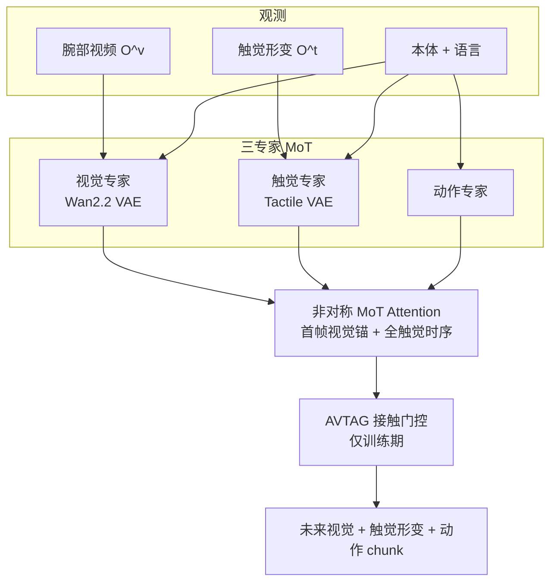

# VT-WAM（Visual-Tactile World Action Model · arXiv:2607.02503）

**VT-WAM**（*VT-WAM: Visual-Tactile World Action Model for Contact-Rich Manipulation*，[arXiv:2607.02503](https://arxiv.org/abs/2607.02503)，中科院自动化所 / TARS Robotics 等，[vt-wam.github.io](https://vt-wam.github.io/)）在 **统一流匹配框架** 内 **联合学习未来视觉、触觉形变与动作**；通过 **非对称 MoT 注意力** 用首帧视觉锚定场景、完整触觉序列建模接触演化，并以 **接触门控 AVTAG** 在接触阶段提高动作对触觉证据的依赖。

## 一句话定义

**不只把触觉当静态附加输入——预测形变如何随动作演化，并在接触窗口强制动作查询「看」触觉。**

## 英文缩写速查

| 缩写 | 英文全称 | 简要说明 |
|------|----------|----------|
| WAM | World Action Model | 视觉-触觉-动作 **联合** 生成策略 |
| MoT | Mixture-of-Transformers | 三模态专家 + 非对称跨注意力 |
| AVTAG | Action-Visual-Tactile Attention Guidance | 接触阶段 **训练期** hinge ranking 损失 |
| CFM | Conditional Flow Matching | 视觉/触觉/动作三头 velocity field 目标 |
| VAE | Variational Autoencoder | Wan2.2 视频 VAE + 预训练触觉 VAE |
| F/T | Force/Torque | 触觉形变为 **3D deformation field**（双触觉面） |
| Fast-WAM | — | 纯视觉 WAM 基线（**45.00%** 平均） |

## 为什么重要

- **接触丰富任务的「时序稀疏性」：** 触觉只在 **短接触窗口** 高信息；视觉帧帧稠密 → 联合训练易 **视觉主导**；VT-WAM 用 **触觉形变预测 + AVTAG** 把因果关键信号 **绑进动作生成**。
- **相对纯视觉 WAM 的大幅增益：** 六任务平均 **71.67%**，较 [Fast-WAM](../methods/generative-world-models.md) **+26.67pp**、较 OmniVTLA **+35.84pp**——说明 **建模触觉动力学** 而非仅 conditioning。
- **与 [TACO](./paper-taco-tactile-wm-vla-posttrain.md)、[Current as Touch](./paper-current-as-touch-proprioceptive-contact.md) 构成接触三角**：VT-WAM **闭环策略**；TACO **失败→纠错数据**；Current as Touch **本体电流替代外置触觉**。
- **Visual-cache 推理模式：** 非对称注意力允许 **首帧视觉锚 + 全触觉序列**，部署时可 **缓存视觉** 而不丢接触动力学（见论文 inference 设定）。

## 核心结构与方法

| 模块 | 方法要点 |
|------|----------|
| **视觉专家** | 腕部相机 $\mathbf{O}^v$ → Wan2.2 VAE → visual tokens；预测 **未来视觉** velocity field |
| **触觉专家** | 双表面 3D 形变 $\mathbf{O}^t$ → 触觉 VAE tokens；预测 **触觉形变演化** |
| **动作专家** | action chunk 线性投影 → action tokens；输出 **可执行 chunk** |
| **非对称 MoT Attention** | Q/K/V 按 visual–tactile–action 拼接；**掩码 $\mathbf{M}$** 控制：动作可读 **首帧视觉锚** + **全触觉序列** |
| **AVTAG（训练期）** | 接触阶段 hinge ranking：**动作 query 对触觉 key 的注意力应高于视觉**；推理 **不改架构** |
| **联合 CFM 目标** | 三模态 velocity field 同框架匹配；语言 + 本体经 cross-attention 注入各专家 |

### 视觉-触觉-动作联合流匹配

### 六类真机任务成功率（论文 Table，索引级）

| 任务类型 | Fast-WAM | OmniVTLA | VT-WAM |
|----------|----------|----------|--------|
| 表面交互类 | 20–70% 区间 | 25–40% | **55–90%** |
| 约束插入类 | 偏低 | 偏低 | **显著提升** |
| **六任务平均** | **45.00%** | **35.83%** | **71.67%** |

## 实验要点（索引级）

| 轴 | 报告口径（以论文为准） |
|----|------------------------|
| **六真机接触任务平均 SR** | **71.67%** |
| **vs Fast-WAM** | **+26.67pp** |
| **vs OmniVTLA** | **+35.84pp** |
| **消融** | 去触觉动力学建模 / 去 AVTAG 均 **显著降点** |
| **硬件** | 腕部相机 + 双触觉形变传感（见项目页） |
| **项目** | [vt-wam.github.io](https://vt-wam.github.io/) |

## 与其他工作对比

| 工作 | 关系 |
|------|------|
| **[TACO](./paper-taco-tactile-wm-vla-posttrain.md)** | **VLA 后训练纠错**；VT-WAM **原生 WAM 联合预测** |
| **[Current as Touch](./paper-current-as-touch-proprioceptive-contact.md)** | **无外置触觉** 路线；VT-WAM 假设 **高分辨率形变传感** |
| **Fast-WAM / Motus / LingBot-VA** | 纯 **视觉 WAM**；缺触觉形变分支 |
| **VT-WM / OmniVTA** | 触觉 WM **用于规划或 reflex**；VT-WAM **耦进单一 CFM 动作头** |
| **OmniVTLA 等 tactile VLA** | 触觉作 **策略输入**；少 **预测形变动力学** |

## 常见误区或局限

- **误区：** 认为加触觉通道即可；关键是 **预测形变演化 + 接触门控注意力**，否则视觉仍主导。
- **误区：** AVTAG 会改变推理图；实际为 **训练期辅助损失**，部署 **零额外模块**。
- **局限：** 依赖 **特定触觉硬件与形变表示**；长程任务 **误差累积** 未充分验证；跨物体泛化仍受数据规模约束。

## 与其他页面的关系

- [wm-action-consequence-category-02-contact-modeling](../overview/wm-action-consequence-category-02-contact-modeling.md) — 接触状态建模 hub
- [动作后果技术地图](../overview/robot-world-models-action-consequence-technology-map.md) — 四类接触信号索引
- [World Action Models](../concepts/world-action-models.md) — Joint WAM 扩展至触觉
- [Deform360](./paper-deform360-deformable-visuotactile-dataset.md) — 视触觉数据层对照
- [VLA](../methods/vla.md) — OmniVTLA 等 tactile VLA 基线

## 推荐继续阅读

- [VT-WAM 论文（arXiv:2607.02503）](https://arxiv.org/abs/2607.02503)
- [VT-WAM 项目页](https://vt-wam.github.io/)
- [TACO 论文实体](./paper-taco-tactile-wm-vla-posttrain.md)
- [Current as Touch 论文实体](./paper-current-as-touch-proprioceptive-contact.md)

## 参考来源

- [具身智能研究室 · 世界模型动作后果专题导读（2026-07）](../../sources/blogs/wechat_embodied_ai_lab_robot_world_models_action_consequence_2026.md)
- [VT-WAM 论文（arXiv:2607.02503）](https://arxiv.org/abs/2607.02503)
