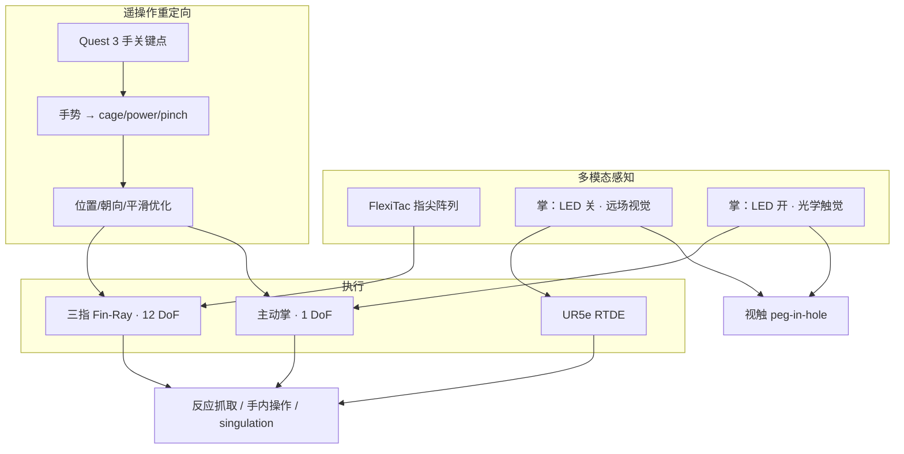

# VTAP Gripper（视触觉主动掌夹爪）

**VTAP Gripper**（*Synergizing Fingertip Sensing and a Visuo-Tactile Active Palm for Dexterous In-Hand Manipulation*，[arXiv:2607.15448](https://arxiv.org/abs/2607.15448)，[项目页](https://yuhao-zhou.com/vtap/)）由 **普渡大学（Purdue）** Edwardson 工业工程学院与 **哥伦比亚大学（Columbia）** 计算机科学系提出：在 **UR5e** 上部署一台 **13-DoF** 三指触觉反应夹爪，用 **主动视触觉掌（VTAP）** 与 **FlexiTac 指尖阵列** 做指–掌协同，并以 **手势条件子空间重定向** 支撑 Meta Quest 3 遥操作与接触丰富数据采集。录用 **IROS 2026**；2026 ASME SMRDC Finalist。

## 一句话定义

**用主动掌上的「LED 开关式」视/触双模态 + 顺应三指触觉阵列，在不堆高 DoF 拟人手的前提下，把远场定位、反应抓取与毫米级手内操作捆进同一夹爪架构。**

## 英文缩写速查

| 缩写 | 英文全称 | 简要说明 |
|------|----------|----------|
| VTAP | Visuo-Tactile Active Palm | 本文主动掌：远场视觉与光学触觉可切换 |
| DoF | Degree of Freedom | 自由度；本夹爪三指×4 + 掌 1 = 13 |
| MCP / PIP | Metacarpophalangeal / Proximal Interphalangeal | 近端指节 / 近端指间关节轴 |
| YCB | Yale-CMU-Berkeley Object Set | 抓取评测物体集 |
| VR | Virtual Reality | Meta Quest 3 手关键点采集 |
| RTDE | Real-Time Data Exchange | UR5e 实时位置控制接口 |
| LED | Light-Emitting Diode | 掌内照明；开→触觉成像，关→透射视觉 |

## 为什么重要

- **夹爪选型中间地带：** 平行夹爪易部署但抓后灵巧弱；拟人手强但贵、重、难控。VTAP 用 **可重构三指 + 主动掌** 证明：许多接触丰富任务可走「指–掌协同」而非「抄人手 DoF」。
- **硬件级视触切换：** 掌相机通过镜面涂层 + LED 在 **远场视觉 / 光学触觉** 间切换，无需机械换模或双目掌——直接对应 [视触觉融合](../concepts/visuo-tactile-fusion.md) 的阶段切换直觉，但是在传感器本体上落地。
- **非拟人遥操作可操作化：** 手势锁定 cage/power/pinch 子空间 + 中间坐标系，把人手演示接到异构三指，面向下游学习数据采集（论文自我定位）。
- **任务谱系完整：** 从脆弱物反应抓取，到手内注射器、≥3 mm singulation、1 mm 公差 peg-in-hole，覆盖「抓 → 手内 → 装配」级联。

## 核心信息

| 项 | 内容 |
|----|------|
| **机构** | 普渡大学（Purdue）Edwardson 工业工程学院；哥伦比亚大学（Columbia）计算机科学系 |
| **平台** | UR5e + VTAP Gripper；遥操作 Meta Quest 3 |
| **驱动** | Dynamixel 2XC430 / 2XL430；掌线性 Actuonix L8-P-50（50 mm） |
| **传感** | 指尖 FlexiTac \(32\times 12\)；掌 GC0307 USB 相机 + 硅胶光学触觉匣 |
| **控制** | 夹爪电流 PD（100 Hz）；臂 RTDE 位置；遥操作优化 ~25 Hz→插值 |
| **开源** | **确认未开源**（截至 2026-07-24；见「局限与风险」） |

## 核心原理

### 硬件与感知栈

| 模块 | 机制 |
|------|------|
| **三指 Fin-Ray** | TPU 被动顺应；每指 \(q_1\)–\(q_4\) 全驱动；120° 扇区布置 |
| **主动掌** | 垂直滑动接触重分配；可压注射器柱塞、贴合物面做触觉扫孔 |
| **掌双模态** | LED 关：透射外景（含 ArUco / 形态学定位）；LED 开：漫反射成像硅胶形变 |
| **指尖阵列** | 压阻 taxels；反应抓取用接触面积变化 \(\Delta C_f\) 与信号强度阈值 \(Q>T_{\mathrm{th}}\) |

### 手势条件重定向

1. **手势先验：** 左手掌开合在 cage / power / pinch 间切换各指 \(q_1\)，并固定内收/外展消歧。
2. **中间系 \(\mathcal{I}\)：** 对人腕 VR 系施常值 \(SE(3)\)，对齐夹爪几何中心基座。
3. **优化目标：** 指尖相对基座的位置/朝向损失 + 速度平滑（Huber）；约束关节限位。
4. **Singulation 特化：** 拇指–食指距离与夹角 → 两主动指 \(q_3\) 等幅反向 + \(q_2\) 微调。

### 流程总览

## 源码运行时序图

**不适用** — 截至 2026-07-24，项目页与 arXiv 均未提供 VTAP 官方可运行仓库；页上 Code 按钮为 [ViTacFormer](https://github.com/RoboVerseOrg/ViTacFormer) 站点模板残留，**不可**当作本文 CAD/控制入口。指尖传感可参考上游 [FlexiTac](https://flexitac.github.io/)，但不覆盖夹爪机械与重定向栈。

## 工程实践

| 项 | 建议 |
|----|------|
| **何时考虑此类夹爪** | 需要抓后手内重定向 / singulation / 掌接触装配，但不想上 16+ DoF 拟人手时 |
| **反应抓取阈值** | 先标定 \(\alpha\) 与 \(T_{\mathrm{th}}\)；重偏心物体（如 drill）需更大接触力余量或更慢闭合 |
| **掌模态切换** | 接近段视觉、贴合后开 LED 转触觉；peg-in-hole 用边缘提取 + 圆拟合再纠孔心 |
| **遥操作稳定** | 注射器失败主因是 VR 遮挡误释 pinch——可改手套、或用另一只手专控掌轴 |
| **数据采集** | 指尖阵列 + 掌视触在狭窄空间优于腰部相机；论文定位为学习策略的接触丰富采集参考架构 |
| **源码运行时序图** | **不适用**（确认未开源） |

## 实验与评测

| 设定 | 主读数（论文 §IV） |
|------|-------------------|
| 反应抓取 9 物 ×10 试 | 总成功 **93.3%**；Drill **5/10** |
| 手内球三轴重定向 | \(x/y\approx\pm 15^\circ\)，\(z\approx\pm 20^\circ\) |
| 注射器遥操作 20 次 | **65%**；均时 **33.4±5.43 s** |
| 手内 singulation | 物体直径可至约 **3 mm**；触觉图案验证单物体 |
| 自主 peg-in-hole 10 次 | **70%**；插入公差 **1 mm** |

## 结论

**一句话总判：VTAP 的可迁移价值是「主动掌把视触切换与接触重分配做成硬件 primitive」，再配手势子空间重定向——用中等 DoF 夹爪覆盖大量本需拟人手的手内/装配任务；复现仍受未开源限制。**

1. **选型读法** — 若任务依赖掌接触（压柱塞、贴面扫孔、cage 大物体），优先评估主动掌，而不是先加手指 DoF。
2. **视触分工** — 掌相机做远场/孔定位，指尖阵列做闭合终止与 singulation 接触验证；二者互补而非互相替代。
3. **遥操作关键** — 非拟人夹爪必须先 **手势锁子空间**，再优化剩余 MCP/PIP；直接抄拟人手 IK 目标会失配。
4. **真机失败模式** — 质量偏心滑脱、VR 遮挡误开 pinch 是主因；部署前要有触觉力余量与跟踪冗余。
5. **对学习栈** — 本文停在硬件 + 遥操作验证；下游 VLA/IL 需自建采集管线，可对照 [T-Rex](./paper-trex-tactile-reactive-dexterous-manipulation.md) 的大规模触觉 mid-training。
6. **开源边界** — 仅论文与项目视频可核验；勿依赖页上模板 Code 按钮。

## 与其他工作对比

| 对照 | 差异读法 |
|------|----------|
| [GelSlim](./gel-slim.md) / GelSight 族 | 高分辨率视觉触觉指尖/夹爪贴片；VTAP **掌** 用同类光学原理但强调 **LED 开关远场视觉**，指尖走 **压阻阵列（FlexiTac）** 换大面积与 Fin-Ray 兼容 |
| [Deimel 欠驱动软手](./paper-deimel-compliant-underactuated-robotic-hand.md) | 极端少驱动 + 接触自适应抓取；VTAP 是 **全驱动三指 + 主动掌**，偏精细手内与遥操作可控性 |
| [T-Rex](./paper-trex-tactile-reactive-dexterous-manipulation.md) | 学习式双手触觉 VLA + 开源数据；VTAP 是 **硬件/遥操作参考架构**，无策略网络贡献 |
| [TacRefineNet](./paper-tacrefinenet-tactile-grasp-refinement.md) | 抓取末段纯触觉精修策略；VTAP peg-in-hole 是 **经典视觉→触觉几何管线**（边缘+圆拟合），非学习伺服 |
| 平行夹爪 + UMI/GELLO | 采集简单、策略栈成熟；VTAP 用更高夹爪复杂度换手内 singulation / 掌接触 primitive |

## 局限与风险

- **确认未开源（2026-07-24）：** 无官方 CAD/控制/重定向仓；项目页 Code 指向无关 ViTacFormer 模板——选型与复现只能基于论文数字与视频。
- **VR 跟踪脆弱：** 近距离小指动作易遮挡拇指/食指跟踪，导致 pinch 误开（§V）。
- **重偏心物体：** Drill 成功率明显偏低，反应阈值在滑移前力不足。
- **非学习闭环：** peg-in-hole 与抓取终止多为阈值/几何管线；泛化到新孔几何需重调。
- **单臂固定基座：** 未演示移动操作或双手协调。

## 关联页面

- [视触觉融合](../concepts/visuo-tactile-fusion.md) — 接触前后模态切换的概念骨架；VTAP 给出硬件级实例
- [触觉感知](../concepts/tactile-sensing.md) — 压阻阵列 vs 视觉触觉技术路线
- [接触丰富操作](../concepts/contact-rich-manipulation.md) — 抓后持续接触任务域
- [Manipulation](../tasks/manipulation.md) — 操作任务总览
- [运动重定向](../concepts/motion-retargeting.md) — 对照：全身 MoCap 重定向 vs 本文夹爪遥操作重定向
- [手内重定向](../methods/in-hand-reorientation.md) — 手内物体姿态操作方法页
- [GelSlim](./gel-slim.md) — 薄片视觉触觉硬件对照
- [T-Rex](./paper-trex-tactile-reactive-dexterous-manipulation.md) — 下游学习式触觉策略对照

## 参考来源

- [VTAP Gripper 论文摘录（arXiv:2607.15448）](../../sources/papers/vtap_gripper_arxiv_2607_15448.md)
- [VTAP 项目页归档](../../sources/sites/yuhao-zhou-vtap.md)

## 推荐继续阅读

- [项目页（视频与设计图）](https://yuhao-zhou.com/vtap/)
- [arXiv:2607.15448](https://arxiv.org/abs/2607.15448)
- [FlexiTac 项目页](https://flexitac.github.io/) — 指尖压阻阵列上游开源传感
