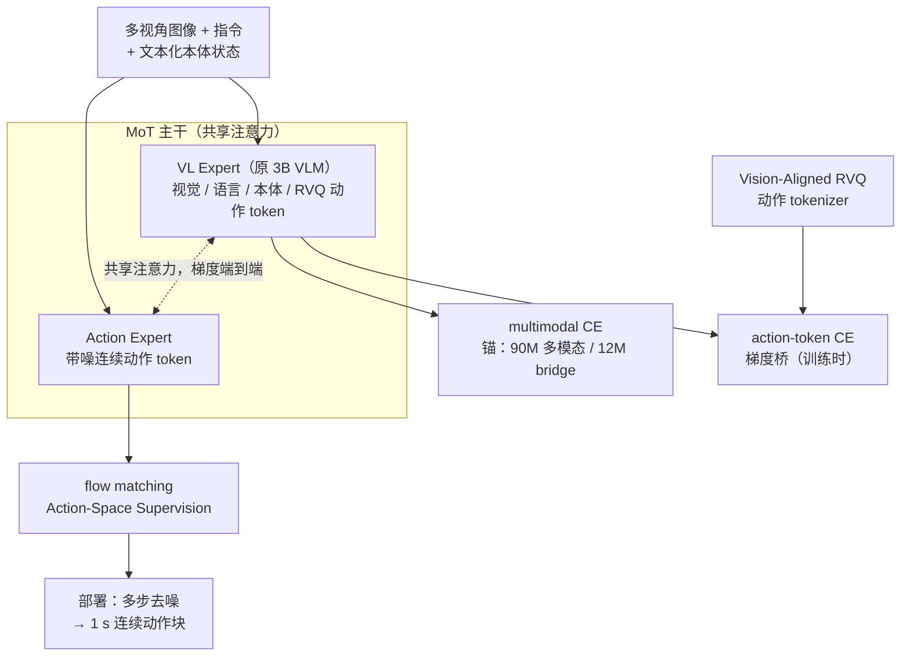
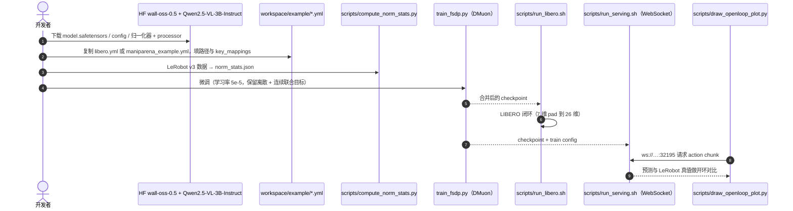

# Wall-OSS-0.5（预训练即可上真机的 VLA）

**Wall-OSS-0.5**（*Wall-OSS-0.5 Technical Report*，[arXiv:2605.30877](https://arxiv.org/abs/2605.30877)，v1 2026-05-29 / v2 2026-06-01；官方页 [x2robot.com/oss](https://x2robot.com/oss)，研究时间线日期 **2026-05-28**；[代码](https://github.com/X-Square-Robot/wall-x)；[权重](https://huggingface.co/x-square-robot/wall-oss-0.5)）是 **自变量机器人（X Square Robot）** 的第二代开源 VLA，前作是 [WALL-OSS](./cn-os-wall-x.md)（arXiv:2509.11766，2025-09）。官方时间线的说法是 "fully open-source, trained with gradient-bridged co-training, and deployable on real robots straight from pretraining"。报告标题各处不统一：项目页 BibTeX 写 *Pretrain Once, Act Anywhere*，GitHub README 写 *A Deployment-Ready VLA with Gradient-Bridged Pretraining*。

## 一句话定义

**在 3B VLM 上加 Action Expert 组成 4B VLA，预训练时让离散动作 token 的交叉熵负责改造主干（「梯度桥」）、多模态交叉熵锚住视觉语言能力、flow matching 负责部署时输出连续动作，使预训练 checkpoint 不经微调就能在真机上完成一部分任务。**

## 英文缩写速查

| 缩写 | 英文全称 | 简要说明 |
|------|----------|----------|
| VLA | Vision-Language-Action | 本文模型类别 |
| VLM | Vision-Language Model | Qwen2.5-VL-3B-Instruct，作为 VL Expert 保留 |
| MoT | Mixture-of-Transformers | 每层 VL Expert 与 Action Expert 并行，只共享注意力 |
| RVQ | Residual Vector Quantization | 多级残差量化；本文学习式动作 tokenizer 的核心 |
| FAST | Frequency-space Action Sequence Tokenization | 一代与 π0.5 用的规则式 DCT tokenizer，被 RVQ 取代 |
| CE | Cross-Entropy | action-token CE（梯度桥）与 multimodal CE（锚） |
| FM | Flow Matching | 连续动作生成目标，部署时的动作接口 |
| DCT | Discrete Cosine Transform | tokenizer 用 DCT 域重建来抑制高频抖动 |
| DMuon | Distributed Muon | 自研分布式 Muon 优化器运行时 |
| VQA | Visual Question Answering | 多模态评测与 bridge 数据的形式 |
| pp | percentage points | 报告用于差值的「百分点」 |

## 为什么重要

- **把「预训练本身能不能用」变成可测问题：** 多数 VLA 只报微调后的结果。本文先在 **17 个真机任务**上直接测预训练 checkpoint，并跟踪 50k→400k 步的曲线，再报微调结果。
- **一个可检验的机制解释：** 共训里 flow matching 对 VLM 主干更新的贡献约 **5%**，主干的主要更新来自两个 CE。由此得出的设计与 [π0.5](./paper-pi05-open-world-vla.md) / [Knowledge Insulation](./paper-knowledge-insulation.md) 的 stop-grad 相反：**不隔离梯度**。
- **完整开源且可部署：** 4B 权重放在 HF，wall-x 1.1.0 提供 FSDP 微调、LIBERO 评测、WebSocket 服务和 RTX 5090 部署脚本；报告称三视角 448px 下约 **15 Hz**。
- **已有下游采用：** [HINT](./paper-hint-robot-manipulation.md) 以 Wall-OSS-0.5 和 π0.5 作为插件底座；LoongForge 等训练框架也列入了 Wall-OSS-0.5（见 [`sources/repos/loongforge.md`](../../sources/repos/loongforge.md)）。

## 核心信息

| 项 | 内容 |
|----|------|
| **机构** | 自变量机器人（X Square Robot），27 位作者 |
| **主干** | Qwen2.5-VL-3B-Instruct 初始化 + MoT → 超过 4B 参数（官方页另一处写「3B VLA」，口径不一） |
| **动作空间** | 26 维：每臂相对 3D 位置 + 相对 6D 旋转 + 1D 夹爪（共 20 维），加底座速度 3 维、升降 1 维、头部 2 维；动作视野 1 秒 |
| **数据** | 20+ 本体；每 epoch 1M+ 轨迹（约 60% 自采 / 40% 开源）；多模态 90M = 78M 开源 + 12M embodied bridge |
| **训练** | 单阶段三路共训；Muon/DMuon + AdamW；全局 batch 8192，bf16，峰值学习率 1e-4；图像长边 448 |
| **推理** | CUDA Graph + 融合算子；RTX 5090、三视角：224px 约 21 Hz，448px 约 15 Hz（T=10 去噪步），比 eager 快 4× |
| **开源（2026-10-09）** | **已开源**：wall-x 1.1.0（Apache-2.0）+ HF `wall-oss-0.5`。**未开源**：预训练数据与真机评测套件 |

## 核心原理（方法）

### 流程总览

注意力掩码让离散动作 token 和连续动作 token 在前向时互不可见，两条通路可以分别训练和评估；flow 的梯度仍然能通过共享注意力回到 VL Expert。推理时**不解码**离散 token，只走 flow 通路。

### 1. 梯度桥：三个目标各管一件事

\[
\mathcal L=\mathcal L_{\text{flow}}+\lambda_{\text{act}}\mathcal L_{\text{act-CE}}+\lambda_{\text{mm}}\mathcal L_{\text{mm-CE}},\qquad \lambda_{\text{act}}=\lambda_{\text{mm}}=0.01
\]

| 信号 | 角色 | 报告的梯度观察 |
|------|------|----------------|
| action-token CE | **桥**：把 VLM 原生的强梯度引向「对连续控制有用」的表征 | 方向与 flow 梯度正相关 |
| multimodal CE | **锚**：保留指令跟随与视觉 grounding | 方向与动作优化大致正交，不互相抵消 |
| flow matching | **执行接口**：训练 Action Expert 输出连续动作 | 前几千步后，对主干更新的占比稳定在约 5% |

action 与多模态样本的 batch 比例为 **9:1**。因为 Action-Space Supervision 下 \(\mathcal L_{\text{flow}}\) 比两个 CE 小约两个数量级，所以两个 CE 都乘 0.01 拉到同一量级。论文的三角论证：只用 flow 太弱；只用 action CE 会抹掉 VLM 先验；只用 multimodal CE 学不到控制。

### 2. Vision-Aligned RVQ Action Tokenizer

在 delta-action 空间做 Encoder–RVQ–Decoder：编码器用时间交叉注意力压缩「观测条件下的动作块」，前几级码本表示粗运动，后几级表示残差细节。除重建外还有三个辅助目标：**视觉–动作对齐**（把动作 latent 拉向 VLM 视觉特征）、**下一帧预测**（让 token 编码动作后果）、**DCT 域重建**（抑制高频抖动）。目的是让离散 token 成为主干的「语义训练接口」，而不只是压缩器。

### 3. Action-Space Supervision

网络仍输出速度，但损失定义在恢复出的动作上：\(\hat A=A_\tau+(1-\tau)f_\theta(A_\tau,\tau)\)，\(\mathcal L_A=\mathbb E\|\hat A-A\|^2\)，等价于在速度空间乘 \((1-\tau)^2\) 权重，从而把监督集中在高噪声段（决定轨迹低频形状的区间）。时间步采样沿用 π0 的 \(u\sim\mathrm{Beta}(1.5,1)\)、\(\tau=0.999(1-u)\)。

### 4. 动作接口与数据处理

- 对话格式：`[System] 本体 prompt [User] 各相机图像 + 指令 + 本体 token [Assistant] <action_ar_token> <action_flow_token>×N`；本体状态离散成文本数字，训练时随机丢弃或扰动。
- 指令分目标级（"tidy up the desk"）和步骤级两种，每步随机采样一种，并加改写。
- 跨源统一：x 前 / y 左 / z 上；零旋转定义为夹爪朝前、开口水平；只有关节数据的源用 URDF 正运动学恢复末端位姿；欧拉角转成 6D 旋转。
- 过滤近静止帧（减少推理时的停顿）；按「源 × 任务」分组做平方根采样（\(p=0.5\)），并设单组上限。
- 开源动作数据保留 10 个子集：RoboMIND v1 / v2.0、AgiBotWorld Beta、RoboCOIN、RoboChallenge、Galaxea Open-World、RealOmin、DROID、BRIDGE v2、Fractal。自采部分加入无本体采集设备 [XRZero-G0](./xrzero-g0.md)。

## 源码运行时序图

官方仓库 [X-Square-Robot/wall-x](https://github.com/X-Square-Robot/wall-x) 的 main 分支（`wall_x` 1.1.0）的 `workspace/README.md` 写明本次开源面向 Wall-OSS-0.5。仓库提供微调与推理，不含预训练语料。

- **最短核对路径：** `fake_inference.py --checkpoint-path` → `SMOKE=1 run_libero.sh` → 自有 LeRobot 数据微调 → `run_serving.sh` 接真机或开环评测。
- **部署：** `workspace/rtx5090/` 提供 RTX 5090 安装与服务脚本（对应报告中的推理测速平台）。

## 工程实践

| 项 | 建议 |
|----|------|
| **微调目标** | 报告 §2.2.4 和 §5.1 都说明微调阶段要保留「离散 + 连续 + 多模态」联合目标；只用 flow 微调的效果更差（图 10b，1 任务与 5 任务两种设置） |
| **动作对齐** | 先把自己的本体映射到 26 维语义（双臂末端 + 夹爪 + 底座 / 升降 / 头部）；单臂或少自由度用 padding；坐标系按报告的统一约定，不要直接塞欧拉角 |
| **norm_key** | HF 卡片列出 `x2_normal`、`ex_normal` 及 DROID、RoboMIND、RoboCOIN、RoboChallenge 等几十个 norm_key；推理时要选与训练分布对应的那个 |
| **显存与速度** | 单卡微调至少 48 GB；部署参考 RTX 5090 三视角 448px 约 15 Hz，降到 224px 约 21 Hz |
| **期望管理** | 零样本强项是语义明确、精度中等的任务（排序、套环）；毛巾折叠、摆餐具、插充电器零样本 <20%，必须微调 |
| **开源状态** | **已开源** 代码（Apache-2.0）+ 权重（HF 未设 gated；卡片元数据无 license 字段）。官方页头部仍写「CODE COMING SOON」，与同页 Open Source 区块和仓库实际情况不符，以仓库为准 |

## 实验与评测

评分统一按步骤累计（满分 10，task progress = 得分/满分×100），每个任务 10 条轨迹；全报告共 31 个真机任务。

**预训练 checkpoint 零样本（17 任务：12 seen + 5 unseen）：**

| 步数 | 50k | 100k | 200k | 300k | 350k | 400k |
|------|-----|------|------|------|------|------|
| Seen 平均（12） | 26.1 | 31.7 | 40.1 | 40.4 | 48.1 | **50.0** |
| Unseen 平均（5） | 24.2 | 41.0 | 38.8 | 34.8 | 47.6 | **53.6** |
| 总平均（17） | 25.5 | 34.5 | 39.8 | 38.7 | 47.9 | **51.1** |

400k 时 ≥60 的任务：Block Sorting **100**、Fruit Sorting **96**、Ring Stacking **86**、Rope Tightening（unseen，柔性）**82**、Cup Grasping 64、Bean Pouring（unseen）60。语义类平均 72.6，是零样本最强的类别。低于 20：Towel Folding 10、Table Setting 9、Charger Plugging 9。作者特别说明 unseen 是「当前本体上没采过同样任务」，开源数据中可能有语义相近的经验。

**微调后（15 任务，每任务约 500 条，同数据同协议）：**

| 模型 | 操作（10） | 推理（5） | 总体（15） |
|------|-----------|-----------|-----------|
| **Wall-OSS-0.5** | **61.1** | **59.3** | **60.5** |
| π0.5 | 35.0 | 58.9 | 43.0 |
| DreamZero | 33.7 | 32.7 | 33.4 |

逐任务：Color Block Sorting 96 vs π0.5 42，Drawer Organization 52 vs 7，Ring Stacking 91 vs 60，Spoon-in-Bowl 80 vs 43。落后的任务：Glasses Rack（π0.5 87 vs 66）、Obj.-to-Basket（DreamZero 97.8 vs 74.8）、Fruit Basket（π0.5 94 vs 86）、Object Matching（π0.5 51.5 vs 44.5）、Pencil Case（DreamZero 26 vs 18.5）。15 项中 10 项第一。

**多任务微调扩展（5→10→19 任务）：** 5 个共享简单任务 73.96 → 74.75 → **83.75**；10 个共享任务 59.98 → **64.78**；新增 9 个 OOD 任务平均 65.59。

**多模态（相对 Qwen2.5-VL-3B）：**

| 基准 | Qwen2.5-VL-3B | Wall-OSS-0.5 | 变化 |
|------|---------------|--------------|------|
| RealWorldQA | 59.2 | 44.2 | **−15.0** |
| ERQA | 38.3 | 32.8 | −5.5 |
| EO-Bench | 20.8 | 24.7 | +3.9 |
| Embodied Grounding（自建） | 9.0 | 30.8 | **+21.8** |
| Where2Place | 4.0 | 15.0 | +11.0 |

**消融：**

| 实验 | 结果 |
|------|------|
| 共训策略（从头训 70k 步，5 任务） | Co-train **57.0** > Stop-grad→Co-train 49.6 > Flow-only 36.6 > Stop-grad 31.9 |
| Action-Space vs 速度空间（LIBERO） | 峰值 **96.5%**（25k 步），比速度空间高 6.2；20k 步即 95.8%，速度空间到 35k 步仍未超过 90.3% |
| RVQ vs FAST（同共训设置） | VQA 75.7 → **77.5**；4 个真机任务 29.3 → **48.1**（每个任务都是 RVQ 更好） |

## 结论

**Wall-OSS-0.5 的核心结论是「离散动作 token 在部署只用连续动作时仍然有用」：它的作用是在训练中把动作信号以 VLM 原生的方式送进主干。预训练零样本 51.1 和微调 60.5 都建立在这个机制上，但都只在自建任务集上测得。**

1. **不要 stop-grad** — 5 任务消融中 Stop-grad 最低（31.9），说明 Knowledge Insulation 式隔离在这套设置下让 Action Expert 欠拟合；隔离的代价不只是 VQA 分数。
2. **离散 tokenizer 的质量会传导到连续动作** — 只换 FAST→RVQ，flow 通路的真机进度就从 29.3 升到 48.1。
3. **零样本能力有明确分层** — 语义清楚、精度中等的任务可以直接用；柔性折叠和精细插拔仍是零样本盲区，应作为微调重点。
4. **「理解不退化」需要分开看** — 具身 grounding +21.8，但 RealWorldQA −15.0；官方页写的 "general VL capability preserved" 要按报告表格理解为「换取具身专长，牺牲部分通用 VQA」。
5. **共训也用在微调** — 微调时保留离散 + 多模态目标，比只用 flow 收敛更快、效果更好。
6. **15 Hz 来自工程优化** — CUDA Graph 消除 CPU 调度空泡，融合 RoPE/RMSNorm 等算子；在别的 GPU 上运行时要重新测速。

## 与其他工作对比

| 对比轴 | Wall-OSS-0.5 | [WALL-OSS（一代）](./cn-os-wall-x.md) | [π0.5](./paper-pi05-open-world-vla.md) / [KI](./paper-knowledge-insulation.md) | [DreamZero](./paper-notebook-dreamzero-world-action-models-are-zero-shot-poli.md) |
|--------|--------------|----------------------------------------|----------------------------------------|---------------------------------------------|
| **路线** | VLA，MoT + 三路共训 | VLA，静态双 FFN + 两阶段 | VLA，FAST + flow 共训 | WAM（视频预测 → 动作） |
| **离散动作** | 学习式 Vision-Aligned RVQ | FAST | FAST | — |
| **flow 梯度到主干** | **保留**（端到端） | 阶段 1 冻结，阶段 2 联合 | **stop-grad** | — |
| **训练阶段** | 单阶段，从第 0 步开始 | Inspiration → Integration | 多阶段 | — |
| **零样本真机** | 17 任务套件，平均 51.1 | 指令抓放 85 / 61 | 论文侧重开放家居泛化 | — |
| **15 任务微调** | **60.5** | — | 43.0 | 33.4 |
| **开源** | 代码 + 权重 | 代码 + 权重 | openpi 部分开源 | 见对应页 |

相对一代：**FAST→RVQ、两阶段→单阶段、速度损失→动作空间损失、静态双 FFN→MoT**，论述重点从 Uni-CoT 推理转到「预训练即可部署」。中间还有 2026-01 的 `wall-oss-flow-0.1`，它已把动作 token 与非动作 token 的 QKV/输出投影拆开，可以看作 MoT 的过渡版本（**推测**，官方未这样表述）。同机构的 [X-Tokenizer](./cn-os-x-tokenizer.md)（arXiv:2606.14752）也是带视觉对齐和下一帧目标的 RVQ 动作 tokenizer，它是否就是本文的 tokenizer，报告没有说明（**推测**两者同源）。

## 局限与风险

- **只在 3B 主干上验证**：作者自己指出，换更大的 VLM 后三路梯度的几何关系可能改变。
- **单帧输入**：没有时序记忆，零样本长程任务受限。
- **固定 26 维动作**：tokenizer 与训练管线绑定这个动作空间，不能直接用于灵巧手等高自由度本体。
- **评测自建**：17 / 15 / 31 任务套件和评分细则由作者设计，没有公开，第三方无法复测真机数字；unseen 只是相对概念。
- **对比条件**：π0.5 与 DreamZero 都用各自官方权重、同样约 500 条数据微调，但任务选择由作者决定；DreamZero 在 Obj.-to-Basket 上大幅领先，说明 WAM 路线在某些任务上仍有优势。
- **官方材料不一致**：项目页「CODE COMING SOON」与已开源的仓库矛盾；「3B / 4B」口径不一；HF 卡片标题和引用仍是一代。引用时以 arXiv 报告为准。
- **数据不可复现**：自采轨迹、12M bridge 样本、自建 Embodied Grounding 基准都没有公开。

## 关联页面

- [WALL-OSS 与 WALL-X](./cn-os-wall-x.md) — 一代模型与共用代码仓（主节点）
- [VLA](../methods/vla.md)
- [Flow Matching 具身策略](../concepts/flow-matching-embodied-policy.md)
- [π0.5](./paper-pi05-open-world-vla.md) / [Knowledge Insulation](./paper-knowledge-insulation.md) / [π0](./paper-pi0.md) — stop-grad 与 FAST 对照
- [DreamZero](./paper-notebook-dreamzero-world-action-models-are-zero-shot-poli.md) — WAM 基线
- [X-Tokenizer](./cn-os-x-tokenizer.md) — 同机构 RVQ 动作 tokenizer
- [XRZero-G0](./xrzero-g0.md) — 预训练数据中的无本体采集设备
- [HINT](./paper-hint-robot-manipulation.md) — 以 Wall-OSS-0.5 为底座的插件
- [WALL-WM](./paper-rcl-2606-01955-wall-wm-carving-world-action-modeling-at-the-eve.md) — 同公司同期的世界动作模型
- [LIBERO](./libero-benchmark.md) — Action-Space 消融与仓库评测
- [具身 Scaling Laws](../concepts/embodied-scaling-laws.md) — 多任务微调扩展的参照
- [跨具身迁移枢纽](../overview/hub-cross-embodiment.md)
- [Manipulation](../tasks/manipulation.md)

## 参考来源

- [WALL-OSS / WALL-OSS-0.5 官方页归档](../../sources/sites/x2robot-wall-oss.md)
- [WALL-X 源码归档](../../sources/repos/wall-x.md)
- *Wall-OSS-0.5 Technical Report*, [arXiv:2605.30877](https://arxiv.org/abs/2605.30877)

## 推荐继续阅读

- 技术报告 — <https://arxiv.org/abs/2605.30877>（官网 PDF：<https://x2robot.com/api/files/file/WALL-OSS_0.5.pdf>）
- 官方页 — <https://x2robot.com/en/oss>
- 代码 — <https://github.com/X-Square-Robot/wall-x>
- 权重 — <https://huggingface.co/x-square-robot/wall-oss-0.5>
- 一代 WALL-OSS — <https://arxiv.org/abs/2509.11766>
