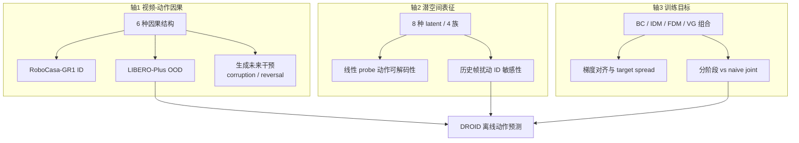

# WAM 设计要素受控实证研究

**What Matters in Designing World Action Models: An Empirical Study**（Chao Tang *、Haoqing Wang * 等；[arXiv:2609.24048](https://arxiv.org/abs/2609.24048)，2026）由 **三星机器人体验（Samsung Robotics eXperience）**、**三星北京研发中心**、**北京大学**、**武汉大学** 与 **北京中关村学院** 联合开展：不提出单一 SOTA 系统，而是在 **同一框架内固定骨干与训练管线**，分别对 WAM 三条设计轴做 **结构性对照实验**——**(1) 视频–动作因果结构**（6 种）、**(2) 潜空间世界表征**（8 种 / 4 族）、**(3) 世界–动作训练目标**（BC / IDM / FDM / VG）。仿真主评 **RoboCasa-GR1（ID）**、**LIBERO / LIBERO-Plus（OOD）**；关键结论在 **DROID**  held-out 离线动作预测上复现。

## 一句话定义

**在控制 confound 的前提下回答「WAM 里什么设计真的起作用」——时间结构比未来像素内容更驱动动作；潜空间里的固定跨帧关系偏 ID 但 OOD 脆；辅助世界目标要看分布与训练日程，而不是默认有益。**

## 英文缩写速查

| 缩写 | 英文全称 | 简要说明 |
|------|----------|----------|
| WAM | World Action Model | 联合世界预测与动作生成的具身策略 |
| VLA | Vision-Language-Action | 以 BC 为主的反应式语义策略对照 |
| BC | Behavior Cloning | 标准 \(p(a\mid o,\ell)\) 模仿学习 |
| IDM | Inverse Dynamics Model | 由未来潜变量反推动作 |
| FDM | Forward Dynamics Model | 由动作预测未来潜变量 |
| VG | Video Generation | 未来视觉潜变量生成监督 |
| ID | In-Distribution | 分布内评测（RoboCasa-GR1） |
| OOD | Out-of-Distribution | 分布外扰动（LIBERO-Plus） |
| LIBERO-Plus | LIBERO perturbation suite | 七类感知/布局/语言扰动 benchmark |

## 核心信息

| 字段 | 内容 |
|------|------|
| **机构** | 三星机器人体验；三星北京研发中心；北京大学；武汉大学；北京中关村学院 |
| venue | [arXiv:2609.24048](https://arxiv.org/abs/2609.24048)（2026-09） |
| **对照框架** | 因果结构：**Fast-WAM** 族；潜空间与目标：**LDA-1B** 族（论文引用，非本文新架构） |
| **评测** | RoboCasa-GR1（24 任务 / 24K 示范）；LIBERO + LIBERO-Plus；DROID train/val/test 语义划分 |
| **开源** | **无项目页、无官方代码**（截至 2026-09-22） |

## 为什么重要

- **拆 confound：** 现有 WAM 常把架构、表征、目标与数据规模 **绑在一起发布**，难以判断增益来自哪一维；本文 **每次只动一轴**。
- **干预 + 结构双证据：** 不仅比 matched 结构成功率，还对 **生成未来 latent** 做 **内容 corruption** 与 **时间 reversal** 干预，区分「辅助监督」与「推理期因果中介」。
- **ID/OOD 分裂规律一致：** 三条轴均出现 **分布依赖**——强时序先验在熟悉轨迹上占便宜，OOD 更依赖 **上下文可适配** 的时间建模。
- **直接服务选型：** 读 [GlanceWAM](./paper-glancewam.md)、[DreamWAM](./paper-dreamwam.md) 等系统论文前，可先对照本文 **因果 route / 表征族 / 目标日程** 三问。

## 研究设定

### 三条设计轴

| 轴 | 变体规模 | 固定项 |
|----|----------|--------|
| **视频–动作因果** | 6 结构 | Fast-WAM 框架；架构与训练管线一致 |
| **潜空间表征** | 8 表征 / 4 族 | LDA-1B 框架 |
| **训练目标** | BC、IDM、FDM、VG 及组合/分阶段 | LDA-1B 框架；任务条件一致 |

### 因果结构（Fig. 2）

1. **Disentangled/Unconditional** — 视频与动作独立
2. **Video-to-Action** — 未来视频条件动作
3. **Action-to-Video** — 动作条件未来视频
4. **Bidirectional** — 双向交互
5. **Joint** — 联合预测
6. **Causally Interleaved** — 帧级交错因果序列（LingBot-VA 类）

### 潜空间四族

| 族 | 代表 | 时序属性 |
|----|------|----------|
| Semantic | DINOv3、Qwen3-VL、SAM3 | DINOv3/SAM3：**framewise**；Qwen3-VL(video)：**inter-frame** |
| Geometric | DA3、VGGT-Ω | **inter-frame** |
| Reconstructive | Image-VAE、Video-VAE | Image：**framewise**；Video：**inter-frame** |
| Predictive | V-JEPA 2.1 | **inter-frame** |

### 训练目标

- **BC：** \(p(a_{t+1:t+k}\mid o_t,\ell)\)
- **IDM：** \(p(a_{t+1:t+k}\mid o_t,z_{t+1:t+k},\ell)\)
- **FDM：** \(p(z_{t+1:t+k}\mid o_t,a_{t+1:t+k},\ell)\)
- **VG：** \(p(z_{t+1:t+k}\mid o_t,\ell)\)

## 流程总览

## 评测与指标

- **仿真 ID：** RoboCasa-GR1 — GR-1 双臂 24 语言条件任务 / 24K 遥操作示范。
- **仿真 OOD：** LIBERO 训练 → **LIBERO-Plus** 七类扰动（布局、视角、初始位姿、语言、光照、背景、传感器噪声）。
- **真机数据：** DROID 按任务语义划分 train/val/test；报告归一化动作空间 **MSE / L1 / Accuracy@0.1 / @0.5**（200K steps，matched settings）。
- **干预指标：** 生成未来 **content corruption**（0.10/0.25/0.50 噪声混合）与 **temporal reversal**（25%/50%/100% 去噪步）下的动作变化率与 rollout 成功率。

## 主要发现

### 轴 1：视频–动作因果

| 发现 | 证据摘要 |
|------|----------|
| **时间组织 > 像素内容** | 最强 content corruption：动作变化 <1%，成功率几乎不变；最强 temporal reversal：OOD 成功率 **−24.24~−32.37%** |
| **Route-enabled 偏 OOD** | Joint vs Uncond、Bidirectional vs A2V 在 LIBERO-Plus **+16.14% / +14.93%**；ID RoboCasa **−2.33% / −4.00%** |
| **Causal video generation 关键** | Causally Interleaved **77.33%** LIBERO-Plus；Video-Causal Global **79.84%**（允许 action 读完整时序视频 horizon） |

### 轴 2：潜空间表征

| 发现 | 证据摘要 |
|------|----------|
| **inter-frame 偏 ID，framewise 偏 OOD** | RoboCasa 上 inter-frame 领先；LIBERO-Plus 排序反转，sensor noise / viewpoint 差距最大 |
| **probe 镜像性能分裂** | ID：inter-frame 各 block 动作 \(R^2\) 更高；OOD：framewise 领先（末 block 差距缩小） |
| **预编码时序关系脆弱** | 扰动 \([H,C]\) 配对时，inter-frame 策略退化显著大于 framewise |

### 轴 3：训练目标

| 发现 | 证据摘要 |
|------|----------|
| **ID：BC-only 最优** | RoboCasa 上所有辅助配置均低于 BC-only；IDM 因与 BC **梯度更对齐** 降幅最小 |
| **OOD：VG 稳健** | BC+VG **77.96%→81.22%**；camera viewpoint **+13.32%**；FDM 边际；IDM 略负 |
| **日程 matters** | naive joint 全目标 **−4.04%** vs BC+VG；**80% BC+VG + 20% dynamics** 达 **83.15%**（LIBERO-Plus 最高） |

### DROID 离线验证（Table I，200K steps）

| 轴 | 更优变体 | MSE ↓ / Acc@0.1 ↑（相对） |
|----|----------|---------------------------|
| 因果 | Causally Interleaved vs Uncond | 0.0666 vs 0.0730；53.78% vs 51.83% |
| 表征 | DINOv3 vs DA3 | 0.0684 vs 0.0702；53.08% vs 52.40% |
| 目标 | BC+VG vs BC-only | 0.0697 vs 0.0769；51.84% vs 49.94% |

## 源码运行时序图

**不适用** — 截至 2026-09-22 无项目页或官方 GitHub；论文为受控消融研究，未发布可运行实现。

## 工程实践

| 项 | 读法 |
|----|------|
| **因果 route** | OOD 鲁棒性常来自「动作能读生成未来」的 **时序组织**；ID 上未必同向增益 |
| **表征选型** | 熟悉域 + 充足 ID 数据 → 可考虑 inter-frame；强 OOD / 感知扰动 → framewise + 策略内时序整合 |
| **目标组合** | ID 任务先 **BC-only** 或轻辅助；OOD 优先 **BC+VG**，dynamics **晚引入** |
| **评测协议** | 必须 **ID + OOD 双报**；仅 RoboCasa 或仅 LIBERO 会得出相反表征/因果结论 |
| **干预诊断** | 部署前可对生成未来做 **temporal reversal** 压力测试，比改像素内容更能暴露依赖 |

## 局限与风险

- **中等规模受控实验：** 作者自述未穷尽更大模型/数据缩放；结论绑定 Fast-WAM / LDA-1B 族。
- **无开源复现：** 框架细节、超参与 checkpoint 需等官方发布或社区复刻。
- **DROID 为离线动作预测：** 非闭环真机成功率；仿真→真机仍可能有尺度效应。
- **LIBERO-Plus 七扰动轴：** VG 增益集中在 **camera viewpoint** 等轴，对 robot/layout shift 未必普适（附录有分项）。

## 结论

**WAM 设计不能「世界建模越多越好」——时间结构放哪里、潜空间是否预编码跨帧关系、辅助目标何时介入，共同决定 ID 与 OOD 上的相反最优。**

1. **推理期因果：** 生成未来 **主要用时间槽位组织动作**，精确像素/ latent 内容 corruption 影响很小。
2. **因果架构：** **帧级因果视频生成** 比严格 video–action token 时序隔离更关键（Video-Causal Global > Causally Interleaved）。
3. **表征 trade-off：** inter-frame 提高 ID 动作线性可解码性，但 **固定跨帧关系** 在分布 shift 下更脆；framewise 把时序留给策略更 OOD 友好。
4. **目标 trade-off：** ID 上 **BC-only** 仍是强基线；OOD 上 **BC+VG** 提供近似 BC 正交的正则；dynamics 目标易 **早训抢容量** 或引入 shortcut。
5. **训练日程：** 多目标 **分阶段**（先 BC+VG 稳表征，后 20% 加 dynamics）可到 **83.15%** LIBERO-Plus；同策略 **不抬 ID**。
6. **真机信号一致：** DROID 离线四项指标支持因果/framewise/VG 三条 simulation 结论的方向性。
7. **选型动作：** 读系统论文时先问三轴——**动作是否读未来 route、latent 是否 inter-frame、辅助目标在第几阶段**。

## 与其他页面的关系

- [World Action Models](../concepts/world-action-models.md) — WAM 范式总览；本文补 **受控设计原则**
- [VLA](../methods/vla.md) — BC-only 在 ID 上相对 WAM 辅助目标的定位
- [GlanceWAM](./paper-glancewam.md) — Fast-WAM 系部署实例；对照本文 **因果/延迟** 轴
- [EffVLA](./paper-effvla.md) — 同类的 **固定骨干 factorial** VLA 设计研究
- [DreamWAM](./paper-dreamwam.md) — beyond-RGB 结构化未来；本文 **表征族** 对照
- [LIBERO benchmark](./libero-benchmark.md) — LIBERO-Plus OOD 协议背景

## 参考来源

- [wam_design_empirical_arxiv_2609_24048](../../sources/papers/wam_design_empirical_arxiv_2609_24048.md)
- 论文：<https://arxiv.org/abs/2609.24048>

## 推荐继续阅读

- [arXiv:2609.24048](https://arxiv.org/abs/2609.24048) — 原文与附录分项统计
- [OpenMOSS WAM 综述](https://arxiv.org/abs/2605.12090) — Cascaded/Joint 分类背景
- [LIBERO-Plus（CVPR 2026）](https://arxiv.org/abs/2606.02120) — OOD 扰动 benchmark 定义
