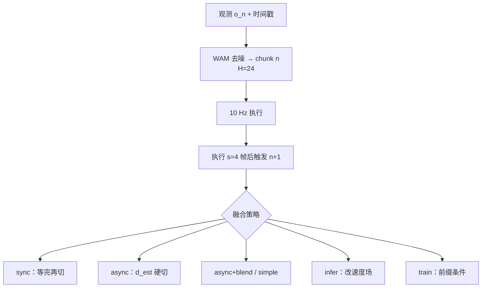

# WAM 实时异步部署（Beyond Stalls · arXiv:2608.01880）

**World Action Models in Real Time**（*An Empirical Study of Smooth Execution via Asynchronous Deployment*，[arXiv:2608.01880](https://arxiv.org/abs/2608.01880)，[博客](https://www.motubrain.com/zh/research/beyond-stalls-deploying-world-action-models/)）由 **生数科技 Motubrain Team**（Mengchen Cai / Jiangfeng Liu / Yinze Rong；致谢清华大学 Jun Zhu）在 [Motubrain](./paper-motubrain.md) 双臂平台上，把 action-chunk WAM 的异步部署拆成六种可对照策略，并用离线 overlap 误差 + 三类真机任务回答：卡顿、抖动和精度到底被哪一层吃掉。

## 一句话定义

**WAM 要丝滑，先把时间戳对齐；对齐之后，输出层加权只是地板，真正兼顾精度与平滑的是训练时注入已承诺前缀。**

## 英文缩写速查

| 缩写 | 英文全称 | 简要说明 |
|------|----------|----------|
| WAM | World Action Model | 联合视频动态与动作生成的具身策略 |
| RTC | Real-Time Chunking | 异步 chunk 切换；文中 infer = 推理时速度场引导 |
| \(H,s,d,d_{\mathrm{est}}\) | horizon / exec horizon / delay / estimated delay | 本文时序四元组；实验 \(24/4/\cdot/8\) |
| MAE | Mean Absolute Error | 离线 overlap 轨迹误差 |
| RMS jerk | Root-Mean-Square jerk | 真机平滑度（平移） |

## 为什么重要

- **WAM 的部署税比 VLA 更重：** 联合 video–action 去噪把端到端延迟推到秒级；同步执行每个边界停一下，动态目标直接失败。
- **把「异步」拆成可对照的四族：** 硬切 / 输出加权 / 去噪内加权 / 速度场引导 / 训练时前缀——不再把 RTC 当一个黑盒形容词。
- **工程第一性：** 博客写明硬件时间戳对齐；\(d>d_{\mathrm{est}}\) 的错帧跳变，任何融合都救不回来。
- **选型可读：** 传送带要响应，插槽要精度，微波炉要长程不累停——三张表把 trade-off 钉死。
- **开源边界：** 截至 **2026-08-13** 没有本实验脚本；GitHub 是 Motubrain **占位仓**。

## 核心信息

| 字段 | 内容 |
|------|------|
| 作者 | Motubrain Team（Cai 发起；Liu 负责；Rong 参与） |
| 机构 | 生数科技（Shengshu Technology）；清华大学（致谢） |
| 出处 | arXiv:2608.01880（2026-08）；博客 2026-08-03 |
| 平台 | 双臂末端 10 Hz；chunk \(H=24\)；\(s=4\)；\(d_{\mathrm{est}}=8\) |
| 开源（截至 2026-08-13） | **未发布实验代码**；[`shengshu-ai/Motubrain`](https://github.com/shengshu-ai/Motubrain) 仅报告 PDF |

## 方法与核心结构

| 代号 | 做什么 | 重训？ |
|------|--------|--------|
| **sync** | 等推理完硬切 | 否 |
| **async** | 提前推理，在 \(d_{\mathrm{est}}\) 硬切 | 否 |
| **async+blend** | 重叠区输出加权（SmolVLA 思路） | 否 |
| **simple** | 去噪逐步把旧 chunk 融进新预测（HoloBrain-0 SimpleRTC） | 否 |
| **infer** | 改去噪速度场，软拉向旧 delay 区（Black et al. RTC） | 否 |
| **train** | 训练时把已承诺 delay 区当干净前缀（Training-Time RTC） | 是 |

overlap 再拆：**delay 区**（黄，\(d_{\mathrm{est}}\) 帧，已承诺）与 **remaining overlap**（绿）。理想上 delay 区两 chunk 应一致。

### 流程总览

## 源码运行时序图

**不适用**（截至 2026-08-13）：论文与博客未提供六策略实现；官方 [`Motubrain`](https://github.com/shengshu-ai/Motubrain) 仅 LICENSE / PDF / README / figures。放出后应补：相机时间戳 → 异步队列 → \(d_{\mathrm{est}}\) 切换 → 选定融合头 → 10 Hz 下发 的 `sequenceDiagram`。

## 工程实践

| 项 | 建议 / 论文设定 |
|----|----------------|
| **先做对齐** | 硬件时间戳绑定命令帧与观测；否则融合是在错位轨迹上抹平 |
| **\(d_{\mathrm{est}}\)** | 用测得端到端延迟中位数；\(d>d_{\mathrm{est}}\) 会跳帧，无法事后补 |
| **最低可用** | 对齐后的 **async+blend**：不改模型，动态任务从 20 拉到 40 |
| **要精度** | 别用 simple 做插槽类接触；去噪内加权会把两个分歧预测平均掉 |
| **要综合** | **train**（前缀条件）三类任务最稳，推理无额外开销，但要重训 |
| **别误用 infer** | 速度场软约束在本平台 **压不住 delay 区**，边界仍跳 |
| **突发障碍** | 旧前缀变干扰；本文方法都不处理（Fig. 6） |
| **源码运行时序图** | **不适用**（原因见上节） |

## 实验与评测（论文报告摘要）

| 设定 | 对照 | 主要结论 |
|------|------|----------|
| **离线 overlap** | async / simple / infer / train | infer delay 区误差明显高于 simple/train；async 最差 |
| **传送带取物（动态）** | 六策略 × 5 trial | sync/async **20**；blend **40**；simple **80**；**train 96**（61.24 s） |
| **插块入槽（精细）** | 同上 | simple **27.5**；sync **72.5**；**train 70** 且更快（12.13 vs 19.4 s） |
| **微波炉放食物（长程）** | 同上 | train/sync **96**；sync 85.18 s，train 68.9 s，异步 ~60–66 s |
| **jerk** | 真机平移 RMS | async 最高；simple/train 低；sync 慢但不一定最抖 |

## 结论

**这篇的真贡献不是又一个 RTC 变体，而是在同一台 WAM 上把「对齐 / 输出加权 / 去噪加权 / 速度场 / 前缀训练」拆开，并证明速度场引导在 WAM 上不够用。**

1. **真影响：时间戳对齐** — 错位观测生成的 chunk 从根上错，融合只是涂抹。
2. **真影响：train 综合最好** — 动态 96、精细不崩、长程比 sync 少停十几秒。
3. **真影响：infer 在本平台失败** — 只改速度场，delay 区动作连续性没有硬保证。
4. **次要代价：simple 的平滑税** — 传送带好看，插槽 27.5 分。
5. **部署读法：** 先 blend 打底；要上线精度就准备重训前缀条件。
6. **工程读法：无代码** — 今日只能读表和看博客视频，不能复现六策略。

## 与其他工作对比

| 对照 | 差异读法 |
|------|----------|
| [Action Chunking](../methods/action-chunking.md) | 方法页讲「为何输出块」；本页讲 **块与块怎么切** |
| [VLA 部署指南](../queries/vla-deployment-guide.md) | 通用异步/缓冲清单；本页是 **WAM 秒级延迟** 的对照实验 |
| Black et al. RTC / Training-Time RTC | 文中 infer / train 的来源；本页在 WAM 上复测，infer 未过关 |
| [kai0](./paper-kai0.md) | chunk 平滑可与 RTC 叠加；本页强调 **对齐是一切融合的前置** |
| [RTCF](./paper-rtcf.md) | **同名不同物**：RTCF 是冻结 VLA 的记忆纠偏，不是 Real-Time Chunking |
| [Motubrain](./paper-motubrain.md) | 本页的策略平台；模型数字与开源边界见该页 |

## 局限与风险

- **只在一个 WAM / 一台双臂上：** 结论外推到其他 flow/VLA 要打折。
- **突发变化未解：** 前缀约束在障碍闯入时有害。
- **\(d_{\mathrm{est}}\) 是中位数近似：** 在线延迟估计仍开放。
- **无官方实现：** 不能把博客视频当可部署包。

## 关联页面

- [Motubrain](./paper-motubrain.md) — 本文平台 WAM
- [Action Chunking](../methods/action-chunking.md) — 动作块输出与异步缓冲
- [World Action Models](../concepts/world-action-models.md) — WAM 概念边界
- [VLA 真机部署指南](../queries/vla-deployment-guide.md) — 延迟与异步清单
- [VLA 与低级控制器融合](../queries/vla-with-low-level-controller.md) — chunk buffer 接到 PD/WBC
- [RTCF](./paper-rtcf.md) — 勿与 RTC 混淆
- [kai0](./paper-kai0.md) — chunk 平滑 × RTC
- [WAM 动作后果分类 01](../overview/wm-action-consequence-category-01-wam-action-prediction.md) — 部署层邻近坐标
- [Rift](./paper-rift-wam.md) — 视频 rollout 税 vs 本页的 chunk 切换税
- [Manipulation](../tasks/manipulation.md) — 双臂操作任务语境

## 参考来源

- [wam_realtime_async_arxiv_2608_01880.md](../../sources/papers/wam_realtime_async_arxiv_2608_01880.md)
- [告别卡顿博客](../../sources/blogs/motubrain_beyond_stalls_wam_async.md)
- [Motubrain 官网归档](../../sources/sites/motubrain-com.md)
- [Motubrain 占位仓](../../sources/repos/motubrain.md)
- Cai, Liu, Rong / Motubrain Team — <https://arxiv.org/abs/2608.01880>
- 博客：<https://www.motubrain.com/zh/research/beyond-stalls-deploying-world-action-models/>

## 推荐继续阅读

- Black, Galliker, Levine, *Real-time execution of action chunking flow policies* — <https://arxiv.org/abs/2506.07339>
- Black et al., *Training-time action conditioning for efficient real-time chunking* — <https://arxiv.org/abs/2512.05964>
- Motubrain 技术报告 — <https://arxiv.org/abs/2604.27792>
- SmolVLA 异步融合 — <https://arxiv.org/abs/2506.01844>
