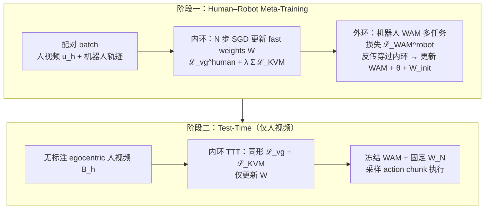

# WAM-TTT（人视频 · 测试时训练 · WAM Steering）

**WAM-TTT**（*Steering World-Action Models by Watching Human Play at Test Time*，[arXiv:2607.06988](https://arxiv.org/abs/2607.06988)，北京大学 · **Galbot** · 中科院自动化所 · 清华大学）把 **人类 egocentric 玩耍视频** 当作 **部署时技能记忆**：不把人视频当 **可模仿轨迹**，也不做 **in-context 长上下文堆叠**，而是在 **冻结的 LDA-1B World Action Model** 上，用 **自监督视频预测 + 逐层 Key–Value 记忆重建** 更新 **TTT fast weights**，经 WAM 共享的 **视频–动作动力学** 引导机器人执行。

## 一句话定义

**在预训练 WAM 的 video 分支外挂可写 fast-weight 记忆：meta-training 学会让人视频 Key/Value 能被机器人 Query 读出；部署时仅用少量无标注人视频做测试时训练写入记忆，即可在不微调主模型的情况下 steer 新操作变体。**

## 英文缩写速查

| 缩写 | 英文全称 | 简要说明 |
|------|----------|----------|
| WAM | World Action Model | 联合未来视觉预测与动作生成的具身策略 |
| TTT | Test-Time Training | 部署/测试时对部分参数做在线梯度更新的机制 |
| KVM | Key–Value Memory | TTT 层用 fast-weight MLP 重建人侧 Key→Value 的结构化写入目标 |
| LDA | Latent Dynamics Action | 本文底座 WAM（LDA-1B，扩散 Transformer 双 expert） |
| ICL | In-Context Learning | 把人视频当上下文 token 条件化冻结模型；本文主要负面对照 |
| RFM | Robot Foundation Model | 大规模预训练机器人基础模型总称 |

## 为什么重要

- **新 steering 接口：** 用户只需 **拍一段人怎么玩物体** 的 egocentric 视频，无需标机器人动作、手姿或 retargeting，也无需 **任务专用全模型 fine-tune**，即可把预训练 WAM **转向** 新任务变体与用户偏好策略。
- **「记忆吸收」优于「上下文条件」：** 与接收 **相同人视频** 的 **WAM-ICL** 相比，WAM-TTT 在 **New 家庭 OOD** 上平均 **46.2% vs 7.1%** progress——说明 fast-weight **写入** 比 **堆 KV 上下文** 更适合跨域技能迁移。
- **保留 foundation 泛化：** WAM 主权重与 action expert **全程冻结**；光照/空间扰动下仍优于 ICL 与 π₀.₅，支持「**steering 座位**」不覆盖预训练动作先验的判断。
- **与训练期人数据路线互补：** [EgoWAM](./paper-egowam-egocentric-human-wam-co-training.md) 在 **训练期** 用可替换世界目标做人–机共训；WAM-TTT 在 **部署期** 用 **TTT 记忆** 吸收人视频——二者共同回答「人视频如何进入 WAM」的不同时间尺度。

## 核心结构与方法

| 模块 | 作用 |
|------|------|
| **LDA WAM 骨干（冻结 @ 部署）** | Video expert + Action expert 联合注意力；标准视频/动作扩散多任务损失 |
| **Video TTT 残差分支** | 每层 video 输出加 \(\Delta z_{\mathrm{TTT}}=\theta_O f_W(\theta_Q(z))\)；仅改 video 流 |
| **慢权重 \(\theta_{K,V,Q,O}, W_{\mathrm{init}}\)** | Meta-training 外环优化；部署时冻结 |
| **快权重 \(W\)** | 内环 SGD 每 forward 更新 \(N\) 步；承载当前人演示记忆 |
| **\(\mathcal{L}_{\mathrm{KVM}}\)** | 让人 Key 经 \(f_W\) 重建 Value；线性情形下等价于无 softmax 的 cross-attention 读出 |
| **相位同步配对** | 机器人 \(t/T_r\) 对齐人视频最近相位帧，无需显式动作 retargeting |

### 流程总览

### Meta-training 与 Test-time 目标（同形内环）

| 损失 | 监督侧 | 作用 |
|------|--------|------|
| \(\mathcal{L}_{\mathrm{vg}}^{\mathrm{human}}\) | 人视频（无动作） | 自监督视频预测，驱动 fast weights 吸收视觉动力学 |
| \(\mathcal{L}_{\mathrm{KVM}}^{(\ell)}\) | 人 token 的 K/V | 结构化记忆写入，使 \(f_W(K_h)\approx V_h\) |
| \(\mathcal{L}_{\mathrm{WAM}}^{\mathrm{robot}}\) | 机器人视频+动作 | 外环：让 TTT 残差后的表征仍产生可执行控制 |

## 实验要点

| 轴 | 报告口径 |
|----|----------|
| **骨干** | **LDA-1B** WAM |
| **具身** | Unitree **G1** 人形；Galbot **gripper** / **sharpa** 双臂 |
| **任务** | **9 项** 操作（递瓶、收桌、送饮、换位、倒水、盖章、翻牛排、金字塔堆叠、多步牛排等） |
| **Meta 数据** | **2286** 对 egocentric 人–机 episode（人侧 GoPro，无姿态） |
| **评测** | **Orig.** 训练 cubicle vs **New** 未见家庭环境；**progress (%)**，25 trials/格 |
| **New 平均** | WAM-TTT **46.2%**；LDA **32.5%**；WAM-Cotrain **25.3%**；EgoScale **15.0%**；π₀.₅ **14.8%**；WAM-ICL **7.1%** |
| **消融亮点** | 去 meta-training 或换 [LoRA](../concepts/lora.md) 大幅下降；**memory recon.** 与 **TTT** 均关键 |
| **扰动** | Deliver Drink 光照/空间扰动下 WAM-TTT **66% / 56%**，WAM-ICL **12% / 20%** |

## 常见误区或局限

- **误区：** 把 WAM-TTT 等同于 **人视频 BC / 模仿学习**——论文明确 **不** 把人轨迹当可执行监督，而是作 **部署时记忆**。
- **误区：** 与 [RoboTTT](./paper-robottt-test-time-training-vla-context.md) 混为一谈——RoboTTT 在 **VLA 层内** 用 **机器人 visuomotor 流** 递推 fast weights；WAM-TTT 在 **WAM video 分支** 用 **人视频** 做 **批次 TTT**，且依赖 **meta-training 人–机对齐**。
- **局限：** Meta-training 依赖 **相位对齐** 的配对数据，错位会无声劣化；fast-weight 容量与 **分布外任务** 边界未充分刻画；接口仅 **egocentric RGB**，未融合手姿/接触/3D；截至 ingest **代码/项目页未公开**。

## 与其他页面的关系

- [World Action Models（WAM）](../concepts/world-action-models.md) — Joint WAM 族中 **部署期人视频 steering + TTT 记忆** 实例
- [EgoWAM](./paper-egowam-egocentric-human-wam-co-training.md) — **训练期** 人–机共训与世界目标消融；与 WAM-TTT **部署期记忆** 互补
- [RoboTTT](./paper-robottt-test-time-training-vla-context.md) — VLA 内 **在线 fast-weight 上下文**；对照 **信息源（机 vs 人）** 与 **层位置**
- [EgoScale](../methods/egoscale.md) — **VLA + 显式腕手预训练** 的人视频缩放基线（本文 **15.0%** New 平均）
- [Manipulation](../tasks/manipulation.md) — 多具身真机操作与人视频驱动策略任务族

## 关联页面

- [World Action Models（WAM）](../concepts/world-action-models.md)
- [Imitation Learning](../methods/imitation-learning.md)
- [Manipulation](../tasks/manipulation.md)
- [EgoWAM](./paper-egowam-egocentric-human-wam-co-training.md)
- [RoboTTT](./paper-robottt-test-time-training-vla-context.md)

## 参考来源

- [WAM-TTT 论文摘录](../../sources/papers/wam_ttt_arxiv_2607_06988.md)

## 推荐继续阅读

- [WAM-TTT 论文（arXiv:2607.06988）](https://arxiv.org/abs/2607.06988)
- [LDA-1B 底座论文（arXiv:2602.12215）](https://arxiv.org/abs/2602.12215)
- [Spatial-TTT（arXiv:2603.12255）](https://arxiv.org/abs/2603.12255) — fast-weight 公式与 meta-training 反传参照
- [EgoWAM 实体页](./paper-egowam-egocentric-human-wam-co-training.md) — 训练期 WAM 人数据共训对照
