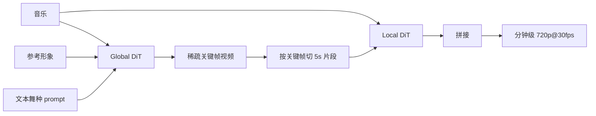
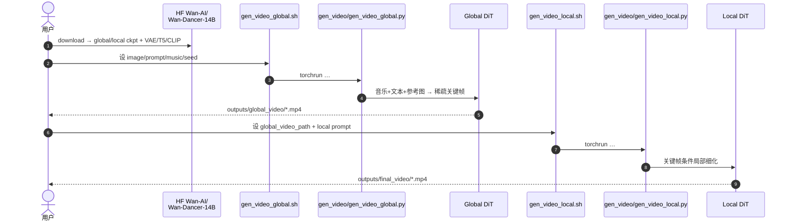

# Wan-Dancer（分钟级连贯 Music-to-Dance 视频生成）

**Wan-Dancer**（*Wan-Dancer: A Hierarchical Framework for Minute-scale Coherent Music-to-Dance Generation*，[arXiv:2607.09581](https://arxiv.org/abs/2607.09581)，2026，**Huang 等** · **阿里巴巴（Alibaba）通义实验室（Tongyi Lab）**；[项目页](https://humanaigc.github.io/wan-dancer-project/)，[代码](https://github.com/Wan-Video/Wan-Dancer)，[权重](https://huggingface.co/Wan-AI/Wan-Dancer-14B)）在 **Wan-I2V** 骨干上做 **音乐驱动舞蹈视频**：用 **全局关键帧规划 + 局部时序 refinement** 把生成时长从常见的十余秒推到 **分钟级**，输出约 **720p / 30fps**，覆盖中国古典舞、K-Pop、街舞、踢踏、拉丁等五类风格，并支持文本与参考形象条件。

## 一句话定义

**一种基于 Wan-I2V 的分层 music-to-dance：先用全曲音乐规划稀疏关键帧，再局部细化拼接，生成分钟级、有节奏且身份稳定的高清舞蹈视频。**

## 英文缩写速查

| 缩写 | 英文全称 | 简要说明 |
|------|----------|----------|
| I2V | Image-to-Video | 以参考形象首帧为条件的视频生成 |
| DiT | Diffusion Transformer | Wan 系去噪骨干；本文分 Global / Local 两套权重 |
| RoPE | Rotary Positional Embedding | 注入绝对时间，适配可变时长与动态 fps |
| RF | Rectified Flow | 训练目标：预测速度场（与 Wan-I2V 管线一致） |
| LoRA | Low-Rank Adaptation | 用少量同编舞参考视频定制特定套路 |
| VAE | Variational Autoencoder | Wan-VAE 编解码；光流亦经 VAE 进损失权重 |
| FPS | Frames Per Second | 目标约 30fps；全局稀疏关键帧与局部高帧率分段 |

## 为什么重要

- **打破短窗天花板：** 通用视频扩散与多数 music-to-dance 系统常卡在 **~5–20 s**；本文用分层全局—局部把 **>1 min**（项目页样例可达约 2–3 min）做成可复现开源能力。
- **Wan 族可控生成谱系补全：** 相对 [Wan-Move](./paper-wan-move.md) 的「点轨迹运动刷」，Wan-Dancer 的条件是 **音乐 + 文本 + 参考形象**，面向编舞节奏与长时程身份一致。
- **人形研究的间接价值：** 不给出可执行关节动作，但可作为 [WBT](../overview/hub-wbt.md) / 高动态模仿链路的 **长时程参考视频先验**（再经姿态估计或人工筛选进入仿真跟踪），并示范长 horizon 分层生成技巧。

## 核心原理（方法）

### 统一骨干上的 Global / Local

建于 [Wan-I2V](./paper-wan-video.md)：VAE latent 与 **keyframe mask** 拼接进 DiT。同一训练配方、不同 mask 语义：

| 阶段 | Mask 策略 | 学到的能力 |
|------|-----------|------------|
| **Global** | 仅第一帧为 1，其余 0 | 从初始条件推演全曲结构与节奏骨架 |
| **Local** | 序列内随机稀疏关键帧为 1 | 在任意时间锚点间做细粒度插值与运动连续 |

多模态条件：参考图 **CLIP**、文本 **umT5**、轻量 **Music Encoder** → Music block 注入 DiT。

### 长时程稳定技巧

| 技巧 | 作用 |
|------|------|
| **Time-mapped RoPE** | 绝对时间进位置编码，适配可变音乐时长与动态帧率 |
| **光流加权 RF 损失** | 速度场预测乘以光流 latent 权重，强化运动连续 |
| **运动速度分层** | 按关键点速度分慢/中/快采样（约 10%/80%/10%），兼顾流体中速与快速动作细节 |

### 流程总览（推理）

## 开源状态

**已开源**（截至 **2026-07-31**）：

| 产物 | 状态 |
|------|------|
| 论文 | [arXiv:2607.09581](https://arxiv.org/abs/2607.09581) |
| 代码 | [Wan-Video/Wan-Dancer](https://github.com/Wan-Video/Wan-Dancer) · **Apache-2.0** |
| 权重 | HF / ModelScope **[`Wan-AI/Wan-Dancer-14B`](https://huggingface.co/Wan-AI/Wan-Dancer-14B)**（`global_model.safetensors` + `local_model.safetensors` 等） |
| Demo | [ModelScope Studio](https://modelscope.ai/studios/Wan-AI/Wan-Dancer) |
| 训练代码 | 公开仓以**推理**为主；论文描述两阶段训练与 LoRA，完整训练管线是否另仓发布以官方后续为准 |

> **URL 澄清：** `https://github.com/Wan-AI/Wan-Dancer-14B` **不存在**（404）。`Wan-AI/Wan-Dancer-14B` 是权重 ID；代码在 **`Wan-Video/Wan-Dancer`**。

## 源码运行时序图

节点对齐 [`sources/repos/wan-dancer.md`](../../sources/repos/wan-dancer.md)（`gen_video_global.sh` / `gen_video_local.sh`）。

- **最短复现：** 拉 `Wan-Dancer-14B` → 按 README 装依赖 → `./gen_video_global.sh` → 填 `global_video_path` 后 `./gen_video_local.sh`。
- **硬件口径：** README 测试 **8×A800 80GB**；亦有 DiffSynth-Studio 单阶段 local 示例脚本可作轻量试验入口。
- **舞种：** 切换 `gen_video/prompt/*_{global,local}.txt`（古典舞 / kpop / 街舞 / 踢踏 / 拉丁）。

## 工程实践

| 项 | 实践要点 |
|----|----------|
| 两阶段顺序 | Local **必须**吃 Global 输出；prompt 分 `*_global.txt` / `*_local.txt`，勿混用 |
| 步数 | README 示例 Global ~48 step、Local ~24；更长视频宜增大 `num_inference_steps` |
| 定制编舞 | 论文：约 **16** 条同编舞参考 + **LoRA rank 32**、~800 step；项目页有单曲多参考 / 单参考多曲 demo |
| 关键帧创意 | Global 关键帧可换装或手改后再进 Local，做外观/动作硬控 |
| 机器人迁移 | 输出是 **RGB 视频**；进人形跟踪前仍需姿态估计 / retarget / 物理滤波，见 [WBT 枢纽](../overview/hub-wbt.md) |

## 实验要点（索引级）

| 轴 | 报告口径（以论文为准） |
|----|------------------------|
| 数据 | 自建约 **200 h**，≥720p@30fps，五类舞种近均匀；5 s / 50% overlap；SEA-RAFT 光流 |
| 训练 | 低分（320×544）128×A100、20k step → 720p USP 微调 4k step；lr \(1\times10^{-5}\) |
| 推理规格 | 全局约 **38** 关键帧 → 每段 **149** 帧局部 → 拼接分钟级 |
| Dance Quality 均值 | Wan-Dancer **8.46** vs MusicInfuser 6.23 / X-Dancer 6.06（Table 1） |
| Video Quality 均值 | **7.46** vs 5.22 / 6.23（Table 2） |
| Prompt Alignment 均值 | **9.03** vs MusicInfuser 6.61（Table 3；X-Dancer 无原生文本条件） |

## 结论

**Wan-Dancer 的真贡献是「用分层全局—局部把 music-to-dance 从短窗推到分钟级」，并在 Wan-I2V 开源栈上把节奏、身份与分辨率同时稳住——它对机器人是参考视频先验，不是可部署控制器。**

- 真正拉开差距的是 **Global 全曲结构 + Local 切片细化**，而不是单纯加长上下文窗口；这直接针对拼接漂移与重复动作。
- 稳定性配方可复用到其他长视频任务：**time-mapped RoPE**、光流加权 RF、速度分层采样——与「只堆参数」路线不同。
- 开源落地清晰：Apache-2.0 推理仓 + 分拆的 global/local 14B 权重 + 五类 prompt；但 README 默认多卡高显存，消费级单卡需另寻 DiffSynth/量化路径。
- 适用边界是 **像素舞蹈视频**：无骨架接口、无接触/力矩保证；进 [WBT](../overview/hub-wbt.md) 仍要下游运动提取。
- 选型判据：要 **分钟级、音乐同步、开源 Wan 族舞蹈视频** 用本页；要 **点级运动刷** 转 [Wan-Move](./paper-wan-move.md)；要 **可执行全身跟踪** 转 physics-based WBT，而非直接部署本模型。

## 局限与风险

- **非机器人策略：** 无关节目标、奖励或真机协议；不可当作 dance controller。
- **算力门槛高：** 官方推理环境偏多卡 80GB；与 [Wan](./paper-wan-video.md) 1.3B 消费级叙事不同。
- **训练数据未公开：** 约 200 h 专有集；可复现的是推理，不是从零复训同分布。
- **后处理声明：** 项目页注明部分展示视频经后期精修，定性对照需结合论文表格读。
- **版权与伦理：** 参考形象与音乐可能涉及肖像/版权；商用前需自审数据与许可链。

## 与其他工作对比

| 对照对象 | 条件接口 | 时长/规格取向 | 与本页关系 |
|----------|----------|---------------|-----------|
| [Wan-I2V（基座）](./paper-wan-video.md) | 文本 + 首帧 | 通用短中视频 | 本文在其上加音乐编码与分层推理 |
| [Wan-Move](./paper-wan-move.md) | latent **点轨迹** | ~5 s / 480p | 同族可控 I2V；运动刷 ≠ 音乐编舞 |
| X-Dancer | 音频 + 图像（2D pose token） | 偏短片段拼接 | 论文主对照；本页强调长时程与文本舞种 |
| MusicInfuser | 音频 + 文本 | 受视频骨干短窗限制 | 端到端对照；本页分层突破分钟级 |
| music-to-motion（EDGE 等） | 音频 → **3D 骨架** | 通常 <20 s | 另一范式；本页直接出像素视频 |

**选型第一判据**：要 **开源、分钟级、音乐驱动的高清舞蹈视频** 选本页；要 **轨迹级运动编辑** 选 Wan-Move；要 **可上真机的舞蹈技能** 走 mocap/视频→retarget→RL 跟踪，而不是端到端部署 Wan-Dancer。

## 关联页面

- [Wan](./paper-wan-video.md) — 开源视频基础模型上游
- [Wan-Move](./paper-wan-move.md) — 同族 latent 轨迹运动控制
- [Generative World Models](../methods/generative-world-models.md) — 视频先验与长时程生成谱系
- [Video-as-Simulation](../concepts/video-as-simulation.md) — 视频当世界模型的概念边界
- [WBT 枢纽](../overview/hub-wbt.md) — 全身跟踪：参考运动如何进物理策略
- [Diffusion-based Motion Generation](../methods/diffusion-motion-generation.md) — 运动生成方法对照（多为骨架/轨迹，非像素舞蹈）

## 参考来源

- [Wan-Dancer 论文摘录](../../sources/papers/wan_dancer_arxiv_2607_09581.md)
- [Wan-Dancer 官方仓库](../../sources/repos/wan-dancer.md)
- [Wan-Dancer 项目页](../../sources/sites/wan-dancer-project.md)

## 推荐继续阅读

- Huang et al., *Wan-Dancer*, arXiv:2607.09581 — <https://arxiv.org/abs/2607.09581>
- 官方代码 — <https://github.com/Wan-Video/Wan-Dancer>
- 权重 — <https://huggingface.co/Wan-AI/Wan-Dancer-14B>
