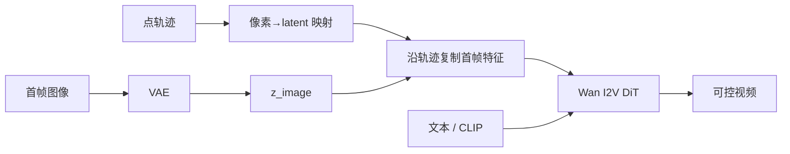
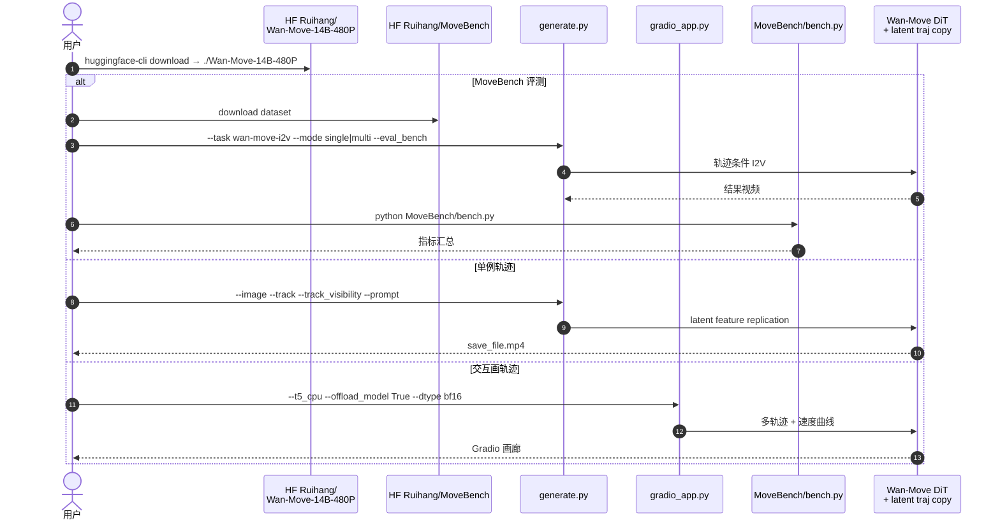

# Wan-Move（潜空间轨迹引导的运动可控视频生成）

**Wan-Move**（*Wan-Move: Motion-Controllable Video Generation via Latent Trajectory Guidance*，[arXiv:2512.08765](https://arxiv.org/abs/2512.08765)，**NeurIPS 2025**，Ruihang Chu 等 · **阿里巴巴（Alibaba）通义实验室** / **清华大学（Tsinghua）** / **香港大学（HKU）** / **香港中文大学（CUHK）**；[项目页](https://wan-move.github.io/)，[代码](https://github.com/ali-vilab/Wan-Move)）给开源 I2V（以 **Wan-I2V-14B** 为例）加上 **点级运动控制**：把像素轨迹映射到 VAE latent，沿轨迹复制首帧特征，**不新增运动编码器或 ControlNet**，从而可对强基座做可扩展微调；生成 **5 秒、480p** 视频，用户研究称运动可控性可比 Kling 1.5 Pro Motion Brush。

## 一句话定义

**一种无架构改动的 I2V 运动控制：用 latent 轨迹引导复制首帧特征，让点轨迹直接改写条件特征并驱动细粒度物体运动。**

## 英文缩写速查

| 缩写 | 英文全称 | 简要说明 |
|------|----------|----------|
| I2V | Image-to-Video | 首帧图像条件视频生成 |
| VAE | Variational Autoencoder | 将视频压到时空 latent；轨迹在此空间传播 |
| DiT | Diffusion Transformer | Wan 系去噪骨干 |
| FM | Flow Matching | 本文微调目标（向量场回归） |
| CFG | Classifier-Free Guidance | 推理时条件/无条件混合增强对齐 |
| MoveBench | MoveBench | 本文发布的运动控制评测集（~1018 clip） |
| SAM | Segment Anything Model | MoveBench 混合标注中的自动分割 |

## 为什么重要

- **可扩展条件注入范式：** 多数运动控制堆辅助模块，难跟 14B 级 I2V 同尺度训；Wan-Move 证明「**改条件特征**」即可达到商用级运动刷体验。
- **连接机器人像素条件 WM：** [Masked Visual Actions](./paper-masked-visual-actions.md) 等将 Wan-Move / Wan-I2V 列为视觉对照——理解 latent 轨迹 vs 掩码轨迹，有助于选型「通用运动刷」还是「机器人实体掩码」。
- **评测资产：** MoveBench 提供长时（5 s）、多类、轨迹+掩码标注，补齐 DAVIS / VIPSeg 等短 clip 评测缺口。

## 核心原理（方法）

### Latent Trajectory Guidance

1. 首帧 \(I\) 与后续 zero-pad 经 VAE 得 \(z_{\text{image}}\)。
2. 点轨迹 \(p\) 按空间压缩比 \(f_s\)、时间压缩比 \(f_t\) 映射为 latent 轨迹 \(\tilde{p}\)。
3. 将首帧在 \(\tilde{p}[0]\) 处的特征 **复制** 到后续帧 \(\tilde{p}[n]\)（仅可见轨迹）。

该操作直接更新条件特征，无需单独 \(z_{\text{motion}}\) 编码器。

### 训练与推理

| 项 | 口径 |
|----|------|
| 数据 | ~**200 万** 720p；质量模型 + SigLIP 运动稳定性过滤 |
| 轨迹 | CoTracker；每步最多 200 条；**5%** 丢运动条件保留原 I2V |
| 损失 | Flow matching \(\mathcal{L}_{\text{FM}}\) |
| 推理 | 文本（umT5）+ CLIP 全局图特征 + 轨迹改写后的 \(z_{\text{image}}\)；CFG |

### 流程总览

## 实验要点（索引级）

| 轴 | 报告口径（以论文 / README 为准） |
|----|----------------------------------|
| 输出规格 | **5 s**，**480p**（832×480 量级） |
| 用户研究 | 运动可控性对标 Kling 1.5 Pro Motion Brush |
| MoveBench | **1018** 视频、**54** 类、5 s、轨迹+掩码；人+SAM 标注 |
| 消融 | latent 特征复制优于像素随机嵌入；无 ControlNet 更易放大骨干 |

## 开源状态

**已开源**（截至 **2026-07-23**）：

| 产物 | 状态 |
|------|------|
| 论文 | [arXiv:2512.08765](https://arxiv.org/abs/2512.08765)（NeurIPS 2025） |
| 代码 | [ali-vilab/Wan-Move](https://github.com/ali-vilab/Wan-Move) · **Apache-2.0** |
| 权重 | HF [`Ruihang/Wan-Move-14B-480P`](https://huggingface.co/Ruihang/Wan-Move-14B-480P) |
| 基准 | HF [`Ruihang/MoveBench`](https://huggingface.co/datasets/Ruihang/MoveBench) |
| Demo | `gradio_app.py`；社区 ComfyUI / Wan2GP |

## 源码运行时序图

节点对齐 [`sources/repos/wan-move.md`](../../sources/repos/wan-move.md)。

- **最短复现：** 拉 14B-480P → `generate.py` + `examples/` 轨迹。
- **降显存：** `--t5_cpu --offload_model True --dtype bf16`（README：单卡 **40GB** 可跑）。
- **批量多卡：** FSDP；评测时 `--ulysses_size 1`。

## 工程实践

| 项 | 实践要点 |
|----|----------|
| 基座依赖 | 需理解 [Wan](./paper-wan-video.md) I2V 接口与 prompt extension；公平评测应关闭扩展 |
| 轨迹来源 | 训练用 CoTracker；推理可用 Gradio 手绘或外部 tracker |
| 机器人迁移 | 通用运动刷 ≠ 闭环物理；机器人掩码/低维动作条件见 MVA / Ctrl-World |
| 选型 | 要 **开源点级运动控制 + MoveBench** 用本页；要 **操纵策略评估沙盒** 转 [Ctrl-World](./paper-ctrl-world.md) / [Masked Visual Actions](./paper-masked-visual-actions.md) |

## 局限与风险

- **非机器人专用：** 不提供动作接口、成功判定或真机协议；直接当 WM 会缺因果控制语义。
- **算力门槛：** 14B 推理/微调成本高；虽有 offload，仍远重于 [DriftWorld](./paper-driftworld.md) 类 1-step 模型。
- **遮挡与冲突轨迹：** 多轨迹时空重叠时随机选一；复杂交互可能丢细节。
- **与掩码条件差异：** 点轨迹强调局部运动，不等价于 MVA 的「实体占据掩码」接口。

## 关联页面

- [Wan](./paper-wan-video.md) — 开源视频基础模型上游
- [Masked Visual Actions](./paper-masked-visual-actions.md) — 机器人掩码条件；文中对照基线之一
- [Ctrl-World](./paper-ctrl-world.md) — 低维动作多视角操纵 WM
- [Generative World Models](../methods/generative-world-models.md) — 条件注入谱系
- [MolmoMotion](./molmo-motion.md) — 另一类显式 3D 点轨迹运动先验

## 参考来源

- [Wan-Move 论文摘录](../../sources/papers/wan_move_arxiv_2512_08765.md)
- [Wan-Move 官方仓库](../../sources/repos/wan-move.md)
- [Wan-Move 项目页](../../sources/sites/wan-move-github-io.md)

## 推荐继续阅读

- Chu et al., *Wan-Move*, arXiv:2512.08765 / NeurIPS 2025 — <https://arxiv.org/abs/2512.08765>
- 官方代码与 MoveBench — <https://github.com/ali-vilab/Wan-Move>
