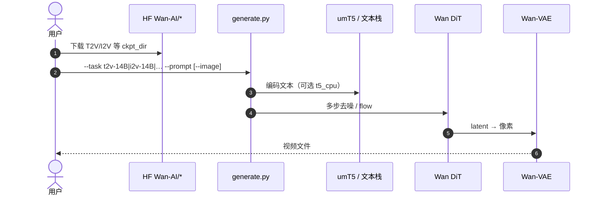

# Wan（开源大规模视频生成基础模型）

**Wan**（*Wan: Open and Advanced Large-Scale Video Generative Models*，[arXiv:2503.20314](https://arxiv.org/abs/2503.20314)，2025，**Wan Team** · **阿里巴巴（Alibaba）**；[站点](https://wan.video)，[Wan2.1](https://github.com/Wan-Video/Wan2.1) / [Wan2.2](https://github.com/Wan-Video/Wan2.2)）是一套 **开源视频基础模型** 技术报告与实现：在 DiT 范式上用新型 **Wan-VAE**、可扩展预训练与大规模数据策展，提供 **1.3B / 14B** 等规模及 T2V、I2V 等多任务能力。对本库而言，它的价值主要是 **机器人视频世界模型的上游视觉先验**——[Wan-Move](./paper-wan-move.md)、[Masked Visual Actions](./paper-masked-visual-actions.md)（Wan2.2-Fun-Control）以及多篇 WAM/WM 工作均建立在 Wan 族之上。

## 一句话定义

**一套开源视频 DiT 基础模型族：用高效 VAE 与大规模预训练提供可微调的 T2V/I2V 能力，并成为可控视频与机器人像素世界模型的常用骨干。**

## 英文缩写速查

| 缩写 | 英文全称 | 简要说明 |
|------|----------|----------|
| T2V | Text-to-Video | 文本条件视频生成 |
| I2V | Image-to-Video | 图像（首帧）条件视频生成 |
| VAE | Variational Autoencoder | Wan-VAE：高效时空压缩编解码 |
| DiT | Diffusion Transformer | 去噪骨干架构范式 |
| MoE | Mixture-of-Experts | Wan2.2 按时间步划分专家以扩容 |
| TI2V | Text-Image-to-Video | Wan2.2-5B 等混合条件生成 |
| VACE | Video creation and editing（Wan 生态） | 创作/编辑一体扩展模型线 |
| VRAM | Video RAM | 小模型可在消费级 GPU 推理的关键约束 |

## 为什么重要

- **开源天花板参照：** 报告与后续仓宣称在多项内外部基准上相对既有开源乃至部分商业方案领先，降低「只能调闭源 API」的研究门槛。
- **机器人侧事实标准骨干之一：** 操纵/驾驶/触觉等视频 WM 频繁微调 Wan2.1/2.2；不理解 Wan 的任务切分与显存档位，就难读 MVA、Wan-Move、ABot 等派生页。
- **可控扩展友好：** 官方与社区在 **不推倒骨干** 的前提下加轨迹、掩码、Fun-Control 等条件——对齐「先验在视频模型、语义在机器人适配层」的分工。

## 核心原理（方法）

### 报告级结构（索引）

技术报告强调四类贡献（摘要口径）：

| 支柱 | 含义 |
|------|------|
| **Leading Performance** | 14B + 大规模图/视频数据，展示缩放 |
| **Comprehensiveness** | 1.3B（效率）与 14B（效果）；多下游 |
| **Efficient VAE** | Wan-VAE：高分辨率、时长友好的编解码 |
| **Practical deployment** | 小模型消费级 GPU 可跑（如 T2V-1.3B ~8.19 GB VRAM） |

实现上采用主流 **latent diffusion / flow** + **DiT**；条件侧含文本编码器与（I2V）首帧 latent 通道拼接等（细节以报告与仓为准）。

### Wan2.1 → Wan2.2（工程演进）

| 版本 | 要点（官方 README） |
|------|---------------------|
| **Wan2.1** | 与 arXiv:2503.20314 主发布对齐；T2V/I2V/FLF2V/VACE 等 |
| **Wan2.2** | MoE 分时专家、美学标签数据、更大数据量、TI2V-5B（16×16×4 VAE，720P@24fps） |

机器人页引用时需分清：**Wan-Move** 论文基座为 **Wan-I2V-14B（2.1 线）**；**MVA** 使用 **Wan2.2-Fun-A14B-Control**。

### 流程总览（推理）

## 开源状态

**已开源**（截至 **2026-07-23**）：

| 产物 | 状态 |
|------|------|
| 论文 | [arXiv:2503.20314](https://arxiv.org/abs/2503.20314) |
| 代码 | [Wan-Video/Wan2.1](https://github.com/Wan-Video/Wan2.1)、[Wan2.2](https://github.com/Wan-Video/Wan2.2) · **Apache-2.0** |
| 权重 | HF / ModelScope **Wan-AI** 组织 |
| 集成 | Diffusers、ComfyUI、多社区加速/编辑插件 |

## 源码运行时序图

节点对齐 [`sources/repos/wan2.1.md`](../../sources/repos/wan2.1.md)（以 Wan2.1 `generate.py` 为主入口；2.2 类似）。

- **最短复现：** 装依赖 → 拉 T2V-1.3B → `generate.py --task t2v-1.3B --offload_model True --t5_cpu`。
- **I2V 下游：** 拉 I2V-14B 权重后同入口加 `--image`；再接 [Wan-Move](./paper-wan-move.md) 做轨迹控制。
- **机器人 Fun-Control：** 不在本仓直出，见 MVA 所用 ModelScope `PAI/Wan2.2-Fun-A14B-Control` + DiffSynth。

## 工程实践

| 项 | 实践要点 |
|----|----------|
| 选型档位 | 原型 / 消费级 → 1.3B 或 2.2-TI2V-5B；质量优先 → 14B |
| 显存 | 官方 offload / t5_cpu / 量化与社区 LightX2V 等 |
| 机器人适配层 | 在 Wan 上加 **动作 / 掩码 / 轨迹 / IR**，不要期望裸 I2V 给出可执行动作 |
| 版本钉扎 | 派生论文写明 2.1 vs 2.2 vs Fun-Control；权重与 DiffSynth commit 需一并记录 |

## 局限与风险

- **不是机器人仿真器：** 无原生动作接口与接触保证；[Video-as-Simulation](../concepts/video-as-simulation.md) 仍需额外条件与校准。
- **报告 vs 产品线：** arXiv 对应 Wan2.1 主叙事；Wan2.2 能力以官方仓/博客为准，避免把 2.2 新特性误标进 2503.20314 正文。
- **许可与再分发：** Apache-2.0 友好，但下游数据与商业 API 条款需单独审查。
- **算力与碳成本：** 14B 训练/大规模微调仍属机构级资源。

## 评测（索引级）

技术报告以「能力覆盖 + 缩放 + 可部署」为主线，评测口径**以报告与官方仓为准**，本库仅做索引，不复述未经核对的具体分数：

| 评测轴 | 报告/仓库口径 |
|--------|---------------|
| 相对开源/闭源 | 报告称在多项内外部基准上相对既有开源、乃至部分商业方案领先（具体基准以报告表格为准） |
| 规模覆盖 | 1.3B（效率档）与 14B（效果档）同时给出，体现 comprehensiveness 而非单点最优 |
| 可部署 | T2V-1.3B 约 **8.19 GB VRAM** 消费级可跑，是「效果 vs 显存」权衡的实证点 |
| 版本演进 | Wan2.2 以 MoE 分时专家 + 美学标签数据 + 更大数据量扩容，能力**以官方仓/博客为准** |

> ⚠️ arXiv:2503.20314 对应 Wan2.1 主叙事；引用 Wan2.2 新能力时须另标官方来源，避免把 2.2 特性误标进 2503.20314 正文。

## 与其他工作对比

Wan 在本库的定位是**上游视觉先验**，而非终端机器人世界模型；与其派生/对照工作的分工如下：

| 对照对象 | 骨干关系 | 条件接口 | 定位差异 |
|----------|----------|----------|----------|
| [Wan-Move](./paper-wan-move.md) | Wan-I2V-14B（2.1 线） | latent 点轨迹 | 在 Wan 上加通用运动刷，不改骨干 |
| [Masked Visual Actions](./paper-masked-visual-actions.md) | Wan2.2-Fun-A14B-Control | 实体占据掩码 | 机器人像素 WM，走 Fun-Control 条件线 |
| [Ctrl-World](./paper-ctrl-world.md) | **非 Wan（SVD）** | 低维动作 + 多视角 | 骨干对照项，说明可控 WM 不必绑定 Wan |
| [ABot-M0.5](./paper-abot-m05-mobile-manipulation-wam.md) / [τ₀ World Model](./tau0-world-model.md) | Wan2.2 系 | 具身动作/观测 | 其他 Wan2.2 具身衍生，共享上游先验 |

**选型第一判据**：需要**可微调的视频基础先验**时选本页作骨干；需要**可执行动作/掩码/接触语义**时，价值在派生的机器人适配层，而非裸 Wan I2V——「先验在视频模型、语义在机器人适配层」。

## 关联页面

- [Wan-Move](./paper-wan-move.md) — latent 轨迹运动控制（I2V-14B）
- [Masked Visual Actions](./paper-masked-visual-actions.md) — Wan2.2-Fun-Control 机器人掩码 WM
- [Ctrl-World](./paper-ctrl-world.md) — 非 Wan 骨干的对照（SVD）可控操纵 WM
- [Generative World Models](../methods/generative-world-models.md) — 方法谱系
- [ABot-M0.5](./paper-abot-m05-mobile-manipulation-wam.md) / [τ₀ World Model](./tau0-world-model.md) — 其他 Wan2.2 系具身衍生

## 参考来源

- [Wan 技术报告摘录](../../sources/papers/wan_video_arxiv_2503_20314.md)
- [Wan2.1 / Wan2.2 仓库归档](../../sources/repos/wan2.1.md)
- [Wan 官方站点](../../sources/sites/wan-video.md)

## 推荐继续阅读

- Wan Team, *Wan: Open and Advanced Large-Scale Video Generative Models*, arXiv:2503.20314 — <https://arxiv.org/abs/2503.20314>
- 官方实现 — <https://github.com/Wan-Video/Wan2.1>（及 [Wan2.2](https://github.com/Wan-Video/Wan2.2)）
