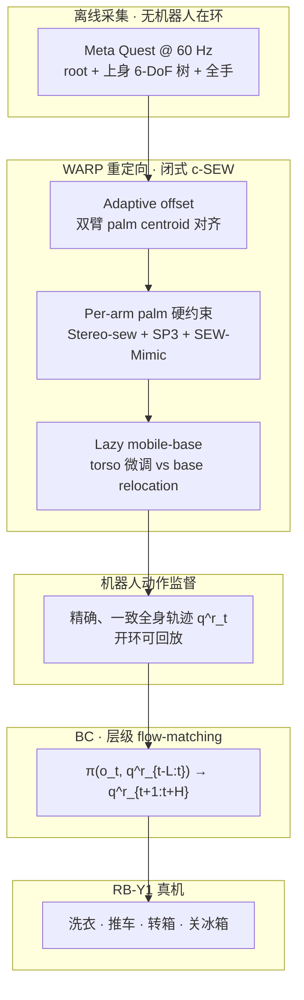

# WARP（Whole-body-Aware Retargeting from human Pose）

**WARP**（*WARP: Whole-Body Retargeting for Learning from Offline Human Demonstrations*，arXiv:[2606.29940](https://arxiv.org/abs/2606.29940)，[项目页](https://warp-retargeting.github.io/)）提出 **离线人类全身演示 → 可学习机器人动作** 的闭式重定向管线：核心 **c-SEW** 在 Shoulder–Elbow–Wrist 表示上以 **palm 硬约束 + adaptive offset + Stereo-sew/SP3** 得到唯一、微秒级全身解；**lazy mobile-base** 解耦上身微调与底座 relocation；层级 **flow-matching** 策略直接吃重定向动作做 BC。论文宣称首个无需 human-in-the-loop 遥操作数据、从离线人演示零样本部署全身移动操作的系统。

## 一句话定义

WARP 把「人类数据便宜、机器人数据贵」的瓶颈落在 **离线重定向质量**：闭式全身几何解保证监督 **精确且单模**，使开环回放与 BC 在全身移动操作上同时可行。

## 英文缩写速查

| 缩写 | 英文全称 | 简要说明 |
|------|----------|----------|
| WARP | Whole-body-Aware Retargeting from human Pose | 本文离线全身人→机重定向框架 |
| SEW | Shoulder–Elbow–Wrist | 肩–肘–腕几何表示；闭式 IK 骨干 |
| c-SEW | constrained SEW | WARP 闭式解：palm 硬约束 + 链长自适应 |
| BC | Behavior Cloning | 行为克隆；本文用重定向动作作监督 |
| IK | Inverse Kinematics | 逆运动学；WARP 避免冗余关节空间加权 IK |
| EEF | End-Effector | 末端执行器；仅 EEF 重定向会丢肘/躯干结构 |
| JL | Joint Limit | 关节限位；BONES-SEED-SOMA 评测可选惩罚项 |

## 为什么重要

- **数据经济学：** 全身移动遥操作（Mobile ALOHA、Open-TeleVision、UMI 等）硬件重、节奏慢；**Meta Quest 离线采集** 无需机器人或 MoCap 架，但 embodiment gap 使劣质重定向直接 poison BC。
- **离线更严：** 在线遥操作有人闭环纠错；离线设定下重定向轨迹 **就是标签**——不精确（EEF vs 全身 trade-off）或不一致（同人姿多解）都会变成 **action multi-modality**。
- **闭式 vs 优化：** 相对 MINK 类加权 IK，WARP 把 palm 匹配升为 **硬约束**，其余自由度解析保 SEW 结构，**>150×** 降低 palm 误差（项目页 Table）且 solver variation 近机器精度。
- **下游 decisive：** DexMimicGen 上 replay 相近时，WARP 数据训练策略平均成功率 **71% vs MINK 59%**；真机转箱任务同等 replay 下 **65% vs 40%**——运动质量比 replay 完成率更决定 BC 上限。
- **全身语义：** 冰箱关合等任务依赖 **肘–躯干** 协调，EEF-only 重定向无法表达；WARP 保留全身结构意图。

## 方法

| 模块 | 作用 |
|------|------|
| **Adaptive offset** | 双臂 palm centroid 闭式对齐，吸收人–机链长差 |
| **Per-arm palm alignment** | 手掌位姿硬约束；Stereo-sew 保肘半平面；SP3 解上臂；SEW-Mimic 闭式关节角 |
| **Lazy mobile-base** | 6-DoF torso 吸收小调整；底座仅跟踪 lazy target，避免 manipulation 中底座抖动 |
| **Hierarchical flow policy** | 单 flow-matching 头 + block-causal attention（base ≼ torso ≼ arm ≼ hand） |
| **采集** | Meta Quest：root locomotion + 6-DoF 上身树 + 全手 @ 60 Hz |
| **部署平台** | RB-Y1：holonomic base、6-DoF torso、双 7-DoF 臂、12-DoF XHands @ 100 Hz |

### 流程总览

### 与常见失败模式对照

| 失败模式 | 典型表现（MINK-EF / MINK-TE 等） | WARP 设计回应 |
|----------|----------------------------------|---------------|
| **不精确** | 加权 IK：要么 EEF 准、全身不像人，要么全身像人、EEF 漂 | palm **硬约束** + SEW 结构解析保真 |
| **不一致** | 冗余人形多解、种子敏感 → 相似观测不同动作 | Stereo-sew + SP3 分支选择 → **唯一解** |
| **底座耦合** | 上身微调驱动高惯量 base 抖动 | **Lazy base** + torso 吸收 |

## 源码运行时序图

**不适用。** 截至 **2026-08-20**，[项目页](https://warp-retargeting.github.io/) 与 arXiv abs **均未列出** 官方 GitHub / 数据集入口；无法对齐可运行 README 入口绘制运行时序图。后续若开源，应补 `sources/repos/` 与本节 sequenceDiagram。

## 工程实践（含开源状态）

| 项 | 结论 |
|----|------|
| 项目页 | <https://warp-retargeting.github.io/> |
| 论文 | <https://arxiv.org/abs/2606.29940> |
| 官方代码 | **未发现**（项目页无 Code / GitHub 链接） |
| 采集硬件 | Meta Quest（60 Hz）；无需外部 MoCap |
| 机器人 | RB-Y1 + XHands；关节阻抗 100 Hz |
| 定位（论文实验） | AprilTag 物体 + Vicon 机座（隔离视觉策略因素） |
| 可复现边界 | 可复核论文、项目页视频与表格；**不可**直接复现训练/重定向代码栈 |

## 实验与评测

### 重定向质量（BONES-SEED-SOMA · 514 clips）

- **WARP（JL off）：** palm mean **0.0046 mm**、P95 **0.046 mm**；limit fraction **0.0047**；collision fraction **0.163**；solver variation RMS **~6.7×10⁻¹⁴ deg** 量级。
- **对照：** MINK-EF palm mean **0.701 mm**、collision **0.977**；MINK-TE palm mean **18.6 mm**；SEW-M palm mean **179 mm**（方向匹配、非 palm 硬约束）。
- **速度：** 项目页称相对 SEW-M 级基线约 **30×** 加速（一小时 vs 一天量级处理 SEED）。

### 仿真策略学习（DexMimicGen · GR1→RB-Y1 · 200 demos/task）

| 任务 | MINK replay / policy | WARP replay / policy |
|------|----------------------|----------------------|
| can_sort | 99.5% / 94% | 98.5% / **100%** |
| pouring | 88.5% / 74% | 90.5% / **78%** |
| coffee | 50.5% / 8% | 51.0% / **34%** |
| **average** | 79.5% / **59%** | 80.0% / **71%** |

Replay 相近；WARP 监督对 BC **+12%** 平均策略成功率。

### 真机（50 human demos/task）

- **任务：** 洗衣（双手腕）、推车（base–arm 接触）、转箱（torso–arm 扭转）、关冰箱（**肘关合**）。
- **WARP** 四任务全胜；冰箱 replay **90%**；转箱同等 replay 下策略 **65% vs MINK 40%**。

## 结论

**离线全身移动操作的关键不是「有没有人类数据」，而是重定向能否同时做到精确、一致、可开环回放——WARP 用闭式 c-SEW 把这一层从加权 IK 的模糊 trade-off 里拉出来。**

1. **离线监督比遥操作苛刻** — 无人在环纠错；重定向误差直接进 BC loss，必须 **精确（palm + 全身结构）且一致（唯一解）**。
2. **c-SEW 是主杠杆** — adaptive offset + palm 硬约束 + Stereo-sew/SP3 闭式链；palm 误差相对 MINK-EF 降 **>150×**，variation 近机器精度。
3. **Lazy base 管协同** — torso 吸收微调、base 只做 relocation，减轻 manipulation 中底座滞后与 overshoot。
4. **Replay ≠ 可学** — DexMimicGen replay 相近时策略仍差 **12%**；真机转箱同等 replay 下 **65% vs 40%** — 运动质量决定下游上限（呼应 [Retargeting Matters](./paper-hrl-stack-01-retargeting_matters.md)）。
5. **全身语义不可省** — 冰箱肘接触等任务 EEF-only 无法表达；须保留 SEW/躯干/底座意图。
6. **边界：无视觉策略** — 作者承认当前无图像观测限制任务面；代码截至入库日未开源，复现待跟进。

## 局限与风险

- **策略无视觉：** 实验用 AprilTag + Vicon 隔离感知；尚未验证 visual-motor BC + WARP 数据的可扩展性（作者计划方向）。
- **平台特定：** 主结果 RB-Y1；跨 embodiment 泛化论文有 DexMimicGen GR1→RB-Y1 一例，真机广度有限。
- **动力学层：** 本文聚焦 **运动学** 重定向与 BC；未做 OmniRetarget/SPIDER 类物理精炼或 RL tracking 层。
- **开源：** 截至 2026-08-20 **未开源**；工程复现仅能参考论文与项目页。

## 核心信息

| 字段 | 内容 |
|------|------|
| 机构 | 佐治亚理工学院（Georgia Tech） |
| 出处 | arXiv preprint（2026） |
| 链接 | [项目页](https://warp-retargeting.github.io/) · [arXiv](https://arxiv.org/abs/2606.29940) |

## 与其他页面的关系

- **Retargeting 质量命题：** [Retargeting Matters / GMR](./paper-hrl-stack-01-retargeting_matters.md) — 重定向质量上限早于 RL/BC
- **交互场景硬约束：** [OmniRetarget](./paper-hrl-stack-03-omniretarget.md) — interaction mesh + SOCP；侧重场景/物体交互增广
- **Meta Quest 但不同环：** [CWI](./paper-cwi-composite-humanoid-whole-body-imitation.md)（robot teleop BC）、[BifrostUMI](./paper-bifrost-umi.md)（SKR + 扩散高层）
- **问题域：** [Motion Retargeting](../concepts/motion-retargeting.md)、[Loco-Manipulation](../tasks/loco-manipulation.md)、[Imitation Learning](../methods/imitation-learning.md)
- **SEW 上游：** [SEW-Mimic 阅读笔记](https://imchong.github.io/Humanoid_Robot_Learning_Paper_Notebooks/papers/07_Teleoperation/SEW-Mimic__Closed-Form_Geometric_Retargeting_Solver_for_Upper_Body_Humanoid_Teleoperation/SEW-Mimic__Closed-Form_Geometric_Retargeting_Solver_for_Upper_Body_Humanoid_Teleoperation.html) — 在线上身闭式解；WARP 扩展到离线 palm 硬约束 + 全身底座

## 参考来源

- [warp_arxiv_2606_29940.md](../../sources/papers/warp_arxiv_2606_29940.md) — 论文全文消化（主归档）
- [warp-retargeting-github-io.md](../../sources/sites/warp-retargeting-github-io.md) — 项目页与演示视频（步骤 2.5：未列代码）

## 推荐继续阅读

- arXiv：<https://arxiv.org/abs/2606.29940>
- 项目页：<https://warp-retargeting.github.io/>
- [Motion Retargeting（概念）](../concepts/motion-retargeting.md)
- [人形训练数据管线选型指南](../queries/humanoid-training-data-pipeline.md)
