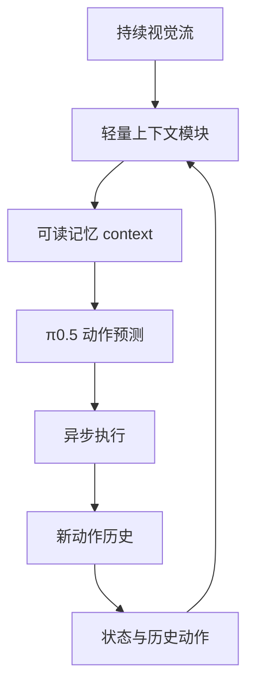

# Watch, Recall, Act（arXiv:2609.28429）

**Watch, Recall, Act**（*Watch, Recall, Act: Always-On Robots in Concurrent Embodied Streams*，[arXiv:2609.28429](https://arxiv.org/abs/2609.28429)）来自 [senlanke 具身运控lab 周更盘点](../../sources/blogs/wechat_senlanke_weekly_manipulation_2026-09-21_25.md)（2026-09-21–25）。

## 一句话定义

**π0.5 上三轻量模块压缩持续视觉/状态/历史动作为可读 context；感知记忆动作异步。**

## 英文缩写速查

| 缩写 | 英文全称 | 简要说明 |
|------|----------|----------|
| RL | Reinforcement Learning | 强化学习 |
| WBC | Whole-Body Control | 全身控制 |
| MPC | Model Predictive Control | 模型预测控制 |

## 为什么重要

- 真实家庭并发事件需长期记忆而非 reset benchmark。

## 流程总览

以下按本页已归纳的机制与资料绘制，表示模块或阅读路径关系。

## 核心机制

| 项 | 内容 |
|----|------|
| **arXiv** | [2609.28429](https://arxiv.org/abs/2609.28429) |
| **开源** | **待发布**（步骤 2.5，2026-09-28） |
| **方法摘要** | Always-on context modules on π0.5 for concurrent embodied streams. |

## 源码运行时序图

**不适用**（截至 2026-09-28 未发布可运行官方代码或待核实）。

## 实验与评测

- 并发流数据与双臂评测（上交/港中文/南大/Astribot 等，以 PDF 为准）。
- 读法：先对齐任务设定、传感器与成功定义，再解读 headline 数字。

## 与其他工作对比

| 维度 | 读法 |
|------|------|
| **同周对照** | 见对应 [周更盘点](../../sources/blogs/wechat_senlanke_weekly_manipulation_2026-09-21_25.md) 映射表，勿跨任务直接比 SR |
| **开源状态** | **待发布** — 部署前以项目页/arXiv 为准 |

## 结论

**常开机器人需要把 memory 做成策略可读 context 而非 episodic reset。**

1. 开源：**待发布**；勿凭公众号摘要臆断可复现性。
2. 指标须连同实验条件解读（仿真/真机、平台、成功阈值）。
3. 关注 arXiv 版本更新与代码发布。

## 关联页面

- [manipulation](../tasks/manipulation.md)
- [vla](../methods/vla.md)
- [world-action-models](../concepts/world-action-models.md)

## 参考来源

- [watch-recall-act-concurrent-streams_arxiv_2609_28429.md](../../sources/papers/watch-recall-act-concurrent-streams_arxiv_2609_28429.md)
- [wechat_senlanke_weekly_manipulation_2026-09-21_25.md](../../sources/blogs/wechat_senlanke_weekly_manipulation_2026-09-21_25.md)
- [arXiv:2609.28429](https://arxiv.org/abs/2609.28429)

## 推荐继续阅读

- [arXiv PDF](https://arxiv.org/pdf/2609.28429)
