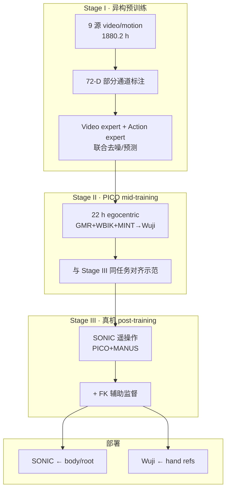

# WB-WAM（异构身–手预训练 · 人形 Loco-Manipulation WAM）

**WB-WAM**（*Heterogeneous Body-Hand Pre-training for Humanoid Loco-Manipulation*，[arXiv:2609.34199](https://arxiv.org/abs/2609.34199)，[项目页](https://wb-wam.github.io/)）由 **清华大学 IIIS（MARS Lab）**、**雄安新区人工智能研究院** 与 **墨尔本大学** 等联合提出：在 **生成式视频预训练** 中显式加入 **body / root / 双手** 的 **72 维物理动作监督**，用 **部分标注的异构大数据** 学 joint video–action 先验，再经 **任务对齐 PICO 示范** 与 **少量 SONIC 真机遥操作** 适配人形 loco-manipulation。

## 一句话定义

**把「身怎么动、根怎么移、手怎么弯」写进同一个 WAM 预测空间——异构源缺哪条通道就填哪条，再用 PICO 人示范补机器人数据。**

## 英文缩写速查

| 缩写 | 英文全称 | 简要说明 |
|------|----------|----------|
| WAM | World–Action Model | 联合视觉动力学与动作生成的策略族 |
| WB | Whole-Body | 身–根–手一体的 72-D 动作空间 |
| SONIC | Scalable Online Neural whole-body Integrated Control | body/root 参考的低层全身跟踪执行器 |
| GMR | General Motion Retargeting | 人体/异构 motion → G1 形态 |
| PICO | PICO VR 设备 | Stage II egocentric 采集与 mid-training |
| FK | Forward Kinematics | Stage III 辅助 body 几何监督 |
| HSI/HOI | Human–Scene / Human–Object Interaction | HumanoidArena 任务类型 |

## 为什么重要

- **预训练缺口在「身–手同屏」：** 纯机器人轨迹 scarce；人视频 / motion 库 abundant 但 **标注不完整**——WB-WAM 用 **共享 72-D 空间** 让各源只贡献自己有的通道，仍共训 video + action expert。
- **与 arm-centric WAM 对照：** [OpenWAM](./paper-openwam.md) 等强在桌面/双臂；本文把 **root + body + Wuji 手** 与 **SONIC 解码** 绑进 **loco-manipulation** 闭环，并在 [HumanoidArena](./paper-humanoidarena.md) **七任务** 上 **81.9%** 均值 SR。
- **PICO 作为 mid-training 而非仅采集工具：** **任务对齐** 的人示范可在 **30 ep/任务** 机端数据下 **超过** 无 mid-training 的 **100 ep**（**73.8% vs 65.0%**）——支持「人 motion 补 robot demo」工程路线。
- **与 WholeBodyWAM / MotionWAM 分工：** [WholeBodyWAM·UniMotion-4K](./paper-wholebodywam-unimotion-4k.md) 强调 **4K h motion expert + MoT**；[MotionWAM](./paper-motionwam-humanoid-loco-manipulation-wam.md) 强调 **实时 Video→Motion DiT + SONIC token**；WB-WAM 强调 **异构 partial label 预训练 + 72-D 可解释物理通道 + 三阶段 WB-Datasets**。

## 核心信息

| 项 | 内容 |
|----|------|
| **作者** | Chuan Qin*、Shaoting Zhu*、Siyuan Luo、Siqiao Huang、Hongyu Zhao、Hang Zhao† |
| **机构** | IIIS, Tsinghua University；Xiong'an Institute of Artificial Intelligence；The University of Melbourne |
| **动作空间** | **72-D**：body 关节参考、root、左右 articulated hand（Wuji） |
| **数据规模** | Stage I **1880.2 h**（9 源）；Stage II **22 h** PICO；Stage III **3.37 h** 真机（**1011 ep**） |
| **平台** | **Unitree G1** + **Wuji** 灵巧手；仿真/真机经 **SONIC** 执行 body/root |
| **开源** | **待发布** — [项目页](https://wb-wam.github.io/) GitHub/HF 按钮 **disabled**（2026-09-30） |

## 流程总览

## 核心原理

1. **部分观测动作共训：** 各数据源只填充 \(\mathbf{a}_t\) 中已有标注的子向量；video expert 与 action expert 仍 **同一条件**（vision / language / proprio）下联合优化。
2. **预测空间全程不变：** Stage I→III **不切换动作维度**；Stage III 用 **冻结 SONIC 编码** 等设计保持与部署接口一致（详见论文 §方法）。
3. **Mid-training 实验读法：** 仅对 **Stage III 任务在 PICO 中有对齐示范** 的四任务报告 **30 vs 100 demo** 对照——勿外推到无对齐任务。
4. **HumanoidArena 协议：** 与 benchmark 论文一致：**高层 WAM → SONIC**；对比对象为 **各任务最强已报告 SONIC 基线**，非单一全局 checkpoint。

## 源码运行时序图

**不适用** — 截至 **2026-09-30** 项目页未发布 GitHub 仓库或可运行入口。

## 工程实践

| 检查项 | 建议 |
|--------|------|
| 数据混合 | Stage I 核对 **9 源** 通道覆盖（仅手 / 仅 body / 全通道）与 GMR→G1、人手→Wuji 链路 |
| Mid-training | 仅当 **人示范任务 ≡ 机端任务** 时预期 **demo 数下降** 增益 |
| 执行分层 | **body/root 必须走 SONIC**；hand 直连 Wuji — 与 [MotionWAM](./paper-motionwam-humanoid-loco-manipulation-wam.md) 等同 SONIC 栈对齐 |
| 基线 | 真机对照含 **OpenWAM** 等 **6** 模型 — 复现时锁定 **同一 SONIC 版本与相机** |
| 代码跟进 | 发布时优先核对 **WB-Datasets** 划分与 **72-D schema** JSON |

## 实验与评测读法

- **HumanoidArena：** **81.9%** 七任务均值 SR；项目页称 **逐项超过** 最强 SONIC 基线。
- **真机五任务：** WB-WAM **84.0%** vs **OpenWAM 80.0%**（无 PICO mid-training 设定）。
- **Demo 效率：** 对齐 PICO + **30** robot ep → **73.8%** > 无 mid-training + **100** ep → **65.0%**。
- **语言条件：** 共享水果策略 — 验证 **指令选目标**，非新架构模块。

## 与其他工作对比

| 维度 | WB-WAM | MotionWAM | WholeBodyWAM·UniMotion-4K | OpenWAM |
|------|--------|-----------|---------------------------|---------|
| 预训练重点 | **异构 partial 72-D + video** | Egocentric video → motion | **4K h motion expert** | 模块化 WAM Study + α |
| 人形接口 | SONIC + Wuji 分通道 | SONIC token 统一 | 天工 3.0 + MoT | 80-D 桌面/多平台 |
| 人示范角色 | **Stage II 任务对齐 mid-training** | Stage 1 视频 | Motion 预训练 | Ego+robot 共训 |
| 仿真 benchmark | **HumanoidArena 81.9%** | 九项真机为主 | 仿真+真机 | LIBERO 等 |

## 结论

**WB-WAM 表明：把身–手物理动作写进 video WAM 预训练，并用 PICO 任务对齐 mid-training，可以在 HumanoidArena 与真机 loco-manipulation 上同时拿到高 SR 与更少机端 demo。**

1. **72-D 共享空间 + 部分标注** 是吃满 **1880 h** 异构源的关键——比「只堆 robot 轨迹」更贴 loco-manip 数据现实。
2. **81.9% / 84.0%** 两档数字分属 **仿真七任务** 与 **真机五任务** — 引用时勿混为同一协议。
3. **PICO mid-training** 在 **对齐任务** 上 **−70% robot demo** 仍赢 **100 ep** 直接适配 — 部署前应先确认是否有人示范同任务。
4. **SONIC 分层** 与 [HumanoidArena](./paper-humanoidarena.md) 诊断框架一致 — 换 GMT/tracker 时成功率可能大幅波动。
5. **代码待发布** — 复现依赖 **WB-Datasets**、SONIC 与 Wuji 遥操作协议一并放出。

## 局限与风险

- **Tracker 条件化：** 与 HumanoidArena 结论同族 — 强依赖 **SONIC** 质量与标定。
- **Mid-training 外推：** 增益仅在 **有对齐 PICO 任务** 上系统验证。
- **闭源阶段：** 无官方仓库时 **72-D 对齐、MINT+GMR 链** 只能按论文自搭。
- **机构覆盖：** 墨尔本等单位贡献需在代码/数据发布时核对 **authorship 与 license**。

## 关联页面

- [Loco-Manipulation](../tasks/loco-manipulation.md)
- [World Action Models](../concepts/world-action-models.md)
- [SONIC](../methods/sonic-motion-tracking.md)
- [HumanoidArena](./paper-humanoidarena.md)
- [OpenWAM](./paper-openwam.md)

## 参考来源

- [wb_wam_arxiv_2609_34199.md](../../sources/papers/wb_wam_arxiv_2609_34199.md)
- [wb-wam-github-io.md](../../sources/sites/wb-wam-github-io.md)
- [arXiv:2609.34199](https://arxiv.org/abs/2609.34199)

## 推荐继续阅读

- [项目页](https://wb-wam.github.io/)
- [HumanoidArena 项目页](https://humanoidarena.github.io/)（benchmark 协议）
- [OpenWAM 代码](https://github.com/OpenWAM-Official/OpenWAM)（真机对照基线之一）
