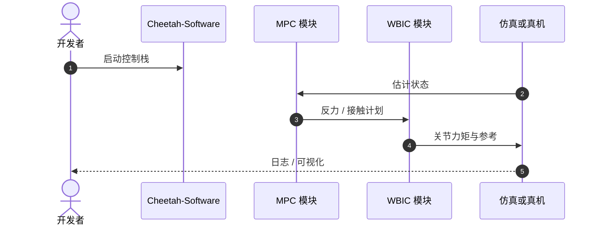

# Highly Dynamic Quadruped Locomotion via WBIC and MPC

## 一句话定义

**Kim, Di Carlo, Katz, Bledt & Kim（MIT，[arXiv:1909.06586](https://arxiv.org/abs/1909.06586)）** 给出 Mini Cheetah 高动态运动的分层控制：**MPC** 在简化模型上求较长时域最优反力剖面，**WBIC（Whole-Body Impulse Control）** 据此计算关节力矩与位置/速度命令，以应对腾空相、短支撑与高速摆腿。

## 英文缩写速查

| 缩写 | 英文全称 | 简要说明 |
|------|----------|----------|
| WBIC | Whole-Body Impulse Control | 全身冲量控制，强调反力/冲量一致性 |
| MPC | Model Predictive Control | 滚动时域优化反力剖面 |
| WBC | Whole-Body Control | 广义全身控制；本文变体侧重冲量 |
| QP | Quadratic Programming | WBC/WBIC 常用求解形式 |
| SRBD | Single Rigid Body Dynamics | 常见简化模型族 |

## 为什么重要

- 成为 Mini Cheetah **模型基 locomotion** 的标准叙事，广泛被 [mpc-wbc-integration](../concepts/mpc-wbc-integration.md) 引用。
- 明确「MPC 管长时域力、WBIC 管全身关节」的时域分离，可直接指导工程分层。
- 实现沉淀于开源 [Cheetah-Software](../../sources/repos/cheetah-software.md)。

## 核心信息

| 项 | 内容 |
|----|------|
| **机构** | 麻省理工（MIT） |
| **平台** | Mini Cheetah |
| **结构** | MPC（反力）→ WBIC（关节） |
| **开源** | **已开源**（Cheetah-Software） |

## 核心原理

- 不同于只跟踪躯干轨迹的 WBC：以 MPC 反力为桥梁，使全身命令与接触冲量一致。
- 适合空中相与高速腿摆——正是小四足「动起来」的难点。

## 源码运行时序图

## 工程实践

| 项 | 建议 |
|----|------|
| 频率 | MPC 数十–百 Hz 量级；WBIC/关节环更高（见概念页表） |
| 调试 | 先仿真对齐接触时刻与摩擦锥，再提高速度命令 |
| 阅读 | 与 [srbd-convex-mpc-wbc](../concepts/srbd-convex-mpc-wbc.md) 对照公式直觉 |

## 评测

| 维度 | 要点 |
|------|------|
| 动态性 | 面向高动态四足步态与接触切换 |
| 平台 | Mini Cheetah 真机验证 |
| 复现 | Cheetah-Software 可对照 |

## 结论

**总判：** 这是 Mini Cheetah 模型基控制的「主教材论文」——分层清晰、可开源复现，后续 RPC/视觉工作多在此内核上叠加。

- 真影响：反力–冲量一致的分层，支撑空中相与高速。
- 次要代价：依赖模型与接触计划质量；感知仍需外挂。
- 部署：优先 Cheetah-Software，再替换启发式/正则（见 RPC 线）。

## 局限与风险

- 简化模型误差在极端地形需 RPC/视觉或学习补偿。
- 调参与接触序列设计仍有工程门槛。

## 关联页面

- [MIT Mini Cheetah](./mit-mini-cheetah.md)
- [MPC–WBC 集成](../concepts/mpc-wbc-integration.md)
- [平台论文](./paper-mini-cheetah-platform.md)
- [RPC 启发式](./paper-extracting-legged-locomotion-heuristics-rpc.md)

## 参考来源

- [论文归档](../../sources/papers/wbic_mpc_mini_cheetah_arxiv_1909_06586.md)
- [Cheetah-Software](../../sources/repos/cheetah-software.md)

## 推荐继续阅读

- arXiv：<https://arxiv.org/abs/1909.06586>
