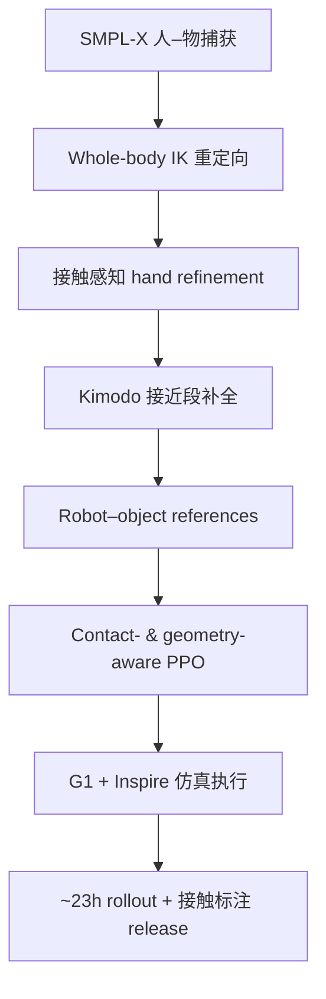
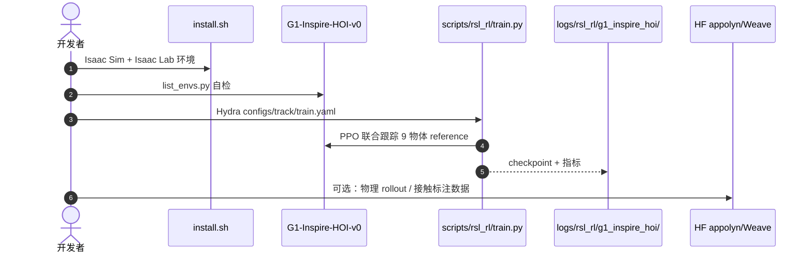

# WEAVE：从人–物交互学习全身灵巧 Loco-Manipulation

**WEAVE**（*Learning Whole-Body Dexterous Loco-Manipulation from Human–Object Interactions*，[arXiv:2609.16683](https://arxiv.org/abs/2609.16683)，[项目页](https://xiaohu-art.github.io/Weave/)）由 **清华大学**（IIIS / College AI）、**大连理工大学** 与 **香港中文大学** 提出：把捕获的 **SMPL-X 人–物交互** 转为可执行的 **robot–object reference**，再用 **contact- & geometry-aware** 单一 PPO 策略在仿真中联合跟踪 **Unitree G1（29 body DoF）+ 双 Inspire 手（12 finger DoF）** 与物体运动，实现 **whole-body dexterous loco-manipulation**。

## 一句话定义

**先用人–物 HOI 做出带接触标注的机器人 reference（含走到物体旁的 Kimodo 前缀），再让一条 PPO 同时管全身、手指和物体跟踪——把「会不会接触、能不能边走过去边抓」写进同一策略。**

## 英文缩写速查

| 缩写 | 英文全称 | 简要说明 |
|------|----------|----------|
| HOI | Human–Object Interaction | 人–物/机–物交互轨迹与接触 |
| PPO | Proximal Policy Optimization | 统一 tracking 策略训练算法 |
| IK | Inverse Kinematics | Whole-body 重定向到 G1 链节 |
| SMPL-X | Skinned Multi-Person Linear Model X | 捕获的人体与物体配对 motion |
| G1 | Unitree G1 Humanoid | 29 主动 body DoF 人形平台 |
| RSI | Reference State Initialization | 从 reference 附近初始化 rollout |
| DoF | Degrees of Freedom | 自由度 |

## 为什么重要

- **HOI 不是只重定向手：** 需要 **balance + locomotion + dexterous contact** 同时成立；WEAVE 把 **approach motion**（Kimodo）与 **interaction phase** 串成同一 reference。
- **接触显式进管线：** Hand refinement 用 **力闭合 + 防穿透**；策略奖励含 **contact matching**，link 级 in-contact / neutral / separated 标签。
- **多物体单策略可扩展：** 联合训练 9 物体 **7,869** 条 reference，测试未见序列仍 **~65%** success；27k iter 联合策略可 **超过** 九专精聚合完成率。
- **数据 release：** **~23 h** 物理执行 rollout + 接触标注，供下游 HOI 策略与物理一致 motion 生成。
- **已开源可复现：** [GitHub](https://github.com/xiaohu-art/Weave) + [HF 数据集](https://huggingface.co/datasets/appolyn/Weave)。

## 核心信息

| 项 | 内容 |
|----|------|
| **机构** | 清华大学；大连理工大学；香港中文大学 |
| **平台** | Unitree G1 + 双 Inspire 灵巧手 |
| **训练数据** | 9 物体；**7,869** train / **1,605** test references（**19.56 h / 3.67 h**） |
| **主指标** | 训练序列 **92.45%** success；未见 interaction 序列 **64.98%** success |
| **开源** | **已开源** — 代码 + HF rollout 数据集（2026-09-17） |

## 核心原理

**Stage A — Reference 构造**

1. **SMPL-X 序列：** 人体 motion + 被操作物体轨迹配对。
2. **Whole-body retarget：** IK 对齐选定链节；骨盆水平约束、高度由地面接触定。
3. **Contact-aware hand refinement：** 指尖拉向物体表面、最大化力闭合、惩罚穿透。
4. **Kimodo completion：** 补全「从旁侧走到初始交互 pose」locomotion；多方向采样扩数据。
5. **Link 接触标签：** 各 link 相对物体表面距离 → in-contact / neutral / separated。

**Stage B — Policy（PPO）**

- **输入：** proprioception、物体 pose/几何特征、短 horizon reference command。
- **输出：** body + **近端指关节** 位置目标。
- **奖励：** robot & object tracking、hand opposition、contact matching；RSI + early termination 贴近 reference。

### 流程总览

## 源码运行时序图

节点对齐 [`sources/repos/weave.md`](../../sources/repos/weave.md) README。

- **最短复现路径：** `bash install.sh` → `python scripts/rsl_rl/train.py --task=G1-Inspire-HOI-v0 --config-dir ./configs/track --config-name train`。
- **数据路径：** reference 默认 `data/train/`（九物体）；HF 数据集供下游 HOI 学习。

## 实验与评测

| 维度 | 数字 / 口径 |
|------|-------------|
| 数据规模 | 9 物体；**7,869** train / **1,605** test references（**19.56 h** / **3.67 h**） |
| 训练序列 | success **92.45%** |
| 未见 interaction 序列 | success **64.98%** —— 注意是 **同物体集合内的新序列**，非新物体 zero-shot |
| 联合 vs 专精 | 专精策略跟踪误差常更低，但 **interaction completion** 上联合策略（27k iter）可超过九个专精策略的聚合 |
| 优化器消融 | 3k iter 小预算下 **SimBaV2 + Muon** 样本效率优于 MLP + AdamW |
| 数据 release | **~23 h** 物理执行 rollout + 接触标注，可供下游 HOI 策略与物理一致 motion 生成复用 |
| 评测环境 | Isaac Sim / Isaac Lab 仿真为主；**真机 sim-to-real 不是本文主 claim** |

代码与 HF 数据集 **已开源**，上述指标可独立复现（见 [参考来源](#参考来源)）。

## 与其他工作对比

| 对照对象 | 差异 |
|----------|------|
| 只重定向手臂的 HOI 迁移 | 缺 approach 阶段，策略「站着够不到就失败」；WEAVE 用 **Kimodo 补全** 把走过去的 locomotion 串进同一 reference |
| 纯 kinematic motion mimic | 只对齐关节轨迹，不管接触是否成立；WEAVE 把 **link 级 in-contact / neutral / separated 标签** 写进奖励 |
| [CoorDex](./paper-coordex-dexterous-humanoid-loco-manipulation.md) | 同为 G1 dexterous loco-manip RL，但走 **潜先验 + 残差** 路线；WEAVE 走 HOI reference 跟踪 |
| [HALOMI](./paper-halomi-humanoid-loco-manipulation.md) | 无机器人示范 + VLA 路线；WEAVE 依赖 SMPL-X 人–物捕获与重定向管线 |
| 每物体一策略 | 跟踪误差更低但不可扩展；WEAVE 用 **单策略 9 物体** 换泛化与完成率 |
| VLA / 世界模型路线 | 正交：本文是 **RL tracking + HOI retarget** 轴上的强 baseline，不产出语言条件通用策略 |

## 工程实践

| 项 | 建议 |
|----|------|
| 网络/优化 | 小桌 3k iter：**SimBaV2 + Muon** 样本效率优于 MLP + AdamW |
| 联合 vs 专精 | 专精跟踪误差常更低，但 **interaction completion** 联合策略可更好 — 按任务选 |
| 泛化读法 | **65%** 为 **未见 interaction 序列**（同物体），非新物体 zero-shot |
| 对照 | [CoorDex](./paper-coordex-dexterous-humanoid-loco-manipulation.md)（潜先验+残差）、[HALOMI](./paper-halomi-humanoid-loco-manipulation.md)（无机器人示范+VLA） |
| 磁盘 | README 建议 workspace **~30 GB**（Isaac Sim + Lab + venv） |

## 局限与风险

- **仿真为主：** 项目页侧重 Isaac 评测；真机部署与 sim-to-real 未作为本文主 CLAIM。
- **未见序列 ≠ 新物体：** 65% 是 **新 interaction 序列**，物体集合仍在九类内。
- **Inspire 手 DoF：** 12 主动指关节 vs 更高 DoF 手，接触丰富度有上限。

## 关联页面

- [Loco-Manipulation 任务](../tasks/loco-manipulation.md)
- [Motion Retargeting Pipeline](../concepts/motion-retargeting-pipeline.md)
- [CoorDex](./paper-coordex-dexterous-humanoid-loco-manipulation.md) — 另一 G1 dexterous loco-manip RL 路线
- [Unitree G1](./unitree-g1.md)

## 结论

**WEAVE 把「人–物 HOI → 带接触的 robot reference → 单策略 whole-body dexterous tracking」做成可扩展管线，并用九物体与 ~23h rollout 数据证明联合训练能兼顾完成率与未见序列泛化。**

- **Reference 管线完整：** IK + 接触 hand + Kimodo 前缀 — 解决「只重定向手臂、不会走过去抓」。
- **接触进奖励与标签：** 不是纯 kinematic mimic。
- **多物体单策略有效：** 训练 **92.5%**；未见序列 **65%**；联合可 beat 专精聚合 completion。
- **工程可复现：** GitHub 训练栈 + HF 数据已发布。
- **读法：** 与 VLA/WM 路线正交 — 这是 **RL tracking + HOI retarget** 轴上的强 baseline。

## 参考来源

- [WEAVE 论文归档](../../sources/papers/weave_arxiv_2609_16683.md)
- [WEAVE 项目页](../../sources/sites/weave-xiaohu-art.md)
- [WEAVE 仓库归档](../../sources/repos/weave.md)

## 推荐继续阅读

- [arXiv:2609.16683 PDF](https://arxiv.org/pdf/2609.16683)
- [项目页四阶段演示](https://xiaohu-art.github.io/Weave/)
