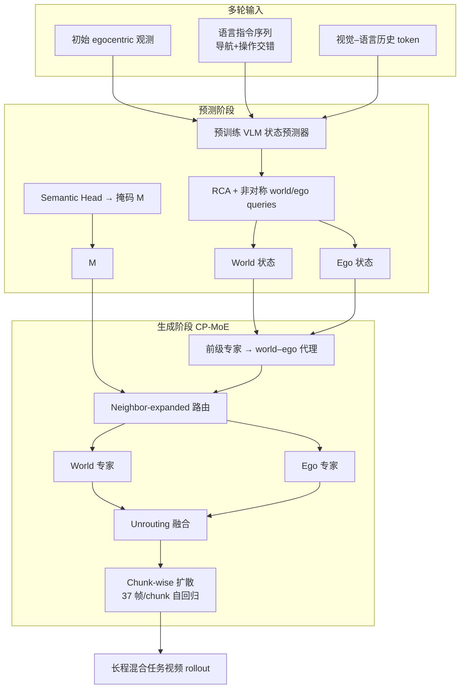

# WEM（World-Ego Modeling / World-Ego Model）

**WEM**（*World-Ego Model*，arXiv:2605.19957，[项目页](https://zgca-hmi-lab.github.io/WEM/)，[代码](https://github.com/ZGCA-HMI-Lab/WEM)）提出 **World-Ego Modeling**：在具身 **视频世界模型** 中把未来演化拆成 **世界（world）**——持久、**指令无关** 的场景规律——与 **自我（ego）**——**机器人中心、指令条件** 的交互动力学。论文认为二者在 **单一生成流** 中纠缠会导致 **长程、导航与操作交错** 任务上的退化，并给出 **运动 / 语义 / 意图** 三种边界定义与 **后 / 前 / 全** 三档解耦策略；默认采用 **语义边界 + 全解耦**，由 **RCA 隐式规划器** 与 **CP-MoE 级联并行扩散生成器** 实例化，配套 **HTEWorld** 基准（基于 **BEHAVIOR-1K**）。

## 一句话定义

**用 world–ego 双角色分解长程具身视频预测，让场景守恒与机体交互各走专用状态与专家路径，并在混合导航–操作多轮指令上可系统评测。**

## 为什么重要

- **问题对准长程混合具身：** 导航需要 **场景/layout 恒常**，操作需要 **接触与末端动力学**；单流模型同时背两种异质责任，易在多 chunk 自回归中漂移（与 [Loco-Manipulation](../tasks/loco-manipulation.md) 任务结构一致）。
- **范式可迁移：** 与 JEPA 式「环境 vs 动作」、GEM 式「ego motion / object / scene」分解同属 **结构化预测**，但 WEM 在 **像素视频 rollout** 上系统定义边界、解耦档位与 **HTEWorld** 协议。
- **评测补齐混合长程缺口：** [EWMBench](./ewmbench.md) 侧重 **操纵** 场景守恒与末端轨迹；**HTEWorld** 显式覆盖 **导航–操作交错、多轮指令**（300 轨迹、2000+ 指令）。

## 核心结构

| 模块 | 作用 |
|------|------|
| **World–Ego 边界** | **Motion：** 光流区分接触诱发运动 vs 背景；**Semantic（默认）：** 实例级掩码，场景→world、机器人/被操作物→ego；**Intention：** 历史 vs 指令双信息源，隐式分工（实验分离较弱）。 |
| **解耦档位** | **Post-** 后融合双专家输出；**Pre-** 前级路由 token；**Full-** 路由 + 专家分工 + unrouting；WEM 默认 **Full + Semantic**。 |
| **RCA 规划器** | 预训练 **VLM** + **Role-Conditioned Attention** + **非对称 query 预算**（world/ego 不同容量）→ 分离 latent 状态；**Semantic Head** 产出路由掩码。 |
| **CP-MoE 生成器** | 前级专家预测 world–ego 代理；后级 **级联并行 MoE** 按掩码 **Neighbor-expanded routing** 分配 token；**chunk-wise AR 扩散** 拼接长视频。 |
| **HTEWorld** | **125K** 训练 clip（**4.5M+** 帧）、细粒度动作标注；**300** 评测轨迹；指标 **EWMScore**（WorldArena 套件）+ 六项导航–操作专项。 |

### 流程总览

## 主要结果（HTEWorld 摘要）

| 模型 | EWMScore ↑ |
|------|------------|
| WoW-7B | 53.44 |
| Cosmos-Predict 2.5-2B | 54.83 |
| Cosmos-Predict 2.5-14B | 55.41 |
| PAN-style Baseline | 58.40 |
| **WEM** | **61.48** |

（同训练数据微调；完整子指标见 [项目页](https://zgca-hmi-lab.github.io/WEM/) 与论文。）消融显示去掉 **非对称 query**、**RCA** 或 **邻域扩展路由** 均明显降低 EWMScore。

## 常见误区或局限

- **误区：** 把 **World-Ego Modeling** 等同于简单「背景/前景分割」；论文强调 **预测角色**（持久规律 vs 指令驱动动力学），掩码只是 **semantic view** 的操作化手段。
- **局限：** 实验主要在 **BEHAVIOR-1K 仿真**；语义边界依赖 **实例分割预处理**；极长 **chunk 链** 仍累积生成误差；真机 sim-to-real 与弱监督边界学习为未来方向（论文 Appendix G）。

## 关联页面

- [Generative World Models](../methods/generative-world-models.md) — 像素级世界模型总览与条件分解谱系。
- [机器人世界模型：训练闭环与三线 taxonomy](../overview/robot-world-models-training-loop-taxonomy.md) — ③ 可控视频生成支路。
- [Video-as-Simulation](../concepts/video-as-simulation.md) — 像素仿真与长程一致性讨论。
- [EWMBench](./ewmbench.md) — 操纵向 EWM 多维基准（对照 HTEWorld 混合长程设定）。
- [Loco-Manipulation](../tasks/loco-manipulation.md) — 移动+操作任务背景。
- [Manipulation](../tasks/manipulation.md) — 操作子任务与 world model 选型语境。

## 方法栈

见上文 **核心结构** 与 **流程总览**（`###` 小节）；完整机制与模块分工以原文为准。

## 与其他工作对比

- 正文已给出与相邻路线 / baseline 的 **定性对照**；定量表格与 ablation 见原文（[参考来源](#参考来源)）。

## 参考来源

- [WEM 论文摘录（arXiv:2605.19957）](../../sources/papers/wem_arxiv_2605_19957.md)
- [WEM 官方项目页归档](../../sources/sites/wem-project.md)
- [WEM 代码仓库索引](../../sources/repos/wem.md)

## 推荐继续阅读

- 论文 PDF：<https://arxiv.org/pdf/2605.19957>
- 项目主页：<https://zgca-hmi-lab.github.io/WEM/>
- GitHub：<https://github.com/ZGCA-HMI-Lab/WEM>
