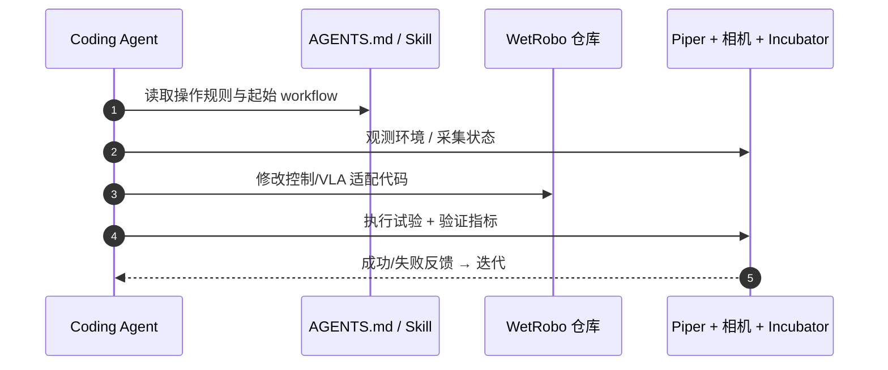

# WetRobo（arXiv:2609.18435）

**WetRobo**（*A Reproducible Robot Kit for Coding Agents in Biological Laboratories*，[arXiv:2609.18435](https://arxiv.org/abs/2609.18435)，[GitHub](https://github.com/tsudalab/WetRobo)）来自 [具身智能小站 9 篇盘点](../../sources/blogs/wechat_embodied_station_9_papers_perception_action_transfer_2026-09-17.md)。

## 一句话定义

**把机械臂、 incubator、示范数据、控制栈与 AGENTS.md 打包成湿实验 kit，让 coding agent 在新实验室通过观测–写码–验证循环现场适配 VLA，而非每换场地重训大模型。**

## 英文缩写速查

| 缩写 | 英文全称 | 简要说明 |
|------|----------|----------|
| VLA | Vision-Language-Action | 待适配的视觉–语言–动作策略 |
| RGB-D | Red Green Blue - Depth | 深度相机传感 |
| RL | Reinforcement Learning | 非本文主路径，强调 agent 写码闭环 |

## 为什么重要

- 生物湿实验室 **相机/夹爪/台面/设备布局** 高度非标准，按场地微调 VLA 人工成本极高。
- 把 **Skill 文档 + 代码 exemplar + 硬件 + demo** 四件套标准化，是可复现 agent 适配范式。
- 开源结论：**已开源**（2026-09-17）。

## 核心机制

| 项 | 内容 |
|----|------|
| **arXiv** | [2609.18435](https://arxiv.org/abs/2609.18435) |
| **开源** | **已开源** |
| **四组件** | AGENTS.md 规则；evolved branch 代码范例；Piper 臂 + Record3D + 腕部 RGB；incubator 任务 |
| **数据** | `demo/` 每任务 15 条遥操作示范 |

## 源码运行时序图

## 结论

**WetRobo 把「实验室换场地」从 ML 问题转成 agent 工程问题——价值在 kit 完整度与 AGENTS.md 能否约束 agent 行为。**

1. 开源仓含 demo 与 evolved branch，可先复现 Petri/cap/door 三 trial 路径。
2. 适配对象是 **策略与控制栈**，不是替代 VLA 预训练。
3. 与 [ActiveScale](./paper-activescale.md) 的硬件协同采集形成对照：一个偏 agent 自适配，一个偏主动感知数据规模。

## 关联页面

- [vla](../methods/vla.md)
- [manipulation](../tasks/manipulation.md)
- [sim2real](../concepts/sim2real.md)
- [9 篇技术地图](../overview/perception-action-transfer-9-papers-technology-map.md)

## 参考来源

- [wetrobo_arxiv_2609_18435.md](../../sources/papers/wetrobo_arxiv_2609_18435.md)
- [wechat_embodied_station_9_papers_perception_action_transfer_2026-09-17.md](../../sources/blogs/wechat_embodied_station_9_papers_perception_action_transfer_2026-09-17.md)

## 推荐继续阅读

- [GitHub: tsudalab/WetRobo](https://github.com/tsudalab/WetRobo)
- [arXiv PDF](https://arxiv.org/pdf/2609.18435)
