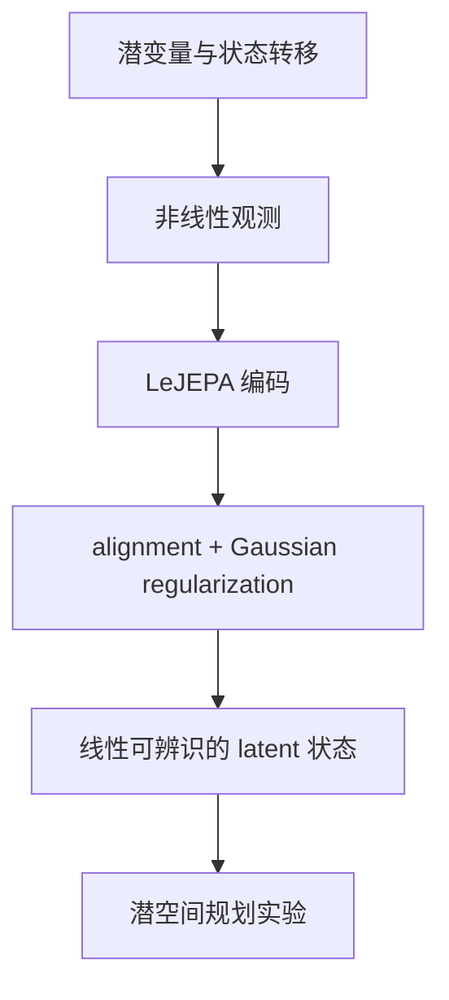

# When Does LeJEPA Learn a World Model?

**When Does LeJEPA Learn a World Model?**（arXiv:2605.26379）由 David Klindt、Yann LeCun、Randall Balestriero 提出。论文的问题不是“所有 embedding 是否都是 world model”，而是：在什么动力学和潜变量分布假设下，学习到的表征能恢复环境的潜在自由度，从而支持规划？

## 英文缩写速查

| 缩写 | 英文全称 | 简要说明 |
|------|----------|----------|
| JEPA | Joint-Embedding Predictive Architecture | 在联合表征空间预测目标表征 |
| LeJEPA | LeJEPA | 以 alignment 与高斯分布正则为核心的 JEPA 变体 |
| OU | Ornstein–Uhlenbeck process | 具有均值回复特性的随机过程，论文用于表征状态转移条件 |
| MPC | Model Predictive Control | 用动力学模型评估动作序列并滚动重规划 |

## 核心结论与假设

在论文分析的世界类别中，潜变量服从高斯分布并经平稳加性噪声动力学演化时，alignment + Gaussian regularization 的 LeJEPA 表征可线性恢复真实潜变量（至正交变换）。作者证明此条件下的 Gaussian 分布具有特定唯一性，并给出近似可辨识性分析，连接到 latent-space planning。

理论结论受作者明确设定约束。论文也讨论潜变量并非高斯、维度选择、有限样本和优化等限制；不能将定理解读为任意视觉表示必然等同真实世界状态。

## 实验与含义

论文报告从二维合成示例扩展到高维 latent，并进行像素输入机器人控制相关的潜空间实验。阅读实验时应区分：

- **表示识别：** 线性映射是否能恢复环境潜变量；
- **模型预测：** latent 动力学是否能在时间上准确预测；
- **规划控制：** 以模型优化动作后，闭环机器人任务是否成功。

前两者是第三者的必要参考，但不自动推出普遍的机器人任务成功率。

## 与相关工作的关系

- [LeJEPA](./paper-lejepa.md) 提出 alignment 与 SIGReg 的表征学习配方；本论文研究其何时能恢复世界结构。
- [LeWorldModel](./paper-lewm.md) 进一步学习像素到未来 latent 的 action-conditioned dynamics。
- [VideoDB JEPA 长文](./article-videodb-jepa-world-models.md) 将本论文用于说明 latent 几何与规划的关系。

## 来源

- [论文来源归档](../../sources/papers/when_does_lejepa_learn_world_model_arxiv_2605_26379.md)
- [arXiv:2605.26379](https://arxiv.org/abs/2605.26379)
- [LeJEPA 详情页](./paper-lejepa.md)
