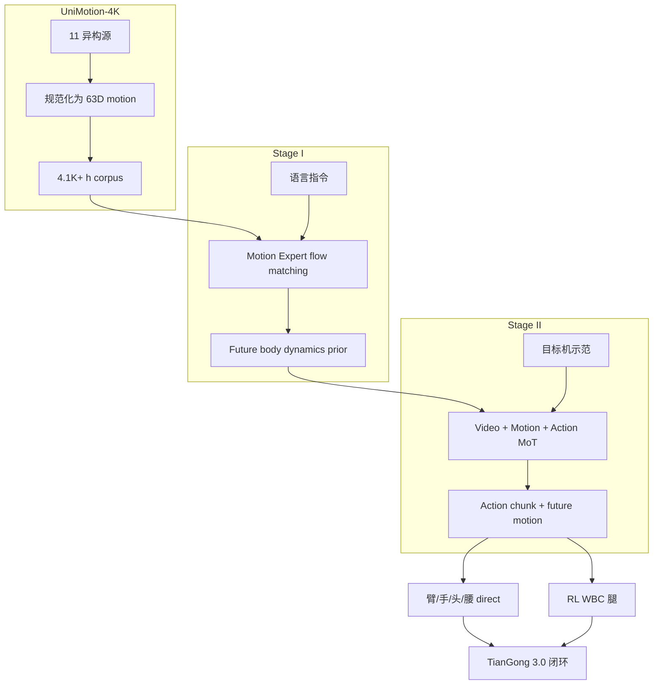

# WholeBodyWAM · UniMotion-4K（4100 小时全身运动世界模型）

**WholeBodyWAM**（*Learning Whole-Body World Action Models with Scalable Motion Priors*，[arXiv:2609.18197](https://arxiv.org/abs/2609.18197)，[项目页](https://zbzyjya.github.io/WholeBodyWAM/)）由 **南开大学**、**北京人形机器人创新中心**、**北京理工大学** 与 **清华大学** 提出：先把互联网/ego 人视频、3D motion 与多平台人形采集规范成 **UniMotion-4K（4.1K+ h）**，预训练 **Motion Expert** 学语言条件 future body dynamics，再与 **Video / Action Experts** 通过 **Mixture-of-Transformers（MoT）** 联合 post-train，把可迁移 motion prior 接地到天工 3.0 真机 whole-body manipulation。

> **同名区分：** 另一篇 WholeBodyWAM（arXiv:[2609.16644](https://arxiv.org/abs/2609.16644)，CUHK/HKU/PKU/Φ，UWBC+CASA）见 [paper-wholebodywam](./paper-wholebodywam.md)。

## 一句话定义

**用 4K+ 小时异构全身 motion 先学「身体将如何演化」的预测先验，再让 Video–Action 专家在不对称注意力下把它翻译成目标人形可执行 chunk，而不是从零收集目标机全身轨迹。**

## 英文缩写速查

| 缩写 | 英文全称 | 简要说明 |
|------|----------|----------|
| WAM | World Action Model | 联合场景动态与动作生成的具身策略 |
| MoT | Mixture-of-Transformers | Video / Motion / Action 三专家层间联合注意力 |
| MPJRE | Mean Per-Joint Rotation Error | 未来全身 motion 预测误差（度） |
| WBC | Whole-Body Control | 腿高阶 locomotion 由 RL WBC 执行 |
| OOD | Out-of-Distribution | 空间/物体级未见变体泛化评测 |
| RL | Reinforcement Learning | 下肢 whole-body controller |

## 为什么重要

- **数据瓶颈换范式：** 目标机器人全身示范贵；人类/人形异构 motion 可规模化，但不能直接当 action 标签——本文把其升格为 **predictive motion prior**。
- **Scaling 有实证：** motion pretrain 0→4K+ h 同时改善 **MPJRE（27.5%↓）** 与 **真机任务分（57.1%→67.6%）**；50% 示范时仍超 FastWAM 全量。
- **架构可插拔：** 同一 Motion Expert 接入 τ₀-WM 可将分数 **39.4%→62.7%**，说明 prior 不绑死原生 WAM 栈。
- **部署务实：** 推理 **363 ms @ A100**，**不 decode 未来视频**，保留 predictive foresight 又控延迟。

## 核心信息

| 项 | 内容 |
|----|------|
| **机构** | 南开大学；北京人形机器人创新中心；北京理工大学；清华大学 |
| **平台** | 天工 3.0（TianGong 3.0）真机六项 whole-body 任务 |
| **数据集** | **UniMotion-4K**：11 源 → **1.19M** 序列 / **444.4M** 帧 / **4.1K+ h** |
| **表示** | 共享 **63D** root-free（21 关节局部 axis-angle） |
| **开源** | **待发布** — 项目页 Code 标注 Coming Soon（2026-09-17） |

## 核心原理

**两阶段训练：**

1. **Stage I — Motion Pre-training：** 30-block Motion Expert，continuous flow matching；**16** 帧 motion 历史 + 语言 → 预测未来 **32** 帧；**仅** language–motion，无目标机 action。
2. **Stage II — Robot Post-training：** Video / Motion / Action Experts 联合预测 future visual latents、future whole-body motion、action chunk；**非对称 mask** — Motion/Action 可读当前视觉、互读，但 **不可 attend 未来视觉 latent**（训练防泄漏；推理省略未来视觉 token）。

**执行分层：** 臂/手/头/腰走 WAM 预测 chunk；**腿高阶命令** 交 RL-based WBC 做 locomotion 与平衡。

### 流程总览

## 源码运行时序图

**不适用** — 截至 **2026-09-17** 项目页 Code 为 Coming Soon，无可运行官方仓库；待 release 后按 README 补 sequenceDiagram。

## 工程实践

| 项 | 建议 |
|----|------|
| 数据效率 | 有 4K+ h motion pretrain 时，**50%** 目标示范可达 **46.9%**，优于 FastWAM 全量 **42.9%** |
| 消融读法 | 去 Stage-I → **59.1%**；阻断 Motion→Action → **46.3%** — motion prior 与 cross-attn 都关键 |
| 对照 | GR00T N1.7 **60.8%**、FastWAM、τ₀-WM + Motion Expert |
| OOD | Toy Pickup 篮位移 15 cm：**55.0% vs 46.3%**；Kneeling 未见玩具 **75.0% vs 63.3%** |
| 同名勿混 | arXiv **2609.16644** 走 WBC-grounded 路线，数据集与机构均不同 |

## 局限与风险

- **代码与 UniMotion-4K 未公开：** 复现依赖后续 release；motion 恢复/过滤/标注管线细节暂不可审计。
- **腿仍依赖 RL WBC：** 非端到端 torque；WBC 质量影响 loco-manipulation 上限。
- **与 CUHK 版 WholeBodyWAM 同名：** 选型与 citation 务必核对 arXiv ID 与机构。

## 关联页面

- [WholeBodyWAM（WBC 接地版）](./paper-wholebodywam.md) — 同名异文（2609.16644）
- [MotionWAM](./paper-motionwam-humanoid-loco-manipulation-wam.md) — 另一人形 loco-manip WAM 路线
- [World Action Models 概念](../concepts/world-action-models.md)
- [Loco-Manipulation 任务](../tasks/loco-manipulation.md)

## 结论

**WholeBodyWAM·UniMotion-4K 表明：人形 WAM 的可扩展路线是先在大规模异构 motion 上学 predictive body prior，再 MoT 接地到目标机，而不是只堆目标机器人全身示范。**

- **先验 scaling 有效：** 4K+ h motion pretrain 同时改善 motion 预测与真机控制，且提升数据效率。
- **Motion→Action 通路不可省：** 阻断 cross-attn 任务分跌至 **46.3%**。
- **prior 可外溢：** 接入 τ₀-WM 仍显著增益，便于与现有 WAM 栈组合。
- **部署取舍清晰：** 不 decode 未来视频，**363 ms** 级延迟，适合闭环 replan。
- **工程复现待 code：** 截至入库日 **待发布**；关注 UniMotion-4K 与训练脚本 release。

## 参考来源

- [WholeBodyWAM·UniMotion-4K 论文归档](../../sources/papers/wholebodywam_unimotion_arxiv_2609_18197.md)
- [WholeBodyWAM·UniMotion 项目页](../../sources/sites/wholebodywam-unimotion.md)

## 推荐继续阅读

- [arXiv:2609.18197 PDF](https://arxiv.org/pdf/2609.18197)
- [项目页演示与 scaling 曲线](https://zbzyjya.github.io/WholeBodyWAM/)
