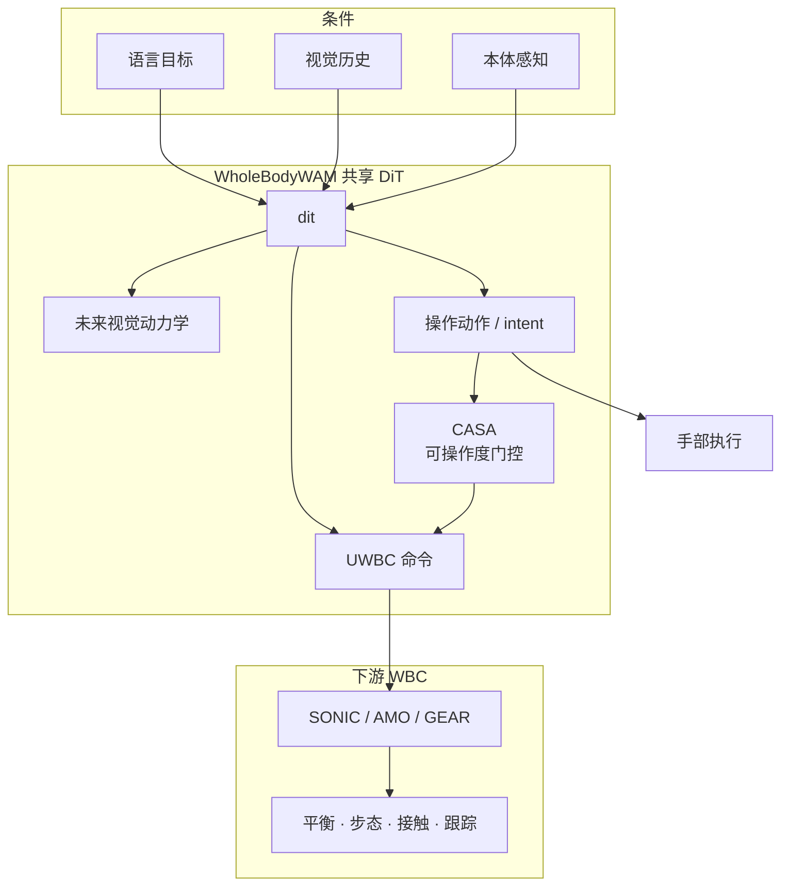

# WholeBodyWAM：预训练 WAM 先验 × WBC 接地协调

**WholeBodyWAM**（*WholeBodyWAM: Generalizing Pre-trained World-Action Priors to Humanoid Loco-Manipulation via WBC-Grounded Coordination*，[arXiv:2609.16644](https://arxiv.org/abs/2609.16644)，[项目页](https://wholebodywam.github.io/)）由 **香港中文大学（CUHK）**、**香港大学（HKU）**、**北京大学（PKU）** 与 **斐研究院（Phi Institute / Φ-Institute）** 提出：在共享 Diffusion Transformer 内 **保留** 预训练视觉—操作先验，通过 **UWBC 统一全身控制接口** 与 **CASA 协调注意力** 将世界—动作模型 **接地** 到异构 WBC，使人形 loco-manipulation 不必从零重学全身行为。

## 一句话定义

**把桌面 WAM 的可复用操作先验保留下来，用结构化 UWBC 语义与协调感知注意力，把异构全身控制器接进同一条世界—动作预测链路。**

## 英文缩写速查

| 缩写 | 英文全称 | 简要说明 |
|------|----------|----------|
| WAM | World Action Model | 联合建模未来视觉动力学与动作 |
| WBC | Whole-Body Control | 全身低层控制（平衡、步态、接触跟踪） |
| UWBC | Unified Whole-Body Controller | 本文 56 维统一 WBC 命令接口 |
| SAF | Structured Action Factorization | 保留预训练视觉—操作通路并引入 UWBC token |
| CASA | Coordination-Aware Self-Attention | 可操作度下降时加强 manipulation→UWBC 注意力 |
| DiT | Diffusion Transformer | 共享骨干，联合生成视觉/操作/UWBC |
| OOD | Out-of-Distribution | 物体配置或语言指令分布偏移 |

## 为什么重要

- **填补 WAM 的人形空白：** 多数 WAM 停在桌面/单臂；人形 loco-manipulation 需同时协调行走、躯干与双手，简单扩 action 维或从零训 humanoid mapping 都代价高。
- **先验复用而非重学：** 项目页强调与「扩接口适配全身」或「从零学 humanoid WAM mapping」不同，WholeBodyWAM **保留** 预训练 world–action priors，只做 **WBC-grounded coordination**。
- **跨控制器泛化：** 在 SONIC、AMO、GEAR 三种 WBC 上分别微调，仍保持较低跨控制器方差（**10.5 pp²** vs Cosmos-3 **35.0 pp²**）。
- **开源结论：** **待发布**（步骤 2.5，2026-09-16）— 项目页无 GitHub；BibTeX 为匿名审稿版。

## 核心信息

| 项 | 内容 |
|----|------|
| **机构** | 香港中文大学（CUHK）；香港大学（HKU）；北京大学（PKU）；斐研究院（Phi Institute / Φ-Institute） |
| **输入** | 语言、视觉历史、本体感知 |
| **输出** | 未来视觉动力学、操作动作、UWBC 命令（intent） |
| **WBC** | SONIC、AMO、GEAR（分别 task-specific 微调） |
| **开源** | **待发布** — 截至 2026-09-16 项目页无官方仓库 |

## 核心原理

**执行边界清晰：** WholeBodyWAM 预测 **intent**；下游 WBC 负责平衡、步态、接触与低层跟踪 — 与世界—动作层与运控层职责分离。

**SAF（结构化动作分解）：** 保留预训练 **视觉—操作** 通路，引入独立 **UWBC token**，使控制器面向的意图可寻址而不破坏可复用操作先验。

**UWBC 接口：** **56** 维槽位 = **46** 共享物理语义 + **10** 控制器特定残差；字段按注册语义与控制器能力激活，不支持项 mask。

**CASA：** 观测到 **任务方向手臂可操作度** 下降时，协调门增强 **manipulation→UWBC** 注意力，让操作意图驱动补偿性全身运动（项目页 TowelPlace OOD：支撑位移 10 cm 后迈步转身二次抓取）。

### 流程总览

## 源码运行时序图

**不适用（待发布）** — 截至 2026-09-16 项目页未列可运行官方仓库；公开后应对齐 README 中仿真 SIMPLE 任务与真机 rollout 入口。

## 工程实践

| 项 | 建议 |
|----|------|
| 先验来源 | 从已有预训练 WAM 初始化，勿从零训 humanoid mapping |
| WBC 选型 | 论文覆盖 SONIC / AMO / GEAR；换控制器需按 UWBC 语义注册与 mask 规则微调 |
| 数据效率 | 项目页强调 **少量 task-specific 示范** 即可受益（Fig. 5）；优先复用预训练 prior + grounding |
| 部署分层 | 上层 WAM 只出 intent；低层 WBC 仍负责接触与平衡 — 勿把 WholeBodyWAM 当端到端扭矩策略 |
| 复现等待 | 代码待发布；选型可先读 PDF 中 SIMPLE 协议与 100 demos/task 设定 |

## 实验与评测

| 设定 | 数字（作者 / 项目页） |
|------|----------------------|
| 仿真 SIMPLE（6 任务 × L0/L1/L2） | 总体 **91.9%**；Cosmos-3 **86.4%**（+5.6 pp） |
| 真机 OOD（8 任务） | **68.8%**；DreamZero **40.0%** |
| OOD 执行进度 | **81.3%** vs DreamZero **57.5%** |
| 跨 WBC 均值 / 方差 | **89.2%** / **10.5 pp²**（Cosmos-3 方差 **35.0 pp²**） |
| 真机任务示例 | CartServe ID **80%** / OOD **65%**（项目页单任务展示） |

**读法：** 仿真用 SONIC + 每任务 100 条微调示范；真机 OOD 改物体配置与语言。最大 ID 增益在 BoxTransfer、BasketCarry、DoorEntry 等 **协调敏感** 任务。

## 与其他工作对比

| 对照 | 差异读法 |
|------|----------|
| 扩 action 接口的全身 WAM 适配 | WholeBodyWAM 保留预训练 prior，用 UWBC 语义接地而非单纯加维 |
| 从零 humanoid WAM mapping | 强调 **generalize** 已有 world–action priors，非 scratch 训练 |
| [MotionWAM](./paper-motionwam-humanoid-loco-manipulation-wam.md) | 同做人形 loco-manip WAM；MotionWAM 用 Video DiT 隐状态 + SONIC token；WholeBodyWAM 强调 **异构 WBC 统一接口 + CASA 协调** |
| [DIDO](./paper-dido-wam.md) | 桌面 WAM 一步蒸馏与交互实体对齐；WholeBodyWAM 解决 **全身协调与 WBC 泛化** |
| Cosmos-3 / DreamZero 基线 | 项目页主要对照；跨 WBC 方差与 OOD 进度是 WholeBodyWAM 的核心卖点 |

## 结论

**WholeBodyWAM 说明：人形 loco-manipulation 的可扩展路线是「保留桌面 WAM 先验 + 结构化 WBC 接地与协调」，而不是重学全身 world–action mapping。**

1. **先验保留是主贡献** — SAF 保住视觉—操作通路；UWBC 让控制器 intent 可寻址。
2. **协调是第二贡献** — CASA 在可操作度下降时把 manipulation 意图接到补偿性全身运动；TowelPlace / TeapotPour OOD 是直观证据。
3. **跨 WBC 低方差是真部署指标** — 10.5 pp² vs 35.0 pp² 比单点成功率更能说明「接地」有效。
4. **执行边界勿混淆** — WAM 层预测 intent；平衡/步态/接触仍归 WBC — 分层失败会高估可复现性。
5. **工程复现需等代码** — 截至 2026-09-16 **待发布**；PDF 中 SIMPLE 协议与 100 demos/task 是公开前的对照锚点。
6. **与 MotionWAM 互补阅读** — 一个强调 **实时隐状态 + SONIC token**，一个强调 **多 WBC 语义统一 + 协调注意力**。

## 局限与风险

- **代码未公开** — 无法核对训练细节、WBC 微调预算与真机安全栈。
- **匿名审稿版** — 作者 affiliations 以项目页 / 用户给定机构为准；正式发表后需回查 citation。
- **WBC 依赖** — 换未在 UWBC 注册的控制器需重新 mask/微调，非 plug-and-play。
- **基线域差异** — Cosmos-3 对仿真、DreamZero 对真机 OOD；横比时勿混任务协议。

## 关联页面

- [world-action-models](../concepts/world-action-models.md)
- [whole-body-control](../concepts/whole-body-control.md)
- [loco-manipulation](../tasks/loco-manipulation.md)
- [SONIC](../methods/sonic-motion-tracking.md)
- [paper-motionwam-humanoid-loco-manipulation-wam.md](./paper-motionwam-humanoid-loco-manipulation-wam.md)
- [paper-dido-wam](./paper-dido-wam.md)

## 参考来源

- [wholebodywam_arxiv_2609_16644.md](../../sources/papers/wholebodywam_arxiv_2609_16644.md)
- [wholebodywam.md](../../sources/sites/wholebodywam.md)
- [wechat_embodied_station_12_papers_vla_deploy_2026-09-16.md](../../sources/blogs/wechat_embodied_station_12_papers_vla_deploy_2026-09-16.md)
- [arXiv:2609.16644](https://arxiv.org/abs/2609.16644)

## 推荐继续阅读

- [arXiv PDF](https://arxiv.org/pdf/2609.16644)
- [项目页](https://wholebodywam.github.io/)
- [MotionWAM 实体页](./paper-motionwam-humanoid-loco-manipulation-wam.md) — 同任务域 WAM 对照
- [12 篇 VLA/部署技术地图](../overview/vla-deploy-12-papers-technology-map.md)
