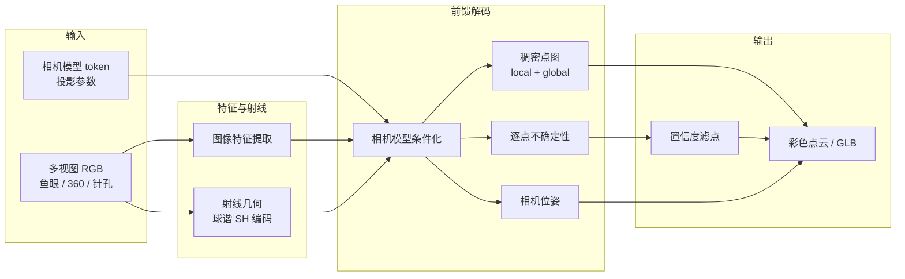
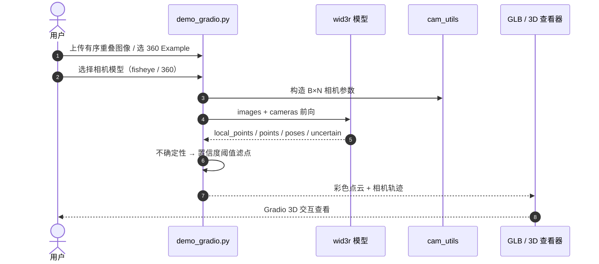

# Wid3R：相机模型条件化的宽视场 3D 重建

**Wid3R**（*Wide Field-of-View 3D Reconstruction via Camera Model Conditioning*，arXiv:[2602.05321](https://arxiv.org/abs/2602.05321)，[项目页](https://jdk9405.github.io/Wid3R/)，[GitHub](https://github.com/jdk9405/Wid3R)）由 **马里兰大学学院公园分校** 与 **NAVER LABS** 提出：在前馈多视图视觉几何框架中引入 **相机模型 token** 与 **球谐射线表示**，**直接**从鱼眼与 **360°** 畸变图像预测稠密点图与相机位姿，无需显式标定或去畸变预处理。

## 一句话定义

**用相机模型条件化 + 射线球谐几何，把前馈 3D 重建从「针孔已校正假设」扩展到原生宽 FoV（鱼眼/360）输入。**

## 英文缩写速查

| 缩写 | 英文全称 | 简要说明 |
|------|----------|----------|
| Wid3R | Wide Field-of-View 3D Reconstruction | 本文：宽视场 3D 重建 |
| FoV | Field of View | 视场角；本文覆盖鱼眼与 360° |
| SH | Spherical Harmonics | 球谐；编码射线方向几何 |
| ERP | Equirectangular Projection | 等距圆柱；360° 常见投影 |
| SfM | Structure-from-Motion | 多视图恢复相机与结构 |
| Pi3 | （上游几何基础模型） | 训练初始化权重来源 |
| AUC | Area Under Curve | 位姿/重建精度曲线下面积；论文报 @30° |

## 核心信息

| 字段 | 内容 |
|------|------|
| **机构** | 马里兰大学学院公园分校（University of Maryland, College Park）；纳沃实验室（NAVER LABS） |
| **arXiv** | [2602.05321](https://arxiv.org/abs/2602.05321)（v2 2026-03-26） |
| **会议** | ECCV 2026 |
| **骨干/初始化** | 自 [Pi3](https://huggingface.co/yyfz233/Pi3) 预训练权重微调 |
| **输入** | 多视图 RGB + **相机模型参数**（fisheye / 360 等） |
| **输出** | 相机空间/全局对齐点图、相机位姿、逐点不确定性 |
| **开源（截至 2026-09-12）** | **已开源**：推理（Gradio）、训练、评测脚本；权重 Google Drive；**数据预处理待发布** |

## 为什么重要

- **补齐前馈几何的 FoV 盲区：** VGGT / DUSt3R / Pi3 系方法多假设 **针孔或已校正** 输入；机器人环视、头戴全景、车载鱼眼等场景若强行去畸变会损失视场与几何一致性。Wid3R 把 **投影模型** 写进网络条件，避免流水线式标定瓶颈。
- **360° 前馈重建（作者声称首创）：** 首个多帧前馈方法原生支持 **360° 影像**；Stanford2D3D 上 AUC@30 **+77.33**，说明宽角数据上的表示学习可行。
- **混合相机模型缓解数据稀疏：** 训练混合 pinhole、fisheye、360 等多投影数据，既提升 360 泛化，也反哺鱼眼基准（Zip-NeRF fisheye **+33.67** AUC@30）。
- **机器人上游：** 环视 SLAM、全景巡检、室内 Matterport 类扫描等 **宽 FoV 感知** 可直接接前馈点图/位姿，与 [CO-Calib](./paper-co-calib-multi-fisheye-calibration.md)（标定管线）形成「标定 vs 免标定前馈」互补选型。

## 流程总览

## 核心原理

### 1. 相机模型 token

不同投影模型（针孔、鱼眼、360 ERP 等）通过 **可学习 token** 条件化解码器，使同一网络权重适配 **畸变感知** 几何预测，而非假设统一 pinhole 成像。

### 2. 射线 + 球谐表示

将像素关联到 **3D 射线方向**，用 **球谐（SH）** 编码射线几何并与图像特征融合。宽 FoV 下射线方向分布非线性，SH 提供紧凑的方向基，避免针孔近似失效。

### 3. 单次前馈多视图输出

与经典 SfM「特征匹配 → BA」不同，Wid3R **一次前向** 输出：
- `local_points`：各视图相机坐标系点图
- `points`：全局对齐点图
- `camera_poses`：相机到世界变换
- `uncertain`：不确定性 → demo 转置信度阈值滤点

### 4. Pi3 初始化与多数据集混合训练

训练从 **Pi3** `model.safetensors` 初始化，在 TartanAirV2、ASE、Hypersim、KITTI-360、Loc360、Matterport3D、ScanNet++、EDEN、Virtual KITTI 2 等混合数据上微调，覆盖室内外、驾驶与 360 场景。

## 源码运行时序图

**复现路径：** `conda env create -f environments.yml` → 下载 `pretrained_weights/wid3r.bin` → 设置 `demo_gradio.py` 中 `CKPT_DIR` → `python demo_gradio.py`。

## 评测要点（论文摘要）

| 基准 | 指标 | Wid3R 增益（论文） |
|------|------|-------------------|
| **Zip-NeRF（fisheye）** | AUC@30 | **+33.67** |
| **Stanford2D3D（360）** | AUC@30 | **+77.33** |

官方仓 `evaluation/` 提供多视图重建、单目深度、相对位姿评测脚本；数据集路径需本地配置。

## 对比定位

| 对照 | Wid3R 差异 |
|------|------------|
| **VGGT / DUSt3R / Pi3** | 针孔或校正假设；Wid3R **原生宽 FoV + 相机 token** |
| [Glob3R](./paper-glob3r.md) | 冻结 Pi3X + tracks → BA **离线精炼**；Wid3R **单次前馈**，不做 BA |
| [VGG-T³](./paper-vgg-ttt.md) | TTT 线性化 **离线千图** VGGT；Wid3R 面向 **畸变宽角** 而非长序列线性化 |
| [R³](./paper-r3-relative-regression.md) | DA3 **相对位姿流式**；Wid3R 解决 **投影模型** 而非长视频坐标系 |
| [LingBot-Map](../methods/lingbot-map.md) | 在线流式 GCA；Wid3R 非流式记忆，强在 **鱼眼/360 输入** |
| [CO-Calib](./paper-co-calib-multi-fisheye-calibration.md) | **标定管线**提升 Kalibr 成功率；Wid3R **绕过显式标定** 做前馈重建 |
| [PanoLOG / G²PS](./paper-panolog-ggps.md) | ERP **全景 3DGS 划分重建**；Wid3R 是 **前馈点图/位姿** 而非神经渲染资产管线 |

## 工程实践

| 项 | 建议 |
|----|------|
| **安装** | `conda env create -f environments.yml && conda activate wid3r` |
| **Checkpoint** | Google Drive `wid3r.bin` → `pretrained_weights/` |
| **推理** | `python demo_gradio.py`；选 **匹配输入** 的相机模型 |
| **训练** | Pi3 `model.safetensors` 初始化 → `accelerate launch ... scripts/train_wid3r.py` |
| **配置** | `configs/data/example.yaml` 改 `data_root`；`configs/train/train_wid3r.yaml` 控分辨率与序列长度 |
| **评测** | `evaluation/mv_recon/`、`monodepth/`、`relpose/` |
| **OOM** | 降 `train.max_img_per_gpu`、缩 `image_num_range` 或训练分辨率 |
| **待发布** | README TODO：**数据预处理代码** |
| **许可** | 以官方仓 LICENSE 为准；上游致谢 Pi3 / VGGT / DUSt3R |

## 结论

**Wid3R 把前馈 3D 重建的输入假设从「已校正针孔」扩展到「任意宽 FoV 投影」——相机模型 token + 射线球谐是核心杠杆，鱼眼/360 的大幅 AUC 提升说明畸变不应只在预处理里解决。**

- **相机模型应进网络而非只进预处理**：显式 token 条件化让同一权重覆盖 fisheye / 360，避免去畸变带来的视场损失与二次误差传播。
- **射线 + SH 是宽 FoV 的几何语言**：针孔像素网格在畸变下失真；射线方向 + 球谐为网络提供 **投影无关** 的几何接口。
- **混合投影训练缓解 360 数据稀疏**：多相机模型联合训练既服务 360 泛化，也提升鱼眼基准——数据效率来自 **条件化** 而非单纯堆 360 数据。
- **Pi3 初始化降低落地成本**：与 [Glob3R](./paper-glob3r.md) 等同属 Pi3 生态，复现者可直接沿用 HF 权重与训练脚本结构。
- **工程上已可跑通 demo**：Gradio + GLB 导出 + 训练/评测目录齐全；**预处理 TODO** 意味着自定义数据管线仍需自行对齐官方格式。
- **机器人读法**：环视/全景 **建图前端** 优先评估；要厘米级全局一致仍应接 BA 或 [Glob3R](./paper-glob3r.md) 类离线精炼；与 [CO-Calib](./paper-co-calib-multi-fisheye-calibration.md) 标定方案按「有无可靠内参」分叉选型。

## 局限与风险

- **权重非 HF 一键拉取：** checkpoint 在 Google Drive，自动化部署需额外脚本。
- **数据预处理未发布：** 自定义宽 FoV 数据集接入成本偏高。
- **前馈精度上限：** 无 BA 精炼时，大场景全局一致可能弱于 [Glob3R](./paper-glob3r.md) 等离线 SfM。
- **360 demo 为降采样预览：** 项目页注明交互 demo 点云降采样，完整质量需本地全分辨率推理。
- **实时性未主打：** 面向多视图批推理；硬实时 SLAM 环仍需评估延迟与序列策略。

## 关联页面

- [Glob3R](./paper-glob3r.md) — Pi3 系离线全局 SfM 精炼对照
- [VGG-T³](./paper-vgg-ttt.md) — 离线线性化 VGGT 对照
- [R³](./paper-r3-relative-regression.md) — 相对位姿流式重建对照
- [LingBot-Map](../methods/lingbot-map.md) — 在线流式前馈几何对照
- [CO-Calib](./paper-co-calib-multi-fisheye-calibration.md) — 多鱼眼标定（互补）
- [PanoLOG / G²PS](./paper-panolog-ggps.md) — ERP 全景重建对照
- [状态估计知识链](../overview/hub-state-estimation.md) — SLAM / 视觉几何入口
- [Navigation SLAM Autonomy Stack](../overview/navigation-slam-autonomy-stack.md) — 导航栈中的视觉几何选型

## 参考来源

- [Wid3R 论文摘录](../../sources/papers/wid3r_arxiv_2602_05321.md)
- [Wid3R 项目页归档](../../sources/sites/wid3r-site.md)
- [jdk9405/Wid3R 官方仓归档](../../sources/repos/jdk9405_wid3r.md)
- Jung et al., *Wid3R: Wide Field-of-View 3D Reconstruction via Camera Model Conditioning* — <https://arxiv.org/abs/2602.05321>
- 项目页：<https://jdk9405.github.io/Wid3R/>
- 代码：<https://github.com/jdk9405/Wid3R>

## 推荐继续阅读

- 项目页交互 demo：<https://jdk9405.github.io/Wid3R/>
- Pi3（训练初始化）：<https://github.com/yyfz/Pi3>
- DUSt3R（NAVER 多视图几何基线）：<https://github.com/naver/dust3r>
- VGGT（针孔前馈对照）：<https://github.com/facebookresearch/vggt>
- Glob3R（Pi3X + BA 精炼）：<https://arxiv.org/abs/2607.09225>
