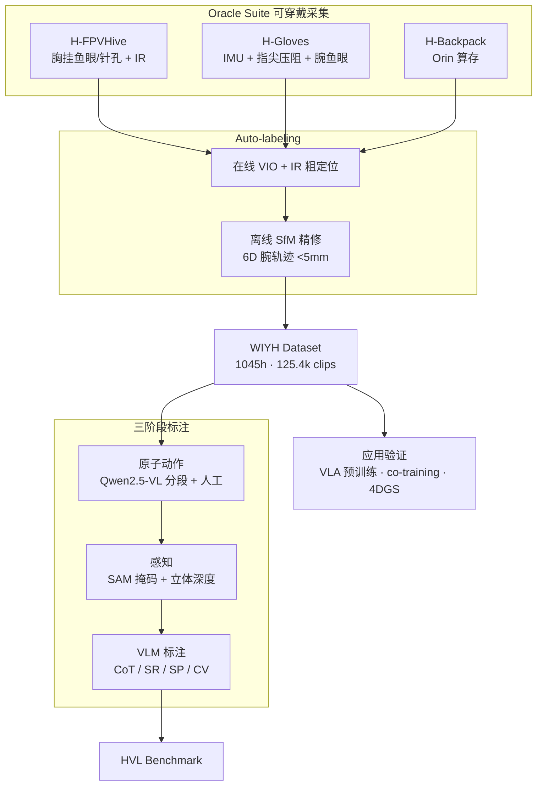
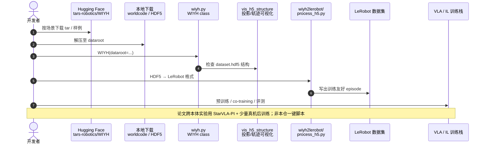

# World In Your Hands（WIYH）：野外人类中心操作开源生态

**World In Your Hands（WIYH）**（*A Large-Scale and Open-Source Ecosystem for Learning Human-Centric Manipulation in the Wild*，[arXiv:2512.24310](https://arxiv.org/abs/2512.24310)，[项目页](https://wiyh.tars-ai.com/)，**它石智航 TARS Robotics**）提出一套 **人类中心野外操作数据生态**：可穿戴 **Oracle Suite** 采集套件、**~1000 小时** 多模态操作数据集，以及从感知到动作的 **Human-centric Vision-Language（HVL）** benchmark。论文验证 WIYH 数据可作为 **跨本体 VLA 预训练** 与 **重定向 co-training** 的人类演示层，显著改善杂乱场景操作策略泛化。

## 一句话定义

**用无实验室外视跟踪的 Oracle Suite 在真实工作流中采集毫米级 3D 手/腕轨迹与触觉，发布千小时级野外多模态操作语料与 VLM 诊断基准，并证明其人侧数据能把机器人杂乱场景成功率从个位数拉到 60% 量级。**

## 英文缩写速查

| 缩写 | 英文全称 | 简要说明 |
|------|----------|----------|
| WIYH | World In Your Hands | 本文生态、数据集与 benchmark 总称 |
| HVL | Human-centric Vision-Language | 空间指称 / 子任务预测 / 完成度验证三类 VLM 评测 |
| VLA | Vision-Language-Action | 视觉–语言–动作模型；论文用 StarVLA-PI 做跨本体预训练 |
| VLM | Vision-Language Model | 多模态大模型；HVL benchmark 的直接评测对象 |
| CoT | Chain-of-Thought | 长程任务分解推理标注 |
| SfM | Structure from Motion | Oracle Suite 离线精修腕轨迹的结构运动算法 |
| VIO | Visual-Inertial Odometry | 在线粗定位模块 |
| GS / 4DGS | Gaussian Splatting | 论文用 WIYH 深度/位姿做动态场景 4D 重建应用 |
| IL | Imitation Learning | 人类演示 → 策略模仿学习的主要消费范式 |
| UMI | Universal Manipulation Interface | 手持夹爪采集范式；论文 Table 6 效率/质量对照基线 |

## 为什么重要

- **模态对齐最全之一：** 相对 Ego4D / Ego-Exo4D / EgoDex（Table 1），WIYH 在 **野外** 设定下同时提供标定 RGB、**3D 动作**、深度、掩码、**触觉**、原子指令与 VLM 标注——适合 VLA / WAM / 空间智能联合训练。
- **采集可规模化：** Oracle Suite 相对遥操作 **~5×** 日产量（720 vs 150 episodes/天），且遮挡下仍输出 **3D 手骨架**（优于 VR 2D 骨架）。
- **跨本体实证：** 人类手数据预训练 + 少量夹爪后训练，真机任务平均成功率 **15%→70%**；杂乱场景 co-training **8%→60%**——为人侧数据进机器人策略提供可量化论据。
- **国内开源标杆：** 与 [HumanTouch](./humantouch.md)、[ACE-Data-0](./paper-ace-data-0.md) 等同属「人类中心操作数据」轴，但 WIYH 强调 **工业/服务野外场景** 与 **官方全量 HF 发布**（见 [cn-os 节点](./cn-os-world-in-your-hands.md)）。

## 核心信息

| 项 | 内容 |
|----|------|
| **机构** | 它石智航（TARS Robotics） |
| **arXiv** | [2512.24310](https://arxiv.org/abs/2512.24310)（v3，2026-03-15） |
| **规模** | **~1045 h** · **125.4k clips** · **100+ skills** · **10** 场景类型 |
| **采集硬件** | Oracle Suite：H-FPVHive（胸挂多相机+IR）+ H-Gloves（6 IMU / 5 指尖压阻 / 3 鱼眼）+ H-Backpack（Orin） |
| **动作精度** | 腕轨迹平均平移误差 **<5 mm**（动捕室对照）；投影–掩码交集质检 |
| **开源（截至 2026-09-15）** | **已开源**：HF 全量数据、GitHub devkit、`wiyh2lerobot`；**待发布**：官方 Foundation Model、硬件 CAD、Human-centric Challenge |

## 开源状态

核查日：**2026-09-15**（[项目页](https://wiyh.tars-ai.com/) / [GitHub](https://github.com/tars-robotics/World-In-Your-Hands) / [HF 数据集](https://huggingface.co/datasets/tars-robotics/WIYH)）。

| 产物 | 状态 |
|------|------|
| 数据集 `tars-robotics/WIYH` | **已发布** — ~36.5 TB；CC BY-NC-SA 4.0 |
| Devkit + 教程 | **已开源** — `wiyh.py`、`wiyh_tutorial.ipynb`、`wiyh2lerobot/` |
| HVL benchmark 标注子集 | **已含于数据发布** |
| Oracle Suite 硬件设计文件 | **待发布** — 论文承诺 open-source |
| WIYH Foundation Model | **待发布** — README TODO |

## 数据集速查

| 维度 | 内容 |
|------|------|
| 适配形态 | **人类演示**（非真机遥操作轨迹）；适合 IL / VLA 预训练、重定向 co-training、4D 重建与 VLM 评测 |
| 重定向就绪度 | 提供 3D 手/腕轨迹 + 标定多视角 RGB；论文实验将 \(D_h\) 重定向到低 DoF 灵巧手 |
| 许可证 | **CC BY-NC-SA 4.0**（非商业；衍生需相同许可） |
| 与金字塔位置 | [Data Pyramid](./paper-data-pyramid-embodied-manipulation.md) **第 ③ 层 Ego/Exo**：野外规模与触觉/3D 动作对齐强于纯 ego 视频集 |
| LeRobot 接入 | `wiyh2lerobot/` 转换脚本；仓内含 `lerobot/` 子目录便于对接 [LeRobot](./lerobot.md) 训练栈 |

## 流程总览

## 源码运行时序图

官方 devkit [tars-robotics/World-In-Your-Hands](https://github.com/tars-robotics/World-In-Your-Hands) 提供数据加载、可视化与 LeRobot 转换入口（归档见 [sources/repos/world-in-your-hands.md](../../sources/repos/world-in-your-hands.md)）：

- **最短复现路径：** 读 [项目页教程](https://wiyh.tars-ai.com/exploredataset#tutorial) → 下载样例 → `wiyh_tutorial.ipynb` → 按需跑 `wiyh2lerobot/convert.sh`。
- **全量数据：** ~30 TB 级，需规划存储与带宽；HF 以 tar 分片发布。

## 实验与评测

### HVL：通用 VLM 在人类中心场景的诊断（Table 2）

| 任务 | 测什么 | 读法 |
|------|--------|------|
| Spatial Referring (S.R.) | 图像 + 空间关系 → 指称区域点击 | 最强 Qwen3-VL-Plus 仅 **~46.5%** — **细粒度空间指称仍是短板** |
| Subtask Prediction (S.P.) | 视频 + 当前任务 → 四选一下一子任务 | 多数模型 **~70–77%** — **高层任务分解相对成熟** |
| Completion Verification (C.V.) | 截断视频 + 指令 → 是否完成 | 略高于随机（~52–57%）— **动态进度建模弱** |

### 跨本体操作策略（§5）

| 实验 | 设置 | 关键结果 |
|------|------|----------|
| Cross-embodiment pretrain | StarVLA-PI + WIYH 原子指令预训练 → 夹爪真机 150 clip/任务后训练 | **VLA 全量预训练 70%** vs 无预训练 15%、仅 VLM 30% |
| Retargeting co-training | \(D_r\) 单物体机器人 + \(D_h\) 杂乱人类（重定向灵巧手） | 杂乱场景 **500 robot + 800 human → 60%**（仅 robot 500 clip 为 8%） |

### 4D 世界建模（§4.2）

WIYH 深度/位姿支持 MegaSAM + TAPIR + Shape of Motion 动态高斯重建；几何指标随任务动态难度变化，验证数据对 **Real2Sim / 空间表征** 的价值（链 [world-action-models](../concepts/world-action-models.md)）。

## 与其他工作对比

> 下表只做 **定位对照**：各数据集的采集本体、标注维度与许可都不同，规模小时数不可当作同一把尺子；策略成功率更不能跨数据集横比（见 [评测基准选型闭环](../queries/embodied-eval-benchmark-selection-loop.md) ③ 层的「跨基准直接比榜」误判条）。

| 对照 | 差异读法 |
|------|----------|
| [HIW-500](./hiw-500-dataset.md) | 最直接的互补面：HIW-500 是 **真机人形 teleop 轨迹**（可直接监督动作），WIYH 是 **人手演示**（需重定向或跨本体预训练）。前者没有形态 gap 但采集贵，后者便宜但上机要补一层 |
| [ACE-Data-0](./paper-ace-data-0.md) | 同为人类演示，场景约束相反：ACE-Data-0 走 **家居同步多模态**（受控环境、模态对齐好），WIYH 走 **真实工作流野外采集**（分布广、但无外视跟踪、质量靠 <5 mm 动捕对照与掩码交集过滤） |
| **Ego4D / EgoDex** | 纯 egocentric 规模派：小时数更大但多数 **没有毫米级 3D 手/腕轨迹与触觉**；WIYH 的主张不是更大，而是 **动作层可用**——这是它能直接进 VLA 预训练的前提 |
| [HumanTouch](./humantouch.md) | 同做大规模人手 **触觉** 采集；WIYH 把触觉与 3D 轨迹、语言标注、VLM 诊断基准放进 **同一生态**，代价是 ~36.5 TB 的存储门槛 |
| [Data Pyramid](./paper-data-pyramid-embodied-manipulation.md) | 该页给出数据分层的总框架；WIYH 落在其 **人类 Ego/Exo 层**，本页 §5 的两组实验正是在回答「这一层数据怎么往上兑换成机器人性能」 |
| **纯机器人 clip 扩量**（要替代的默认做法） | 论文最锋利的一条反例：杂乱场景下把机器人 clip 从 200 堆到 500，成功率 0% → **8%**；换成 500 robot + **800 human** co-train 到 **60%**。即「扩机器人数据」在杂乱域不如「扩人类观测域」 |
| **仅加载 VLM 权重**（消融对照） | 同一 cross-embodiment 实验里，无预训练 15%、仅 VLM 30%、**VLA 全量预训练 70%**——说明收益来自动作层预训练，不是骨干语义 |

## 结论

WIYH 是当前少有的 **野外千小时级、3D 动作+触觉+VLM 标注对齐** 的人类操作生态；对工程选型，**人类侧数据值得作为 VLA 预训练与杂乱场景 co-training 的默认候选层**，而非仅当真机 teleop 不够用时的备胎。

- **优先接 devkit + 样例：** 全量 ~36.5 TB 前先用 `wiyh_tutorial.ipynb` 验证管线与 LeRobot 转换，再批下场景 tar。
- **预训练读 VLA 全量权重：** 论文 cross-embodiment 实验显示仅加载 VLM 收益明显弱于 **VLA 全量预训练**（70% vs 30%）。
- **杂乱场景靠人类域扩观测：** 单纯堆机器人 clip（200→500）对杂乱成功率几乎无效（0%→8%）；**+800 人类 clip co-train 可到 60%**。
- **HVL 分数解释模型短板：** 部署前勿假设通用 VLM 已具备可靠 **空间指称 / 完成度判断**；应用侧需任务专用微调或结构化状态。
- **许可边界：** CC BY-NC-SA 4.0 — 商业产品与闭源权重需单独谈授权。
- **硬件与 FM 仍待跟进：** Oracle Suite CAD 与官方 Foundation Model 未发布；仿真 benchmark 亦在路线图。

## 工程实践

1. **入口：** [项目页下载](https://wiyh.tars-ai.com/exploredataset#downloads) + [GitHub devkit](https://github.com/tars-robotics/World-In-Your-Hands) + [HF 数据集](https://huggingface.co/datasets/tars-robotics/WIYH)。
2. **格式：** 原始 `dataset.hdf5` 与 WorldCode JSON；`wiyh.py` 查结构，`wiyh2lerobot/` 进 [LeRobot](./lerobot.md)。
3. **质检：** 复现论文动捕对照（<5 mm）与投影–手掩码交集流程，过滤低质量 clip。
4. **训练配方：** 人类数据作 **预训练或 co-train 增广域**；机器人侧仍需少量同任务真机 clip 做后训练对齐。
5. **对照选型：** 真机人形 teleop 看 [HIW-500](./hiw-500-dataset.md)；家居同步多模态看 [ACE-Data-0](./paper-ace-data-0.md)；纯 ego 规模看 Ego4D / EgoDex。

## 局限与风险

- **非机器人轨迹：** 与 [HIW-500](./hiw-500-dataset.md) 不同，WIYH 是 **人手演示**；上机需重定向或 cross-embodiment 预训练，存在形态与接触动力学差距。
- **存储与带宽：** 全量 ~36.5 TB，基础设施成本高于多数开源集。
- **NC 许可：** 非商业限制影响产品化数据集混合；与 Apache/MIT 机器人数据混训前需法务核对。
- **硬件未全开源：** Oracle Suite 机械/电气设计文件截至入库日未独立发布，自研采集需参考论文或等待官方开放。
- **仿真环境待补：** 论文写明高保真 sim + 部分 benchmark 后续版本发布，当前 Real2Sim 需自建。

## 关联页面

- [Data Pyramid for Embodied Manipulation](./paper-data-pyramid-embodied-manipulation.md) — 人类 Ego/Exo 层定位
- [ACE-Data-0](./paper-ace-data-0.md) — 家居同步多模态人类演示对照
- [HumanTouch](./humantouch.md) — 另一大规模人手触觉采集叙事
- [LeRobot](./lerobot.md) — `wiyh2lerobot` 训练栈对接
- [VLA](../methods/vla.md) — 跨本体预训练消费范式
- [cn-os World In Your Hands](./cn-os-world-in-your-hands.md) — 国内开源全景索引节点
- [具身大模型评测基准选型闭环](../queries/embodied-eval-benchmark-selection-loop.md) — HVL 三项诊断落在其 ① 具身大脑/MLLM 认知层（测 VLM 看懂没），§5 的跨本体成功率落在 ③ 策略任务成功率层；两层分数不可互相外推

## 参考来源

- [WIYH 论文归档](../../sources/papers/wiyh_arxiv_2512_24310.md)
- [项目页归档](../../sources/sites/wiyh-tars-ai.md)
- [HF 数据集归档](../../sources/datasets/wiyh.md)
- [GitHub 仓库归档](../../sources/repos/world-in-your-hands.md)

## 推荐继续阅读

- [WIYH 项目页](https://wiyh.tars-ai.com/) — 场景统计、下载与交互教程
- [arXiv:2512.24310](https://arxiv.org/abs/2512.24310) — 完整实验与附录
- [Hugging Face 数据集](https://huggingface.co/datasets/tars-robotics/WIYH) — 分片下载与 JSON 字段规范
