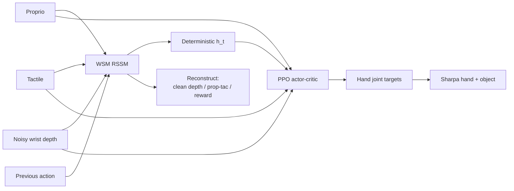

# WM-Craftnet：世界联觉模型驱动的鲁棒手内灵巧操作

**WM-Craftnet**（*World Synesthesia Model for Generalizable and Robust Dexterous In-Hand Manipulation*，[arXiv:2609.07002](https://arxiv.org/abs/2609.07002)，[项目页](https://wmcraftnet.github.io/)，**CoRL 2026**）由 **Sharpa Robotics** 提出：用 Dreamer 式 **World Synesthesia Model（WSM）** 从本体、**噪声腕部 depth**、触觉、动作与奖励学习 action-conditioned **RSSM**，以 **干净 depth 重建** 为核心监督；部署时 **不做 latent imagination**，只把确定性循环特征 \(h_t\) 作为 asymmetric **PPO** actor–critic 的 **可复用任务上下文**，在 Sharpa 真机上实现 **无 object ID** 的多物体 z/x/y 轴手内旋转、扰动恢复与 sim-to-real。

## 一句话定义

**手内旋转要抗扰动：别在策略里硬啃 noisy depth——先训一个会「联觉」几何与接触的 WSM 循环状态，再让 PPO 把它当任务上下文闭环调整。**

## 英文缩写速查

| 缩写 | 英文全称 | 简要说明 |
|------|----------|----------|
| WSM | World Synesthesia Model | 多模态 action-conditioned RSSM，重建 clean depth 与 proprio-tactile |
| WM-Craftnet | World Model Craftnet | 本文框架：WSM 条件化手内操作策略 |
| RSSM | Recurrent State-Space Model | 确定性记忆 + 随机潜变量的循环世界模型（Dreamer 族） |
| PPO | Proximal Policy Optimization | 与 WSM 特征并联的 asymmetric actor–critic |
| IHR | In-Hand Rotation | 项目页对照基线：tactile + noisy real depth |
| Sim2Real | Simulation to Real | 仿真训练、Sharpa 真机腕深+触觉闭环部署 |

## 为什么重要

- **世界模型的新用法：** 与在 WM 内做想象 rollout 或 MBPO 不同，WSM 只做 **deployable state estimator**——推理时只读 \(h_t\)，算力与稳定性更适合高频手内控制。
- **Clean-depth 监督是真机关键：** 噪声 depth 单独喂策略会 OOD；WSM 从 noisy 输入重建几何，消融显示 clean-depth head 比 noisy-depth 监督 **+45.3 Return**，且 IHR+去噪 depth 仍远低于完整 WM-Craftnet。
- **单策略多物体：** 无 object identifier；t-SNE 显示 \(h_t\) 按几何/接触工况聚类，一条闭环策略覆盖九仿真物 + 真机连续多物 rollout。
- **可迁移物理先验：** 九物体 z 轴预训练 WSM → 四十九物体下游：**9.37±0.13 rad/ep** vs 无先验 **3.28**；fall **0.3%** vs **6%**。
- **真机数字拉开差距：** duck z 轴 **16.18 rad / 10/10** vs IHR **1.83 / 5/10**；cross/corner/unseen 均显著优于 tactile-only 与「仅去噪 depth」基线。

## 核心信息

| 项 | 内容 |
|----|------|
| **机构** | 夏帕机器人（Sharpa Robotics） |
| **作者** | Jie Yin、Zeyuan Zhao、Xiaojing Tan、Yang Liu、Chiyu Wang、Xinyang Gu |
| **平台** | Sharpa 灵巧手；腕部 depth + 五指触觉；仿真随机 18 cm² 初始位姿 |
| **训练** | WSM 预训练（多模态重建 + reward）→ PPO 手内旋转；可选多轴与重力不变紧凑抓型 |
| **开源** | **待发布**（截至 **2026-09-11** 项目页 *codes soon*；[GitHub](https://github.com/sharpa-robotics/WM-Craftnet) **404**） |

## 核心原理

### 两阶段：WSM 表征 + PPO 闭环

1. **WSM 训练：** action-conditioned RSSM 接收 noisy depth、proprio、tactile、action；解码 **clean depth**、低维 proprio-tactile、reward。损失驱动 **去噪几何 + 接触演化** 进入 \(h_t\)。
2. **策略训练：** asymmetric actor–critic 读取 \(h_t\)（及当前传感），优化手内旋转奖励；**不在 WM 内做策略梯度想象**。
3. **部署：** 同一 WSM 前向提供循环上下文；真机噪声 depth 经 WSM  latent 重建更稳定的几何估计，并与触觉时间序列共同支撑 slip/漂移推断。

### 流程总览

### 与「仅加传感器 / 仅去噪 depth」的差别

项目页消融强调：性能增益来自 **action-conditioned 循环推断 + clean-depth 监督 + 触觉头**，而非把 depth/tactile 直接拼进更大观测向量。IHR 加 WSM-denoised depth 能到 **2.76 rad**，但缺 **时序接触与运动上下文** 时仍无法稳定长时旋转（duck **16.18 rad**）。

## 源码运行时序图

**不适用** — 截至入库日（2026-09-11）[官方仓库](https://github.com/sharpa-robotics/WM-Craftnet) **404**，项目页仅声明即将发布代码。若开源，预期路径为：`train_wsm`（多模态重建预训练）→ `train_ppo`（读取冻结/共享 WSM 的 \(h_t\)）→ `deploy_real`（Sharpa 腕深+触觉闭环）。

## 工程实践

| 项 | 建议 |
|----|------|
| 基线设计 | 对照至少包含 raw-sensor PPO、from-scratch、**IHR+WSM depth only**，避免把增益误读为「多一个 CNN」 |
| Depth 监督 | 训练 WSM 时用 **clean depth target**；真机只给 noisy stream |
| 触觉 | prop+tac 已显著提升 Return；完整 prop+tac+depth 最强 |
| 先验复用 | 九物体 z 轴 WSM 可作 **四十九物体** 下游初始化，显著降 fall rate |
| 多轴 | y 轴 elongated 物体需侧向力矩控制；x 轴依赖 rolling——勿直接用 z 轴 finger gait |
| 扰动 | 策略应先 **re-center / regrasp** 再最大化 RotR；评测需含 process disturbance |
| 复现 | 等待 Sharpa 发布 sim + 真机接口；勿假设 `sharpa-robotics/WM-Craftnet` 已可用 |

## 实验与评测

### 仿真消融（z 轴，项目页）

| Method | Return ↑ | RotR ↑ | Fall ↓ |
|--------|----------|--------|--------|
| Best raw-sensor baseline | 386.9 | 1.018 | 0.047 |
| WM-Craftnet from scratch | 414.3 | 0.742 | 0.002 |
| WSM prop+tac+depth | **753.3** | **1.293** | **0.005** |

### 真机 z 轴（duck，RR / SR）

| Method | Duck |
|--------|------|
| IHR | 1.83 / 5/10 |
| IHR + WSM-denoised depth | 2.76 / 8/10 |
| **WM-Craftnet** | **16.18 / 10/10** |

项目页另报 cross **8.01/10/10**、corner **8.48/10/10**、unseen **4.32/8/10**。

### 四十九物体下游（3000 epoch）

| 条件 | rad/ep | Fall rate |
|------|--------|-----------|
| 无 WSM 先验 | 3.28 | 6% |
| 九物体预训练 WSM | **9.37±0.13** | **0.3%** |

### 定性能力

- 连续多物真机 rollout（duck→cylinder→cross→bun→未见双槽块等）
- 过程中外力、OOD 初始位姿、掌区滑移恢复
- x/y 轴与重力不变紧凑抓型；螺丝刀平移与快转（工具使用 demo）

## 结论

**手内旋转的鲁棒性来自「可部署的循环视触觉状态」，而不是更大的单帧观测或开环 gait replay。**

1. **WSM 用法** — 作 **recurrent task context**，不在 WM 内做想象策略优化。
2. **Clean-depth 监督** — 是真机几何稳定性的核心；仅去噪 depth 给 IHR **不够**。
3. **触觉 + 时序** — prop+tac+depth 消融最高；触觉提供接触演化，depth 提供几何，循环记忆整合 drift/slip。
4. **无 object ID** — \(h_t\) 仍按交互工况聚类；单策略覆盖多形状/质量物体。
5. **可迁移先验** — 九物体 WSM 显著加速四十九物体下游并降 fall rate。
6. **sim-to-real** — 真机 noisy depth + 触觉闭环验证；优于 open-loop replay 与 tactile-only。
7. **开源** — 截至 2026-09-11 **待发布**；工程复现需跟进官方仓库。

## 与其他工作对比

| 对照 | 差异读法 |
|------|----------|
| IHR / tactile-only | 缺显式几何或缺循环上下文；易 side-fall |
| IHR + WSM-denoised depth | 证明去噪有用，但缺 **时序接触推断** 仍远低于 WM-Craftnet |
| Open-loop finger gait replay | 无反馈；项目页真机基线无法恢复可控旋转 |
| [FBI](../entities/paper-sa-2508-14441-fbi-learning-dexterous-in-hand-manipulation-with.md) | 动态视触觉融合 + 一步扩散策略；不同架构，同在手内旋转域 |
| [WM-LOCO](./paper-wm-loco.md) | 同类 RSSM→策略特征，但任务为 **G1 落脚行走**，非灵巧手 |
| [ADEPT](./paper-adept-dexterity.md) | RL 预训练 reposing + post-train；长视界 arm-hand insert，非单 hand in-hand rotation |
| [Motus2](./paper-motus2.md) | 联合 video–action GWM + MBRL 想象；WM-Craftnet **刻意不做** rollout 策略优化 |
| Dreamer / MBPO 手内操作 | 本文强调 **state estimator + model-free PPO**，降低想象 rollout 部署成本 |

## 局限与风险

- **评测视界：** 定量仍以短视界 in-hand rotation 为主；平移、更广 sensing 变化、长程工具任务多为定性或 future work。
- **失败模式：** 极难初始位姿、长程接触漂移（如 duck 5 转后失稳）仍会失败。
- **硬件绑定：** 结果建立在 Sharpa 手 + 其 depth/tactile 栈；迁移到他手需重训 WSM 与策略。
- **未开源：** 仿真环境、奖励与真机驱动截至入库日不可用。
- **与 RoboCraft 无关：** 名称含 Craft，但本文 **非** 粒子图 Deformable WM（[RoboCraft](./paper-robocraft-particle-graph-dynamics.md)）。

## 关联页面

- [In-hand Reorientation](../methods/in-hand-reorientation.md)
- [Manipulation](../tasks/manipulation.md)
- [Tactile Sensing](../concepts/tactile-sensing.md)
- [Model-Based RL](../methods/model-based-rl.md)
- [WM-LOCO](./paper-wm-loco.md) — RSSM 特征喂策略的另一域实例
- [TeleDexter](./paper-teledexter.md) — 同系 Sharpa 平台的遥操作/采数路线

## 参考来源

- [WM-Craftnet 论文归档](../../sources/papers/wm_craftnet_arxiv_2609_07002.md)
- [wmcraftnet 项目页归档](../../sources/sites/wmcraftnet-github-io.md)
- [wm-craftnet 仓库归档（待发布）](../../sources/repos/wm-craftnet.md)

## 推荐继续阅读

- [arXiv:2609.07002 全文 PDF](https://arxiv.org/pdf/2609.07002)
- [WM-Craftnet 项目页](https://wmcraftnet.github.io/) — 消融表、latent depth 重建与真机恢复视频
