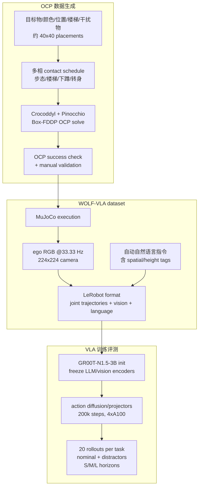

# WOLF-VLA

**WOLF-VLA: Whole-Body Humanoid Optimal Locomotion Framework for Vision-Language-Action Learning**（arXiv:2606.25591，DFKI / University of Oldenburg 等）收录于 [具身智能研究室 Loco-Manip 接触专题](../../sources/blogs/wechat_embodied_ai_lab_loco_manip_contact_survey.md) **05 VLA/WM 调用** 组。它更偏 **humanoid locomotion VLA benchmark** 而非物体操作论文：用全身最优控制（OC/OCP）合成动态一致、接触相干的人形 locomotion 轨迹，再同步 ego 视觉与自然语言训练 VLA。

## 一句话定义

WOLF-VLA 用 **OCP 轨迹优化数据工厂** 生成带最优性/安全约束的人形全身 locomotion 数据，再把这些动态一致示范变成 vision-language-action policy 的训练集和 benchmark。

## 英文缩写速查

| 缩写 | 英文全称 | 简要说明 |
|------|----------|----------|
| WOLF | Whole-Body Humanoid Optimal Locomotion Framework | 本文的 OC 数据生成框架 |
| VLA | Vision-Language-Action | 从 ego 视觉、语言和本体预测动作块的多模态策略 |
| OCP | Optimal Control Problem | 数据生成核心：多相接触动力学约束下优化轨迹 |
| DDP | Differential Dynamic Programming | Crocoddyl/Box-FDDP 求解多相 OCP 的优化方法 |
| ROM | Range of Motion | 评估策略关节运动是否贴近 OC reference 的指标 |
| SSR | Soft Success Rate | stair tasks 的分段软成功率，按完成楼梯子目标计分 |

## 为什么重要

- **把 classical OC 变成 VLA 数据源**：不同于 teleoperation 或 mocap，OCP 轨迹天然包含 torque、joint limits、contact phases 和 smoothness constraints。
- **回应 humanoid VLA 的数据缺口**：Open X-Embodiment 等偏机械臂；WOLF-VLA 提供全身 humanoid locomotion 的视觉、语言、本体、action 对齐数据。
- **安全与最优性可溯源**：数据不是“人操作出来的轨迹”，而是由多体接触动力学、扭矩/关节约束和 cost terms 生成，便于分析策略为何稳定。
- **VLA/WM 调用层的底座**：上层模型要调用全身动作接口，不能只输出语义；WOLF-VLA 提供一组接触可行 reference，用来检验 VLA 是否真的学到 locomotion dynamics。
- **与 MotionWAM/OpenHLM 对照**：[MotionWAM](./paper-motionwam-humanoid-loco-manipulation-wam.md) 强调世界动作模型和真机 loco-manip，WOLF-VLA 强调 OC benchmark 与动态一致 locomotion data。

## 流程总览

## 核心机制

### 1）Synthetic dataset creation by optimal control

WOLF-VLA 生成 **277 hours** 的 humanoid motion，覆盖六类 locomotion-related skills：

- forward walking toward target；
- left/right side-walking；
- forward walking + ascending three-step staircase；
- walking with stair ascent and descent；
- 180° turning；
- variable-height squatting。

环境参数包括目标形状（box/cylinder/sphere/ground marker/staircases）、六种颜色、X/Y 系统位置变化（约 40×40 placements）和随机 distractors。每条样本同步记录 RGB observation、OC trajectory 和 natural-language instruction。

### 2）OCP：多相接触动力学约束

轨迹优化基于带接触的多体动力学：

- 状态：generalized configuration/velocity；
- 控制：joint torques；
- 接触：足端 contact Jacobian 与 contact force；
- 约束：joint position、velocity、torque limits；
- phase：每个 phase 对应特定接触配置。

OCP 通过 multiple shooting 和 DDP 求解，使用开源 **Crocoddyl** 和 **Pinocchio**，并用 Box-FDDP enforce torque limits。Cost terms 包括 CoM tracking、feet tracking、torque minimization 和 posture regularization。

### 3）Virtual environment and action space

论文使用 RH5 humanoid，含 free-flyer 与 **25 actuated joints**。Observation 包括：

- proprioception：32 joint rotations + 31 velocities（含 floating base）；
- ego RGB：头部 120° FOV 虚拟相机，224×224；
- natural-language instruction。

Action space 是 delta joint rotation command，表示每步增量关节目标。

### 4）VLA policy learning

WOLF-VLA 主模型从 **GR00T-N1.5-3B** 初始化：

- LLM 与 vision encoder 冻结；
- action diffusion model 与 projector layers 训练；
- 4 NVIDIA A100，200,000 gradient steps，effective batch size 128；
- AdamW，peak LR 1e-4，cosine decay 到 1e-5，bfloat16；
- 数据转为 LeRobot dataset format。

训练目标是 flow matching：对 ground-truth action chunk 与 Gaussian noise 插值，预测 conditional vector field，再用 Euler integration 生成 denoised action chunk。

### 5）评测指标

- **Success Rate**：是否在 horizon 内完成任务。
- **Soft Success Rate（SSR）**：楼梯任务按完成的 intermediate stair objectives 计分。
- **ROM error（ΔROM）**：比较策略和 OC reference 在 hip/knee/ankle range of motion 上的偏差，避免只看任务成功而忽略动作质量。

## 工程实践

| 维度 | 记录 |
|------|------|
| 机器人 | RH5 humanoid；free-flyer + 25 actuated joints |
| 仿真 | MuJoCo / Gymnasium；头部 ego camera 120° FOV |
| OC 工具 | Crocoddyl、Pinocchio、Box-FDDP、多相 OCP |
| 数据规模 | **277 h**，**15,276 episodes**；平均 episode length 28 s |
| 任务统计 | WF 2874 episodes；WA 8234；W.CS.U 2358；W.CS.U/D 1810 |
| 重定向就绪度 | 数据为 **RH5 形态专属**：action 是 25 actuated joints 的 delta joint rotation，proprioception 亦按 RH5 骨架记录，因此**只可直接喂给 RH5 策略**；换到 Unitree G1 等异构人形需先做 **motion retargeting / 骨架对齐**。好处是 OCP 生成的轨迹本身满足 torque/关节约束、**物理可行**且动态一致，作为重定向源质量高于纯 mocap/teleop 轨迹 |
| VLA 训练 | GR00T-N1.5-3B init；4×A100；200k steps；LeRobot format |
| 开源状态 | 摘要承诺 full dataset、model checkpoints、benchmarking simulation suite 将开放；截至 2026-07-22 未发现官方仓库或下载页 |
| 源码运行时序图 | **不适用**：当前无可运行官方代码；只可根据论文复现 OCP/VLA 流程 |

## 实验与评测

### 主模型任务成功率摘要

| Task | Average success |
|------|-----------------|
| WF（Walk Forward） | 99% |
| WA（Walk Around / side/turn-like setting） | 27% |
| W.CS.U（stairs up，SSR） | 51% |
| W.CS.U/D（stairs up/down，SSR） | 44% |
| All | 55.3% |

### Baseline 对比

| Model | All average success |
|-------|---------------------|
| WOLF-VLA / GR00T-N1.5 fine-tune | 55.3% |
| ACT | 1.4% |
| π0.5 | 0% |

### 模态消融

- 去掉 spatial tags：平均成功从 55.3 降到约 48。
- 去掉 language：复杂任务下降，说明语言不是唯一 grounding，但提供高层任务信息。
- 去掉 vision：WF 只剩约 5%，WA 0%，楼梯任务约 11%，说明 ego vision 是环境感知的关键。
- paraphrased instruction：平均约 54，说明语言鲁棒性相对可接受。

## 与相邻路线对比

| 路线 | 数据来源 | 主要接口 | 主要验证 |
|------|----------|----------|----------|
| WOLF-VLA | OCP/OC 自动生成动态一致 locomotion trajectories | ego RGB + language + proprioception → action chunks | RH5 仿真 benchmark |
| [MotionWAM](./paper-motionwam-humanoid-loco-manipulation-wam.md) | egocentric video + 全身遥操作微调 | world-action latent → SONIC tokens | Unitree G1 真机 loco-manip |
| [OpenHLM](./paper-loco-manip-161-154-openhlm.md) | 高层语言/人形任务接口 | open-ended humanoid motion/language framework | Loco-manip VLA/WM 调用侧 |
| 传统 MPC/WBC | 在线模型预测与全身控制 | state/task reference → control | 安全稳定强，但数据规模化弱 |

## 局限与风险

- **偏 locomotion，非完整 object manipulation**：虽归入接触专题 05 组，但主要处理行走、楼梯、转身、下蹲，不是搬箱/抓取等 HOI。
- **仿真 benchmark 先行**：论文强调 dataset/model/simulation suite，尚未展示与真实 humanoid 的 sim2real 部署闭环。
- **任务复杂度不均**：WF 接近满分，WA/楼梯难度高且受 distractors/horizon 影响明显。
- **OC 成本与人工验证**：轨迹需 OCP solve 和 manual validation；扩展到更多复杂接触任务成本不低。
- **开源尚未落地**：摘要承诺 future release，但当前没有 official repo/checkpoints 可下载。

## 关联页面

- [Loco-Manip 接触技术地图](../overview/loco-manip-contact-technology-map.md)
- [05 VLA/世界模型调用分类 hub](../overview/loco-manip-contact-category-05-vla-world-models.md)
- [Humanoid Locomotion](../tasks/humanoid-locomotion.md)
- [Loco-Manipulation](../tasks/loco-manipulation.md)
- [VLA](../methods/vla.md)
- [Model Predictive Control](../methods/model-predictive-control.md)
- [Whole-Body Control](../concepts/whole-body-control.md)
- [OpenHLM](./paper-loco-manip-161-154-openhlm.md)
- [MotionWAM](./paper-motionwam-humanoid-loco-manipulation-wam.md)

## 参考来源

- [WOLF-VLA 来源摘录](../../sources/papers/wolf_vla_arxiv_2606_25591.md)
- [具身智能研究室 Loco-Manip 接触专题](../../sources/blogs/wechat_embodied_ai_lab_loco_manip_contact_survey.md)
- arXiv: <https://arxiv.org/abs/2606.25591>

## 推荐继续阅读

- [VLA](../methods/vla.md)
- [Model Predictive Control](../methods/model-predictive-control.md)
- [Crocoddyl](https://github.com/loco-3d/crocoddyl)
- [Pinocchio](https://github.com/stack-of-tasks/pinocchio)
