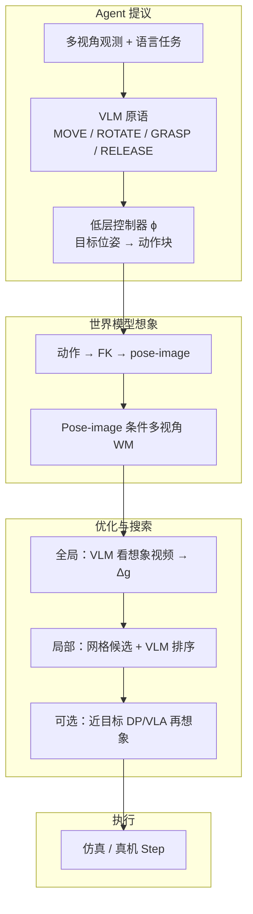
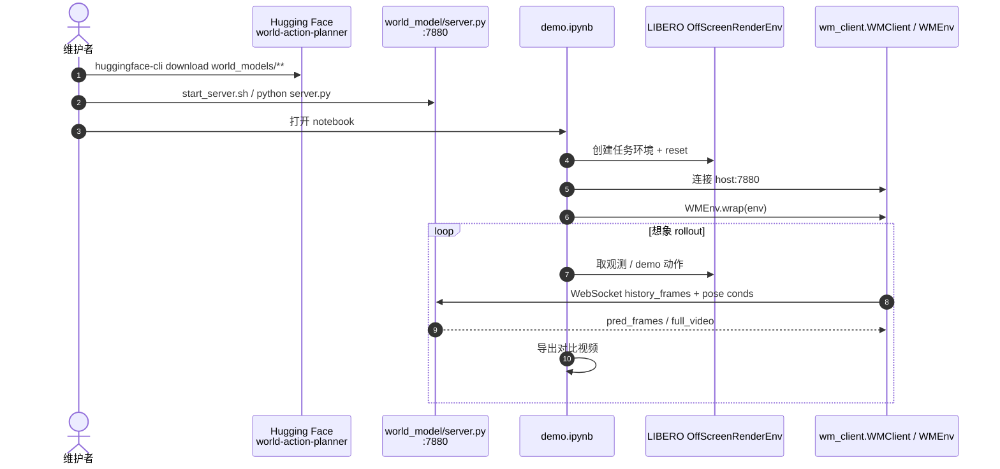

# World Action Planner

**World Action Planner（WAP）**（*Generalizable Decision-Making with Action-Conditioned World Models*，[arXiv:2607.27599](https://arxiv.org/abs/2607.27599)，[项目页](https://worldactionplanner.github.io/)）由 **哈佛大学（Harvard University）** Xiangcheng Zhang、Yilun Du 提出：用 **VLM 提议动作原语**，再在 **pose-image 条件多视角世界模型** 的想象 rollout 上做 **全局优化 + 局部搜索**，把 E2E 模仿策略降级为可选工具。

## 一句话定义

**不把决策绑死在示教轨迹上——先让 VLM 提计划，再在动作条件世界模型里「预演—改—选」，用想象 rollout 完成组合任务、新布局与零样本操作。**

## 英文缩写速查

| 缩写 | 英文全称 | 简要说明 |
|------|----------|----------|
| WAP | World Action Planner | 本文规划系统：VLM + 动作条件 WM + 搜索 |
| WM | World Model | pose-image 条件多视角视频预测器 |
| VLM | Vision-Language Model | 提议原语、语义反馈与候选排序（默认 Gemini 3.0 Flash） |
| VLA | Vision-Language-Action | E2E 对照基线（如 π₀.₅） |
| WAM | World Action Model | 联合世界–动作 E2E 对照（如 cosmos-policy） |
| DP | Diffusion Policy | 近目标精细抓取的可选工具策略 |
| LIBERO | Lifelong Robot Learning Benchmark | 组合 / Object 套件主评测场 |
| PSNR / LPIPS | Peak Signal-to-Noise / Learned Perceptual Image Patch Similarity | 世界模型帧质量指标 |

## 为什么重要

- **直接打 E2E 泛化痛点：** 组合长程时 VLA 常完成第一子任务后停滞；布局一变就抓训练坐标。
- **把「策略」改成「工具」：** in-distribution 可用 DP/VLA；OOD 走完整模型基规划，而不是再堆示教。
- **条件化更可规划：** pose skeleton 图像由正运动学渲染，相对低维动作调制更利于 OOD / 危险动作想象。
- **可复现：** GitHub + Hugging Face 权重（世界模型与 DP/IDM）已公开。

## 核心信息

| 项 | 内容 |
|----|------|
| **机构** | 哈佛大学（Harvard University） |
| **作者** | Xiangcheng Zhang、Yilun Du |
| **骨干** | Wan-T2V-1.3B；diffusion forcing + flow matching |
| **规划 Agent** | Gemini 3.0 Flash（默认） |
| **评测套件** | LIBERO / Robocasa / MimicGen / DexMimicGen / Robosuite |
| **开源** | **已开源**：[GitHub](https://github.com/XiangchengZhang/world-action-planner) + [HF 权重](https://huggingface.co/XiangchengZhang/world-action-planner) |

## 流程总览

## 核心原理

### Pose-image 条件世界模型

| 设计点 | 做法 |
|--------|------|
| 动作接口 | 未来关节由动力学前推，渲染为 **pose skeleton 图像**（非裸低维向量） |
| 多视角 | 第三人称 + 腕部等拼成 2×2；视频与 pose token 统一序列 |
| 训练 | pose token 清洁；历史/未来视频按 diffusion-forcing 加噪；flow matching |
| 推理 | 约 20 diffusion steps；历史 21 帧 @7 FPS → 未来 20 帧 @20 FPS |

相对 Ctrl-World 等低维动作条件基线，作者报告单具身 in-distribution 平均约 **+11.4%**、泛化设置约 **+16.8%**（Table 1，PSNR/LPIPS 相对第二名）。

### 规划管线（Alg.1）

1. **提议：** VLM 在多视角上标目标像素 → 三角化 3D → 控制器出动作块。
2. **全局优化：** WM 想象整段轨迹；VLM 给语义修正（抬升避 rim、前移补偿掉落等）。
3. **局部搜索：** 网格扰动候选 → 各自想象；可选再 roll 工具策略；VLM 排序选优后执行。
4. **理论（§4）：** 多任务共享动力学时，模型基规划可避免模仿在任务数随预算增长时的常数级次优。

## 源码运行时序图

关键复现路径：先按 `world_model/README.md` 装独立 env、下 Wan VAE 与 ckpt → `bash start_server.sh` → 再在规划 env 里跑 `demo.ipynb` 或自接 `WMClient`。完整 VLM 规划环需自备 Gemini（或替换 Agent）与论文附录中的控制器/搜索脚本配置。

## 工程实践

| 项 | 内容 |
|----|------|
| 环境安装 | `pip install -e environments/{robomimic,robosuite,LIBERO}` + `pip install -e wm_client` |
| 世界模型 env | 独立 `ei_world_model`；`pip install -e world_model` |
| 默认 ckpt | `libero_90_base/checkpoints/latest.ckpt` |
| 微调 ckpt | `libero_object_ft`、`robosuite_ft` |
| 服务协议 | WebSocket JSON：`history_frames` / `history_conds` / `future_conds` → base64 PNG |
| GPU | 完整 Wan 推理需 CUDA；CPU 仅能过 import 检查 |
| 开源状态 | **已开源**（代码 + 权重）；项目页 HF 按钮曾写 Coming soon，HF 仓已可下 |

## 评测与结论要点

| 场景 | 指标（论文报告） |
|------|------------------|
| 组合 LIBERO-Long（Table 3） | WAP **72 / 68 / 78 / 70**；π₀.₅ 与 cosmos-policy ≈0–4；纯 VLM planner 28–56 |
| 新布局 LIBERO-Object（Table 4） | WAP **66–90**；通用 VLA/WAM 多为 0；策略仅 **5** demo/任务 |
| 零样本 Robosuite（Table 5） | PickPlaceCan **80**、StackCube **76**（无专家策略；WM +50 探索轨迹） |
| 世界模型质量（Table 1） | vs 第二名平均约 **+11.4%**（ID）/ **+16.8%**（OOD） |

## 与其他工作对比

| 维度 | World Action Planner | E2E VLA / WAM | Ctrl-World 类闭环 WM |
|------|----------------------|---------------|----------------------|
| 决策主体 | VLM 提议 + 想象搜索 | 单策略直接出动作 | 策略在 WM 里评估/微调 |
| 动作条件 | pose-image 骨架渲染 | 低维动作 / 联合 token | 低维动作或位姿记忆 |
| 泛化杠杆 | 测试时规划合成新轨迹 | 依赖示教覆盖 | 合成数据 SFT / 虚拟评测 |
| 策略角色 | 可选工具（近目标 DP） | 唯一决策器 | 被评估或后训练的主体 |

## 结论

**World Action Planner 证明：用可规划的动作条件世界模型承接 VLM 语义，比把泛化压力全部压给 E2E VLA/WAM 更扛组合与布局偏移。**

- 真影响指标看 **组合成功率与改布局成功率**，不是单任务 in-distribution SR。
- pose-image 条件是世界模型可规划性的关键，不只是「更好看的视频」。
- 近目标精细操作仍可挂 DP；规划系统负责导航与纠错。
- 零样本 StackCube 相对纯 VLM planner 的大间隙，说明想象搜索不可省。
- 部署成本在 **WM 服务 + VLM API + 多轮想象**；适合仿真/离线规划，真机延迟需另评估。
- 复现优先跑通 `server.py` + `demo.ipynb`，再替换为自己的 Agent/控制器。

## 局限与风险

- 主文规划实验在 **仿真**（LIBERO / Robosuite）；真机闭环未作主结果。
- 依赖强 VLM（Gemini）与多轮想象，**延迟与 API 成本**高。
- 世界模型仍可能在精细接触上失真；局部搜索不能完全补物理误差。
- HF 权重体积大（约数十 GB），本地复现门槛高。

## 关联页面

- [World Action Models](../concepts/world-action-models.md) — WAM 联合建模对照；WAP 更偏 **级联「WM 想象 + 外环规划」**
- [生成式世界模型](../methods/generative-world-models.md) — 视频扩散 WM 方法页
- [VLA](../methods/vla.md) — π₀.₅ 等 E2E 对照
- [Diffusion Policy](../methods/diffusion-policy.md) — 近目标工具策略
- [LIBERO](./libero-benchmark.md) — 主评测基准
- [Ctrl-World](./paper-ctrl-world.md) — 多视角动作条件 WM 近邻
- [Kairos](./paper-kairos-native-world-model-stack.md) / [τ₀-WM](./tau0-world-model.md) — 联合 WAM / 测试时仿真对照
- [Manipulation](../tasks/manipulation.md)
- [具身 FM 选型闭环](../queries/embodied-fm-taxonomy-loop.md)

## 参考来源

- [World Action Planner 论文策展](../../sources/papers/world_action_planner_arxiv_2607_27599.md)
- [项目页归档](../../sources/sites/worldactionplanner-github-io.md)
- [GitHub 仓库归档](../../sources/repos/world-action-planner.md)
- [Hugging Face 权重归档](../../sources/sites/huggingface-xiangchengzhang-world-action-planner.md)

## 推荐继续阅读

- 项目页：<https://worldactionplanner.github.io/>
- 论文 PDF：<https://arxiv.org/pdf/2607.27599>
- 仓库 README / `world_model/README.md`（服务与 ckpt 下载）
