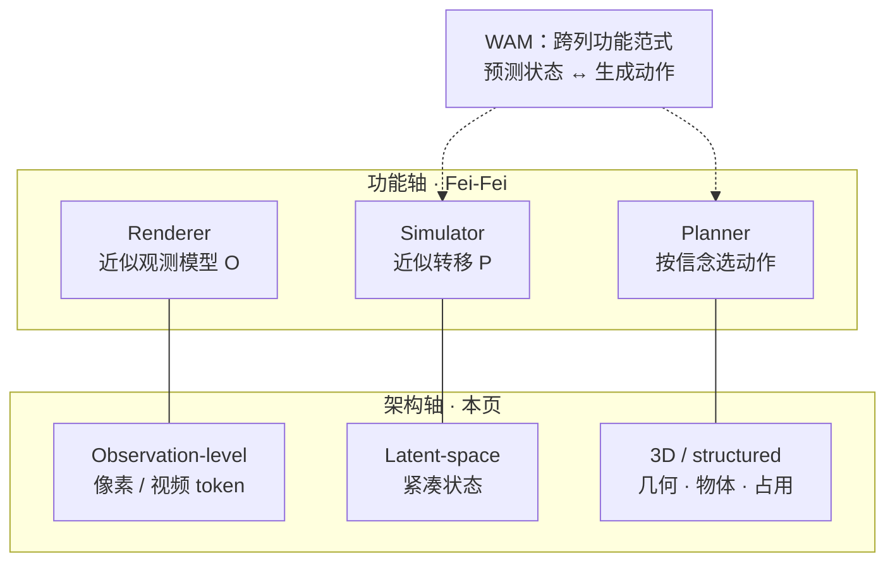
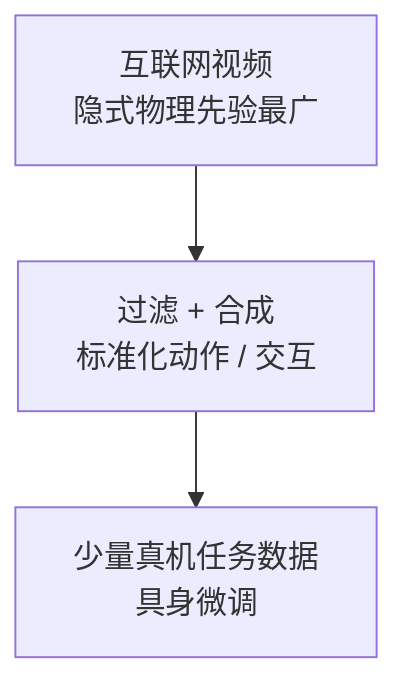

# 世界模型定义与路线图（上海人工智能实验室）

**A Definition and Roadmap for World Models**（[arXiv:2607.06401v1](https://arxiv.org/abs/2607.06401v1)）是上海人工智能实验室 Physical Intelligence Team 的视角文：先给物理世界模型一个压缩定义，再把 Fei-Fei 的功能分类补成 **功能 × 架构** 二维表，并写出数据倒金字塔与三阶段路线。贡献者按姓氏：Xinyuan Chen、Haoyu Guo、Shi Guo、Bingqi Jiang、Chunhua Shen、Xing Shen、Tianfan Xue、Yufei Xue、Mulin Yu、Weinan Zhang、Bin Zhao、Bowen Zhou、Ming Zhou。

## 一句话定义

> **世界模型不是视频生成器，而是在有限算力下压缩物理状态转移；渲染、仿真、规划只是同一内部状态的三种解码。**

## 英文缩写速查

| 缩写 | 英文全称 | 简要说明 |
|------|----------|----------|
| PWM | Physical World Model | 文内与 world model 互换；特指物理状态转移压缩，不是任意视频模型 |
| POMDP | Partially Observable Markov Decision Process | 定义所依附的 agent–环境环 |
| WAM | World Action Model | 跨架构的规划向范式，不是第四实现列 |
| JEPA | Joint-Embedding Predictive Architecture | 潜空间预测、不做像素重建的代表 |
| CoI | Chain-of-Imagination | 在动作条件动力学空间里推理，对照语言 CoT |
| BFM | Behavior Foundation Model | 文内的「身体世界模型」：先验是身体能做什么 |

## 为什么重要

- **给过载词一个可检验定义。** 功能分类告诉你系统吐什么；本页告诉你内部该压缩什么。没有这一层，Sora、Dreamer、Marble、VLA 会继续共用一个名字。
- **把数据天花板说死。** 固定架构与算力时，物理泛化上限由训练数据里的物理经验多样性决定；互联网视频是目前唯一能扩到所需广度的源。
- **和本库 WAM / 生成式 WM 对齐。** WAM 被明确写成 Planner+Simulator 的功能家族，而不是和 observation / latent / 3D 并列的第四列。
- **路线图可对照选型。** 「统一多模态 → 一个物理状态、多种解码 → 可闭环验证的交互仿真器」比「再训一个更大的视频模型」更可执行。

## 核心信息

| 项 | 内容 |
|----|------|
| **机构** | 上海人工智能实验室（Shanghai AI Lab），Physical Intelligence Team |
| **类型** | 视角 / 定义 + 路线图；无新基准数字 |
| **对话对象** | Fei-Fei 2026 功能分类；LeCun 2022 潜空间预测；Craik 1943 / Dyna |
| **开源** | **确认未开源**（截至 2026-09-05：abs/HTML 无项目页、仓库或权重） |
| **源码运行时序图** | **不适用**（视角文，无可运行实现） |

## 核心原理（方法栈）

### 压缩定义

文中 Definition 2.1：世界模型是在有限计算资源约束下，对物理世界状态转移过程的压缩建模。生成与仿真是好表征的下游能力，目标本身是 **保留决策相关因果/物理、丢掉光度 nuisance**。

三条伴随性质：**全模态工作范围**、**多维异步**（不同传感器频率）、**局部性**（POMDP：局部观测 + 外部干预）。

认识论从「接下来会发生什么」扩成「正在发生什么、为什么、接下来会怎样」。物理系统非平稳；安全关键故障可能从不出现在静态语料里，因此静态世界模型不够。

### 理解 vs 预测

| 取向 | 优化什么 | 失败模式 |
|------|----------|----------|
| Understanding | 实体、关系、机制、信念 | 隐状态对了，渲染仍可能难看 |
| Prediction | 可滚未来、可规划 | 画面逼真，但丢隐状态 / 因果 / 干预语义 |

文内立场：物理世界模型以 **理解为先**，预测用来检验和反事实推演。这和「视频越像越像世界模型」相反。

### 二维 taxonomy

- 功能轴沿用 [Renderer / Simulator / Planner](../concepts/functional-taxonomy-world-models.md)，并写进 POMDP：Simulator ≈ \(T\)，Renderer ≈ \(O\)，Planner 在信念上优化期望效用（含认知价值）。
- 架构轴问「世界知识存在哪种底物上」。Sora / Seedance 落在 observation-level Renderer；Genie 3 仍是观测级但可交互；JEPA 家族是 latent Simulator；Dreamer 是潜空间仿真 + 想象训练的策略；Marble 落在 3D/structured，桥接渲染与仿真，但 collider ≠ 完整学习动力学；Cosmos 3 是同一 omnimodal 骨干上的多种配置。
- **WAM 不是第四列。** 它可实例化在像素、潜空间或 3D 流上；功能上偏 Planner，通常同时做 Simulator。这与本库 [WAM 概念页](../concepts/world-action-models.md) 的 \(p(o',a\mid o,l)\) 边界一致。

### 倒金字塔数据流

没有硬件部署能在可预见期内造出互联网规模的操作数据。因此要先从视频里解锁物体恒存、刚/软体、运动学极限、遮挡因果、人类动作结构，再蒸馏到机器人能用的信号。对照本库 [具身数据金字塔综述](./paper-data-pyramid-embodied-manipulation.md)：那里按真机 / UMI / Ego-Exo / 仿真 / 通用分层；这里按「广度 → 可执行性」漏斗。两套图互补，不是同一张表。

### 三阶段路线图

1. **统一多模态**：外观、3D、状态、动作、长程推理必须互相解释变化，而不是拼 token。
2. **统一物理表征**：一个内部状态同时可解码为像素/splat、接触/应力、物体–部件–可供性。现有系统往往维护三套世界定义，互译有损。
3. **基础规模交互仿真器**：要能在闭环里验证因果一致性、长程稳定、对真机或湿实验的预测力——不只视觉可信。

Outlook 另画 Trinity：**Agent（执行）/ Evaluator（判完成与违规）/ World Model（仿真 + 自动课程）**。世界模型要知道当前 Actor 的能力边界，并提出刚超出边界的任务。

## 工程实践

| 项 | 建议 |
|----|------|
| 先贴标签再选型 | 同时标功能格与架构格；「这是 WAM」只回答耦合方式 |
| 数据 | 用倒金字塔：先问视频先验覆盖了哪些物理，再问过滤层是否抽出可标准化动作，最后才堆真机 |
| 训练目标 | 像素似然不够；还要看闭环一致性、可控性、长程稳定、稀有工况 |
| 规划用法 | 分清背景规划（训练时想象）与决策时搜索；长程用短 rollout + 重规划，或上层次化 |
| 物理约束 | 软惩罚易失衡；硬结构在先验错时会偏置；混合（可微引擎 + 残差）更常见 |
| 反事实 | 检查 same-world：改抓取方向不该改质量/身份/摩擦 |
| 身体 vs 世界 | 外部场景先验和 [BFM 技术地图](../overview/bfm-41-papers-technology-map.md) 式身体技能流形是两套生成先验，文内主张将来要合 |

## 实验与评测

本文无新表格数字；评测节是对碎片化基准的盘点，选型时按合同取子集：

| 合同 | 文内点到的基准族 | 不够的地方 |
|------|------------------|------------|
| 生成 / 感知 | VBench / VBench-2.0、Cosmos-HUE | 不像 ≠ 能控 |
| 3D/4D 世界生成 | WorldScore、4DWorldBench | 可控与时空一致，仍非任务成功 |
| 物理常识 | PhyGenBench、WorldModelBench、PhyWorldBench、WorldSimBench | 代理物理，不是真机 |
| 控制 / 具身 | ALE、DM Control、Habitat、CARLA、RoboArena、EWMBench、WorldArena | 虚拟捷径 vs 真机噪声 |
| 交互 / 长程状态 | WBench、WorldMark、MBench、WorldPrediction、WorldReasonBench、CoW-Bench | 少测推理延迟；亚秒生成被写成安全需求 |

文内强调：真验证要真机交互，但硬件磨损与初始态不一致会破坏公平。标准化协议本身仍是开放问题。本库 [EWMBench](./ewmbench.md) / [WorldScore](./paper-worldscore.md) / [WorldArena](./worldarena.md) 可作落地对照，不要用本文当排行榜。

## 与其他工作对比

| 框架 | 问的问题 | 和本页关系 |
|------|----------|------------|
| [Fei-Fei 功能分类](../concepts/functional-taxonomy-world-models.md) | 输出是观测、状态还是动作？ | 本页采纳为功能轴，并批评它不定义内部模型 |
| LeCun JEPA / 潜空间预测 | 要不要重建像素？ | 同意像素不是终极目标；仍主张重建质量可用来追踪压缩丢掉了什么 |
| [WAM 综述 2605.12090](../concepts/world-action-models.md) | 未来与动作是否在策略内耦合？ | 本页把 WAM 收成跨架构功能范式，不新开一列 |
| [训练闭环三线 2605.00080](../overview/robot-world-models-training-loop-taxonomy.md) | 预测能否进入学习 / 评估 / 决策？ | 机器人接口轴；与功能×架构正交 |
| [VL* 五家族](../comparisons/vlm-vln-vla-vlx-world-model-taxonomy.md) | 感知→导航→执行→融合→推演 | I/O 家族轴；WM 在那里是推演层 |
| [具身数据金字塔 2607.24744](./paper-data-pyramid-embodied-manipulation.md) | 真机 / UMI / Ego / 仿真怎么配？ | 本页倒金字塔是「广度→可执行」漏斗，不是同一分层 |

机器人应用节把世界模型收成 Data Engine / Environment Simulator / Action Planner，并单列 Embodiment World Model（BFM）：一套先验管外部场景，一套管身体技能流形。

## 结论

**真正重要的是可查询、可干预的压缩物理状态；像素好看和单独会出动作都是次要投影。**

1. **先写定义再贴标签。** 世界模型 = 有限算力下的状态转移压缩；视频生成器只有在保留决策相关结构时才算。
2. **功能分类有用，但只描述解码。** Renderer / Simulator / Planner 应读成 POMDP 上的角色，同一内部模型可以兼任。
3. **再标一列架构。** observation / latent / 3D 决定你能查询什么、长程误差怎么长；WAM 不是第四列。
4. **数据多样性定天花板。** 倒金字塔：互联网视频解锁隐式物理 → 过滤合成可执行信号 → 少量真机收敛任务；不要指望真机规模追上视频。
5. **规划会剥削模型。** compounding error、objective mismatch、乐观偏差从 MBRL 原样搬到基础规模 WM；短 rollout、不确定性、决策感知目标仍是工程默认。
6. **评测按合同拆。** 感知保真、物理精度、闭环成功是三件事；本文不提供可引用的新分数。
7. **路线按表征走，不按品牌走。** 统一多模态只是第一阶段；缺「一个状态、三种解码」，统一世界模型仍是三个头。

## 局限与风险

- **视角文，无新实验。** 代表系统的格子是作者放置，不是可复现排行。
- **确认未开源。** 没有仓库可对照图 1–10 的实现细节。
- **「物理世界模型」一词在其他文献更窄或更宽。** 文内脚注已声明与交互 3D 视频模型不等价。
- **社会世界模型被严格收窄。** 有界团队/制度可以讨论；国家/人群尺度预测被排除，并列出监控、歧视、performative 反馈风险。
- **Trinity / Physical AGI 是展望。** 不要把 Agent–Evaluator–World Model 图当成已部署架构。

## 关联页面

- [世界模型功能分类（Renderer / Simulator / Planner）](../concepts/functional-taxonomy-world-models.md)
- [Generative World Models](../methods/generative-world-models.md)
- [World Action Models（WAM）](../concepts/world-action-models.md)
- [机器人世界模型：训练闭环与三线 taxonomy](../overview/robot-world-models-training-loop-taxonomy.md)
- [具身数据金字塔综述](./paper-data-pyramid-embodied-manipulation.md) — 真机/UMI/Ego/仿真分层；对照本文倒金字塔
- [Cosmos 3](./cosmos-3.md)
- [Marble](./marble-world-model.md) / [World Labs](./world-labs.md)
- [Video-as-Simulation](../concepts/video-as-simulation.md)
- [Model-Based RL](../methods/model-based-rl.md)
- [WorldArena](./worldarena.md) — 文内点到的具身功能评测族
- [BFM 41 篇技术地图](../overview/bfm-41-papers-technology-map.md) — 身体技能流形先验，对照文内 Embodiment World Model

## 参考来源

- [world_model_definition_roadmap_arxiv_2607_06401.md](../../sources/papers/world_model_definition_roadmap_arxiv_2607_06401.md)
- [worldlabs_functional_taxonomy_world_models.md](../../sources/blogs/worldlabs_functional_taxonomy_world_models.md)

## 推荐继续阅读

- 论文 HTML / PDF：[arXiv:2607.06401](https://arxiv.org/abs/2607.06401)
- Fei-Fei Li, *A Functional Taxonomy of World Models* — [World Labs 博客](https://www.worldlabs.ai/blog/taxonomy-of-world-models)
- Wang et al., *World Action Models* — [arXiv:2605.12090](https://arxiv.org/abs/2605.12090)
