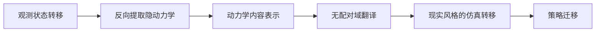

# World Translation：反向动力学提取的 Sim2Real 域翻译

**World Translation** 从观测到的状态转移反向抽取隐含动力学，再以无配对域翻译在仿真与现实间保留动力学内容、迁移域风格。

## 英文缩写速查

| 缩写 | 英文全称 | 简要说明 |
|---|---|---|
| Sim2Real | Simulation to Reality | 仿真策略迁移到现实 |
| POMDP | Partially Observable Markov Decision Process | 隐变量造成部分可观测 |
| BDE | Backward Dynamics Extraction | 从已发生转移反推动力学特征 |
| UDT | Unpaired Domain Translation | 无配对仿真/现实特征翻译 |

## 核心洞见

历史编码器默认隐变量在动作发生前已经留下可辨识痕迹；突发接触、摩擦跳变等并不满足该假设。论文改从结果回看原因，把 deterministic-but-imperfect 的模拟器与 accurate-but-underdetermined 的学习动力学互补起来。

## 方法总览

World Translation 的方法链可拆成两步互补模块：

1. **反向动力学提取（BDE）：** 不再假设隐变量在动作发生前已在历史中留痕，而是从「已经发生」的状态转移 $(s_t, a_t, s_{t+1})$ 回看，反推突发接触、摩擦跳变等难以前向辨识的动力学特征，得到把 deterministic-but-imperfect 模拟器与 accurate-but-underdetermined 学习动力学互补起来的 **动力学内容表示**。
2. **无配对域翻译（UDT）：** 在缺乏仿真–现实配对样本时，保留上一步的动力学内容、仅迁移 domain style，把仿真转移映射成「现实风格」的转移，供策略在更贴近现实的分布上迁移。

两步合起来先把「不可观测动力学」显式抽出、再跨域对齐，针对的是历史不可辨识（如突发接触）导致的 Sim2Real 误差，而非笼统的视觉或参数差异。

## 结果与工程价值

- 在人形、四足和机械臂平台上评估，尤其在历史无法恢复隐变量时优于基线。
- Unitree Go2 实机部署显示策略迁移改善。
- 工程上适合作为 domain randomization / system identification 的补充，而不是替代安全约束和在线校准。

## 与其他工作对比

| 维度 | World Translation | Domain Randomization | System Identification | 前向历史编码器 |
|------|-------------------|----------------------|-----------------------|----------------|
| 核心思路 | 反向提取隐动力学 + 无配对域翻译 | 随机化仿真参数覆盖现实分布 | 拟合物理参数对齐模型 | 从动作前历史前向推断隐变量 |
| 隐变量假设 | 不要求动作前历史可辨识 | 无需辨识，靠覆盖 | 需可辨识参数 | 假设隐变量已在历史留痕 |
| 突发接触/摩擦跳变 | 从结果回看，专门针对 | 靠范围覆盖，未必命中 | 难以在线捕捉 | 失效（历史无痕） |
| 定位 | domain randomization / sysID 的补充 | 基础手段 | 基础手段 | 被指出的失效前提 |
| 平台验证 | 人形/四足/机械臂 + Go2 实机迁移 | 通用 | 通用 | — |

## 局限与开源状态

- 摘要未给统一量化幅度，选型前需精读任务定义与消融。
- **源码运行时序图：不适用。** 截至 2026-07-22，arXiv 未列官方项目页或代码。

## 关联页面

- [Sim2Real](../concepts/sim2real.md)
- [Domain Randomization](../concepts/domain-randomization.md)
- [System Identification](../concepts/system-identification.md)

## 推荐继续阅读

- [论文 PDF](https://arxiv.org/pdf/2607.18154)

## 参考来源

- [World Translation 论文归档](../../sources/papers/world_translation_arxiv_2607_18154.md)
