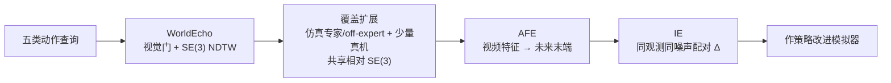

# WorldEcho / WorldSync（动作条件世界模型的动作跟随评测与对齐）

**WorldEcho / WorldSync**（*Do Robotic World Models Really Follow Actions?*，[arXiv:2608.24885](https://arxiv.org/abs/2608.24885)）由 **北京大学** Sixiang Chen / Shanghang Zhang 等与 **北京人形机器人创新中心、纽约大学、电子科技大学、南洋理工大学、香港中文大学** 提出：先用 **WorldEcho** 在比专家演示更广的动作分布上测「生成未来是否真跟命令走」，再用 **WorldSync** 从覆盖、表征接地、介入效应三轴对齐动作条件生成，使世界模型能当策略迭代改进的模拟器。

## 一句话定义

**专家演示上看着像在仿真，不等于任意合法动作都会被忠实生成——WorldEcho 把门控视觉完整性与 \(\mathrm{SE}(3)\) 末端对齐绑在一起测这件事，WorldSync 用更广动作后果 + AFE + 配对介入监督去补。**

## 英文缩写速查

| 缩写 | 英文全称 | 简要说明 |
|------|----------|----------|
| WorldEcho | WorldEcho benchmark | 本文五类动作查询 + 视觉门控 + NDTW 评测协议 |
| WorldSync | WorldSync training recipe | 覆盖扩展 + AFE + IE 的动作跟随对齐配方 |
| AC-WM | Action-Conditioned World Model | 观测/语言/数值动作 → 未来多视角视频 |
| AFE | Action-Forcing Expert | 从视频中间特征解码未来末端轨迹，推理时去掉 |
| IE | Intervention-Effect | 同观测同噪声、不同动作的配对，对齐预测差与真值差 |
| NDTW | Normalized Dynamic Time Warping | 末端位姿轨迹的时间弯曲对齐误差 |
| VLAW | VLA–World-model co-improvement | 文中策略改进协议所改编的迭代框架 |

## 为什么重要

- **把「能当模拟器」从假设变成可测指标：** 策略评估与后训练都依赖 off-expert 查询；只报专家回放会系统低估误差。
- **拆开两种 complementary 失败：** 画面崩了就不能信轨迹；画面好看也可能完全无视命令。单项 FVD / 单项 NDTW 都会漏一边。
- **下游有预算对齐的政策收益：** 同一套交互/生成/训练预算下，WorldSync 相对 Ctrl-World 在仿真倾倒与真机叠杯上多涨一轮成功率。

## 核心信息

| 项 | 内容 |
|----|------|
| **机构** | 北京大学（Peking University）；北京人形机器人创新中心（X-Humanoid）；纽约大学（NYU）；电子科技大学（UESTC）；南洋理工大学（NTU）；香港中文大学（CUHK） |
| **评测床** | RoboTwin 50 任务；策略改进另含真机叠杯 |
| **骨干对照** | Ctrl-World、Cosmos-Predict2.5、Cosmos 3、DreamDojo、Motus、LingBot-VA |
| **开源** | **确认未开源**（截至 2026-08-27 无项目页、无 GitHub、正文未承诺发布） |

## 核心原理（方法）

### WorldEcho：五类查询 + 完整性门控

从同一初始状态在 RoboTwin 执行被查询动作，得到动作特异真值视频。查询按对专家联合分布的依赖递减：

| 类别 | 测什么 |
|------|--------|
| Demonstrated | 专家回放，ID 基线 |
| Cross-State Replay | 把别的状态上的专家动作接到当前状态，测是否把「专家像」当成成功 |
| Local Perturbation | 专家流形附近的有界扰动 |
| Policy Rollout | 学习策略产生的偏离（评估/改进时真正会遇到的） |
| Feasible-Space Sampling | 更广可行空间，最少依赖专家行为 |

视觉门 \(G_{\mathrm{vis}}\) 需同时过：画质、运动平滑、末端可见、手臂完整。轨迹用 AnyPos 式提取器 \(\Phi\) 恢复左右臂 \(\mathrm{SE}(3)\)，再算 pose-aware NDTW。官方聚合：门通过用 NDTW，否则固定惩罚 \(\kappa\)；先任务内平均再跨任务宏平均。

### WorldSync：三轴对齐

视频骨干为 flow matching。AFE 不读动作、不写回像素，只通过特征反传；IE 把「换动作后预测该怎么变」写成显式损失。

## 工程实践

| 项 | 说明 |
|----|------|
| 源码运行时序图 | **不适用**（确认未开源，无训练/评测入口） |
| 主指标 | 完整性门控误差；同时报 raw NDTW 与视觉通过率 |
| 覆盖扩展 | 六套骨干在 Expanded 设定下轨迹都变好；视觉通过率是否上升取决于骨干 |
| 消融读法 | IE 是轨迹主杠杆；AFE 单独不降动作误差，和 IE 一起把门控误差压到最低 |

## 实验与评测

- **诊断：** 六套专家训模型 off-expert 门控误差升 **0.029–0.099 m**；raw NDTW 升 **0.010–0.043 m**，视觉失败率升 **6.3–28.1 pt**。
- **主表（50 任务宏平均）：** WorldSync 门控 **0.0661**、视觉通过 **84.51%**。Expanded Ctrl-World 门控 0.0670；Motus Expanded 视觉 84.34%。Cosmos-Predict2.5 Expanded raw NDTW **0.0127** 低于 WorldSync **0.0223**——领先来自门控平衡，不是三项全赢。
- **注意协议：** 基线 Expert 20k / Expanded 40k 更新，WorldSync **60k**，不是同步数消融。
- **策略改进（匹配预算两轮）：** RoboTwin 倾倒 **~52%→65%**（Ctrl-World 约 56–57%）；真机叠杯 **48%→68%** vs Ctrl-World **56%**。

## 结论

**WorldEcho 真正改变读法的是「专家回放好看 ≠ 能当 off-expert 模拟器」；WorldSync 的可迁移部分是覆盖 + 介入效应，而不是再堆一个视觉分数。**

1. **评测要同时看门控与轨迹：** 只报 NDTW 会放过视觉崩；只报画质会放过动作无视。
2. **off-expert 四类不是装饰：** 策略改进查询的就是 Policy Rollout / 可行空间，不是 Demonstrated。
3. **IE > AFE 作为轨迹杠杆：** AFE 的价值是和 IE 一起折中视觉有效性。
4. **下游只信匹配预算的政策增益：** 仿真 +13 pt、真机 +20 pt 相对 Ctrl-World 的 +5 / +8。
5. **不能复现：** 无代码无权重；数字按论文自报，选型时当诊断框架而不是可跑榜。

## 与其他工作对比

| 对比轴 | WorldEcho / WorldSync | [Ctrl-World](./paper-ctrl-world.md) | [SC3-Eval](./paper-sc3-eval.md) | [GigaWorld-1](./paper-gigaworld-1-policy-evaluation.md) |
|--------|------------------------|--------------------------------------|----------------------------------|--------------------------------------------------------|
| **主问题** | 动作跟随（含 off-expert） | 多视角可控闭环 + 合成 SFT | 自一致防漂移作策略评估器 | 长时序动作忠实 vs 短时视觉逼真 |
| **真值** | 仿真回放 \(\mathrm{SE}(3)\) | 真机成功率相关 / 合成轨迹 | 真机 SR 相关 + MMRV | WMBench / 评估器研究 |
| **失败模式** | 视觉崩 vs 动作无视 | 接触幻觉 / 长时漂移 | 自回归漂移、视角分裂 | 视觉高质量但动作不忠 |
| **开源** | **未开源** | **已开源** | **未开源** | 以项目页为准 |

相对 MiraBench（失败扰动、乐观偏差）：WorldEcho 强调连续数值动作上的末端 \(\mathrm{SE}(3)\) 对齐，而不是任务级失败判断。

## 局限与风险

- **确认未开源：** 无法复核 \(\kappa\)、视觉阈值或 60k vs 40k 更新是否公平。
- **评测绑在 RoboTwin + 末端提取器：** 开世界、长程接触、跨本体仍是论文自承缺口。
- **WorldSync 不是新骨干：** 配方可迁到其他 AC-WM，但本文实现细节不可跑。
- **门控误差领先很窄：** 0.066 vs 0.067，读「SOTA 碾压」会过读。

## 关联页面

- [Generative World Models](../methods/generative-world-models.md) — AC-WM 作策略模拟器
- [评测选型闭环](../queries/embodied-eval-benchmark-selection-loop.md) — ② 层动作忠实
- [动作后果分类 04](../overview/wm-action-consequence-category-04-eval-posttrain.md) — 评测→后训练
- [Ctrl-World](./paper-ctrl-world.md) — 主对照与策略改进基线
- [WALL-SS](./paper-wall-ss.md) — next-scale AR；WorldArena 动作跟随 + 虚实成功率，不报 SE(3) NDTW
- [SC3-Eval](./paper-sc3-eval.md) — 自一致评估器，不测 off-expert SE(3)
- [GigaWorld-1](./paper-gigaworld-1-policy-evaluation.md) — 「动作忠实 > 视觉逼真」
- [具身评测基准枢纽](../overview/hub-embodied-eval-benchmark.md)
- [Manipulation](../tasks/manipulation.md)

## 参考来源

- [WorldEcho / WorldSync 论文摘录](../../sources/papers/worldecho_worldsync_arxiv_2608_24885.md)

## 推荐继续阅读

- Chen et al., *Do Robotic World Models Really Follow Actions?* — <https://arxiv.org/abs/2608.24885>
- 对照已开源基线：[Ctrl-World](https://github.com/Robert-gyj/Ctrl-World)
- Yang et al., *MiraBench* — <https://arxiv.org/abs/2605.29360>（失败扰动，非本页 \(\mathrm{SE}(3)\) 协议）
