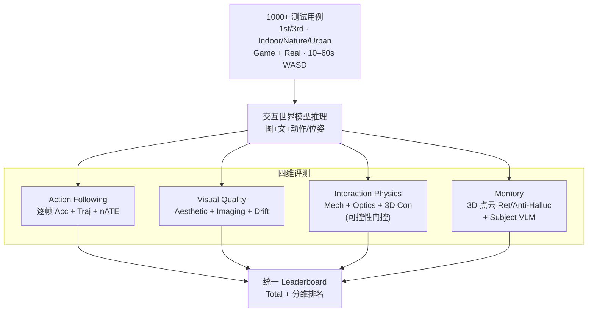
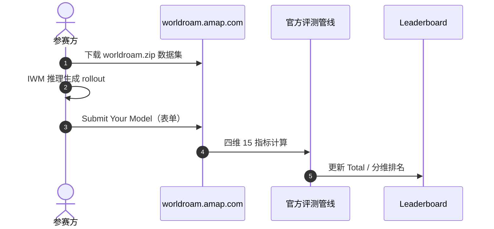

# WorldRoamBench：交互世界模型长程稳定性开放基准

**WorldRoamBench**（*An Open-World Benchmark for Long-Horizon Stability of Interactive World Models*；[arXiv:2606.31672](https://arxiv.org/abs/2606.31672)；[项目页 / Leaderboard](https://worldroam.amap.com/)）由 **高德地图视觉技术实验室（Amap CV Lab）** 与 **南京大学、清华大学、北京大学** 联合提出：面向 **交互世界模型（IWM）** 的 **开放域、长时程（10–60s）** 稳定性评测，补齐既有基准在 **逐帧动作精度、视觉漂移、交互物理、轨迹感知记忆** 上的缺口。

## 一句话定义

**用 1000+ 第一/第三人称、室内/自然/城市、游戏+真实场景用例，在 Action / Vision / Physics / Memory 四维 15 指标上评测交互世界模型的长程稳定性，并提供可提交的在线 Leaderboard。**

## 英文缩写速查

| 缩写 | 英文全称 | 简要说明 |
|------|----------|----------|
| IWM | Interactive World Model | 用户动作/指令驱动的可交互世界生成模型 |
| WM | World Model | 预测环境动态的世界模型 |
| Act Acc | Action Accuracy | 逐帧精确动作匹配率 |
| TrajScore | Trajectory Score | 轨迹形状对齐分（可掩盖逐步错误） |
| nATE | normalized Absolute Trajectory Error | 归一化平移/旋转轨迹误差 |
| VLM | Vision-Language Model | 主体记忆评测中的视觉语言推理 |

## 为什么重要

- **轨迹分不够：** 项目页与论文均强调 TrajScore >0.85 的模型可 **逐帧 Act Acc <65%**——延迟响应、短停、过度补偿会在几何上抵消。
- **视觉与动作解耦：** 高美学/成像分 **不预测** 动作跟随；纹理好看 ≠ 听键盘。
- **物理 vs 跟随权衡：** 更守碰撞/地形约束的模型往往 **偏离** 规定轨迹——物理合理性与指令忠实度冲突。
- **记忆评测需解耦 action：** 对称帧对会把「没走到转折点」误判为遗忘；**3D 点云重建** 分离场景记忆与动作误差。
- **活榜 + 打榜入口：** [worldroam.amap.com](https://worldroam.amap.com/#leaderboard) 支持提交模型；[ABot-World-0](./paper-abot-world-0.md) 等已引用本榜数字。

## 核心信息

| 项 | 内容 |
|----|------|
| **机构** | 高德地图视觉技术实验室（Amap CV Lab）；南京大学（NJU）；清华大学（THU）；北京大学（PKU） |
| **规模** | **1000+** 测试用例；WASD 连续交互 **10–60s**；第一/第三人称；Indoor / Nature / Urban |
| **评测模型** | 10+（含 Genie 3、HappyOyster、LingBot-World(-V2)、HY-World 1.5、Matrix-Game、SANA-WM、Lyra 2.0、minWM 等） |
| **开源** | **部分开源** — Leaderboard + 数据集 ZIP **已开放**；GitHub 评测代码 **待发布**（站点标 coming soon） |
| **打榜** | <https://worldroam.amap.com/> → Submit Your Model |

## 流程总览

## 方法（评测设计）

### 1）Action Following（5 指标）

- **创新：** **逐帧** action metric，绕过跨模型语义尺度差异，暴露轨迹级指标隐藏的失败。
- **指标：** Act Acc、Part Acc、TrajScore、nATE t/r（均归一化到 0–100 展示）。

### 2）Visual Quality（4 指标）

- **创新：** **分段 drift** — 在全 rollout 滑窗内测相对峰值下降，捕捉 **非单调中段崩塌**（非仅首尾对比）。
- **指标：** Aesthetic（LAION）、Imaging（MUSIQ）、Drift A / Drift I。

### 3）Interaction Physics（3 指标）

- **创新：** **可控性门控** — 仅在动作被执行的前提下评物理合理性。
- **指标：** Mechanics（碰撞/穿模/地形/重力/形变）、Optics（反射/阴影）、3D Consistency。

### 4）Memory（3 指标）

- **创新：** **与 action following 解耦** — 场景记忆用过渡局部 **3D 点云重建**；主体记忆用 **SAM2 + VLM**。
- **指标：** Retention、Anti-Hallucination、Subject consistency。

## 评测（榜单读法）

**Overall 前三（站点截至 2026-08-20）：**

| Rank | Model | Total | 备注 |
|------|-------|-------|------|
| 1 | Genie 3 | 70.32 | 闭源 |
| 2 | Lyra 2.0 | 69.61 | 开源 |
| 3 | HappyOyster | 68.53 | 闭源 |

**读榜注意：**

- 分场景/视角/可控性子表（Real vs Game、1st vs 3rd、Ctrl Rate 等）排名可显著_shuffle_。
- [ABot-World-0](./paper-abot-world-0.md) 报告 5B 档 Strict Acc. **0.5266**（次优 HappyOyster **0.5317**），Memory **偏弱**。
- 论文结论：**无一模型** 在四维上同时可靠；即使最佳亦仅中等总分。

## 对比（与相邻基准）

| 基准 | 逐帧 Action | Visual Drift | Interaction Physics | Traj.-Aware Memory | 时长 |
|------|-------------|--------------|---------------------|-------------------|------|
| WildWorld | ✕ | ✕ | ✕ | ✕ | ~5–10s |
| iWorld-Bench | ✕ | ✕ | ✕ | Revisit only | ~5–10s |
| WBench | ✕ | ✕ | ✔ | ✔ | ~5–10s |
| WorldMark | ✕ | ✕ | ✕ | ✕ | 20–60s |
| **WorldRoamBench** | **✔** | **✔** | **✔** | **✔** | **10–60s** |

与 [WorldScore](./paper-worldscore.md)（静态/动态世界 **生成** 布局可控）互补：WorldRoamBench 锚定 **键盘/动作驱动的交互 rollout 稳定性**；与 [HarnessEval-W](./paper-harnesseval-w.md)（开放交互 **意图/过渡** 评测）可并列读。

## 工程实践

| 项 | 内容 |
|----|------|
| 打榜入口 | <https://worldroam.amap.com/> → Submit Your Model |
| 数据集 | `https://amap-cvlab.oss-cn-zhangjiakou.aliyuncs.com/worldroambench/worldroam.zip`（约 2.5GB） |
| 评测代码 | **待发布**（GitHub coming soon）；复现需盯项目页更新 |
| 自测 | 先本地跑通模型推理 → 按站点提交协议上传 → Leaderboard 更新 |

## 源码运行时序图

**不适用（评测代码 GitHub 待发布）。** 在线打榜流程：

## 局限与风险

- **代码未全开源：** 截至入库日仅数据+活榜；自研指标细节以论文+站点为准，本地复现评测受限。
- **交互协议绑定 WASD：** 键盘离散动作；连续相机/手柄轨迹模型需额外对齐。
- **闭源模型占优：** 榜单头部多闭源（Genie 3、HappyOyster）；开源模型需分表读 Lyra 2.0 等。
- **不等于机器人策略收益：** 像素交互稳定性 **不直接** 推出操纵/导航策略提升（见 [hub-embodied-eval-benchmark](../overview/hub-embodied-eval-benchmark.md) 分层）。

## 结论

**WorldRoamBench 把交互世界模型评测从「轨迹看起来像」推进到「长程四维都稳」——逐帧动作、视觉漂移、门控物理、解耦记忆缺一不可。**

1. **打榜前先看子维** — Total 高可能掩盖 Action 或 Physics 短板；读 Act Acc 与 Drift。
2. **TrajScore 不能单独信** — 与逐帧 Acc 对照；ABot-World-0 类宣传需两列并报。
3. **Memory 用 3D 重建协议** — 勿用简单帧对帧 revisit 替代。
4. **数据已下、代码待更** — 可先跑推理对齐数据格式；指标实现等 GitHub。
5. **与 HarnessEval-W / WorldScore 分工** — 本榜锚定 **长程交互稳定性**；意图评测与静态世界生成分读其他榜。
6. **榜单日期** — 站点标注截至 2026-08-20；引用排名以 Leaderboard 实时页为准。

## 与其他页面的关系

- 评测链：[hub-embodied-eval-benchmark.md](../overview/hub-embodied-eval-benchmark.md)
- 已引用模型：[paper-abot-world-0.md](./paper-abot-world-0.md)、[paper-sa-2607-07534-infinite-worlds-with-versatile-interactions-ling.md](./paper-sa-2607-07534-infinite-worlds-with-versatile-interactions-ling.md)
- 相邻基准：[paper-harnesseval-w.md](./paper-harnesseval-w.md)、[paper-worldscore.md](./paper-worldscore.md)、[ewmbench.md](./ewmbench.md)
- 方法背景：[generative-world-models.md](../methods/generative-world-models.md)

## 参考来源

- [worldroambench_arxiv_2606_31672.md](../../sources/papers/worldroambench_arxiv_2606_31672.md)
- [worldroambench.md](../../sources/sites/worldroambench.md)

## 推荐继续阅读

- 在线 Leaderboard：<https://worldroam.amap.com/#leaderboard>
- 打榜 / 项目页：<https://worldroam.amap.com/>
- 论文 PDF：<https://arxiv.org/pdf/2606.31672>
- [ABot-World-0](./paper-abot-world-0.md) — 同机构交互世界模型与 WorldRoamBench 数字对照
