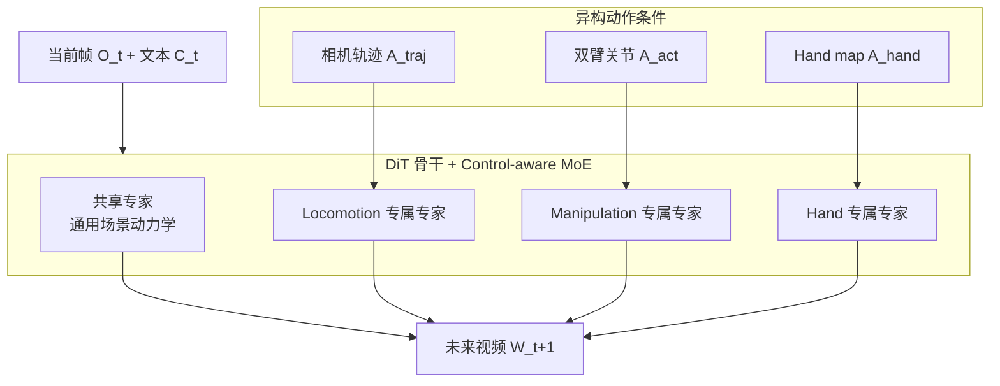

# Worldscape-MoE（Unified Mixture-of-Experts World Model · arXiv:2607.03964）

**Worldscape-MoE**（*Worldscape-MoE: A Unified Mixture-of-Experts World Model for Scalable Heterogeneous Action Control*，[arXiv:2607.03964](https://arxiv.org/abs/2607.03964)，清华大学 + Manifold AI，[worldscape-moe.com](https://worldscape-moe.com)）把 **相机轨迹、双臂关节动作、第一视角 hand-joint 控制** 统一进 **同一 DiT 世界模型**：**共享专家** 积累跨模态物理规律，**控制专属专家** 保留各动作接口精度，**渐进 MoE 微调** 可持续接入新模态而不重建全模型。

## 一句话定义

**异构动作只是同一物理世界的不同接口：MoE 把「世界规律共享」与「控制语义专属」因子化，把碎片化监督变成可扩展训练资源。**

## 英文缩写速查

| 缩写 | 英文全称 | 简要说明 |
|------|----------|----------|
| MoE | Mixture of Experts | 共享专家 + 模态专属专家稀疏激活 |
| DiT | Diffusion Transformer | 视频世界模型扩散骨干 |
| WM | World Model | 动作条件未来视频生成器 |
| EWM | Embodied World Model Score | WorldArena 16 维指标算术均值 |
| $A_{\mathrm{traj}}$ | Camera trajectory | 相机运动序列条件 |
| $A_{\mathrm{act}}$ | Robot action | 双臂 $17\times14$ 关节控制张量 |
| $A_{\mathrm{hand}}$ | Hand action map | 稠密 hand-joint 动作图序列 |

## 为什么重要

- **回应策展文「跨本体迁移」开放问题：** 同一任务换机械臂/手型/控制频率时，**共享规律 vs 专属接口** 如何拆分——Worldscape-MoE 给出 **可扩展 MoE 架构 + 渐进训练** 的一种答案。
- **打破「按控制模态孤岛化」的 scaling 瓶颈：** Genie / Cosmos-Predict / Hand2World 等各自为政；本文论证 **异构监督可相互增强而非干扰**（locomotion + manipulation + egocentric hand **同训增益**）。
- **与 [GigaWorld-1](./paper-gigaworld-1-policy-evaluation.md) 同属规模化 WM 基础设施：** 前者偏 **异构动作可控生成**，后者偏 **策略评估 faithful rollout**；共同支撑「世界模型作研发基础设施」叙事。
- **专家路由可解释：** 共享专家承担 **~69.5%** gate 负载；manipulation 专属专家 **~48%**，hand **~36%**，locomotion **~21%**——符合「接触/手物交互更依赖专属接口」直觉。

## 核心结构与方法

| 组件 | 方法要点 |
|------|----------|
| **异构动作形式化** | $W_{t+1}=f_\theta(O_t, C_t, A_t)$；$A_t \in \{A_{\mathrm{traj}}, A_{\mathrm{hand}}, A_{\mathrm{act}}, A_{\mathrm{other}}\}$ |
| **模态感知 control injection** | 轨迹 / hand-map / 低维关节各自 **匹配结构的注入路径** |
| **共享专家** | 跨控制积累 **物体持久性、接触规律、时序连贯** 等世界动力学 |
| **控制专属专家** | 保留各模态 **动作语义精度**（faithfulness） |
| **Worldscape-MoE Tuning** | 分阶段引入新分支/专家；新专家从 **当前共享专家初始化**；共享参数 **保守学习率** |
| **自回归长程** | 预测片段末帧 $O_{t+1}$ 回灌为下一步初帧 |

### 异构控制 MoE 架构

### 四个研究问题（RQ）与方法对应

| RQ | 方法验证结论 |
|----|--------------|
| RQ1 多控制不互相伤害 | 异构训练 **提升而非削弱** 单模态指标 |
| RQ2 MoE 是否真 specialization | 路由统计显示 **共享/专属分工**，非纯加容量 |
| RQ3 新模态可扩展性 | 加新控制 **短暂 locomotion 退化后恢复** |
| RQ4 OOD 与 loco-manip | **跨域场景与耦合 loco-manip** 定性可行 |

## 实验要点（索引级）

| 轴 | 报告口径（以论文为准） |
|----|------------------------|
| **Locomotion（iWorld-Bench 500 cases）** | 综合 **0.7556**（最强 baseline VideoX-Fun-Wan **0.7443**）；motion smoothness **0.9941** |
| **Manipulation（WorldArena EWM）** | **62.84**（w/o MoE **61.88**；CtrlWorld **59.98**） |
| **Hand motion（EgoDex 100 samples）** | FID-VID **3.80** / FVD **110.94** / FID **5.78** / Image Quality **0.7325**（均优于 w/o MoE） |
| **MoE vs dense mixed** | dense 混训 **跨模态干扰**；MoE **三模态一致提升** |
| **机构** | 清华大学、Manifold AI |
| **项目** | [worldscape-moe.com](https://worldscape-moe.com) |

## 与其他工作对比

| 工作 | 关系 |
|------|------|
| **[GigaWorld-1](./paper-gigaworld-1-policy-evaluation.md)** | 同 **大规模 WM 基础设施**；GigaWorld 偏 **评估 faithful**；本文偏 **异构控制生成** |
| **Genie / Matrix-Game / HY-World** | **仅 camera/nav 控制岛** |
| **Ctrl-World / Cosmos-Predict** | **仅 robot action 岛** |
| **Hand2World / Generated Reality** | **仅 egocentric hand 岛** |
| **DSWAM / DynaWM** | **下游 WAM 策略**；Worldscape 偏 **上游可控视频 WM** |

## 常见误区或局限

- **误区：** 认为 MoE 只是 **更大 DiT**；消融 w/o MoE 仍强，但 **异构混训干扰** 说明 **结构因子化** 才是核心。
- **误区：** 期待 **单一模型直接输出机器人策略**；本文是 **视频 WM**，策略需另接 IDM/VLA。
- **局限：** 新模态接入仍有 **短暂能力回撤**；真机 closed-loop **策略级** 验证有限；距离策展文所述 **通用跨本体接口** 仍远。

## 与其他页面的关系

- [wm-action-consequence-category-01-wam-action-prediction](../overview/wm-action-consequence-category-01-wam-action-prediction.md) — 异构动作 WM 基础设施
- [动作后果技术地图](../overview/robot-world-models-action-consequence-technology-map.md) — 跨本体开放问题索引
- [World Action Models](../concepts/world-action-models.md) — 下游 WAM 与上游 WM 分层
- [Generative World Models](../methods/generative-world-models.md) — DiT 视频 WM 技术栈
- [GigaWorld-1](./paper-gigaworld-1-policy-evaluation.md) — 规模化评估对照

## 推荐继续阅读

- [Worldscape-MoE 论文（arXiv:2607.03964）](https://arxiv.org/abs/2607.03964)
- [Worldscape-MoE 项目页](https://worldscape-moe.com)
- [GigaWorld-1 论文实体](./paper-gigaworld-1-policy-evaluation.md)
- [WorldArena benchmark](https://arxiv.org/abs/2607.03964) — EWM 评测协议（见论文）

## 参考来源

- [具身智能研究室 · 世界模型动作后果专题导读（2026-07）](../../sources/blogs/wechat_embodied_ai_lab_robot_world_models_action_consequence_2026.md)
- [Worldscape-MoE 论文（arXiv:2607.03964）](https://arxiv.org/abs/2607.03964)
