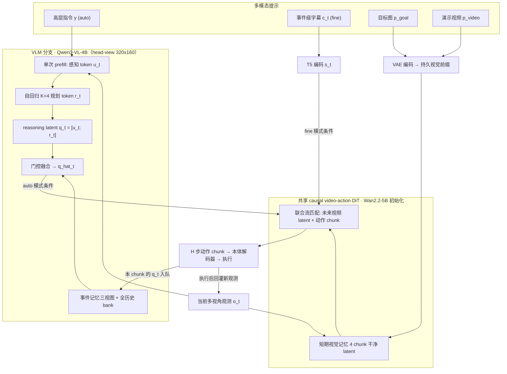
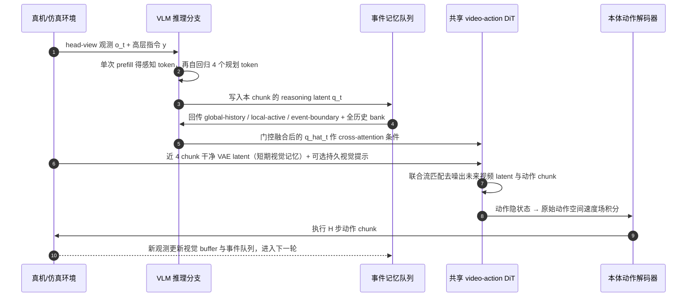

# WorldScape Policy 2.0（Reasoning-Augmented Memory WAM · arXiv:2607.18840）

**WorldScape Policy 2.0**（*Empowering Steerable World Action Modeling with Reasoning-Augmented Memory*，[arXiv:2607.18840](https://arxiv.org/abs/2607.18840)，Manifold AI + 清华大学 + 上海交通大学，[项目页](https://manifoldai-research.github.io/WorldScape-Policy/)）把 **World Action Model 的「历史」拆成两条互不混用的通路**：VLM 分支维护 **事件级语义记忆**（推理任务进度、产出隐式子目标），causal DiT 分支维护 **帧级视觉记忆**（保留接触与物体运动的局部动力学）；再用 **semantic forcing** 把细粒度字幕的语义搬进自主规划的隐通路，使同一个模型既能从高层指令自主规划，也能被文本 / 目标图 / 演示视频直接驱动。

## 一句话定义

**长程可控性的瓶颈不是「记多久」而是「按什么组织」：事件记忆负责回答「做到哪一步」，视觉记忆负责回答「现在正在怎么动」，把两者塞进同一条历史缓存就会互相稀释。**

## 英文缩写速查

| 缩写 | 英文全称 | 简要说明 |
|------|----------|----------|
| WAM | World Action Model | 联合建模未来观测与可执行动作的具身策略族 |
| DiT | Diffusion Transformer | 本文视频–动作共享骨干（由 Wan2.2-5B 初始化） |
| VLM | Vision-Language Model | 推理分支骨干（Qwen3-VL-4B），产出感知与规划 token |
| STM | Short-Term Memory | 短期**视觉**记忆：近 4 个 chunk 干净 VAE latent 作 causal prefill |
| LTM | Long-Term Memory | 长短期**事件**记忆：默认 8 个历史 chunk 的三视图检索 |
| LSR | Latent Subgoal Reasoning | 隐式子目标推理，检索历史增强规划 token |
| SF | Semantic Forcing | 用 T5 事件字幕嵌入做 stop-grad 语义靶对齐规划隐状态 |
| C2R | Clean-to-Randomized | 只用 clean 演示训练、在 clean+randomized 上取平均的 OOD 协议 |
| ICL | In-Context Learning | 由目标图 / 演示视频驱动的上下文适配 |

## 为什么重要

- **给「WAM 的记忆该长什么样」一个可证伪的分工假设：** 此前路线是静态观测（无记忆）、滑窗（短期视觉）、全历史视觉检索（如 MemoryWAM）。本文主张**语义与像素分层**，并用消融支持：三件套齐备时 randomized 成功率 **17.22% → 26.03%**，增益的大头在 OOD 而非干净场景。
- **把「可控接口」从纯文本扩到多模态并在数据侧兑现：** 目标图（first-view / third-view）与演示视频（human→robot / robot→robot）不是推理时的临时拼接，而是在 **ManipEvent-5M** 里成对标注、Stage 1 就作为可互换控制条件预训练——这是真机上跨本体迁移从 **10–20%** 抬到 **60–70%** 的直接来源。
- **事件级监督替代 episode 级指令：** 同一 episode 内所有片段共享一条指令是具身数据的普遍弱点；本文用「先定边界、再定语义」的两段式标注把 4.89M 段绑到各自的原子动作上，Stage-1 消融显示这是三阶段中增益最大的一环。
- **同团队上下游拼图：** 与 [Worldscape-MoE](./paper-worldscape-moe-heterogeneous-action.md)（上游异构动作可控视频 WM，不直出策略）构成「可控生成 → 可控策略」的两级，可对照看 Manifold AI 的技术路线。

## 核心结构与方法

建模对象：\(p_\theta\big(A^{(e)}_t,\ z_{t+1:t+H}\ \big|\ o_t,\ a_{<t},\ \mathcal{P}^\mu_t,\ \mathcal{M}_t\big)\)，其中 \(\mathcal{M}_t=(\mathcal{Q}_t,\mathcal{Z}^{vis}_t)\) 为 **事件记忆队列 + 近期视觉 latent buffer**。

| 组件 | 方法要点 |
|------|----------|
| **统一动作表示** | 单臂 10D = chunk 首帧相对位移 \(\Delta p\) + 相对旋转 6D + **绝对**夹爪；双臂 \(d_a=20\) |
| **本体适配器** | 每本体独立 action encoder/decoder，DiT 骨干共享；**流匹配在原始动作空间**做，适配器只当 I/O 接口 |
| **两种语言模式** | `fine`：T5 编码事件字幕直接 cross-attention；`auto`：VLM 输出 memory-enhanced token。**二选一，不拼接** |
| **短期视觉记忆（STM）** | \(\mathcal{Z}^{vis}_t=z^{obs}_{t-S_v:t}\) 干净 VAE latent 作 DiT causal prefill；默认 **4 个 chunk** |
| **持久视觉上下文** | 目标图 / 演示视频 latent 作 **rollout 全程不滑动** 的前缀，可随时 ON/OFF |
| **长短期事件记忆（LTM）** | 历史 chunk 感知 token 压成 gist、规划 token 全留 → 紧凑 bank \(H_t\)；再造三视图（下表）；默认留 **8 个历史 chunk** |
| **检索与门控** | \(B_t=\mathrm{cat}(m^{gh},m^{la},m^{eb},H_t)\)，\(q_t\) 作 Query 做 cross-attention 得 \(\tilde m_t\)；逐 token 门控 \(\hat q_t=q_t+\alpha\,\sigma(W_g[q_t;\tilde m_t]+b_g)\odot\tilde m_t\) |
| **Semantic Forcing（SF）** | \(\mathcal{L}_{sem}=1-\tilde s_t^\top\tilde q_t\)，T5 靶 **stop-gradient**（防塌缩），只训投影器 \(\phi_q\)；\(\lambda_s=0.001\) |
| **总损失** | \(\mathcal{L}=\mathcal{L}_{act}+\lambda_w\mathcal{L}_{world}+\lambda_s\mathcal{L}_{sem}\)（两个流匹配 + 语义对齐），端到端，无需额外提示/记忆标签 |

### 事件记忆三视图

| 视图 | 构造 | 承担的问题 |
|------|------|-----------|
| **Global-History** \(m^{gh}\) | \(P_{gh}(\mathrm{Expand}(F_{gh}([e_y;\mathrm{Mean}(H_t)])))\) | 任务意图 + 全轨迹池化 → 整体进度 |
| **Local-Active** \(m^{la}\) | 最近 \(S_e\) 个已完成 chunk，保 **全 token anchor** | 当前活跃事件的细节 |
| **Event-Boundary** \(m^{eb}\) | \(d_j=1-\cos(\bar q_j,\bar q_{j-1})\)，`TopKΔ` 取至多 \(S_b\) 个（带最小间隔 \(\Delta\)），保 **全 token** | 稀疏保留子任务起止/切换，**无需在线边界标注** |

> 关键工程细节：检索时把 **紧凑全历史 bank \(H_t\) 一并拼进 Key/Value**，因此三视图是「加权重」而非「做筛选」，不会丢掉非边界证据。

### 流程总览

### 三阶段课程

| 阶段 | 训练内容 | 目的 |
|------|----------|------|
| **Stage 1** 事件接地多模态预训练 | ManipEvent-5M；细粒度字幕 / 目标图 / 演示视频作**可互换**控制条件；STM 已启用，**无** VLM 事件记忆 | 建立细粒度语言–视频–动作接地与可控生成 |
| **Stage 2** 记忆感知 mid-training | 引入 VLM 规划分支与 LTM；输入只给高层指令，事件字幕仅作 \(\mathcal{L}_{sem}\) 训练靶 | 把 Stage 1 的**显式**语义迁移进**自主规划**隐通路 |
| **Stage 3** 下游交互式后训练 | 按任务所需模式适配下游本体与动作分布 | 保持统一接口下的任务特化 |

**实现关键值：** 标注用 Qwen3-VL-32B，推理骨干用 Qwen3-VL-4B（只吃 head-view，resize 到 320×160，\(K=4\) 规划 token）；三路相机拼成单张视觉画布；video-action token 间双向注意力，对干净/历史 token 保持因果；预训练 bs 768 / lr 5e-4，后训练 bs 128 / lr 6e-5 / 50K steps。

## ManipEvent-5M：数据配比才是取舍所在

合计 **512.14M 帧 / 4982.81 h / 744.43K episode / 4.89M 事件段**（平均 6.6 段/episode）。

| 来源 | 事件段（M） | 训练占比 | 读点 |
|------|------------:|---------:|------|
| Self-Collected PiPER（真机自采） | 0.56 | **45.0%** | 段数只占 11%，却吃掉近一半配比——真机自采被显著上采样 |
| AgiBot World | 1.16 | 32.53% | 最大公开真机来源（285.56M 帧） |
| EgoDex（ego 人视频） | **2.96** | **3.0%** | 贡献约 **61%** 的事件段，配比却极低 |
| Self-Collected UMI | 0.06 | 8.0% | 无机器人数据，主要服务 human→robot 视频提示配对 |
| RoboTwin 2.0 / LIBERO | 0.145 / 0.005 | 3.94% / 0.06% | 仿真 |
| RoboMIND / RoboCOIN / DROID | — | 0.75% / 3.65% / 3.07% | **完全没有事件级分解**（单段比例 100%） |

标注管线四段式（Qwen3-VL）：**两段式标注**（先由本体归一化速度、夹爪状态、端点定边界与 move/grasp/release/idle 粗原语，再由 VLM 开放词表重标语义，解耦「何时变」与「变的是什么」）→ **层级帧采样**（episode 级 ≤16 帧产出**事后**任务描述而非照抄原指令；事件级 ≤12 帧产出单动作 `step_text`）→ **具身提示约束**（强制写明执行末端、目标物、初末状态、接触模式、失败/恢复）→ **多视角冲突消解**（`LEFT_GRIPPER → RIGHT_GRIPPER → HEAD`，**冲突时优先夹爪视角**；坏字幕局部替换不丢整条轨迹）。

人手数据在预训练前 **重定向为机器人夹爪位姿与开合**，进入同一 position–rotation–gripper 语义，本体差异交给专属 encoder/decoder。

## 源码运行时序图

**不适用（截至 2026-08-03）。** 论文与项目页给出的 [GitHub 仓库](https://github.com/manifoldai-research/WorldScape-Policy) 只有 `README.md` 与 `.gitignore`（*"Code is coming soon"*），[HF 模型卡](https://huggingface.co/manifoldai-research/WorldScape-Policy-2) 也无权重文件（*"Model is coming soon"*，声明 Apache-2.0），**无任何可辨识的训练 / 推理 / 部署入口**，无法按 [schema 步骤 5](../../schema/ingest-workflow.md) 要求对齐 `sources/repos/` 中的目录或脚本名。核查明细见 [`sources/repos/worldscape-policy.md`](../../sources/repos/worldscape-policy.md)；代码发布后应补本节并与实际入口逐一核对。

下图仅按**论文正文描述**还原自主规划模式的闭环时序，节点为论文中的模块名而非仓库路径，**不可当作复现入口**：

## 评测要点

**RoboTwin 2.0 标准协议**（50 任务 × 100 trial，所有方法均用 clean+randomized 数据微调 50K 步）：

| 类别 | 模型 | Clean | Randomized | Average |
|------|------|------:|-----------:|--------:|
| VLA | \(\pi_0\) | 65.9% | 58.4% | 62.2% |
| VLA | \(\pi_{0.5}\) | 82.7% | 76.8% | 79.8% |
| VLA | HoloBrain-0-QW | 91.9% | 92.3% | 92.1% |
| WAM | Fast-WAM | 91.9% | 91.8% | 91.9% |
| WAM | LingBot-VA 2.0 | 93.8% | 93.4% | 93.6% |
| WAM | Abot-M0.5 | 94.0% | **94.2%** | 94.1% |
| WAM | WorldScape Policy **1.0** | 93.2% | 91.7% | 92.5% |
| WAM | **WorldScape Policy 2.0** | **94.3%** | **94.2%** | **94.3%** |

**C2R（只用 clean 演示训练，在 clean+randomized 两种评测上取平均）：** \(\pi_0\) **31.4** / \(\pi_{0.5}\) **37.5** / Fast-WAM **39.1** / **本文 47.9**（+16.5 / +10.4 / **+8.8**）。

**真机（AgileX 双臂 PiPER，5 任务，各 20 trial）：**

| 能力 | 任务 / 提示 | \(\pi_{0.5}\) | [DreamZero](./paper-notebook-dreamzero-world-action-models-are-zero-shot-poli.md) | 本文 |
|------|-------------|-----:|-----:|-----:|
| 长程自主规划 | 叠衣服 / 折箱子（全局指令） | 60% / 65% | 45% / 55% | **75% / 75%** |
| 记忆依赖视觉推理 | shell game（演示视频） | 30% | 50% | **75%** |
| 跨本体技能迁移 | 叠积木（目标图 / 演示视频） | 10% / 20% | 20% / 20% | **60% / 70%** |
| 序贯细粒度控制 | 清桌完整序列（连续字幕） | 70% | 60% | **80%** |

**细粒度指令跟随（清桌，逐条指令各 20 trial）：** In-domain 均值 **86.7%**（\(\pi_{0.5}\) 83.3 / DreamZero 73.3）；**OOD 均值 60.0%**（43.3 / 30.0）；总均值 **73.3%**（63.3 / 51.7）。

**消融（RoboTwin 2.0 官方 clean-only 划分，即 C2R 协议；绝对值不可与上表直接比）：**

| 变体 | Clean | Randomized | Average |
|------|------:|-----------:|--------:|
| 无记忆 | 64.60% | 17.22% | 40.91% |
| +STM | 66.92% | 22.42% | 44.67% |
| +STM+LTM | 68.49% | 24.01% | 46.25% |
| +STM+LTM+LSR | **69.74%** | **26.03%** | **47.89%** |
| 从零训（无 Stage-1/2/SF） | 65.67% | 20.71% | 43.19% |
| 仅 Stage-1 | 67.90% | 25.36% | 46.63% |
| Stage-1+2 无 SF | 68.95% | 25.64% | 47.30% |

## 结论

**这篇论文真正证明的不是「WAM 又涨了 0.2 个点」，而是「把历史按语义/像素分层组织，能把 OOD 与视觉提示两条最脆弱的路显著加固」——头条榜单已饱和，选型价值全在 C2R 与真机视觉上下文任务上。**

- **不要看 RoboTwin 2.0 标准榜的头名。** 94.3% 对 Abot-M0.5 的 94.1%、LingBot-VA 2.0 的 93.6%，差距在 **+0.2 ~ +0.7**，落在评测噪声量级；这条榜对当代 WAM 已无区分度。
- **要看 C2R。** 只用 clean 演示训练时 **47.9% vs Fast-WAM 39.1%（+8.8）**，同一协议下的消融显示记忆三件套在 randomized 上贡献 **+8.81**（17.22→26.03）而 clean 上只有 **+5.14**——记忆买的是**分布外鲁棒性**，不是干净场景上限。若你的场景本身受控且数据充足，本文架构的边际收益会小很多。
- **增益的次序是 Stage-1 ≫ Stage-2 ≈ SF。** 事件级预训练单独就带来 **43.19 → 46.63**，而记忆 mid-training 与 semantic forcing 各自只再加 **+0.67 / +0.59**。想低成本借鉴，先做**事件级细粒度标注**，再考虑上双记忆。
- **真机上最值得复制的是视觉提示接口。** 叠积木由目标图 / 演示视频驱动时 **60% / 70%**，而 \(\pi_{0.5}\) 只有 **10% / 20%**——这是本文差距最大的一格，来源是 ManipEvent-5M 里成对标注的 human→robot / robot→robot 视频与 first/third-view 目标图，而非推理时的临时拼接。
- **OOD 物体上的指令跟随差距同样实在：** held-out 类别均值 **60.0% vs 43.3%（\(\pi_{0.5}\)）/ 30.0%（DreamZero）**，支持「事件级预训练改善原子指令接地与组合泛化」的主张。
- **部署前必须自行测延迟。** 每个 action chunk 要跑一次 Qwen3-VL-4B prefill + 4 token 解码，再走 Wan2.2-5B 级 DiT 流匹配；论文**全文没有任何控制频率或吞吐数字**，只提到为省显存把 head-view 压到 320×160。这是把本文当候选方案时最大的未知数。
- **当前无法复现。** 代码与权重均为占位（见下节），ManipEvent-5M 的自采部分未见发布计划——把它当**架构参考**读，别当可用基线。

## 与其他工作对比

| 工作 | 关系 |
|------|------|
| **[Worldscape-MoE](./paper-worldscape-moe-heterogeneous-action.md)** | 同 Manifold AI。MoE 解 **异构动作接口** 的上游可控视频 WM，不直出策略；本文解 **历史组织** 的下游 WAM 策略，两者是同一路线的上下游 |
| **MemoryWAM** | 同样面向全历史记忆，但只做**视觉证据检索**；本文把历史组织成任务进度并转成隐式子目标条件 |
| **[DSWAM](./paper-dswam-dual-system-wam.md)** | 显式双系统：VLM 规划器把可执行指令传给 WAM 执行器；本文把规划**内化为同一 VLM 上下文里的 4 个隐 token**，靠 SF 训练时对齐语义 |
| **[ABot-M0.5](./paper-abot-m05-mobile-manipulation-wam.md)** | 同为 Wan 系骨干、RoboTwin 2.0 同档（94.1 vs 94.3）；ABot 强在 **移动+操作解耦与 latent action**，本文强在 **记忆与多模态提示** |
| **[DreamZero](./paper-notebook-dreamzero-world-action-models-are-zero-shot-poli.md)** | 本文真机主 WAM 基线；零样本策略路线，在需要历史的 shell game / 视觉提示叠积木上明显落后 |
| **[\(\pi_{0.5}\)](./paper-pi05-open-world-vla.md)** | 本文真机主 VLA 基线；静态单帧输入，作者为两个上下文任务**人为扩展了其历史输入**以保可比 |
| **[LingBot-VA 2.0](./lingbot-vla-v2.md)** | 同期原生 video-action 预训练 WAM，标准榜 93.6%，是「原生预训练」路线的直接对照 |

## 常见误区或局限

- **误区：** 把 94.3% 当作「新 SOTA、可直接选型」。标准榜已饱和，同档方法密集分布在 93.6–94.3；真正的证据在 C2R 与真机视觉上下文任务。
- **误区：** 把消融表的 47.89% 与主表的 94.3% 并列比较。消融走的是 **clean-only（C2R）协议**，论文已明确二者不可直接比。
- **误区：** 以为「长期记忆」= 全历史无损保留。默认只留 **8 个历史 chunk**，且历史感知 token 已被压成 gist，只有 local-active 与 event-boundary 保全 token。
- **局限（复现）：** **代码与权重截至 2026-08-03 均未发布**，ManipEvent-5M 自采部分（PiPER / UMI）无发布计划，公开来源需各自单独获取。
- **局限（本页推断，论文无 Limitations 章节）：**
  - **无任何延迟 / 控制频率数据**，而每 chunk 都含一次 VLM prefill + 自回归解码 + 视频扩散去噪。
  - **真机规模有限**：单一 AgileX 双臂 PiPER 平台、5 个任务、每任务 20 trial；跨本体只在**数据侧**验证，未在第三方本体上闭环。
  - **消融只在 clean 划分**，未在标准协议下复核各组件贡献。
  - **基线可比性部分自述**：\(\pi_{0.5}\) 的历史输入由作者扩展，基线后训练配置未展开。
  - **记忆规模的扩展曲线未给**：更长 horizon 下 gist 压缩与 8-chunk 上限如何退化，无数据支撑。

## 与其他页面的关系

- [World Action Models](../concepts/world-action-models.md) — Joint WAM 族定位与相邻概念分界
- [wm-action-consequence-category-01-wam-action-prediction](../overview/wm-action-consequence-category-01-wam-action-prediction.md) — 动作预测类 WAM 的组内索引
- [Worldscape-MoE](./paper-worldscape-moe-heterogeneous-action.md) — 同团队上游异构动作可控视频 WM
- [RoboTwin](./robotwin.md) — 主评测基准（50 任务 / 标准与 C2R 协议）
- [AgiBot World](./agibot-world-2026.md) — ManipEvent-5M 最大公开真机来源
- [Generative World Models](../methods/generative-world-models.md) — DiT 视频世界模型技术栈
- [VLA](../methods/vla.md) — 反应式策略对照面

## 推荐继续阅读

- [WorldScape Policy 2.0 论文（arXiv:2607.18840）](https://arxiv.org/abs/2607.18840)
- [WorldScape Policy 2.0 项目页](https://manifoldai-research.github.io/WorldScape-Policy/)
- [RoboTwin 2.0（ICML 2026）](https://icml.cc/virtual/2026/poster/62192) — 主评测基准与域随机化协议
- [Wan: Open and advanced large-scale video generative models（arXiv:2503.20314）](https://arxiv.org/abs/2503.20314) — DiT 骨干来源

## 参考来源

- [WorldScape Policy 2.0 论文摘录](../../sources/papers/worldscape_policy_2_arxiv_2607_18840.md)
- [WorldScape-Policy 仓库归档（占位核查）](../../sources/repos/worldscape-policy.md)
- [WorldScape Policy 2.0 项目页归档](../../sources/sites/manifoldai-research-worldscape-policy.md)
