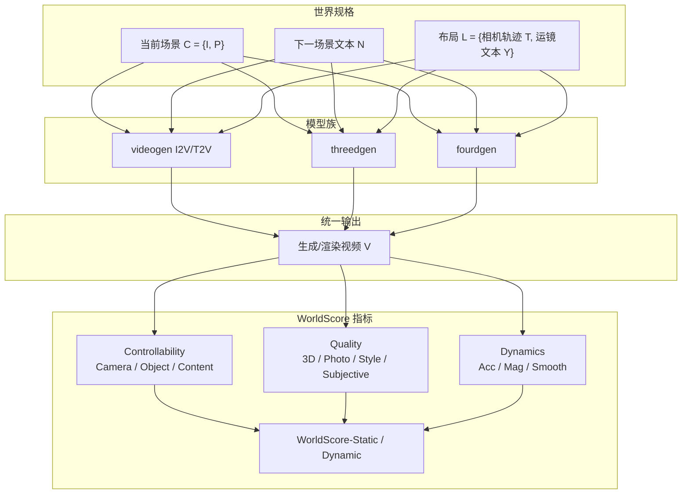
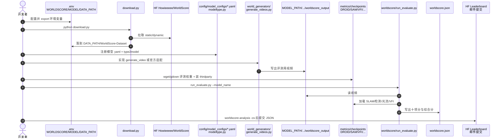

# WorldScore（统一世界生成评测基准）

**WorldScore**（arXiv:[2504.00983](https://arxiv.org/abs/2504.00983)，[项目页](https://haoyi-duan.github.io/WorldScore/)，[代码](https://github.com/haoyi-duan/WorldScore)，**ICCV 2025**，斯坦福大学）是面向 **world generation** 的统一评测：不把「世界」当成单段好看视频，而是拆成带 **显式相机轨迹布局** 的 **next-scene** 序列，让 **3D 场景生成、4D、I2V、T2V** 在同一视频输出格式上可比。数据集 **3000** 例（静 2000 / 动 1000，含风格化对偶）；指标聚合 **可控性、质量、动态** 十维，得到 **WorldScore-Static / Dynamic**。官方提供 MIT 评测仓、HF 数据集与 [可更新 Leaderboard](https://huggingface.co/spaces/Howieeeee/WorldScore_Leaderboard)。

## 一句话定义

用 **当前场景 + 下一场景文本 + 相机布局** 的 next-scene 协议，把 3D/4D/视频世界生成模型拉到同一坐标系，用 Ctrl / Quality / Dynamics 打分。

## 英文缩写速查

| 缩写 | 英文全称 | 简要说明 |
|------|----------|----------|
| WorldScore | Unified World Generation Benchmark | 本文统一世界生成评测基准与综合分 |
| I2V / T2V | Image-/Text-to-Video | 图生视频 / 文生视频模型族 |
| CLIPScore | CLIP-based Alignment Score | 内容对齐用的图文相似度 |
| DROID-SLAM | Deep Visual SLAM | 3D 一致性：稠密深度 + 重投影误差 |
| AEPE | Average End-Point Error | 光度一致性：帧间光流端点误差 |
| VFI | Video Frame Interpolation | 运动平滑：插帧模型作平滑参考 |
| HF | Hugging Face | 数据集与 Leaderboard 托管平台 |

## 为什么重要

- **单场景视频榜测不出「生成世界」：** VBench 等可给「跟不住运镜 / 不生成新场景」的模型接近分；WorldScore 用多场景 + 相机路径把这类失败拉开（项目页卧室 pan/move/pull 示例）。
- **统一 3D / 4D / 视频入口：** 同时给图像条件、文本与相机矩阵，避免「3D 方法进不了 T2V 榜」。
- **工程可复现 + 活榜：** 代码、3000 例数据、十项自动指标与邮件上榜流程齐全；读论文 Table 2 后必须以 [HF Leaderboard](https://huggingface.co/spaces/Howieeeee/WorldScore_Leaderboard) 为最新排名源。
- **与具身评测正交互补：** [EWMBench](./ewmbench.md) 锚定操纵场景守恒/末端/语义；WorldScore 锚定开放域多场景布局可控世界生成——选型时不要混轴。

## 核心信息

| 项 | 内容 |
|----|------|
| **机构** | 斯坦福大学（Stanford University） |
| **Venue** | ICCV 2025 |
| **规模** | 3000 测试例；论文评 20 模型；HF 榜截至 2026-07-27 约 34 行 |
| **开源** | **已开源** — MIT 仓 + HF Dataset + HF Leaderboard |
| **提交** | 自测 `worldscore.json` → haoyiduan@princeton.edu（推荐自采样自评测） |

## 流程总览

## 核心原理

### 方法栈 / 任务协议

| 模块 | 机制 | 要点 |
|------|------|------|
| **分解** | 世界生成 → 序列 next-scene | 每步三元组 \((\mathcal{C},\mathcal{N},\mathcal{L})\) |
| **Static 任务** | 大运镜 + 新场景内容 | 评可控性与质量；含 small（1 新场景）与 large（3 新场景，约 20%） |
| **Dynamic 任务** | 固定相机 + 场景内运动描述 | 评动力学；附运动 mask 标注区域 |
| **运镜集** | 8 类电影常用相机运动 | 覆盖空间方向，便于 T2V 文本指令 |
| **预处理** | \(w_{\text{proc}}\) 按模型族适配 | 3D 用相机矩阵；视频多用运镜文本 + 图/文条件 |
| **归一化** | 经验上下界线性映射到 0–100 | 再对维度算术平均得 Static / Dynamic |

### 十项指标速查

| 方面 | 指标 | 实现直觉 |
|------|------|----------|
| 可控性 | Camera Ctrl | 相对 GT 轨迹的尺度不变旋转/平移误差几何平均 |
| 可控性 | Object Ctrl | 从 \(\mathcal{N}\) 抽物体，开集检测成功率 |
| 可控性 | Content Align | CLIPScore 对整段下一场景文本 |
| 质量 | 3D Consist | DROID-SLAM 深度 + 共视点重投影误差 |
| 质量 | Photo Consist | 帧间光流 AEPE（抓纹理闪烁，非 CLIP 类别恒常） |
| 质量 | Style Consist | 首末帧 Gram 矩阵差 |
| 质量 | Subjective Qual | CLIP-IQA+ × Aesthetic（经人研选型） |
| 动态 | Motion Acc | 指定区域内 vs 区域外光流对比 |
| 动态 | Motion Mag | 帧间光流幅值 |
| 动态 | Motion Smooth | VFI 插帧作平滑参考 |

**聚合：** WorldScore-Static = Ctrl∪Quality 维平均；WorldScore-Dynamic 再并入 Dynamics。不支持动态的 3D 模型动力学维记 **0**（因此 Static 高、Dynamic 常明显更低）。

## 源码运行时序图

官方仓 [haoyi-duan/WorldScore](https://github.com/haoyi-duan/WorldScore) 提供「下数据 → 适配生成 → 评测 →（可选）上榜」可运行主线（归档见 [sources/repos/worldscore.md](../../sources/repos/worldscore.md)）：

- **最短复现：** `.env` → `download.py` → 选已有 `videogen` 配置生成 → 装评测依赖与 checkpoints → `run_evaluate.py`。
- **上榜：** `worldscore-analysis -cs` 校验完整后邮件提交；或交视频由官方代评。

## 工程实践

| 项 | 建议 |
|----|------|
| 环境拆分 | 生成环境与 `worldscore` 评测环境宜分开；评测钉 CUDA 12.1 + 指定 PyTorch |
| 依赖重量 | DROID-SLAM / Grounding-SAM / SAM2 / VFIMamba 子模块与权重体积大，先跑 `worldscore-analysis -cd` 确认生成齐全再评 |
| 模型注册 | 必须同时改 `model_configs` 与 `modeltype.py` 的 `threedgen`/`fourdgen`/`videogen` |
| 输出约定 | `generate_video` 返回 PIL 列表或 `[N,3,H,W]`∈[0,1] |
| 读榜 | 以 [HF Leaderboard CSV](https://huggingface.co/spaces/Howieeeee/WorldScore_Leaderboard) 为准；核对 Accessibility、Sampled/Evaluated by、Date |
| 开源边界 | **已开源** 代码+数据+榜；闭源视频模型需自备 API（`.secrets`） |

## 数据集速查

| 子集 | 规模 | 内容要点 |
|------|------|----------|
| Static | 2000 | 室内外各 5 类；写实 + 风格化；小/大世界序列 |
| Dynamic | 1000 | 5 类运动；固定相机；运动区域标注 |
| HF configs | `static` / `dynamic` | 字段含 image、camera_path、prompt(s)、style、scene/motion 元数据 |

## 实验与评测

### 论文主表（Table 2 摘录，20 模型批次）

| 模型 | 类型 | Static ↑ | Dynamic ↑ | 读法 |
|------|------|----------|-----------|------|
| WonderWorld | 3D | **72.69** | 50.88 | Static 最强档；动力学维为 0 |
| LucidDreamer | 3D | 70.40 | 49.28 | 高相机控制与 3D/光度一致 |
| CogVideoX-I2V | Video | 62.15 | **59.12** | 当时开源视频综合最强之一 |
| Gen-3 / Hailuo | Video (API) | 60.71 / 57.55 | 57.58 / 56.36 | 闭源；物体/内容对齐往往更好 |
| CogVideoX-T2V | Video | 54.18 | 48.79 | 相机可控性高于多数 I2V，质量略逊 |
| 4D-fy | 4D | 27.98 | 32.10 | 场景级 4D 仍很难 |

### 关键观察（论文 §4）

- **3D 擅静态、缺动态；** 扩到 4D 后 4D-fy 仍弱。
- **视频主瓶颈是相机可控性**（最好的视频相机分仍远低于任意 3D 方法）。
- **开源视频可媲美闭源综合分**，但分项各有胜负（如对象可控 vs 相机）。
- **运动幅度 ↔ 平滑、幅度 ↔ 准确** 均存在张力；大幅运动不等于指令落点正确。
- **长序列与户外** 对视频更难；T2V 更敢动相机，I2V 更粘初始视角。

### HF Leaderboard（截至 2026-07-27，活榜摘录）

| 模型 | 类型 | Static | Dynamic | Date |
|------|------|--------|---------|------|
| UniWorld-View | 4D | **85.53** | 76.09 | 2026.07.23 |
| WorldScape-0.2(MoE) | Video | 85.13 | **76.23** | 2026.07.13 |
| World Dreamer | 4D | 84.52 | 74.35 | 2026.07.10 |
| Voyager | 3D | 77.62 | 54.53 | 2025.06.25 |
| WonderWorld | 3D | 72.69 | 50.88 | 2025.03.30 |

完整 34 行与分项见 [Leaderboard 归档](../../sources/sites/worldscore-leaderboard-hf.md)。

## 结论

**WorldScore 把「世界生成」从单场景审美榜升级为可复现的多场景、相机可控统一协议；读结果时必须分开 Static（布局+一致性）与 Dynamic（再加运动），并与具身操纵基准（如 EWMBench）保持轴线分离。**

1. **先看任务是不是多场景/跟运镜** — 是则 WorldScore 比 VBench 更贴；只要操纵末端/场景守恒，优先 EWMBench。
2. **Static 冠军常是 3D** — 高分往往来自相机与几何一致，不代表会动。
3. **Dynamic 才暴露视频动力学** — 3D 方法动力学维为 0，勿用 Dynamic 直接开除 3D。
4. **相机可控性是视频主短板** — 综合分接近闭源时，仍可能 Camera Ctrl 远低于 3D。
5. **以 HF 活榜为准** — 论文 Table 2 是 2025-03 快照；后续 Voyager / WorldScape / UniWorld-View 等已改写前列。
6. **复现成本在评测依赖** — 生成适配相对直接；DROID-SLAM/SAM/VFI 链路才是工程主成本。

## 与其他工作对比

| 对照 | 差异读法 |
|------|----------|
| [EWMBench](./ewmbench.md) | 具身操纵：场景守恒 / EEF 轨迹 / 语义逻辑；WorldScore：开放域多场景 + 相机布局 |
| VBench / WorldModelBench | 单场景视频质量为主；缺统一 3D 相机规格与多场景协议 |
| [GigaWorld-1 / WMBench](./paper-gigaworld-1-policy-evaluation.md) | 偏「WM 作策略评估器」的动作忠实；WorldScore 不测下游策略收益 |
| [HomeWorld](./paper-homeworld-whole-home-scene-generation.md) | 全屋静态 3D 生成系统；可用 WorldScore 类布局一致性视角对照，但非同一官方协议 |
| WonderJourney / WonderWorld | 同作者线 3D 世界生成方法；在 WorldScore 上 Static 领先视频，Dynamic 为 0 |

## 局限与风险

- **不是机器人策略 / 具身操纵基准** — 无末端轨迹、无任务成功率；勿与 EWMBench、RoboDojo 混读。
- **评测栈重且脆弱** — SLAM/开集检测/光流/VFI 版本与权重路径错误会导致分数不可比。
- **3D 的 Dynamic 结构零分** — 聚合规则对「只会静态重建」的方法不公平地压低 Dynamic；比较时按族读表。
- **人研校准的主观质量组合** — Subjective Qual 依赖选定的自动指标组合，换域时需谨慎。
- **活榜参差** — Sampled/Evaluated by 可能不同；社区提交需信任官方复核。

## 关联页面

- [EWMBench](./ewmbench.md) — 具身视频世界模型三轴评测（操纵轴）
- [Generative World Models](../methods/generative-world-models.md) — 生成式世界模型方法谱系
- [Video-as-Simulation](../concepts/video-as-simulation.md) — 视频作仿真接口时的失效模式
- [具身评测基准选型闭环（专题）](../overview/topic-embodied-eval-benchmark.md) — 四层评测入口；本页作 ② 层相邻的世界生成统一榜
- [具身大模型评测基准选型闭环（Query）](../queries/embodied-eval-benchmark-selection-loop.md) — 选型决策链
- [GigaWorld-1](./paper-gigaworld-1-policy-evaluation.md) — WM 作策略评估器的动作忠实轴

## 参考来源

- [worldscore_arxiv_2504_00983.md](../../sources/papers/worldscore_arxiv_2504_00983.md)
- [haoyi-duan-worldscore-github-io.md](../../sources/sites/haoyi-duan-worldscore-github-io.md)
- [worldscore-leaderboard-hf.md](../../sources/sites/worldscore-leaderboard-hf.md)
- [worldscore.md](../../sources/repos/worldscore.md)
- Duan et al., *WorldScore: A Unified Evaluation Benchmark for World Generation*, ICCV 2025 / [arXiv:2504.00983](https://arxiv.org/abs/2504.00983)

## 推荐继续阅读

- [WorldScore 项目页](https://haoyi-duan.github.io/WorldScore/) — 指标视频样例与基准对比表
- [haoyi-duan/WorldScore](https://github.com/haoyi-duan/WorldScore) — 安装、适配与评测 README
- [WorldScore Leaderboard（HF Space）](https://huggingface.co/spaces/Howieeeee/WorldScore_Leaderboard) — 最新排名与 CSV
- [Howieeeee/WorldScore（HF Dataset）](https://huggingface.co/datasets/Howieeeee/WorldScore) — static/dynamic 数据卡
- Huang et al., *VBench*, [arXiv:2311.17982](https://arxiv.org/abs/2311.17982) — 单场景视频多维基准对照
- Hu et al., *EWMBench*, [arXiv:2505.09694](https://arxiv.org/abs/2505.09694) — 具身操纵轴对照
