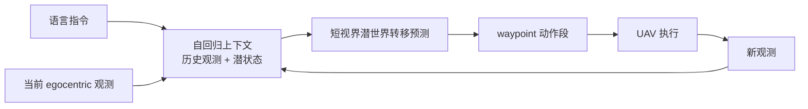

---

type: entity
tags:
  - paper
  - vln
  - aerial-navigation
  - uav
  - world-action-models
  - autoregressive
  - vision-language-action
  - reinforcement-learning
status: complete
updated: 2026-05-24
arxiv: "2605.15964"
code: https://github.com/EmbodiedCity/WorldVLN.code
related:
  - ../tasks/vision-language-navigation.md
  - ../concepts/world-action-models.md
  - ../methods/vla.md
  - ../methods/generative-world-models.md
  - ../overview/robot-world-models-training-loop-taxonomy.md
  - ../overview/vln-open-source-repro-paradigms.md
sources:
  - ../../sources/papers/worldvln_arxiv_2605_15964.md
  - ../../sources/sites/worldvln-embodiedcity.md
  - ../../sources/repos/worldvln_embodiedcity.md
summary: "WorldVLN（arXiv:2605.15964）：首个面向空中 VLN 的自回归 World Action Model——潜视频骨干预测短视界世界转移并解码为航点，执行后观测回写闭环；SFT 接地 + Action-aware GRPO；室内外 UAV 基准相对 VLA 成功率约 +12%，报告真机零样本部署。"
tags: [paper, vln, aerial-navigation, uav, world-action-models, autoregressive, vision-language-action, reinforcement-learning, zju, bit, sdu, tsinghua]

---

# WorldVLN（空中 VLN · 自回归 World Action Model）

**WorldVLN**（*Autoregressive World Action Model for Aerial Vision-Language Navigation*，arXiv:2605.15964，[项目页](https://embodiedcity.github.io/WorldVLN/)，[代码](https://github.com/EmbodiedCity/WorldVLN.code)）把 **无人机视觉–语言导航** 写成 **预测驱动的 world–action 问题**：策略在 **指令与 egocentric 历史** 条件下，先 **自回归预测短视界潜世界状态转移**，再 **直接解码为可执行 waypoint**；每执行一段动作，将 **新观测编码回上下文**，形成与 embodied 导航一致的 **observe–act–update** 闭环。

## 一句话定义

**用自回归潜世界预测承担导航的时空–因果结构，并把动作生成绑在同一 WAM 策略内**——而不是仅用 VLM 语义先验做「观测 + 语言 → 控制」的单步映射。

## 英文缩写速查

| 缩写 | 英文全称 | 简要说明 |
|------|----------|----------|
| SFT | Supervised Fine-Tuning | 用监督数据将通用模型适配到特定任务分布 |
| VLA | Vision-Language-Action | 视觉-语言-动作多模态基础策略方向 |
| WAM | World Action Model | 联合世界模型与动作预测的架构 |
| VLM | Vision-Language Model | 视觉-语言多模态理解模型，VLA 的上游 |
| WM | World Model | 学习环境动态以供想象/规划的世界模型 |
| AI | Artificial Intelligence | 人工智能 |

## 为什么重要

- **空中 VLN 的额外难度：** 相对室内地面/agent 离散转向，UAV 的 **大视角变化、连续 3D 运动与累积状态误差** 更依赖 **因果记忆与在线修正**；整段双向视频生成与闭环接口天然错位。
- **WAM 在导航上的实例化：** 与 [World Action Models（WAM）](../concepts/world-action-models.md) 综述中的 Joint/Cascaded 讨论衔接；WorldVLN 属于 **潜自回归骨干 + 动作解码器** 的 **闭环 Joint 族** 工程实例，并补上 **空中 VLN** 这一此前较少被 WAM 文献覆盖的任务域。
- **训练接口创新：** 作者提出 **Action-aware GRPO**——在 SFT 接地后，对 **自回归 WAM** 做在线 rollout 与 **段级、带时间衰减的信用分配**，把优化目标从「视觉逼真」拉向 **可解码、利于到达指令目标的转移**。

## 核心结构

| 模块 | 作用 |
|------|------|
| **潜自回归视频骨干** | 继承大规模 **视频时序先验**；按因果上下文预测 **下一小段潜世界状态**（非整 clip 双向生成） |
| **动作解码器** | 将潜世界转移 **直接映射为 waypoint 动作段** |
| **闭环编码** | 执行动作段后，将 **新 egocentric 观测** 写回自回归上下文，支撑长程指令 |
| **Stage 1 SFT** | 指令–视频对 **接地导航动力学**；视频–轨迹对 **监督动作解码** |
| **Stage 2 Action-aware GRPO** | 多 rollout、**轨迹/任务/参考策略** 段级奖励 + **时间衰减**（强调早期动作对下游观测与成功率的影响） |

### 流程总览

### 与相邻范式的边界

| 范式 | 与 WorldVLN 的分界 |
|------|-------------------|
| **导航 VLA**（如 Uni-NaVid 一类） | 强语义接地；通常不显式滚 **动作条件下的世界转移** |
| **整段视频 WM + VO** | 先合成未来帧再反推动作；非原生闭环、成本高 |
| **imagine-and-rank** | 多候选想象再排序；间接 |
| **地面室内 VLN 四范式** | 见 [VLN 开源复现路径](../overview/vln-open-source-repro-paradigms.md)；WorldVLN 聚焦 **UAV + WAM**，与 Habitat/R2R 离散栈互补 |

## 实验要点（索引级）

- **基准：** 项目页展示 **室外（UAV-Flow）** 与 **室内（IndoorUAV）** 仿真，以及 **室内外真机** 部署视频；论文摘要报告相对 **Vision-Language-Action 基线** **成功率提升 12%+**，困难样本优势更大（具体表格以 PDF 为准）。
- **分析轴（项目页 Training Analysis）：** WAM 是否比 VLA **更易学**、**自回归** 是否必要、**Action-aware GRPO** 相对纯 SFT 的增益（含定性「更直接改善动作执行」表述）。
- **迁移：** 摘要强调 **真实无人机零样本** 部署可行性（细节见附录 Real-World Deployment）。

## 常见误区或局限

- **误区：** 把 WorldVLN 等同于「任意视频生成模型 + 导航头」；其核心是 **短视界、因果、可解码的潜转移**，而非追求整段视觉逼真。
- **误区：** 认为空中 VLN SOTA 可直接替代 [地面 VLN](../tasks/vision-language-navigation.md) 的 Matterport/R2R 生态；动作空间、动力学与安全约束不同，需分任务评估。
- **局限：** 航点/低层飞控接口、风扰与感知失效恢复、法规与安全层未在单篇论文中穷尽；代码仓 ingest 时为新建状态，复现以论文与项目页为准。

## 关联页面

- [视觉–语言导航（VLN）](../tasks/vision-language-navigation.md) — 任务定义；本页补足 **空中/UAV** 子域
- [World Action Models（WAM）](../concepts/world-action-models.md) — 联合预测–动作范式与 Cascaded/Joint 族谱
- [VLA](../methods/vla.md) — 对比基线类别与导航子任务挂接
- [机器人世界模型：训练闭环 taxonomy](../overview/robot-world-models-training-loop-taxonomy.md) — 视频世界模型与策略内预测三线
- [VLN 四范式开源复现](../overview/vln-open-source-repro-paradigms.md) — 地面导航复现路径（对照）

## 方法栈

见上文 **核心结构** 与 **流程总览**（`###` 小节）；完整机制与模块分工以原文为准。

## 与其他工作对比

- 正文已给出与相邻路线 / baseline 的 **定性对照**；定量表格与 ablation 见原文（[参考来源](#参考来源)）。

## 参考来源

- [WorldVLN 论文摘录（arXiv:2605.15964）](../../sources/papers/worldvln_arxiv_2605_15964.md)
- [WorldVLN 项目页归档](../../sources/sites/worldvln-embodiedcity.md)
- [EmbodiedCity/WorldVLN 代码索引](../../sources/repos/worldvln_embodiedcity.md)

## 推荐继续阅读

- Zhao et al., *WorldVLN: Autoregressive World Action Model for Aerial Vision-Language Navigation* — [arXiv:2605.15964](https://arxiv.org/abs/2605.15964)
- Wang et al., *World Action Models: The Next Frontier in Embodied AI* — [arXiv:2605.12090](https://arxiv.org/abs/2605.12090)（WAM 概念纵览）
- [VLN 四范式新手复现](../overview/vln-open-source-repro-paradigms.md) — 地面 agent 侧由浅入深开源栈
