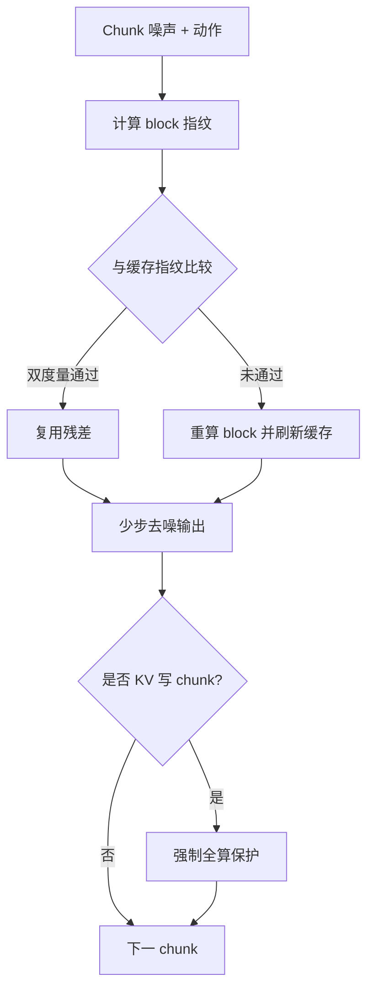

# X-Cache（Cross-Chunk Block Caching）

**X-Cache**（arXiv:2604.20289）由[小鹏（XPeng）](https://www.xiaopeng.com/) AI Infra 团队提出：专为 **少步蒸馏 + 闭环交互** 的自回归驾驶世界模型设计的 **免训练** 推理加速，在 [X-World](./paper-x-world.md) 上验证。

## 一句话定义

**当去噪步只剩 4 步、跨步缓存全部失效时，改沿相邻生成 chunk 复用 DiT block 残差，并用指纹门控与 KV 写保护把近似误差切断。**

## 英文缩写速查

| 缩写 | 英文全称 | 简要说明 |
|------|----------|----------|
| DiT | Diffusion Transformer | 视频扩散主干，按 block 计算 |
| KV | Key / Value cache | 自回归滚动上下文缓存 |
| PSNR | Peak Signal-to-Noise Ratio | 像素级质量指标（dB） |
| EMA | Exponential Moving Average | 自适应 cosine 阈值的历史平滑 |
| S | Denoising steps | 少步蒸馏后的去噪步数（文中常 S=4） |

## 为什么重要

- **交互式世界仿真的算力墙：** 高保真多摄生成若不加速，无法支撑在线 RL / 实时评测。
- **诊断清楚：** 指明为何 TeaCache 等「跨步」方法在少步蒸馏后必然失效。
- **工程可插拔：** training-free，挂在已有 X-World 推理图上。

## 核心信息

| 字段 | 内容 |
|------|------|
| 机构 | 小鹏（XPeng）AI Infra Team |
| arXiv | [2604.20289](https://arxiv.org/abs/2604.20289) |
| 项目页 | <https://x-cache-1.github.io/en/> |
| 加速 | ≈ **2.6–2.7×** wall-clock；block skip ≈ **71%** |
| 开源状态 | **未开源**（截至 2026-07-21） |

## 核心原理

### 机制要点

| 组件 | 作用 |
|------|------|
| **Cross-chunk residual cache** | 按 (去噪步 t, block b) 存残差，跨 chunk 复用 |
| **Structure & action fingerprint** | 32 latent token 子采样 + 全局均值 + 动作向量 |
| **Dual-metric gate** | cosine ≥ τ **且** max-deviation < τ_dev 才 skip |
| **KV-update protection** | 写清洁 K/V 的 chunk **强制全算** |
| **Anchor block** | block 0 永不跳，刷新动作条件传播 |

### 流程总览

## 源码运行时序图

**不适用** — 截至 2026-07-21，[项目页](https://x-cache-1.github.io/en/)仅链 arXiv，无可运行实现仓库。

## 评测要点

| 场景 | PSNR（7-cam） | Skip | Speedup |
|------|---------------|------|---------|
| Urban | ≈ 51.4 dB | 71.4% | 2.7× |
| Highway | ≈ 54.7 dB | 71.6% | 2.7× |
| U-turn | ≈ 52.0 dB | 71.3% | 2.7× |

相对无缓存基线近无损；KV-update 若误 skip，PSNR 可崩至 ~21 dB。

## 与其他工作对比

| 对照 | 差异 |
|------|------|
| **TeaCache / DeepCache / ΔDiT** | 沿 **去噪步** 复用；少步蒸馏后失效 |
| **轨迹外推 / block cascading** | 需前瞻或平滑动作；闭环交互驾驶不适用 |
| **X-World 全算** | 质量上限；X-Cache 以跨 chunk 残差复用换吞吐 |

## 工程实践

| 项 | 要点 |
|------|------|
| 适用前提 | **少步蒸馏** AR 视频扩散 + **闭环无前瞻** |
| 质量红线 | 切勿在 KV-update pass 上启用 skip（文中 PSNR 可崩到 ~21 dB） |
| 调参 | τ_floor=0.97；EMA 自适应阈值；U-turn 等大航向变化仍可维持 ~71% skip |
| 复现边界 | 方法描述完整，但无官方代码/基座权重 |

## 局限与风险

- **绑定 X-World 类架构：** 换骨干或非 chunk 生成器需重做指纹与护栏假设。
- **未开源：** 外部只能借鉴设计，不能直接集成验证。
- **误区：** 以为「任何 diffusion cache 都能加速世界模型」——缓存轴选错会零收益甚至伤质量。

## 关联页面

- [X-World](./paper-x-world.md) — 被加速的生产多摄世界模型
- [生成式世界模型](../methods/generative-world-models.md) — 部署侧算力议题
- [Video-as-Simulation](../concepts/video-as-simulation.md) — 交互仿真概念
- [X-Foresight](./paper-x-foresight.md) — 下游联合 VLA 世界建模（Renderer 同源）

## 参考来源

- [X-Cache 论文摘录（arXiv:2604.20289）](../../sources/papers/x_cache_arxiv_2604_20289.md)
- [X-Cache 项目页归档](../../sources/sites/x-cache-1-github-io.md)

## 推荐继续阅读

- 论文：<https://arxiv.org/abs/2604.20289>
- 项目主页：<https://x-cache-1.github.io/en/>
