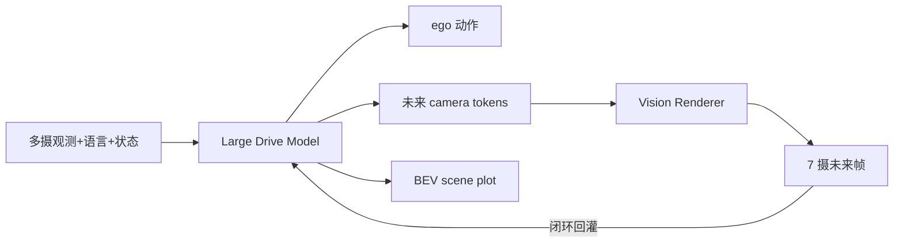

# X-Foresight（Joint Vision-Action Causal Forecasting）

**X-Foresight**（arXiv:2605.24892）由[小鹏（XPeng）](https://www.xiaopeng.com/) PWM 团队提出：将 **预测式世界模型** 直接集成进驾驶 **VLA**，联合学习世界因果与实时动作控制。

## 一句话定义

**用块内稠密、块间稀疏的长视界 chunk-wise 自回归逃离「相邻帧外推」，让 Large Drive Model 同时吐动作与多摄未来 latent，再经扩散 Renderer 闭合观测环。**

## 英文缩写速查

| 缩写 | 英文全称 | 简要说明 |
|------|----------|----------|
| LDM | Large Drive Model | 自回归多模态驾驶主干 |
| VLA | Vision-Language-Action | 视觉–语言–动作策略 |
| TIS | Temporal Importance Sampling | 偏置到安全关键 chunk 的采样 |
| CLEF | Curriculum Learning with Extended Foresight | 逐步加长块间 stride 的课程 |
| ADE / FDE | Average / Final Displacement Error | 轨迹位移误差 |
| CCES | 综合驾驶评测聚合（文中 Safety/Compliance/Comfort/Efficiency） | 生产评测总分 |

## 为什么重要

- **把世界知识写进策略目标：** 不只靠反应式模仿，而用未来视频监督学因果。
- **同时解决低熵塌缩与时间困境：** chunk-wise 设计是方法核心贡献。
- **产业规模实证：** 公开叙事覆盖 ~280k 小时、34M clips、1024 GPU 生产训练。

## 核心信息

| 字段 | 内容 |
|------|------|
| 机构 | 小鹏（XPeng）PWM Team |
| arXiv | [2605.24892](https://arxiv.org/abs/2605.24892) |
| 项目页 | <https://x-foresight-1.github.io/en/> |
| 数据 | ~280k h / 34M clips / 7 cams / 13.8T tokens |
| 开源状态 | **未开源**（截至 2026-07-21） |

## 核心原理

### 架构

| 模块 | 角色 |
|------|------|
| **LDM** | 吃多摄+语言+ego；预测动作、BEV plot、每摄未来 camera tokens |
| **Vision Renderer** | DiT rectified-flow；条件仅 camera tokens；渲染帧回灌 AR |
| **Chunk foresight** | 预测 K 帧 chunk + 可延长 stride；半因果 block-sparse 注意力 |
| **CLEF / TIS** | 稳定长视界训练；聚焦安全关键时间片 |

### 流程总览

## 源码运行时序图

**不适用** — 截至 2026-07-21，[项目页](https://x-foresight-1.github.io/en/)仅链 arXiv，无公开可运行代码。

## 评测要点

| 指标（生产规模 vs 同规模基线） | 变化 |
|------|------|
| ADE Lat. / Lon. | 0.1675→0.1567 / 1.1387→1.0982 |
| 碰撞率 | 0.228%→0.191%（相对 −16.2%） |
| CCES Total | 3.8296→3.6535（−4.6%） |
| Renderer FID@1s | Camera Latent Decoder 10.97 → Vision Renderer **1.51** |

视界 H↑ 与 CLEF/TIS 消融见项目页表格。

## 与其他工作对比

| 对照 | 差异 |
|------|------|
| **反应式驾驶 VLA** | 缺长视界因果；X-Foresight 用 chunk-wise 未来监督 |
| **朴素 next-frame WM** | 易塌缩外推；本工作块间稀疏、块内稠密 |
| **X-Mind** | 同团队：本页偏 **稠密多摄想象**；X-Mind 偏 **压缩 Visual CoT** |
| **X-World** | 外部仿真器；本页把预测 **嵌进策略环** |

## 工程实践

| 项 | 要点 |
|------|------|
| 训练三阶段 | 分训 LDM/Renderer → 冻结 LDM、用预测 tokens 对齐 Renderer |
| 帧率 | 存 12 Hz、训 4 Hz，平衡运动保真与序列长度 |
| 生产增益（同规模基线） | 横向 ADE **−6.4%**；碰撞率相对 **−16.2%**；CCES Total **−4.6%** |
| 复现边界 | 内部数据与 1024 GPU 配方不可外搬；仅作方法对照 |

## 局限与风险

- **未开源 + 私有数据：** 外部无法复现榜数字。
- **算力与延迟：** 稠密多摄想象对车载仍重；同团队用 [X-Mind](./paper-x-mind.md) 走压缩 Visual CoT。
- **误区：** 把 Renderer 保真当成规划提升的充分条件——消融显示长视界因果监督才是安全增益主因。

## 关联页面

- [VLA](../methods/vla.md) — 联合世界建模的策略主线
- [World Action Models](../concepts/world-action-models.md) — Joint 族对照坐标
- [生成式世界模型](../methods/generative-world-models.md) — Renderer / 视频仿真谱系
- [X-World](./paper-x-world.md) — Renderer 注意力/VAE 前序底座
- [X-Mind](./paper-x-mind.md) — 同数据协议的高效 Visual CoT 变体
- [X-Cache](./paper-x-cache.md) — 世界模型推理加速（仿真侧）
- [TuringViT](./paper-turingvit.md) — 同机构视觉编码器

## 参考来源

- [X-Foresight 论文摘录（arXiv:2605.24892）](../../sources/papers/x_foresight_arxiv_2605_24892.md)
- [X-Foresight 项目页归档](../../sources/sites/x-foresight-1-github-io.md)

## 推荐继续阅读

- 论文：<https://arxiv.org/abs/2605.24892>
- 项目主页：<https://x-foresight-1.github.io/en/>
