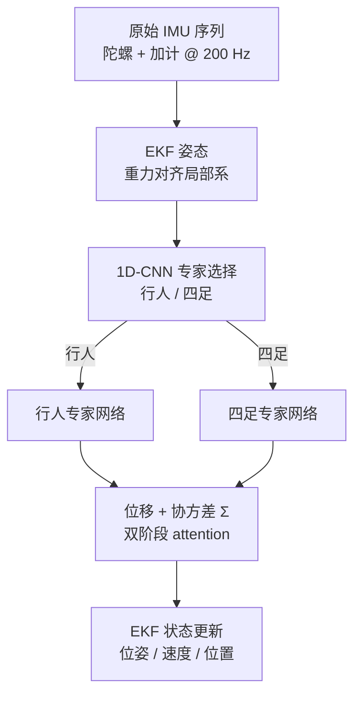

# X-IONet（跨平台惯性里程计网络）

**X-IONet**（Cross-Platform Inertial Odometry Network）是 Shen & Chen 提出的 **仅用单 IMU** 的跨平台惯性里程计框架（IEEE RA-L Vol. 11 No. 7, July 2026；[arXiv:2511.08277](https://arxiv.org/abs/2511.08277)）。它用 **规则式专家选择** 区分行人 vs 四足运动模式，将 IMU 序列路由到 **平台专属位移网络**；网络采用 **双阶段 attention** 同时建模时间依赖与轴间相关，回归 **位移 + 协方差**，再经 **EKF** 做鲁棒状态估计。在 **RoNIN**、**GrandTour** 与自采 **Unitree Go2** 数据上达到 SOTA，尤其 Go2 上 ATE/RTE 相对最强基线降低 **52.8% / 41.3%**。

## 一句话定义

**用「平台分类 → 专家位移网络 → EKF」三段式，把行人惯性里程计的成功范式扩展到四足：单 IMU、无视觉/GNSS，靠双阶段 attention 抓多尺度惯性特征，并用学习的不确定性驱动滤波融合。**

## 英文缩写速查

| 缩写 | 英文全称 | 简要说明 |
|------|----------|----------|
| X-IONet | Cross-Platform Inertial Odometry Network | 本文跨平台单 IMU 惯性里程计框架 |
| IMU | Inertial Measurement Unit | 惯性测量单元（陀螺 + 加计） |
| IO | Inertial Odometry | 仅由 IMU 推断位移/轨迹的里程计 |
| EKF | Extended Kalman Filter | 非线性系统递推状态估计；本文融合网络位移量测 |
| ATE | Absolute Trajectory Error | 全局轨迹对齐后的 RMSE 定位误差 |
| RTE | Relative Trajectory Error | 局部时间窗内相对漂移误差 |

## 为什么重要

- **跨平台缺口：** 多数学习型 IO 只服务 **行人或单一载体**；四足 **高动态、非周期** 运动使行人模型直接迁移崩溃（论文 Fig. 6 右：行人模型在 Go2 上轨迹严重偏离）。
- **传感器极简：** 相对 VIO/LIO/GNSS，**纯 IMU** 在视觉退化、室内、GNSS 拒止场景仍可工作，适合 **腿式机载备份里程计** 或 **手持/手机导航**。
- **学习 + 滤波闭环：** 延续 **TLIO** 等「网络预测位移/不确定性 → EKF 更新」范式，但引入 **专家路由** 与 **Crossformer 式双阶段 attention**，在四足公开集与实机 Go2 上同时拉开差距。
- **工程可部署：** 推理每窗只跑 **一个专家子网**，比端到端通才模型更省算力（论文 IV-A4）。

## 方法与核心结构

| 模块 | 作用 |
|------|------|
| **重力对齐预处理** | 用 EKF 姿态将原始 IMU 旋到 **重力对齐局部系** 再入网 |
| **专家选择（1D-CNN）** | 三层 Conv1d + 全连接二分类（行人 / 四足）；softmax 后置信度 + **if–else 路由** |
| **位移预测网络** | 1 s @ 200 Hz 窗；**时间 attention**（轴内）+ **维度 attention**（轴间，带 router）；层次 encoder–decoder + cross-attention |
| **不确定性头** | 输出 3D 位移与 **3×3 协方差**；**Huber–Gaussian** 损失联合训练 |
| **EKF 状态估计** | 状态含历史位姿、当前 R/v/p 与 IMU bias；网络位移作量测，**Σ** 进入 Kalman 增益 |

### 流程总览

## 实验与评测

| 数据集 | 平台 / 传感器 | 规模（论文） | X-IONet 亮点 |
|--------|---------------|--------------|--------------|
| **RoNIN** | 行人，手机 IMU | 42.7 h | Seen ATE **3.10 m**；相对最强基线 ATE/RTE **−14.3% / −11.4%** |
| **GrandTour** | 四足，NovAtel CPT7 IMU | 36 条轨迹 | ATE **5.37 m**；**−11.8% / −9.7%** |
| **Go2（自采）** | Unitree Go2 + iPhone 14 Pro Max | 30 序列，~1.5 h | ATE **1.03 m**，RTE **0.84 m**；**−52.8% / −41.3%** |

**基线族：** RoNIN-ResNet/TCN/LSTM、CTIN、TLIO、IMUNet/EfficientNet 等；均在对应数据集训练 split 上 **公平重训**（Adam, lr 1e-4, batch 128, 最长 100 epoch, RTX 4090）。

**消融结论：** 去掉双阶段 attention、层次 encoder–decoder、EKF 或不确定性损失，ATE/RTE 均明显恶化（IV-D）。

## 常见误区或局限

- **误区：「一个网络通吃所有平台」。** 论文采用 **显式专家路由**；新平台需 **补数据 + 重训 selector 与新 expert**，不是零样本任意载体。
- **局限：仍依赖 IMU 积分 + 学习位移，长期绝对定位仍会漂**；无闭环绝对参考（地图/GNSS/视觉）时只能作 **短时里程计**。
- **局限：Go2 实验用手机 IMU + LiDAR 里程计作 GT**，与机载工业 IMU、不同安装位姿的泛化需自行验证。
- **对比 VIO/LIO：** 不解决 **全局一致建图** 与 **尺度来自视觉/激光** 的问题；优势在 **极简传感与拒止环境鲁棒性**。

## 与其他页面的关系

- [State Estimation（概念总览）](../concepts/state-estimation.md) — IMU 融合与足式状态估计语境
- [EKF（形式化）](../formalizations/ekf.md) — 本文滤波后端与 TLIO 范式
- [状态估计专题汇总](../overview/topic-state-estimation.md) — SLAM/VIO/LIO 与纯 IMU 路线对照
- [Unitree（平台）](./unitree.md) — Go2 自采数据集硬件语境
- [Locomotion（任务）](../tasks/locomotion.md) — 腿式运动产生 distinct 惯性签名

## 参考来源

- [x_ionet_arxiv_2511_08277.md](../../sources/papers/x_ionet_arxiv_2511_08277.md)
- Shen, Chen, *X-IONet: Cross-Platform Inertial Odometry Network for Pedestrian and Legged Robot*, IEEE RA-L, 2026 — <https://arxiv.org/abs/2511.08277>

## 推荐继续阅读

- Yan et al., *RoNIN: Robust Neural Inertial Navigation in the Wild* — 行人 IO 数据集与 ResNet/LSTM/TCN 基线
- Liu et al., *TLIO: Tight Learned Inertial Odometry* — 学习位移 + EKF 融合的开创性组合
- [Contact-Aided Invariant EKF（Paper Notebooks 索引）](./paper-notebook-contact-aided-invariant-ekf-for-legged-robots.md) — 足式多传感器 EKF 对照路线
