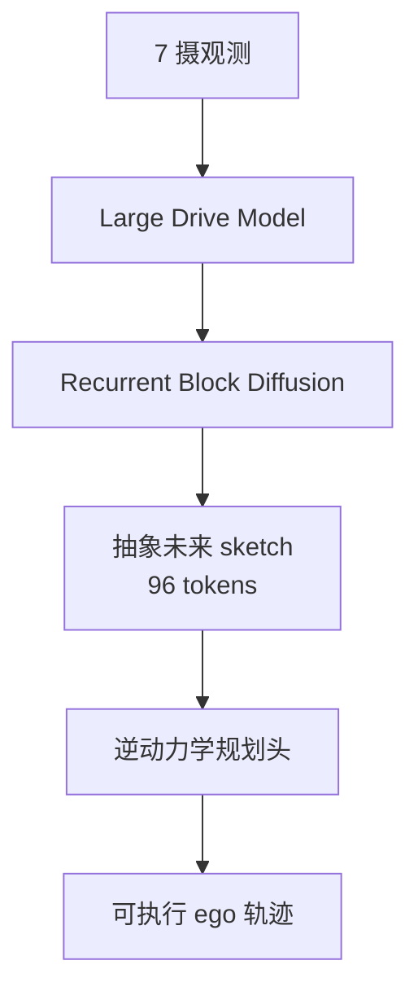

# X-Mind（Efficient Visual Chain-of-Thought via Predictive World Model）

**X-Mind**（arXiv:2606.28758）由[小鹏（XPeng）](https://www.xiaopeng.com/) PWM 团队提出：将 **Predictive World Model** 内化为驾驶大模型的 **Visual Chain-of-Thought**，先想象未来再规划动作，并用压缩表示与层间扩散解决车载时延。

## 一句话定义

**强制「世界 rollout → 逆动力学规划」的 Visual CoT：用 BEV+驾驶先验的抽象 sketch（12 帧压到 96 token）与 Recurrent Block Diffusion，在一次 LLM 前向内完成前瞻推理。**

## 英文缩写速查

| 缩写 | 英文全称 | 简要说明 |
|------|----------|----------|
| PWM | Predictive World Model | 预测未来世界状态的模块 |
| CoT | Chain-of-Thought | 显式中间推理；此处为视觉版 |
| DC-AE | Deep Compression Autoencoder | 把多帧 sketch 压到极少 token |
| RBD | Recurrent Block Diffusion | 去噪步沿 Transformer block 展开 |
| BEV | Bird's-Eye-View | 鸟瞰布局作为心理画布 |
| ADE | Average Displacement Error | 规划轨迹误差 |

## 为什么重要

- **打中级联 PWM 的时延死穴：** 外挂全像素世界模型难以上车。
- **把「想清楚再开」结构化：** 不是辅助 loss，而是动作前的强制视觉推理。
- **与 X-Foresight 形成效率–保真光谱：** 同数据协议下，一个偏稠密多摄想象，一个偏抽象 sketch。

## 核心信息

| 字段 | 内容 |
|------|------|
| 机构 | 小鹏（XPeng）PWM Team |
| arXiv | [2606.28758](https://arxiv.org/abs/2606.28758) |
| 项目页 | <https://xp-x-mind.github.io/en/> |
| 传感/数据 | 7 摄；沿用 X-World / X-Foresight 协议；实验用 1/8 子集 |
| 开源状态 | **未开源**（截至 2026-07-21） |

## 核心原理

### 方法栈

| 模块 | 角色 |
|------|------|
| **Abstract sketch** | BEV 拓扑/动态体 + 红绿灯 + 导航意图 + 速度合规 |
| **DC-AE** | 12 帧未来 → **96 tokens** |
| **RBD** | 层间 Euler 去噪，单次前向生成未来 sketch |
| **Inverse dynamics planner** | 条件于 rollout，监督纵向加速度与横摆率 |
| **联合目标** | λ_WM L_WM + λ_plan L_plan |

### 流程总览

## 源码运行时序图

**不适用** — 截至 2026-07-21，[项目页](https://xp-x-mind.github.io/en/)仅提供 ArXiv / Tech Report PDF，无公开训练推理仓库。

## 评测要点

| 设定 | Extra tokens | ADE Lat./Lon. | Inference |
|------|--------------|---------------|-----------|
| Base | 0 | 0.2399 / 1.2979 | 1.0× |
| + Image | 3584 | 0.2003 / 1.2456 | 22× |
| + 3DGS | 3072 | 0.1964 / 1.2247 | 19× |
| **+ Sketch（Ours）** | **96** | **0.1765 / 1.1849** | **1.1×** |

RBD FID **9.59** vs 单步去噪 **67.30**；预测 12 帧未来比重建当前帧更利轨迹。

## 与其他工作对比

| 对照 | 差异 |
|------|------|
| **级联外挂 PWM** | 时延不可接受；X-Mind **内化** 为 Visual CoT |
| **浅层终端世界任务** | 难注入 LLM 深特征；RBD 沿层级展开去噪 |
| **X-Foresight** | 稠密多摄 latent + Renderer；本页用 **96-token sketch** 换上车时延 |
| **标准 VLA** | 反应式映射；本页强制「先想象再规划」 |

## 工程实践

| 项 | 要点 |
|------|------|
| 表示选型 | Sketch **96 tokens** 相对 dense image **3584** / 3DGS **3072**：ADE 更好、推理 ≈1.1× |
| RBD vs 单步 | FID **9.59** vs **67.30**；规划 ADE 亦更优 |
| 预测 vs 重建 | 预测未来 12 帧的轨迹优于重建当前帧——优势来自 **前瞻** |
| 复现边界 | 私有数据 + 未开源；适合读设计，不适合期望可跑通复现 |

## 局限与风险

- **结构化 GT 依赖：** sketch 监督需要标注；未来工作提到自监督感官预测。
- **未开源：** 无法验证车载延迟数字的可迁移性。
- **误区：** 以为 Visual CoT = 再挂一个视频扩散器——本工作的关键是 **压缩思考画布 + 层内化扩散**。

## 关联页面

- [VLA](../methods/vla.md) — 反应式策略 → 前瞻推理的扩展
- [World Action Models](../concepts/world-action-models.md) — 联合世界–动作坐标
- [Latent Imagination](../concepts/latent-imagination.md) — 潜空间想象对照
- [X-Foresight](./paper-x-foresight.md) — 同团队稠密多摄联合预测
- [X-World](./paper-x-world.md) — 传感配置前序
- [TuringViT](./paper-turingvit.md) — 同机构视觉底座

## 参考来源

- [X-Mind 论文摘录（arXiv:2606.28758）](../../sources/papers/x_mind_arxiv_2606_28758.md)
- [X-Mind 项目页归档](../../sources/sites/xp-x-mind-github-io.md)

## 推荐继续阅读

- 论文：<https://arxiv.org/abs/2606.28758>
- 项目主页：<https://xp-x-mind.github.io/en/>
- Tech Report PDF（项目页）：<https://xp-x-mind.github.io/X_Mind.pdf>
