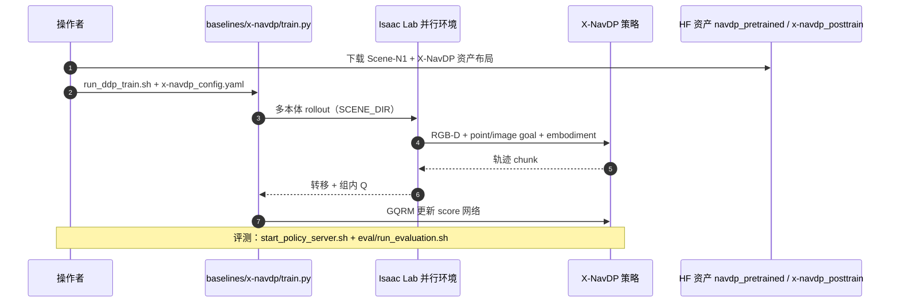

# X-NavDP：跨本体导航扩散策略 RL 后训练

**X-NavDP: Generalizing Navigation Diffusion Policy to Novel Behavior and Embodiments with Group Q-score Reweighted Matching**（[arXiv:2607.28560](https://arxiv.org/abs/2607.28560)，[项目页](https://yty-sky.github.io/x-navdp-project-page/)，[HF 资产](https://huggingface.co/InternRobotics/X-NavDP)）由 **复旦大学、上海人工智能实验室、中山大学、清华大学** 提出：在 **RGB-D 局部观测** 的 [NavDP](./paper-notebook-navdp-learning-sim-to-real-navigation-diffusion.md) 预训练扩散导航策略上，用 **Group Q-score Reweighted Matching（GQRM）** 做 **数据高效的在线 RL 后训练**，在 **Dingo / Unitree Go2 / Unitree G1** 等异构本体上同时提升常规避障导航，并习得 **脱困后退、长障碍绕行、本体感知行为** 等预训练 IL 难以覆盖的能力。

## 一句话定义

**用组内 Q-score 加权的 score matching（而非不稳定扩散似然梯度）后训练 NavDP，在约 12 小时分布式 RL 内把跨本体视觉导航 SR 从 61% 级拉到 84% 级，并显著改善真机 hard layout。**

## 英文缩写速查

| 缩写 | 英文全称 | 简要说明 |
|------|----------|----------|
| X-NavDP | Cross / eXtended NavDP | 本文 GQRM 后训练后的导航扩散策略 |
| GQRM | Group Q-score Reweighted Matching | 组内 Q 归一化 + 重加权 score matching |
| NavDP | Navigation Diffusion Policy | IL 预训练骨干（privileged guidance） |
| RL | Reinforcement Learning | 在线交互后训练 |
| SR / SPL | Success Rate / Success weighted by Path Length | 导航成功率与路径加权成功率 |
| FiLM | Feature-wise Linear Modulation | 注入 embodiment 条件的轻量调制 |
| RTC | Real-Time Chunking / guidance | 项目页称提升时序一致性的引导机制 |

## 为什么重要

- **IL 导航扩散的结构性上限：** 模仿全局 oracle 轨迹在 **局部 RGB-D** 部署时存在决策歧义，且数据生成常 **忽视本体动力学**；纯 IL 在死胡同、长障碍等场景缺乏 **自主探索与恢复**。
- **扩散 + RL 的工程痛点：** 策略梯度式扩散微调 **似然链不稳定**；潜空间冻结法 **探索不足**；全局 Q 归一化的 reweighted matching 对 **稀疏 hard state** 信号弱。
- **可复现栈已公开：** 训练入口在 [InternRobotics/NavDP](https://github.com/InternRobotics/NavDP) 的 `baselines/x-navdp`（MIT），权重与目录规范在 [InternRobotics/X-NavDP](https://huggingface.co/InternRobotics/X-NavDP)，与 [NavDP](./paper-notebook-navdp-learning-sim-to-real-navigation-diffusion.md) 形成「预训练 → 后训练」连续路线。

## 核心信息

| 项 | 内容 |
|----|------|
| **机构** | 复旦大学；上海人工智能实验室；中山大学；清华大学 |
| **预训练骨干** | NavDP（RGB-D 导航扩散；privileged IL） |
| **后训练** | 分布式在线 RL；GQRM + 自举轨迹扰动（goal / no-goal 混合） |
| **本体** | 轮式 Dingo；四足 Unitree Go2；人形 Unitree G1 |
| **仿真** | 40 held-out scenes（clutter + home/commercial 等） |
| **开源** | **已开源** — 代码 `NavDP/baselines/x-navdp`；checkpoint / 元数据 HF；项目页源码 [yty-sky/x-navdp-project-page](https://github.com/yty-sky/x-navdp-project-page) |

## 核心原理

1. **Self-bootstrapped perturbation：** 在保留扩散先验的前提下，用结构化轨迹扰动（含 **无目标** 样本）扩大行为多样性，而非仅依赖采样噪声。
2. **Group Q-score reweighting：** 在同一状态下对多条 rollout **组内归一化 Q**，对低回报 hard 样本仍保留学习信号，并将 score matching 权重偏向组内更优轨迹。
3. **Embodiment FiLM：** 在 NavDP 骨干上轻量调制，支撑 **跨本体** 联合后训练。
4. **RTC 类时序引导（项目页）：** 改善 chunk 级推理的 **时间一致性**（与同步 / 异步推理评测相对应）。

### 流程总览

## 源码运行时序图

图下说明：训练 / 评测路径对齐 [HF README](https://huggingface.co/InternRobotics/X-NavDP) 与 `NavDP/baselines/x-navdp`；大场景与 USD **不在** Git 内，需 `InternRobotics/Scene-N1` 与 HF 权重。

## 工程实践

| 项 | 说明 |
|----|------|
| 环境 | Python 3.11；**Isaac Sim 5.0.0** + **Isaac Lab 0.46.2** + `isaaclab-rl==0.4.0`；**acados** |
| 训练 | `bash scripts/run_ddp_train.sh`（示例 8 GPU；72 scenes × 24k steps 与论文设定一致） |
| 评测 | Policy server + Isaac Lab client；`eval/config/eval_pointgoal/` |
| 初始化 | `pretrain_model/navdp_pretrained.ckpt` |
| 发布权重 | `checkpoints/x-navdp_posttrain.ckpt` |
| 许可 | X-NavDP **MIT**；NavDP 上游与第三方见各自 NOTICE |

## 实验与评测

| 设置 | NavDP | X-NavDP | 读法 |
|------|-------|---------|------|
| 仿真 Overall SR | 61.20% | **84.28%** | 40 held-out scenes |
| 仿真 Overall SPL | 58.95% | **77.19%** | 同上 |
| 真机 hard cases（平均） | ~10% | **~65%** | zero-shot；三本体多 layout |
| Dingo / Go2 / G1 分项 | 见项目页 | 均显著提升 | 勿跨任务直接比 VLN |

## 结论

X-NavDP 表明：**导航扩散策略的后训练应优先选 stable 的 reweighted score matching + 结构化探索**，而不是硬上扩散似然 PG；在公开 NavDP 栈上约 **12 h** 后训练即可获得 **跨本体** 的 SR/SPL 跃升与新行为（脱困 / 绕行）。

1. **GQRM** 是核心可迁移配方：组内 Q 归一化对 hard state 更敏感。
2. **Embodiment FiLM** 使单一后训练流程覆盖轮足 / 四足 / 人形。
3. **依赖链长：** Isaac 5 + Lab 0.46 + acados + Scene-N1/HF 资产，部署前按 README 逐项核对版本。
4. 与 [RoamFlow](./paper-roamflow.md)（未开源、Habitat image-goal）对比：X-NavDP 走 **NavDP 生态 + point-goal RGB-D + 已开源** 复现路径。
5. 相对「仅 IL 的 NavDP」：后训练是 **能力上限** 的关键一环，而非 marginal tweak。

## 与其他工作对比

| 工作 | 预训练 | 后训练 / 精炼 | 开源 | 与本文 |
|------|--------|---------------|------|--------|
| **X-NavDP** | NavDP IL | **GQRM 在线 RL** | **已开源** | 本页 |
| [NavDP](./paper-notebook-navdp-learning-sim-to-real-navigation-diffusion.md) | 大规模 sim IL | 无（基线） | 已开源 | 预训练骨干与 benchmark |
| [NoMaD](./paper-notebook-nomad-goal-masked-diffusion-policies-for-navigat.md) | 扩散导航 IL | 无统一 RL 后训练叙事 | 已开源 | 同为扩散导航，任务与栈不同 |
| [RoamFlow](./paper-roamflow.md) | MeanFlow IL | Habitat PPO | 未开源 | Image-goal；一步 MeanFlow |
| NavDP + 在线 RL（Sheng et al.，Related Work） | NavDP | RL 微调 | — | 论文称探索仅靠扩散随机性，提升有限 |

## 局限与风险

- 仍依赖 **仿真大规模 rollout** 与 Isaac 版本钉死；真机结果集中在 **hard layout** 协议，非全场景 guarantee。
- 资产体积大（场景 / USD / 低层控制器 checkpoint），HF + Scene-N1 下载与 `SCENE_DIR` 布局是复现主摩擦。
- Point-goal / RGB-D 导航，**不是** 语言 VLN 或全局拓扑规划替换。

## 关联页面

- [NavDP（PNB）](./paper-notebook-navdp-learning-sim-to-real-navigation-diffusion.md)
- [NoMaD（PNB）](./paper-notebook-nomad-goal-masked-diffusion-policies-for-navigat.md)
- [RoamFlow](./paper-roamflow.md)
- [depth-navigation](../../roadmap/depth-navigation.md)
- [diffusion-policy](../methods/diffusion-policy.md)
- [unitree-g1](./unitree-g1.md)

## 参考来源

- [x_navdp_arxiv_2607_28560.md](../../sources/papers/x_navdp_arxiv_2607_28560.md)
- [x-navdp-project-page.md](../../sources/sites/x-navdp-project-page.md)
- [internrobotics_x_navdp.md](../../sources/repos/internrobotics_x_navdp.md)
- [navdp.md](../../sources/repos/navdp.md)

## 推荐继续阅读

- [项目页](https://yty-sky.github.io/x-navdp-project-page/)
- [arXiv PDF](https://arxiv.org/pdf/2607.28560)
- [Hugging Face 模型卡与安装说明](https://huggingface.co/InternRobotics/X-NavDP)
