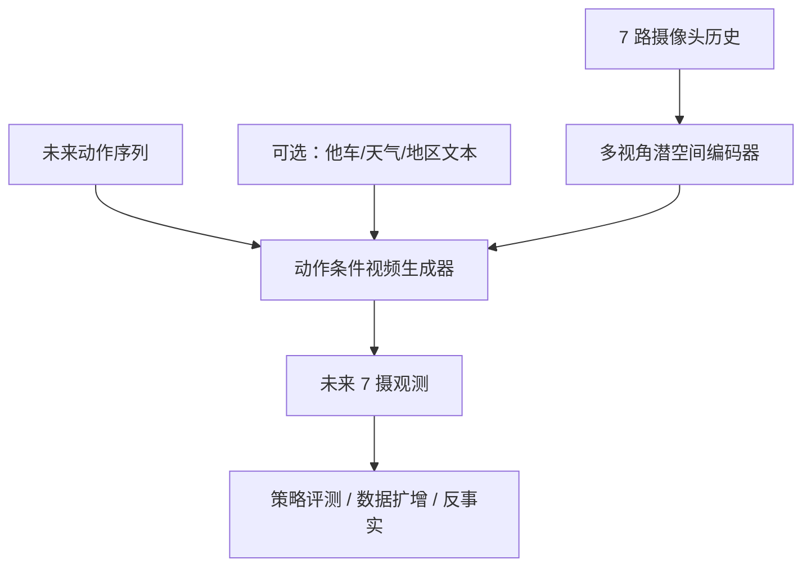

# X-World（Controllable Ego-Centric Multi-Camera World Models）

**X-World**（arXiv:2603.19979）由[小鹏（XPeng）](https://www.xiaopeng.com/) GWM 团队提出：面向端到端智驾评测与数据扩增的 **动作条件多摄生成式世界模型**，在视频空间直接模拟「执行指定动作后」的未来环视观测。

## 一句话定义

**给定 7 路同步摄像头历史与未来动作序列，生成严格跟随动作、跨视角一致且长时程稳定的未来多摄视频，并可叠加交通参与者与天气等可控条件。**

## 英文缩写速查

| 缩写 | 英文全称 | 简要说明 |
|------|----------|----------|
| WM | World Model | 预测未来观测/状态的环境模型 |
| VLA | Vision-Language-Action | 端到端智驾策略范式 |
| GWM | Generative World Model | 以视频生成为载体的世界模型 |
| DiT | Diffusion Transformer | 多块因果视频扩散骨干（后续 X-Cache 语境） |
| E2E | End-to-End | 传感器到控制的端到端驾驶 |

## 为什么重要

- **把路测评测部分搬进可复现模拟器：** 降低成本、扩大长尾场景覆盖。
- **多摄几何一致是硬门槛：** 7 路环视若错位/模糊，闭环策略评测会系统性失真。
- **小鹏驾驶世界模型栈的底座：** [X-Cache](./paper-x-cache.md) 加速它；[X-Foresight](./paper-x-foresight.md) Renderer 建于其上；[X-Mind](./paper-x-mind.md) 沿用同一传感配置。

## 核心信息

| 字段 | 内容 |
|------|------|
| 机构 | 小鹏（XPeng）GWM 团队 |
| arXiv | [2603.19979](https://arxiv.org/abs/2603.19979) |
| 项目页 | <https://x-world-1.github.io/> |
| 传感 | 7 摄像头 360° 环视 |
| 开源状态 | **未开源**（截至 2026-07-21） |

## 核心原理

### 输入 / 输出

| 侧 | 内容 |
|------|------|
| 输入 | 同步多视角历史帧 + 未来动作（可选：他车/静态要素控制、外观文本） |
| 输出 | 未来多摄视频流；可做动作保持下的风格迁移 |

### 流程总览

## 源码运行时序图

**不适用** — 截至 2026-07-21，[项目页](https://x-world-1.github.io/)仅链论文 PDF，无训练/推理仓库。

## 评测要点

| 维度 | 公开叙事 |
|------|----------|
| 跨视角一致 | 7 摄几何一致、不错位模糊 |
| 长时程 | 连续数十秒 rollout 不崩 |
| 可控性 | 动作严格跟随；可选他车/天气/地区风格 |

> 详细定量表以 PDF 为准；项目页以演示视频为主。

## 与其他工作对比

| 对照 | 差异 |
|------|------|
| **GAIA-1 / UniSim** | 同为视频世界模型；X-World 聚焦 **车载 7 摄 ego-centric + 动作条件** |
| **M⁴World** | 同为多摄驾驶生成 WM；M⁴World 强调 **物体外观操纵 + 同步 LiDAR**，X-World 强调 **动作条件闭环评测底座** |
| **X-Foresight / X-Mind** | X-World 是 **级联仿真底座**；后两者把世界预测 **嵌进 VLA** |
| **解析仿真器** | 生成式保真 ≠ 可证明动力学；评测可复现性更强、物理保证更弱 |

## 工程实践

| 项 | 要点 |
|------|------|
| 用途定位 | **视频级实时仿真底座**，不是解析物理引擎替代品的完备证明 |
| 配套加速 | 交互式部署读 [X-Cache](./paper-x-cache.md)（少步蒸馏后跨 chunk 缓存） |
| 闭环注意 | 动作跟随误差会累积进策略评测；需看长 rollout 稳定性指标 |
| 复现边界 | 内部数据与权重均未公开 |

## 局限与风险

- **未开源：** 无法独立复现或做外部基准对齐。
- **误区：** 把「像行车记录仪」等同于物理正确——生成式保真 ≠ 可证明动力学。
- **与机器人操作 WM 差异：** 本页主战场是 **车载环视驾驶**，迁移到人形操作需另证。

## 关联页面

- [生成式世界模型](../methods/generative-world-models.md) — 视频即仿真谱系
- [Video-as-Simulation](../concepts/video-as-simulation.md) — 概念层定位
- [World Action Models](../concepts/world-action-models.md) — 与「联合动作–世界」对照：X-World 偏 **级联仿真器**
- [VLA](../methods/vla.md) — 端到端智驾策略语境
- [X-Cache](./paper-x-cache.md) — 少步推理加速
- [X-Foresight](./paper-x-foresight.md) — 策略内嵌预测式世界建模
- [X-Mind](./paper-x-mind.md) — Visual CoT 高效变体
- [M⁴World](./paper-m4world.md) — 美团等环视+LiDAR 物体可控驾驶 WM（对照）
- [TuringViT](./paper-turingvit.md) — 同机构视觉编码器底座

## 参考来源

- [X-World 论文摘录（arXiv:2603.19979）](../../sources/papers/x_world_arxiv_2603_19979.md)
- [X-World 项目页归档](../../sources/sites/x-world-1-github-io.md)

## 推荐继续阅读

- 论文 PDF：<https://arxiv.org/pdf/2603.19979>
- 项目主页：<https://x-world-1.github.io/>
- 配套加速：[X-Cache 项目页](https://x-cache-1.github.io/en/)
