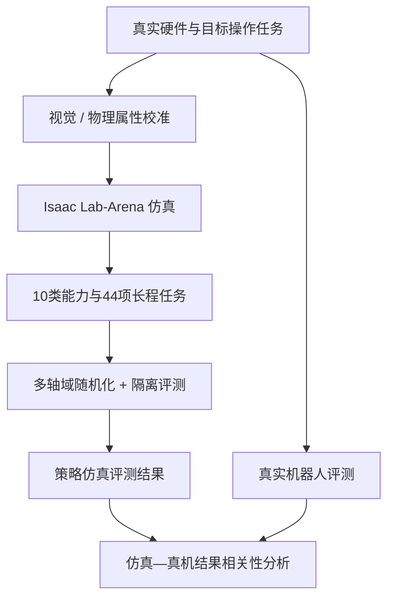
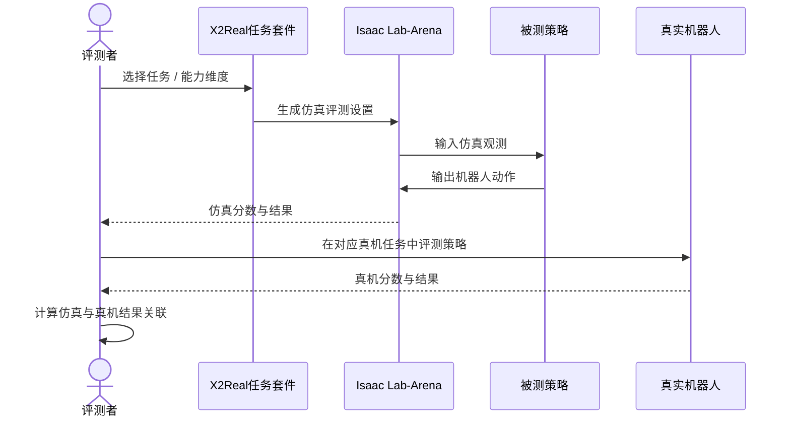

# X2Real: an eXtensive simulation benchmark for real-world generalist policies

**论文类型：** arXiv 预印本（v1，2026-09-23）  
**项目团队：** X Square Robot（自变量机器人；arXiv 摘要页未提供作者逐人机构映射）  
**作者：** Lian Ruan, Jade Yang, Sherphylan Gao, Felix Gao, Kyson Liang, Galen Liu, Ligo Wu, Lane Jin, Guu Gu, Bevan Xie, Cloud Yan, Zongzi Yuan, Kino Luo, Emma Chen, Shuwen Chen, Yang Ping, Miles Guo, Rain Sun, Kayden Zhang, Alex Du, Ruihai Wu, Liang Hao, Zhaoshuo Li, Roy Gan, Hao Wang, Qian Wang.

## 英文缩写速查

| 缩写 | 英文全称 | 本文含义 |
|---|---|---|
| X2Real | eXtensive simulation benchmark for real-world generalist policies | 本文提出的通才操作策略仿真评测基准 |
| Sim2Real | Simulation-to-Real | 仿真评测结果与真实机器人表现之间的对应 / 迁移 |
| DSL | Domain-Specific Language | Mana 是面向物理任务设计的领域专用语言 |
| HF | Hugging Face | 公开静态仿真资产集的托管平台 |
| API | Application Programming Interface | 本页图示不代表已核实的具体接口 |

## 一句话概括

X2Real 针对通才机器人操作策略评测中的仿真—真机差距、任务覆盖不足和训练 / 测试不公平，构建一个基于 NVIDIA Isaac Lab-Arena 的可扩展仿真基准。

## 为什么需要这个基准

一个策略在仿真里分数高，不一定说明它在真实机器人上也可靠。作者把现有评测的主要问题归纳为三类：

1. **保真度不足：** 仿真中的视觉或物理差异会改变策略表现。
2. **覆盖范围有限：** 短任务或单一能力不足以代表通才操作能力。
3. **评测可能被“刷分”：** 训练与测试边界不清会让评测结果失去可信度。

X2Real 把这些问题直接纳入基准设计目标，而不是只增加一组仿真任务。

## 方法与基准设计

| 设计原则 | 论文摘要明确报告的做法 |
|---|---|
| 保真度 | 校准仿真的视觉与物理属性，使其贴近真实硬件 |
| 多样性 | 以 10 个能力维度、44 个层级化长程任务覆盖基础操作、视觉定位、语言理解和双臂控制等能力 |
| 公平性 | 多轴域随机化；严格分离训练与评测流程，降低基准利用与数据泄漏风险 |

项目基于 NVIDIA Isaac Lab-Arena。Mana 是作者提出的物理领域专用语言，用于模块化任务设计和迭代性能分析。论文摘要还提到近 300 小时的标注仿真轨迹；不要将这批轨迹与 [公开静态资产集](../../sources/datasets/x2real-assets.md) 混为一谈。

### 论文主张的验证路径（概念图）

### 评测参与者之间的数据流（概念图）

> 图示仅表达论文摘要支持的基准逻辑，不代表已核实的具体 API、控制频率或仓库执行命令。

## 关键结果

论文摘要报告：仿真与真实机器人评测结果达到 **0.84 线性相关**。

这个数是相关系数，不是“84% 成功率”，也不意味着基准能对所有任务 / 本体 / 策略都作出同等准确的预测。当前可核实的摘要没有展开相关性实验的完整样本、置信区间和适用范围，阅读或引用时应回到论文全文核对口径。

## 如何使用这项工作

- 把它看成**评测基础设施**：目标是衡量并分析策略，不是提供现成控制策略。
- 对照自己的使用场景检查 44 项任务的覆盖是否匹配，尤其是操作类型、语言条件、双臂需求和长程结构。
- 运行对比时明确训练与测试任务、场景和随机化边界；否则公平性主张无法落实。
- 报告结果时同时写清仿真与真机的评测设置，避免只引用相关系数而忽略实验范围。
- 下载资源时区分论文报告的轨迹数据、仿真任务实现与静态模型资产。

## 开源与复现边界

- **项目页：** [X2Real 项目页](https://x2robot.com/en/pages/x2real)；对应工程定位见[独立项目详情](./x2real-project.md)。
- **数据资源：** [Hugging Face 静态仿真资产集](https://huggingface.co/datasets/x-square-robot/x2real-assets)。其 README 说明不包含动作、观测、视频或轨迹。
- **代码：** Hugging Face 数据集卡列出 GitHub 地址 X-Square-Robot/x2real，但本次检查 GitHub API 返回 404；不据此推断代码当前可公开访问。
- **许可证：** 数据集卡的许可证字段标为 TODO，使用 / 再分发前需要再次核实。
- 项目页本次无法被抓取工具读取；论文事实以 arXiv 摘要和可访问的公开数据集卡片为边界。

## 局限与解读边界

- 0.84 相关性是论文实验中的总体主张，不等于跨任务或跨平台保证。
- 44 项任务的数量本身不能替代对能力维度、长程阶段和测试分布的审查。
- 多轴域随机化和训练 / 评测分离能降低某些评测偏差，但并不自动证明所有任务都没有泄漏或过拟合。
- 项目公开资产包不是完整 benchmark 代码；目前不能仅凭该 HF 仓库确认任务定义、控制逻辑和策略权重均已开放。

## 与其他工作对比

| 工作 | 共同点 | 关键区别 |
|---|---|---|
| [Isaac Lab-Arena](./isaac-lab-arena.md) | X2Real 直接构建于其上 | Arena 是通用的场景 / 本体 / 任务运行时组装与评测扩展；X2Real 是在其上定义的具体任务套件，并附带视觉 / 物理校准与仿真—真机相关性验证 |
| [LIBERO](./libero-benchmark.md) | 都以固定任务套件评测操作策略 | LIBERO 侧重终身学习与分布偏移；X2Real 把仿真分数能否预测真机表现（0.84 线性相关）作为基准可信度的核心证据 |
| [RoboTwin-Phys](./paper-robotwin-phys.md) | 都关注物理差异如何影响策略评测 | RoboTwin-Phys 连续采样物理参数来测鲁棒性；X2Real 先校准贴近真机，再用多轴域随机化与训练 / 评测隔离控制公平性 |

放在[具身大模型评测基准选型闭环](../queries/embodied-eval-benchmark-selection-loop.md)中看，X2Real 属于「策略任务成功率评测」与「sim↔real 评测 gap 校准」两层的交界：它既给出任务套件，也给出仿真分数与真机分数的关联证据。仿真评测在可复现性与真实代表性之间的取舍见 [Sim vs Real 评测落差](../concepts/sim-vs-real-eval-gap.md)。

## 结论

X2Real 的贡献在于把「仿真分数是否代表真机能力」写进基准设计目标：校准保真度、44 项长程任务覆盖 10 类能力、训练 / 评测严格分离，并以 0.84 的仿真—真机线性相关作为证据。该相关性是论文实验范围内的总体主张；公开资源目前只有静态仿真资产，GitHub 仓库访问返回 404、数据集许可证仍为 TODO。现阶段更适合作为仿真评测设计的参考，完整复现与横向引用需等代码和实验细节公开后再核对。

## 关联页面

- [X2Real 项目详情](./x2real-project.md) — 基准工程入口、资产与复现边界
- [Isaac Lab-Arena](./isaac-lab-arena.md) — 论文摘要中的仿真基座
- [Day 6 导读](../overview/humanoid-motion-intelligence-day6-engineering-deployment.md) — 原始资料导航
- [Sim2Real](../concepts/sim2real.md) — 仿真与真机迁移
- [机器人操作](../tasks/manipulation.md) — 任务领域

## 参考来源

- [arXiv:2609.27449](https://arxiv.org/abs/2609.27449) — 题录与摘要
- [X2Real 项目页](https://x2robot.com/en/pages/x2real)
- [x-square-robot/x2real-assets](https://huggingface.co/datasets/x-square-robot/x2real-assets) — 静态仿真资产说明与下载边界
- [X2Real 论文来源归档](../../sources/papers/x2real_arxiv_2609_27449.md)
