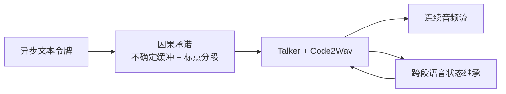

# X2Streaming-TTS：令牌级因果流式语音合成

**X2Streaming-TTS**（*Causal Token-Level Text-to-Speech from Streaming Text with Speech-State Inheritance*；[arXiv:2608.18661](https://arxiv.org/abs/2608.18661)）由 **自变量机器人（X Square Robot）** 提出：服务机器人语音交互的低时延上限不只取决于声学模型 FLOPs，还取决于系统如何在 **前缀不确定** 时持续发声。

## 一句话定义

**只消费已到达文本令牌，用因果承诺缓冲歧义前缀，并跨段继承 Code2Wav/Talker 状态，实现严格令牌级流式 TTS。**

## 英文缩写速查

| 缩写 | 英文全称 | 简要说明 |
|------|----------|----------|
| TTS | Text-to-Speech | 文本转语音 |
| TTFT | Time To First Token (audio) | 首音频令牌延迟 |
| HRI | Human-Robot Interaction | 人机交互 |
| KV | Key-Value cache | Talker 历史状态缓存 |
| Code2Wav | Code-to-Waveform | 声学解码模块 |

## 为什么重要

- LLM 流式输出文本时，句级 TTS 仍要等标点/句边界 → **交互空窗**。
- 「3」「3rd」等前缀歧义若过早承诺会读错；过晚承诺则增加延迟。
- 128 并发下 median TTFT **260.8 ms** 仍可控，适合多用户服务场景。

## 核心信息

| 项 | 内容 |
|----|------|
| **机构** | 自变量机器人（X Square Robot） |
| **接口** | **零未来 lookahead** 的令牌级输入 |
| **延迟** | 单请求首音频令牌 **15.8 ms**；128 并发 **260.8 ms** |
| **开源** | **待发布** — 论文链 [GitHub](https://github.com/X-Square-Robot/X2Streaming-TTS) **404**（2026-08-21） |

## 核心原理

### 因果承诺 + 状态继承

1. **Causal commitment** — 不确定性感知缓冲；容量自适应；标点感知分段消解歧义。
2. **Speech-state inheritance** — 段间携带完整 Code2Wav 状态 + 部分 Talker KV。
3. **对比伪流式** — 多数指标优于等待句级上下文的基线；质量接近离线 TTS。

## 源码运行时序图

**不适用** — 截至 **2026-08-21** 无可访问官方仓库或项目页。

## 工程实践

| 项 | 建议 |
|----|------|
| 与机器人栈集成 | TTS 应接 **LLM token stream**，而非 final string |
| 延迟指标 | 报告 TTFT **与** 并发度；单用户 15.8 ms 不能代表多用户 |
| 歧义测试 | 刻意构造数字/缩写前缀 case（如 "3" vs "3rd"） |
| 复现 | 跟踪 X Square 是否发布 cited 仓库 |

## 实验与评测

- 主客观指标优于伪流式模型；质量接近所评离线基线。
- **TTFT：** 15.8 ms（单请求 median）；260.8 ms（128 并发 median）。

## 结论

**机器人语音交互的低时延上限，取决于如何管理不确定前缀，而不只是声学模型推理速度。**

1. **令牌级因果** — 真流式须零 future text lookahead。
2. **因果承诺** — 缓冲+分段是歧义与延迟的折中核心。
3. **状态继承** — 跨段自然度靠 Code2Wav/Talker 状态延续。
4. **并发** — 128 用户仍 sub-300 ms TTFT 有工程价值。
5. **开源** — cited 仓库 404；部署需等官方发布。

## 与其他工作对比

| 对照 | 差异读法 |
|------|----------|
| 句级 TTS | 要等标点/句边界才开口 → LLM 边生成边等待的**交互空窗**；本文只消费已到达令牌，零 future lookahead |
| 伪流式（等句级上下文再切块播） | 接口看似流式、内部仍依赖完整句上下文；本文多数主客观指标优于伪流式基线，质量接近离线 TTS |
| 过早承诺歧义前缀 | 「3」直接读出会在后续变成「3rd」时读错；本文用不确定性感知缓冲 + 标点感知分段做折中 |
| 过晚承诺 | 缓冲越久越安全但延迟越高；容量自适应缓冲是这条 **质量–延迟 frontier** 上的取舍点 |
| 段间无状态延续 | 分段合成会在段边界出现不自然断裂；本文跨段继承完整 Code2Wav 状态 + 部分 Talker KV |
| 只报单请求延迟的 TTS 工作 | 单请求 median TTFT **15.8 ms**，128 并发升到 **260.8 ms**——服务机器人选型必须同时看并发度，不能只引单用户数字 |

## 局限与风险

- **无公开实现** — 404 仓库阻碍复现与集成。
- **语种/说话人** — 论文评测集覆盖需查 PDF；中文服务机器人场景待验证。
- **与 ASR/LLM 耦合** — 端到端延迟含上游 LLM，不单 TTS。
- **质量-延迟 frontier** — 极端低缓冲可能牺牲自然度（见论文消融）。

## 关联页面

- [Teleoperation](../tasks/teleoperation.md)
- [SHRIMP](./paper-shrimp.md) — 自然语言→机器人任务（不同模态，可组合）
- [WALL-SS](./paper-wall-ss.md) — 同机构 next-scale 世界模型

## 参考来源

- [X2Streaming-TTS 论文归档](../../sources/papers/x2streaming_tts_arxiv_2608_18661.md)
- [具身智能小站 8 篇综述](../../sources/blogs/wechat_embodied_station_8_papers_world_model_memory_2026-08-21.md)

## 推荐继续阅读

- [arXiv:2608.18661 PDF](https://arxiv.org/pdf/2608.18661)
