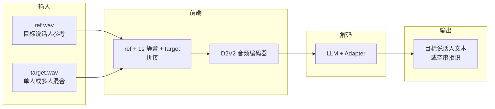
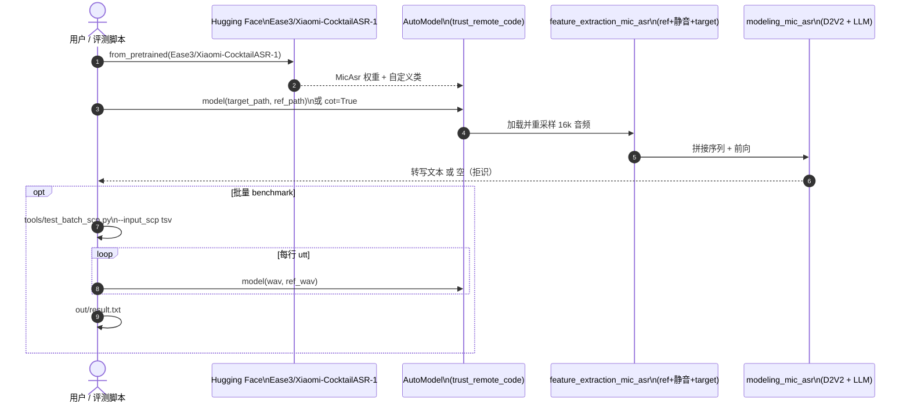

# Xiaomi-CocktailASR-1（目标说话人 LLM-ASR）

**Xiaomi-CocktailASR-1**（*Xiaomi-CocktailASR-1 Technical Report*，[arXiv:2609.11274](https://arxiv.org/abs/2609.11274)，小米 Xiaomi Research；[代码](https://github.com/xiaomi-research/xiaomi-cocktailasr-1) · [权重](https://huggingface.co/Ease3/Xiaomi-CocktailASR-1)）是面向 **鸡尾酒会场景** 的 **目标说话人自动语音识别（TS-ASR）** 大模型：用 **参考语音** 作 voiceprint prompt，在 **多人混合音频** 中直接转写目标说话人，**不需要** 经典 speech separation 前端；同一套权重在 **单说话人** 场景仍可与主流 ASR 可比，并具备 **目标缺席时的空输出拒识** 与可选 **Chain-of-Thought** 推理。

## 一句话定义

给定 **ref.wav（要听谁）** 与 **target.wav（混合场）**，一次 `model(target, ref)` 只输出目标说话人的文本——目标不在场则 **空串**，避免 Whisper-only 在群聊里「听错人」。

## 英文缩写速查

| 缩写 | 英文全称 | 简要说明 |
|------|----------|----------|
| TS-ASR | Target-Speaker Automatic Speech Recognition | 只转写指定说话人；本文核心任务 |
| ASR | Automatic Speech Recognition | 语音 → 文本 |
| LLM-ASR | LLM-based Automatic Speech Recognition | 音频编码 + 大语言模型解码 |
| WER | Word Error Rate | 词错误率；混合/单人集主指标 |
| FRR | False Rejection Rate | 正样本被误拒识为空的比例 |
| CoT | Chain-of-Thought | 推理过程与答案分 tag 输出 |
| D2V2 | Data2Vec 2.0–style encoder | README/HF 包内音频编码器配置名 |

## 为什么重要

- **人形/HRI 示教与群聊：** [人形智能语音交互](../methods/humanoid-voice-interaction.md) 默认 ASR 不区分说话人；遥操作示教、多人讨论时更需要 **只听操作者** 或 **注册声纹后的指令者**——TS-ASR 比「全转写再 NLU 过滤」更省错链。
- **统一单人/多人：** 传统 TS 管线常在混合集强、单人集弱；本文主张 **一套模型** 覆盖，减少机器人栈里「会议模式 / 单人模式」切换。
- **拒识 = 安全相关：** 参考说话人不在混合音频中时输出空，可配合唤醒/声纹门控，降低 **误触发技能**（对比无拒识的通用 ASR）。
- **与 SATS 正交：** [MOSS Transcribe Diarize](./paper-moss-transcribe-diarize.md) 一次输出 **所有人** 的 SATS；本文在 **已知要听谁**（有 ref）时更贴 **定向监听** 产品形态。

## 核心信息

| 项 | 内容 |
|----|------|
| 机构 | 小米（Xiaomi Research） |
| 任务 | **TS-ASR**（目标说话人转写）+ 单说话人 ASR + **负样本拒识** |
| 输入 | 16 kHz 单声道 `target` + `ref`（非 16 kHz 自动重采样）；内部 **ref + 1 s 静音 + target** 拼接 |
| 代码 | [xiaomi-research/xiaomi-cocktailasr-1](https://github.com/xiaomi-research/xiaomi-cocktailasr-1) |
| 权重 | [Ease3/Xiaomi-CocktailASR-1](https://huggingface.co/Ease3/Xiaomi-CocktailASR-1)（`trust_remote_code=True`） |
| 开源核查 | **已开源**（2026-09-25）：推理 API + 批量脚本 + demo；**训练代码未在官方仓发布** |

## 核心原理

### 架构（HF 包 + 技术报告）

- **音频：** 内联 **D2V2 风格** 编码器（`d2v2_config.json`）提取混合轨与参考轨特征；特征侧由 `feature_extraction_mic_asr.py` 完成 ref/target 拼接与前端。
- **文本：** **LLM 骨干**（`text_config`）自回归解码；Adapter 连接声学与文本空间（权重合并在 `pytorch_model.bin`）。
- **提示：** 标准模式 prompt 要求 *仅转写目标说话人*；CoT 模式要求分步推理并写入 `<think>` / `<answer>`。
- **无分离头：** 相对「分离 → ASR」级联，端到端直接优化 **目标文本**，减轻分离错误传播。

### 流程总览

## 源码运行时序图

节点对齐 [`sources/repos/xiaomi-cocktailasr-1.md`](../../sources/repos/xiaomi-cocktailasr-1.md) 与官方 README；**模型类在 HF 仓库**，GitHub 仓提供调用与批量评测。

关键复现路径：`pip install torch torchaudio transformers soundfile` → `AutoModel.from_pretrained(..., trust_remote_code=True).cuda()` → `model("target.wav", "ref.wav")`；负样本用 **错误 ref** 或 demo 负例验证空输出。

## 工程实践

| 项 | 建议 |
|----|------|
| 最短推理 | HF 权重 + README 单条 API；`bfloat16` + GPU |
| 批量评测 | `tools/test_batch_scp.py` + 5 列 TSV；可选 `--cot` |
| ref 从哪来 | 唤醒后 **短注册句**、示教开始前 **3–10 s 干净语音**、或上一轮 TTS 回放（慎用于回声场景） |
| 人形语音栈 | 作 [ASR 上游](../methods/humanoid-voice-interaction.md)：**ref=操作者** → 文本送 NLU/LLM；无 ref 时仍可用同模型（单人轨） |
| vs MOSS SATS | 要 **全场会议纪要** → MOSS；要 **只听一人** 且能录 ref → 本文 |
| vs 云 API | Gemini/Qwen3-ASR 在 README 混合集 WER 远高于本文，但需自托管 GPU 与 ref 管理 |

## 实验与评测

### 客观指标（官方 README，WER ↓ 除非注明）

| 场景 | 数据集 | Xiaomi-CocktailASR-1 | 读榜提示 |
|------|--------|----------------------|----------|
| 混合·模拟 | LibriMix 2mix | **4.11** | 明显优于 Qwen3-ASR / Gemini / StepAudio |
| 混合·真实 | AliMeeting Far | **20.63** | 略优于 prior SOTA ~27.5 |
| 混合·真实 | AMI SDM | **21.81** | 与 prior SOTA ~22.0 可比 |
| 单人 | LibriSpeech | 1.73（non-empty WER） | 与 Qwen3-ASR-1.7b 等接近 |
| 拒识 | LibriSpeech neg | **79.59%** 拒识率 | Qwen3/StepAudio **0%**；Gemini 略高但混合 WER 差 |
| 误拒 | LibriSpeech FRR | **0.36%** | 有拒识能力时的正样本代价 |

**CoT：** LibriMix 2mix 上 non-CoT **4.11** → CoT **3.87**（小幅增益；3mix 几乎不变）。

## 与其他工作对比

| 路线 | 代表 | 何时用 | 局限 |
|------|------|--------|------|
| 通用 ASR | Whisper / Qwen3-ASR | 单人、干净拾音 | 混合场景 WER 暴涨；**无目标说话人** |
| 分离 + ASR | 经典 cocktail pipeline | 无 ref、要所有人 | 分离错误传播；难统一单人精度 |
| 说话人 embedding TS | Conformer TS-ASR 等 | 有 ref | 论文称常牺牲单人性能、缺拒识 |
| **SATS 全说话人** | [MOSS Transcribe Diarize](./paper-moss-transcribe-diarize.md) | 会议转写、要时间戳+ID | 不解决「只听一人」；128k 长会 |
| **本文** | CocktailASR-1 | **有 ref** 的混合场 | 必须维护 ref；**无** 原生多说话人全文+时间戳 |

## 结论

**一句话总判：CocktailASR-1 把「鸡尾酒会」收成带 ref 的 LLM-ASR 单调用——混合 SOTA、单人可共存、空输出拒识可接技能门控；机器人栈里适合「只听示教者」，全场纪要仍用 SATS/分离方案。**

1. **先问有没有 ref** — 无稳定参考声纹时，TS-ASR 产品形态不成立；有 ref 时比通用 ASR 在 LibriMix/AliMeeting 上差距极大。
2. **拒识与 FRR 要一起验收** — 负样本拒识 ~70–80% 的同时，正样本 FRR 虽低但非零；安全关键指令建议 **二次确认** 或 **非空才触发**。
3. **CoT 是可选增益，不是默认路径** — LibriMix 2mix 约 −0.24 WER；延迟与解析 `<answer>` 成本需自测。
4. **权重在 HF、脚本在 GitHub** — 复现务必 `trust_remote_code=True`；批量用 `test_batch_scp.py` 对齐论文表。
5. **与 MOSS 互补而非替代** — 定向监听 vs 全场 SATS；[人形语音交互](../methods/humanoid-voice-interaction.md) 可按场景二选一或串联。
6. **训练未开源** — 领域微调需等官方或自研；当前 ingest 以 **推理选型** 为主。
7. **16 kHz 与拼接假设** — 现场麦阵/回声未在 README 展开；真机部署需加 AEC 与 ref 采集 UX。

## 局限与风险

- **依赖参考语音质量：** ref 与现场说话人音色/信道差异大时，WER 与拒识行为可能漂移。
- **无公开训练代码：** 仅技术报告 + 推理权重；定制域（工厂噪声）需自行微调或蒸馏。
- **非流式 API：** README 为整段文件推理；实时对话需分块策略（未在官方仓说明）。
- **与 Gemini 拒识对比不对称：** Gemini 负样本拒识率高但混合 WER 差；选型不能只看拒识率单列。
- **机构标签：** 语音 TS-ASR 与 [小米机器人 VLA](./xiaomi-robotics-1.md) 不同团队，集成时注意 **模型与算力边界**。

## 关联页面

- [人形智能语音交互](../methods/humanoid-voice-interaction.md) — ASR→NLU 闭环与多说话人上游选型
- [MOSS Transcribe Diarize](./paper-moss-transcribe-diarize.md) — 长时多说话人 SATS 对照
- [人形语音交互流水线](../queries/humanoid-voice-interaction-pipeline.md) — 工程分环落地
- [OpenLess](./openless.md) — 桌面 ASR 口述工作流（非 TS-ASR）

## 参考来源

- [论文摘录 · arXiv:2609.11274](../../sources/papers/xiaomi_cocktailasr_1_arxiv_2609_11274.md)
- [官方仓库 xiaomi-research/xiaomi-cocktailasr-1](../../sources/repos/xiaomi-cocktailasr-1.md)
- [Hugging Face 权重 Ease3/Xiaomi-CocktailASR-1](../../sources/sites/xiaomi-cocktailasr-1-hf.md)

## 推荐继续阅读

- [GitHub README · 快速开始与基准表](https://github.com/xiaomi-research/xiaomi-cocktailasr-1#%E5%BF%AB%E9%80%9F%E5%BC%80%E5%A7%8B) — 单条/CoT/批量推理
- [arXiv:2609.11274](https://arxiv.org/abs/2609.11274) — TS-ASR 问题设定与实验细节
- [MOSS Transcribe Diarize · SATS 对比](./paper-moss-transcribe-diarize.md) — 何时要「全场转写」而非「只听一人」
