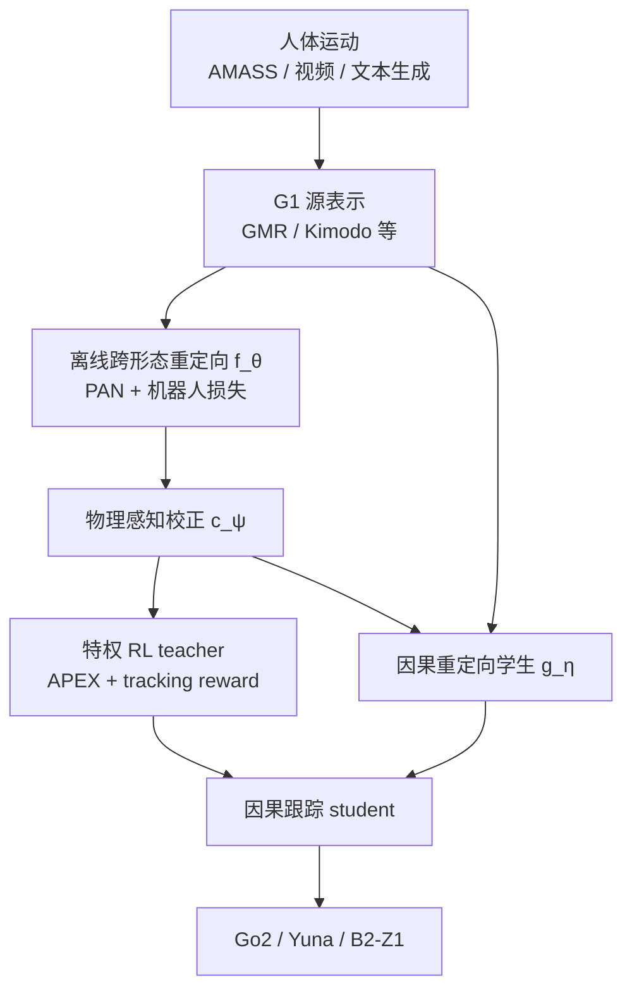

# X-Morph：跨形态人体运动先验

**X-Morph**（*Human Motion Priors for Scalable Robot Learning Across Morphologies*，[arXiv:2606.30290](https://arxiv.org/abs/2606.30290)）由 **新加坡国立大学（NUS）** 提出：把大规模人体运动转成 **非人形腿式机器人**（四足、六足、带臂四足）可跟踪、可部署的 locomotion / loco-manipulation 行为先验。项目页：<https://maker-rat.github.io/morph/>。

## 一句话定义

**人体运动不是「照抄关节」，而是经跨形态重定向与物理校正后的候选参考——再用特权 RL 跟踪并蒸馏成因果学生，让同一人体数据底物服务多种非人形形态与视频/文本接口。**

## 英文缩写速查

| 缩写 | 英文全称 | 简要说明 |
|------|----------|----------|
| X-Morph | Cross-Morphology behavior transfer | 本文端到端人体→非人形腿式行为管线 |
| PAN | Pose-aware Attention Network | 离线重定向网络的 body-part 编解码底座（Hu et al.） |
| GMR | General Motion Retargeting | 视频链路中 SMPL→G1 的在线重定向前端 |
| APEX | Action Priors Enable Efficient Exploration | 跟踪 teacher 训练用的衰减动作先验 |
| FK | Forward Kinematics | 接触/穿地/末端损失与校正度量的几何后端 |

## 为什么重要

- **补非人形数据缺口：** 人形侧已有 AMASS 级人体运动；四足/六足/带臂四足仍常靠手工奖励或小技能库——X-Morph 论证人体运动可作**跨拓扑行为底物**。
- **把重定向降级为中间件：** 与「重定向输出即最终动作」不同，明确要求 **物理校正 + 闭环跟踪**；消融显示 corrector 同时抬参考质量与跟踪指标。
- **统一交互接口：** 同一参考–跟踪栈接 **视频遥操作**、**文本→Kimodo→执行** 与下游任务初始化，避免为每个形态重训语言/视觉控制器。

## 核心信息

| 项 | 内容 |
|----|------|
| **机构** | 新加坡国立大学（NUS）；通讯 Ritwik Sharma |
| **作者** | Ritwik Sharma*†、Shivam Sood*、Arhaan Jain、Shyam Charan Kesavamoorthi、Chengyang He、Guillaume Sartoretti |
| **源表示** | 人体运动先落到 [Unitree G1](./unitree-g1.md) 关节/根速度表示，再跨形态映射 |
| **目标平台** | [Unitree](./unitree.md) Go2；Yuna 六足；B2-Z1（四足 + Z1 臂） |
| **数据** | AMASS、LAFAN1 等；任务族分 locomotion / loco-manipulation 语义对应表 |
| **开源** | **项目页 Code 未开放**（截至 **2026-08-06**，按钮 disabled） |

## 核心原理

### 三阶段：生成 → 校正 → 跟踪

1. **形态感知重定向 \(f_\theta\)**：基于 PAN 的 encode–transfer–decode；共享 body-part 潜空间 + 形态元数据；加脚滑/接地/末端对齐等机器人损失。
2. **物理感知校正 \(c_\psi\)**：离线时间残差模型，压脚滑、穿地、漂浮接触与根漂移，保留局部根运动意图。
3. **参考条件跟踪**：特权 teacher（全状态 + APEX prior + DeepMimic 式奖励）→ 因果 student 蒸馏；部署仅用本体感觉 + 短参考预览。

交互部署另训 **因果重定向学生 \(g_\eta\)**，模仿「离线重定向+校正」的干净参考，避免在线跑完整非因果栈。

### 语义对应（任务族可换）

同一机器人可换 \(\mathcal{C}^{h\rightarrow r}\)：例如 Go2 locomotion 把人腿映到四腿；loco-manipulation 则腿→后腿、臂→前腿；B2-Z1 把人右臂映到 Z1。对应质量直接决定后续可校正/可跟踪上界。

### 流程总览

## 源码运行时序图

**不适用** — 截至入库日（2026-08-06）项目页 <https://maker-rat.github.io/morph/> 的 **Code** 按钮为 disabled，公开材料无官方仓库 URL。若后续开源，应按「G1 源运动 → 离线重定向/校正 → teacher–student 跟踪 → 因果重定向在线部署」补 `sequenceDiagram`。

## 工程实践

| 项 | 做法 |
|----|------|
| 源规范化 | 先把人体运动落到 **G1**，再学跨形态，而不是从裸 SMPL 直映每个目标 |
| 对应表 | 按任务族维护 \(\mathcal{C}^{h\rightarrow r}\)（loco vs loco+manip）；形态 XML 与对应表分离 |
| 训练顺序 | 离线重定向 → corrector → 特权 tracker → 蒸馏 student → 因果重定向学生 |
| 部署双路径 | 视频：RGB→FastSAM3D Body→[GMR](../methods/motion-retargeting-gmr.md)→G1→\(g_\eta\)→tracker；文本：Kimodo→G1→整段重定向→同一 tracker |
| 读消融 | 先看参考接触指标（Table 1），再看同参考流下跟踪误差（Table 2）——证明「只重定向不够」 |
| 墙钟量级（附录） | 3090 上离线重定向 ~2 h、corrector ~5 min、因果重定向 ~15 min；4090 上 teacher ~2.5 h、student ~2 h |

## 实验与评测

**跨形态执行：** 同一视频接口在 Go2 / Yuna 上迁移走、转、蹲、上肢表达与物体交互意图；可视化关闭时参考流可达 **28.9 Hz**（30 Hz 相机）。箱体交互强调「结构化试次」而非高成功率操作策略。

**参考质量（Go2，Table 1，33 clips）：** retargeting + corrector 相对 raw network：foot slip **58.76→42.76 cm/s**（−27.2%），penetration p95 **11.34→6.02 cm**（−46.9%），contact height / floating / joint acc 同步下降。

**跟踪（Yuna 直播视频流，Table 2）：** corrected refs 相对 uncorrected：Joint MAE **6.57→5.45°**，yaw-rate RMSE **0.896→0.651**，foot slip **29.29→24.30 cm/s**。

**下游：** 六足开门为定性 case study——用重定向 loco-manipulation 先验初始化后续策略；作者**不声称**相对从零 RL 的样本效率优势。

## 结论

**要把人体运动库扩到非人形腿式机器人，关键不是「更炫的跨拓扑动画」，而是把重定向产物校正成可跟踪参考，再经 teacher–student 变成统一参考接口；corrector 是从「看着像」到「跟得住」的杠杆。**

1. **选型：** 目标是 Go2/六足/带臂四足等**非人形**且缺自有运动库时，优先看 X-Morph 这类「人体底物 + 形态对应表」管线，而不是只堆人形 WBT。
2. **读主指标：** 同时看参考接触伪影（slip/penetration）与跟踪误差；仅报告视觉重定向质量不够。
3. **接口复用：** 视频/文本条件走同一 G1→参考→tracker 栈，避免每形态重做语言/视觉策略。
4. **对应表是上限：** 手工 \(\mathcal{C}^{h\rightarrow r}\) 差会直接毁掉校正与跟踪；换任务族先改对应，再改网络。
5. **下游读法：** 开门等结果是**先验初始化**叙事，不是受控 sample-efficiency 结论。
6. **复现边界：** 截至入库日无官方代码；视频链路还绑单目姿态估计延迟与误差。

## 与其他工作对比

| 维度 | X-Morph | [GMR](../methods/motion-retargeting-gmr.md) / 运动学重定向 | [ReActor](../methods/reactor-physics-aware-motion-retargeting.md) | [ZEST](../methods/zest.md) |
|------|---------|--------------------------------------------------------------|-------------------------------------------------------------------|--------------------------------|
| 主目标形态 | 非人形腿式（四/六足/带臂） | 多人形为主，工程前端 | 含四足的跨形态参考生成 | 人形为主，跨形态零样本部署 |
| 重定向角色 | 中间候选参考 | 常作运动学输出 | 双层优化内与跟踪共训 | 数据当物理正则，弱依赖显式重定向网 |
| 物理处理 | 独立 offline corrector | 需另接动力学过滤 | 仿真内上层参考形变 | RL 自适应采样/课程 |
| 部署接口 | 视频 + 文本 + 下游先验 | 轨迹资产 | 参考生成 | 高动态技能策略 |
| 代码（本库核查） | **未开放** | 已开源 | 见对应页 | 见对应页 |

## 局限与风险

- 语义对应依赖人工；对应错误无法靠 corrector 完全挽回。
- Corrector 非完整轨迹优化，不保证动力学可行；复杂地形未系统验证。
- 视频部署受单目姿态估计遮挡/快速运动/视角影响。
- 下游任务仅定性；箱体/开门成功不等于操作策略 SOTA。
- **开源缺口：** 选型复现前先核实项目页 Code 是否上线。

## 关联页面

- [动作重定向知识链](../overview/hub-motion-retargeting.md) — 重定向→跟踪全链路入口
- [跨具身迁移知识链](../overview/hub-cross-embodiment.md) — human→非人形迁移坐标
- [GMR](../methods/motion-retargeting-gmr.md) — 视频链路 SMPL→G1 前端
- [ReActor](../methods/reactor-physics-aware-motion-retargeting.md) — 物理感知跨形态参考的另一路线
- [ZEST](../methods/zest.md) — 跨形态高动态技能迁移对照
- [Motion Retargeting 概念](../concepts/motion-retargeting.md) — 任务定义
- [跨具身迁移策略](../queries/cross-embodiment-transfer-strategy.md) — 选型决策树
- [Unitree G1](./unitree-g1.md) — 源运动中间表示
- [Unitree](./unitree.md) — Go2 / B2 等目标平台族

## 参考来源

- [sources/papers/xmorph_arxiv_2606_30290.md](../../sources/papers/xmorph_arxiv_2606_30290.md) — 本次 ingest 归档
- [sources/sites/maker-rat-morph-github-io.md](../../sources/sites/maker-rat-morph-github-io.md) — 项目页与开源核查
- [arXiv:2606.30290](https://arxiv.org/abs/2606.30290) — 论文与附录
- [项目页](https://maker-rat.github.io/morph/) — 演示与入口

## 推荐继续阅读

- Hu et al., *Pose-Aware Attention Network for Flexible Motion Retargeting by Body Part* (TVCG 2024) — 离线重定向底座
- Araujo et al., *Retargeting Matters* / GMR ([arXiv:2510.02252](https://arxiv.org/abs/2510.02252))
- Sood et al., *APEX* ([arXiv:2505.10022](https://arxiv.org/abs/2505.10022)) — 跟踪 teacher 的动作先验
- Rempe et al., *Kimodo* ([arXiv:2603.15546](https://arxiv.org/abs/2603.15546)) — 文本条件人体运动生成
