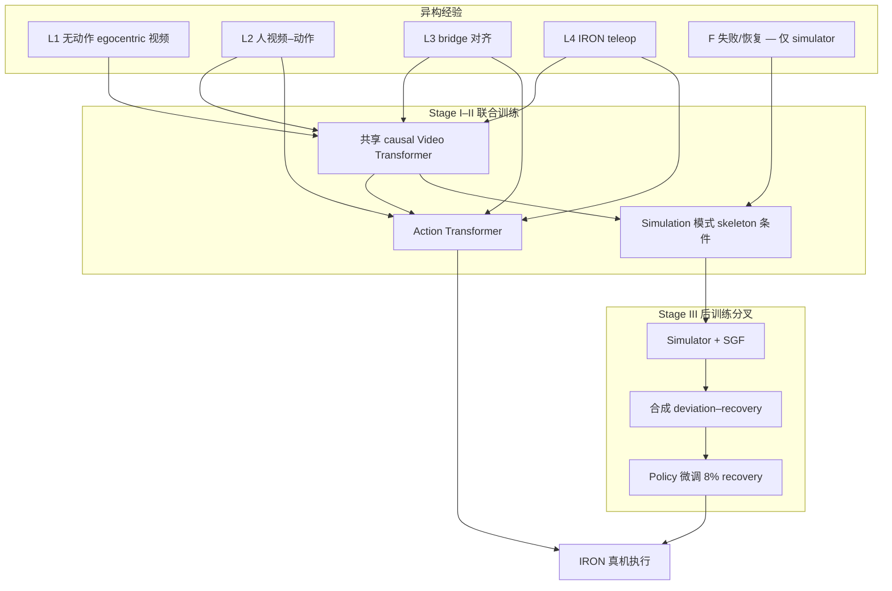

# XPACE（Joint World and Action Modeling · arXiv:2609.17372）

**XPACE**（*XPACE: Joint World and Action Modeling from Heterogeneous Experience*，[arXiv:2609.17372](https://arxiv.org/abs/2609.17372)）由 **XPENG Robotics（小鹏机器人）** 提出：[项目页](https://xpeng-robotics.github.io/xpace/) · [技术报告 PDF](https://xpeng-robotics.github.io/xpace/assets/papers/xpace.pdf)。同一模型既是 **world action model**（联合预测可执行动作与未来视频），也是 **world simulator**（给定 skeleton 控制预测视觉后果），在 **IRON** 人形上验证异构经验训练与仿真驱动 policy 自改进。

## 一句话定义

**用共享 video backbone 把 WAM 与 simulator 焊成一体：无动作视频学动力学，人/机示范联合学控制，simulator 再合成 deviation–recovery 给 policy 做闭环微调。**

## 英文缩写速查

| 缩写 | 英文全称 | 简要说明 |
|------|----------|----------|
| WAM | World Action Model | 联合未来视频与可执行动作的策略/模型 |
| MoT | Mixture-of-Transformers | 非对称多 Transformer 混合架构（本工作 video/action 分支） |
| SGF | Self-Gradient Forcing | 自梯度 forcing，适配 simulator 到自回归 rollout 上下文 |
| DAgger | Dataset Aggregation | 经典交互式模仿学习；本文指用合成 recovery 数据微调 policy |
| IL | Imitation Learning | 模仿学习；XPACE 主训练范式为示范 + 合成 recovery |

## 为什么重要

- **把「学世界」和「学动作」收成一条管线：** 相对纯反应式 [VLA](../methods/vla.md) 或单独 [generative world models](../methods/generative-world-models.md)，XPACE 用 **同一 video backbone** 同时服务 policy 与 simulator，减少 world–action 表征分裂。
- **异构经验有结构化入口：** 5000h 数据分 L1–L4 层 + bridge，明确 **哪些进 policy 模仿、哪些只训 simulator**（失败/恢复集），对「人视频 + 机器人 teleop」混训有工程模板价值。
- **simulator 不是只用来 roll 视频：** deviation–recovery 合成 + 8% recovery 混合微调，把 world model 变成 **policy self-improvement 引擎**（与 [robot-world-models-training-loop-taxonomy](../overview/robot-world-models-training-loop-taxonomy.md) 中「仿真生成监督」支路一致）。
- **真机读点在人–机迁移与 OOD 任务：** 叠碗等 **不在 robot demo 中** 的行为仍可从 human/bridge 迁移；recovery 微调把平均成功率从 **61.7% 拉到 86.7%**（项目页报告）。

## 核心信息

| 项 | 内容 |
|----|------|
| **机构** | XPENG Robotics（小鹏机器人） |
| **平台** | IRON 人形（真机评测 IRON-R01-1.11） |
| **数据规模** | 约 **5000h** embodied video（L1 无动作 + L2 人动作 + L3 bridge + L4 IRON teleop） |
| **开源** | **未开源** — 项目页仅链 [xpeng-robotics](https://github.com/xpeng-robotics) 组织，**无 XPACE 仓库/权重**（核查 2026-09-20） |

## 核心结构

| 模块 | 作用 |
|------|------|
| **共享 Video Transformer** | Causal video backbone；policy 与 simulator 共用视觉动力学表征 |
| **Action Transformer** | 读多级 video feature + 当前 state → **16-step action chunk**；embodiment-specific I/O 投影对齐人/机动作 schema |
| **Simulation 分支** | 历史 + **prescribed skeleton controls** + camera pose → 未来视频；**无语言指令、无 action 输出** |
| **数据分层** | L1 无动作视频；L2 人视频–动作；L3 task/appearance bridge；L4 IRON 示范；**F 失败/恢复仅 simulator** |
| **Stage I** | 预训练 video backbone 适配具身视频（**无动作监督**） |
| **Stage II** | Flow-matching 联合训练；每步等概率采样 video–action 或 simulation；human→bridge→robot **三相位**粗到细 |
| **Stage III-sim** | SGF 适配 simulator 到自生成上下文；围绕专家 pivot 扰动 EE → 渲染 deviation/recovery → 过滤 |
| **Stage III-policy** | 自 Phase II-c 复制；**8% 合成 recovery + 92% 原配方** 微调；simulator 固定 |

### 流程总览

## 源码运行时序图

**不适用**（截至 2026-09-20：项目页与 [xpeng-robotics](https://github.com/xpeng-robotics) 组织均未发布 XPACE 可运行代码、权重或 README 入口；仅有技术报告与演示页）。

## 实验与评测

### 仿真（视频预测）

| 设置 | 要点 |
|------|------|
| 分辨率 / 长度 | 480×832；97 与 193 帧 horizon |
| Skeleton 条件 | **Token addition** 在 ID/OOD 上 PSNR/SSIM/DINO 优于 AdaLN、cross-attention、channel concat |
| SGF | 相对 baseline 长程 PSNR +0.89~1.01 dB，生成 **~3× 更快**（50→8 ODE steps） |
| Recovery simulator | Phase II-c + SGF；97 帧 ID PSNR **19.73 dB**（项目页 Table 3） |

### 离线 policy（teacher-forced）

- 19 个 held-out 子集（ID pick-place + OOD 场景/物体/指令/行为变体）。
- Stage I 视频预训练：满量 exposure 相对零 exposure **−12.5%** benchmark action loss。
- Human–robot co-training 相对 robot-only：**−14.0%** action loss（vs 先 human 再 robot-only 的 **−8.5%**）。
- 按任务覆盖分层：robot 缺示范但 human 密集时 co-training **−22.7%** loss。

### 真机（IRON，20 trials/task）

| 对比 | 平均成功率 | 备注 |
|------|------------|------|
| GR00T | 6.7% | 同监督语料；XPACE 独得 Stage I 视频适配 |
| DreamZero | 40.0% | 同上 |
| **XPACE** | **68.3%** | 香蕉 pick-place / 倒水 / **叠碗**（叠碗无 robot demo） |
| XPACE + recovery DAgger | **86.7%** | 相对微调前 61.7%；倒水 50%→95% |

**读法：** headline 数字比较的是 **完整系统 + 训练配方**（含 Stage I 与异构数据），不宜与单模块 ablation 或不同任务套件直接横比；叠碗等任务的成功定义以项目页 **full completion** 为准。

## 与其他工作对比

| 维度 | XPACE | 邻近读法 |
|------|-------|----------|
| **WAM 族** | 联合 video+action，共享 backbone | [DreamWAM](./paper-dreamwam.md) 强调 beyond-RGB 结构化未来；[world-action-models](../concepts/world-action-models.md) 总览 |
| **纯 world model** | simulator 分支 + SGF 长程 rollout | [Qwen-RobotWorld](./paper-sa-2606-17030-qwen-robotworld-unifying-embodied-world-modeling.md) 偏语言条件视频轨迹 |
| **VLA 基线** | 真机对比 GR00T / DreamZero | [isaac-gr00t](./isaac-gr00t.md) — 注意 XPACE 额外 Stage I 与异构数据 |
| **自改进** | Simulator 合成 recovery + 少量混合微调 | 区别于纯 online RL；recovery 数据 **过滤视觉一致性** 后进入 policy |

## 局限与风险

- **未开源：** 无法复现 5000h 数据混合比例、action schema 与 IRON 控制栈；选型应视为 **方法参考 + 真机报告**。
- **对比口径：** 真机实验 XPACE 独享 Stage I 视频预训练，与 GR00T/DreamZero 比的是 **系统级 recipe**，不是权重结构 ablation。
- **Simulator 闭环诊断：** policy 驱动 simulator 可提前暴露指令跟随错误，但 **不等于** 真机成功率上界。
- **Recovery 比例敏感：** 8% 合成混合 + 额外微调预算；换平台/任务需重新标定。

## 结论

**XPACE 把 world simulator 当作 policy self-improvement 引擎，用共享 video backbone 把人视频、bridge 与 IRON 示范焊进同一 WAM，并在真机上证明异构训练与合成 recovery 的叠加增益。**

1. **开源：未发布** — 仅有项目页与技术报告；部署前勿假设可复现训练/推理栈。
2. **架构选型：** 需要 **同一模型** 既 rollout 又出动作时，优先理解 video–action / simulation **双模式切换** 与 failure 数据 **不进 IL** 的边界。
3. **数据配方：** L1 无动作视频 + L2–L4 渐进 grounding 是 headline 鲁棒性的前提；robot-only 会显著掉点（项目页 position/distractor 消融）。
4. **人–机迁移：** 关注 **robot demo 缺失但 human 密集** 的任务族（如叠碗、关抽屉）；co-training 优于「human 预训再 robot-only FT」。
5. **自改进路径：** SGF 适配 simulator → 合成 recovery → **8% 过滤混合** 微调；倒水任务增益最大，说明 **接触/流体** 类任务最吃 recovery 监督。
6. **评测读法：** 68.3% vs 40% vs 6.7% 是 **三任务平均**；逐任务进度与 OOD 子集 action loss 需分开解读。
7. **跟进：** 监视 [xpeng-robotics](https://github.com/xpeng-robotics) 是否发布 XPACE 仓库或权重。

## 关联页面

- [world-action-models](../concepts/world-action-models.md)
- [generative-world-models](../methods/generative-world-models.md)
- [robot-world-models-training-loop-taxonomy](../overview/robot-world-models-training-loop-taxonomy.md)
- [manipulation](../tasks/manipulation.md)
- [DreamWAM](./paper-dreamwam.md)
- [isaac-gr00t](./isaac-gr00t.md)

## 参考来源

- [xpace_arxiv_2609_17372.md](../../sources/papers/xpace_arxiv_2609_17372.md)
- [xpace-project.md](../../sources/sites/xpace-project.md)
- [wechat_senlanke_weekly_manipulation_2026-09-14_18.md](../../sources/blogs/wechat_senlanke_weekly_manipulation_2026-09-14_18.md)
- [arXiv:2609.17372](https://arxiv.org/abs/2609.17372)

## 推荐继续阅读

- [XPACE 项目页](https://xpeng-robotics.github.io/xpace/)
- [技术报告 PDF](https://xpeng-robotics.github.io/xpace/assets/papers/xpace.pdf)
- [depth-wam 学习路线](../../roadmap/depth-wam.md)
