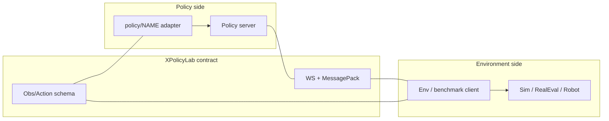
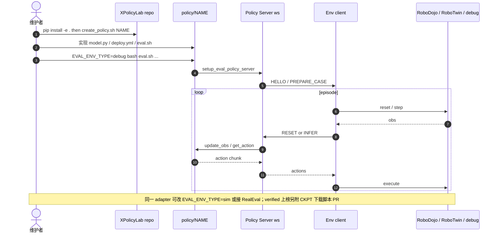

# XPolicyLab（统一策略评测部署标准 · arXiv:2608.09892）

**XPolicyLab**（*A Unified Standard and Open Ecosystem for Robot Policy Evaluation and Deployment*，[arXiv:2608.09892](https://arxiv.org/abs/2608.09892)；[项目页](https://xpolicylab.github.io/)；[代码](https://github.com/XPolicyLab/XPolicyLab)）由 **香港大学（HKU）MMLab** 与 **清华大学（Tsinghua）** 主导社区维护：面向异构 VLA / WAM / 扩散 / IL 策略，提供 **共享观测–动作契约 + 依赖隔离 client/server**，使「适配一次」即可对接多基准、仿真与真机。工程入口见工具页 [XPolicyLab](./xpolicylab.md)。

## 一句话定义

把「接 N 个策略到 M 个评测环境」从 \(O(NM)\) 降到 \(O(N{+}M)\)——策略侧只写一个 adapter，环境侧只写一个 client。

## 英文缩写速查

| 缩写 | 英文全称 | 简要说明 |
|------|----------|----------|
| VLA | Vision-Language-Action | 仓内主要适配族之一 |
| WAM | World-Action Model | 仓内世界–动作模型适配族 |
| WS | WebSocket | 默认 policy-server 传输 |
| CKPT | Checkpoint | 官方榜 verified 必须对齐的权重 |
| RealEval | RoboDojo Real-World Evaluation | 真机云评测侧环境客户端 |
| PR | Pull Request | 社区接入与上榜提交形态 |

## 为什么重要

- **评测可比性的系统瓶颈在接线，不在再写一个任务脚本：** 相机命名、通道序、夹爪缩放等 silent 分歧会毁掉跨策略比较。
- **基准不必各自维护模型 serving 栈：** RoboTwin / RoboDojo 等定义「评什么」；XPolicyLab 定义「策略怎么被统一调用」。
- **上榜治理入口：** RoboDojo verified 分数公开前须经本仓释放训推与 evaluated checkpoint。
- **集成税可测：** 论文给出受控研究与 agent skills 的小时级对照，而不仅是口号。

## 核心信息

| 字段 | 内容 |
|------|------|
| 机构 | 香港大学（HKU）MMLab；清华大学（Tsinghua）；XPolicyLab Community |
| 发表 | arXiv preprint（2026-08） |
| arXiv | [2608.09892](https://arxiv.org/abs/2608.09892) |
| 项目页 | <https://xpolicylab.github.io/> |
| 代码 | [XPolicyLab/XPolicyLab](https://github.com/XPolicyLab/XPolicyLab)（Apache-2.0） |
| 规模（论文日） | **42** 策略适配（2026-08-08 Table I） |
| 对接榜 | RoboTwin；RoboDojo-sim；RoboDojo-real |

## 核心原理

### 输入 / 输出

| 侧 | 内容 |
|------|------|
| 观测 schema | \(\mathbf{o}_t=\{\mathbf{v}_t,\mathbf{q}_t,\mathbf{p}_t,\ell,\mathbf{m}_t\}\)；图像解码在 serving 层统一 |
| 动作 | 关节 / EE；embodiment 维在配置而非硬编码进 adapter |
| 策略 API | `__init__` → `update_obs` → `get_action`（可 batch）→ `reset` |
| 部署拓扑 | policy server 与 env client 进程隔离；可本机或远端 GPU |

### 流程总览

### 关键机制（压缩）

1. **语义边界 vs 执行边界：** schema 管表示；WS 管进程与拓扑，互不绑架对方 conda。
2. **异构留在策略侧：** 网络结构、解码器、horizon、训练框架均不由标准规定。
3. **有状态与 chunk：** `reset` 清 episode 状态；执行多少步 chunk 由知道控制频率的 env 侧决定。
4. **可靠性进契约：** 请求 ID 缓存防重试双推理；server instance ID 变化即中止 trial。
5. **符合性分层：** 静态检查 → offline closed-loop debug client → 再接仿真/真机。

## 源码运行时序图

官方仓可运行路径对齐 `scripts/create_policy.sh`、`policy/*/eval.sh` 与 `client_server/`：

关键复现：先 `EVAL_ENV_TYPE=debug` 验契约，再接仿真；官方榜以云管线为准。

## 工程实践

| 项 | 建议 |
|----|------|
| 学参考 | 读 `policy/demo_policy` |
| 建骨架 | `bash scripts/create_policy.sh <NAME>` |
| 无仿真门禁 | `EVAL_ENV_TYPE=debug` |
| Agent 加速 | 仓内 Cursor/Claude skills 做 scaffold / audit |
| 上榜 | CONTRIBUTING：PR + HF/ModelScope checkpoint 脚本 |
| 工具页 | 日常导航见 [XPolicyLab](./xpolicylab.md) |

## 实验与评测

| 设定 | 结果要点 |
|------|----------|
| 覆盖 | **42** 策略（VLA / WAM / 扩散 / 记忆 / IL） |
| 复杂度局部性 | 模型侧代码量差一个数量级；环境侧闭环仍贴近固定参考几行 |
| 集成代价（受控） | 代表策略 **>5 h → ~2 h**；agent skills **~30 min** |
| 复用 | 同一 adapter → RoboTwin + RoboDojo-sim + RoboDojo-real |

## 结论

**跨策略公平评测与部署的第一刀，应砍在「统一契约 + 依赖隔离 serving」，而不是再为每个基准写一套模型胶水。**

1. **选型时先问「是否只需写一个 adapter」** — 若仍要为每个环境改预处理，就还没吃到 O(N+M)。
2. **数字引用写核查日** — 论文 42、早期公告 40+/30 都可能过时，以仓内 `policy/` 为准。
3. **debug client 是最低成本门禁** — 未过契约勿上仿真/真机。
4. **verified ≠ 本地分** — 与 [RoboDojo](./robodojo.md) 联读时遵守开源产物与 hidden-layout。
5. **Agent skills 是工程杠杆** — 适合作为社区接入的默认路径，而非可选项。
6. **勿与摘录榜混淆** — [VLA SOTA Leaderboard](./vla-sota-leaderboard.md) 不重跑；本工作服务可复现接线。

## 局限与风险

- **适配质量不齐：** 目录存在 ≠ 全任务可跑通。
- **训练可延期、评测不可糊弄：** eval-only 接入允许，但 verified 仍要可复现 artifact。
- **依赖地狱未消失：** 统一的是契约，不是单一环境。
- **标准演进成本：** schema/协议变更需全生态跟进。

## 与其他工作对比

| 路线 | 标准化对象 | 是否规定模型结构 | 开源/复现 |
|------|------------|------------------|-----------|
| LeRobot / 训练基建 | 数据集与训练循环 | 常绑定示例策略 | 开源 |
| 单模型官方 deploy | 该模型的推理栈 | 是 | 随模型 |
| RoboDojo / RoboTwin | 任务、协议、环境 | 否（评「什么」） | 开源基准 |
| **XPolicyLab（本文）** | **策略↔环境契约 + serving** | **否（留在 adapter）** | **已开源** |
| VLA SOTA Leaderboard | 论文摘录分数导航 | N/A | 不重跑 |

## 关联页面

- [XPolicyLab（工具实体）](./xpolicylab.md) — 日常适配与目录骨架
- [RoboDojo](./robodojo.md) — 官方 sim-and-real 榜与上榜规则
- [仿真评测基础设施](../concepts/simulation-evaluation-infrastructure.md) — 闭环评测方法论
- [具身评测选型闭环](../queries/embodied-eval-benchmark-selection-loop.md) — 策略成功率层入口
- [VLA](../methods/vla.md) — 主要适配对象族
- [VLA SOTA Leaderboard](./vla-sota-leaderboard.md) — 摘录榜对照

## 参考来源

- [论文归档 XPolicyLab（arXiv:2608.09892）](../../sources/papers/xpolicylab_arxiv_2608_09892.md)
- [项目页归档](../../sources/sites/xpolicylab-github-io.md)
- [仓库归档](../../sources/repos/xpolicylab.md)

## 推荐继续阅读

- [XPolicyLab 项目页](https://xpolicylab.github.io/) — 策略列表与贡献指南
- [GitHub README](https://github.com/XPolicyLab/XPolicyLab) — Common Workflow
- [RoboDojo · XPolicyLab 用法](https://robodojo-benchmark.com/doc/usage/xpolicylab/)
