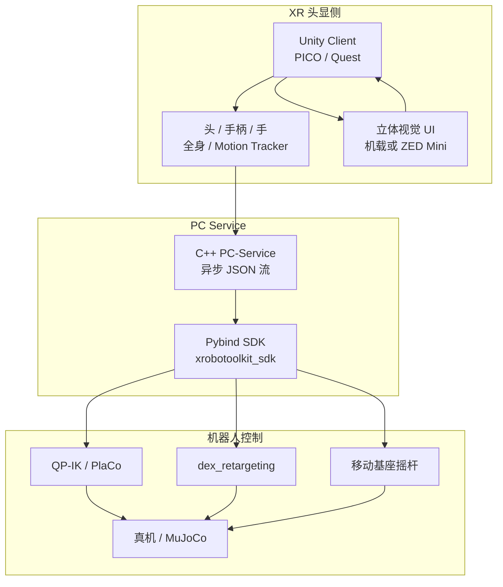
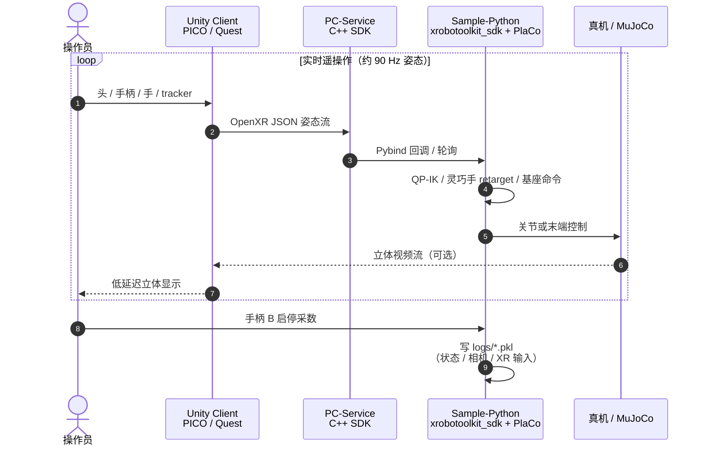

# XRoboToolkit

**XRoboToolkit**（*A Cross-Platform Framework for Robot Teleoperation*，字节跳动 PICO / 佐治亚理工 / 乔治梅森，arXiv:2508.00097，[项目页](https://xr-robotics.github.io/)，SII 2026 Best Paper）是一套基于 **OpenXR** 的 **XR 机器人遥操作与示范采集** 软件套件：头显侧 Unity Client 统一输出头 / 手柄 / 手 / 全身 / 辅助 tracker 姿态流，PC 侧 C++ Service + Python/C++ 控制模块完成 **立体视觉回传**、**QP 逆解** 与 **灵巧手重定向**，覆盖精密机械臂、移动操作平台与仿真灵巧手。

## 英文缩写速查

| 缩写 | 英文全称 | 简要说明 |
|------|----------|----------|
| XR | Extended Reality | VR/AR 等扩展现实头显与交互总称 |
| OpenXR | OpenXR Standard | 跨厂商 XR 运行时与姿态约定标准 |
| QP-IK | Quadratic Programming Inverse Kinematics | 带约束的二次规划逆运动学求解 |
| VLA | Vision-Language-Action | 视觉-语言-动作多模态策略 |
| DOF | Degree of Freedom | 自由度；末端 6-DoF 姿态常用 |
| FOV | Field of View | 视场角；影响立体深度与操作舒适度 |

## 为什么重要

- **XR 遥操作的「标准化层」：** 相对绑定单机 Unity SDK / WebXR 的方案，OpenXR 约定 + 模块化机器人接口降低「换头显 / 换臂」集成成本；当前公开支持 **PICO 4 Ultra** 与 **Meta Quest 3**。
- **延迟直接服务数据质量：** 同硬件相对 [Open-TeleVision](./paper-loco-manip-161-131-open-television.md) 视频流延迟约 **−22%**（ZED Mini→Quest 3：121.5→94.5 ms）；更低延迟减轻晕动并改善精细操作示范。
- **闭环到 VLA：** 不仅演示遥操作 UI，还用双臂折毯 **100** 条示范 LoRA 微调 **π₀**，连续 30 min 自主 **100%** 成功——把「框架是否好用」落到 **示范是否可训**。
- **已成为下游栈依赖：** [TWIST2](./paper-twist2.md)、[HumanoidUMI](./paper-humanoidumi.md)、Being-M0.7 等多人形工作以 XRoboToolkit 作为 **PICO 视觉 + 全身姿态流** 入口，值得单独建实体而非只当脚注。

## 核心信息

| 字段 | 内容 |
|------|------|
| 机构 | 字节跳动 PICO（ByteDance）；佐治亚理工学院 IRIM（Georgia Tech）；乔治梅森大学（George Mason） |
| 设备 | PICO 4 Ultra、Meta Quest 3；可选 ZED Mini / 头显机载立体相机 |
| 机器人 / 仿真 | UR5、ARX R5、Galaxea R1-Lite、Shadow Hand；MuJoCo；MeshCat（G1 上身示意） |
| XR→机器人 | OpenXR 右手系 JSON @90 Hz；Pybind / C++ SDK |
| 控制 | PlaCo **QP-IK**（Pinocchio）；`dex_retargeting` 灵巧手；摇杆移动基座 |
| 代码 | [github.com/XR-Robotics](https://github.com/XR-Robotics)（**已开源**，见 [sources/repos/xrobotoolkit.md](../../sources/repos/xrobotoolkit.md)） |

## 流程总览

## 源码运行时序图

官方组织 [XR-Robotics](https://github.com/XR-Robotics) **已开源**。主复现入口为 [XRoboToolkit-Teleop-Sample-Python](https://github.com/XR-Robotics/XRoboToolkit-Teleop-Sample-Python)（须先安装并启动 PC-Service）。遥操作与采数运行时交互如下：

- **最短仿真路径：** 启动 PC-Service → `setup_conda.sh` → `python scripts/simulation/teleop_dual_ur5e_mujoco.py`。
- **真机路径：** `teleop_dual_ur5e_hardware.py` / `teleop_dual_arx_r5_hardware.py` / `teleop_r1lite_hardware.py`；采数日志可按 README 转 LeRobot / openpi 微调。

## 核心原理

### 1）OpenXR 数据面

- 坐标系：右手系，**X 右、Y 上、Z 后**；原点为应用启动时头部位姿。
- 单帧 JSON 聚合头、左右手柄（摇杆/扳机/grip/按键）、双手各 **26** 关节、全身 **24** 关节（PICO 约定）、辅助 motion tracker（位姿+速度/加速度+序列号）。
- 手柄控制采用 **相对运动**：grip 按下瞬间锁存参考，末端跟踪相对位移，降低奇异与初始对齐负担。

### 2）QP-IK 与冗余约束

- 用 PlaCo 求解加权任务残差二次型，并加入可操作度正则以改善奇异附近稳定性。
- 辅助 tracker（如肘）可作为额外位姿任务，解析 7-DoF 臂零空间，利于拟人臂形（论文 MeshCat G1 上身示例）。

### 3）立体视觉与延迟

- 源：PICO 4 Ultra 机载，或 ZED Mini（经 PC / Orin）。
- 自定义 shader 调瞳距，焦点约 **3.3 ft**（约 1 m）以利桌面操作深度。
- Table II：Open-TeleVision 121.5 ms vs XRoboToolkit（同 ZED→Quest）94.5 ms；ZED→PICO 最低均值 82 ms；PICO→PICO 抖动最小（STD 3.12 ms）。

### 4）示范 → VLA

- ARX R5 双臂 + RealSense 腕/顶视；折毯 100 条 @50 FPS（关节状态/命令 + 三相机 RGB）。
- π₀ LoRA：80k step，batch 16，action horizon 50；30 min 连续运行成功率 100%，并出现自主 regrasping。

## 工程实践

| 项 | 建议 |
|----|------|
| 安装顺序 | 先 PC-Service，再 Pybind / Sample；Ubuntu 22.04 为官方测试环境 |
| 追踪模式 | 默认手柄 6-DoF；手势追踪适合灵巧手；elbow tracker 仅建议冗余臂 |
| 采数 | 硬件 demo 中 **B** 启停；右摇杆单击可丢弃当前段 |
| 下游 | `.pkl` → LeRobot / openpi 转换后训 ACT / π₀ 等 |
| 与人形栈衔接 | TWIST2 等把本套件当 **XR 流入口**，其上再接重定向与 RL tracking |

## 实验与评测

| 实验 | 设置 | 结果要点 |
|------|------|----------|
| 视频流延迟（Table II） | LED 面板 + 双视角录制；1280×720 @60 FPS / 1 Mbps | ZED→PICO **82 ms**；ZED→Quest **94.5 ms** vs Open-TeleVision **121.5 ms**（约 −22%） |
| 精密插入 | 双 UR5 + 2-DoF 头 + PICO 立体；3 mm 螺丝刀 → 4 mm 孔 | 验证深度感知与细粒度手柄控制 |
| VLA 数据质量 | ARX R5 折毯 **100** 条；π₀ LoRA 80k step | 连续 30 min 自主成功率 **100%**；出现自主 regrasping / 重定位 |

定量细节与消融以 **论文 PDF / Table II** 为准。

## 与其他工作对比

| 维度 | XRoboToolkit | Open-TeleVision | Isaac Teleop | TWIST2 |
|------|--------------|-----------------|--------------|--------|
| 定位 | **跨平台 XR 中间层** + 采数 | 沉浸式主动视觉遥操作 | Isaac Lab/Sim **生态内** XR 管线 | 人形便携全身采集 + visuomotor |
| 标准面 | **OpenXR** JSON 姿态流 | 自有 XR 栈 | OpenXR + Isaac retargeting 图 | 上层依赖 XRoboToolkit 流 |
| 延迟主张 | 同硬件相对 Open-TeleVision ↓ | 基线对照对象 | 取决于 CloudXR / 仿真步长 | 非本页延迟实验主体 |
| 开源 | **全栈 org 已开源** | 见项目页 | NVIDIA 官方开源 | 全栈 + 数据集 |

## 局限与风险

- **全身模型未标准化：** 24-joint 全身跟随 PICO；跨品牌骨骼可能不兼容；论文明确 **未做全身→人形重定向验证**。
- **欠驱动灵巧手：** retargeting 假设各关节独立可控，对 INSPIRE 等耦合手不准确。
- **仿真覆盖面：** 论文主推 MuJoCo；多仿真器扩展列入未来工作（如 RoboVerse）。
- **数据资产边界：** 代码 **已开源**，但 VLA 实验用的 100 条折毯集 / 权重 **未**在项目页单独发布——复现「论文同款 π₀」仍需自采。
- **勿与 Isaac Teleop 混淆：** [Isaac Teleop](./isaac-teleop.md) 绑定 NVIDIA Isaac Lab/Sim 与 retargeting 图；XRoboToolkit 是头显厂商生态友好的 **跨臂/跨仿真通用 XR 中间层**。

## 关联页面

- [Teleoperation](../tasks/teleoperation.md) — XR 示范采集任务总览
- [Open-TeleVision](./paper-loco-manip-161-131-open-television.md) — 沉浸式主动视觉遥操作与延迟对照
- [TWIST2](./paper-twist2.md) — 下游人形便携全身遥操作栈（依赖本套件）
- [Isaac Teleop](./isaac-teleop.md) — NVIDIA 仿真/真机 XR 遥操作对照
- [BifrostUMI](./paper-bifrost-umi.md) — 无机器人 Pico 采集 vs 真机 XR 遥操作谱系
- [HumanoidUMI](./paper-humanoidumi.md) — Pico SDK + XRoboToolkit → SMPL 身体表示
- [Motion Retargeting](../concepts/motion-retargeting.md) — IK / 手部重定向语境
- [Imitation Learning](../methods/imitation-learning.md) — 示范下游学习

## 参考来源

- [sources/papers/xrobotoolkit_arxiv_2508_00097.md](../../sources/papers/xrobotoolkit_arxiv_2508_00097.md) — 论文摘录与开源核查
- [sources/sites/xr-robotics-github-io.md](../../sources/sites/xr-robotics-github-io.md) — 项目页归档
- [sources/repos/xrobotoolkit.md](../../sources/repos/xrobotoolkit.md) — GitHub 组织与复现入口
- Zhao et al., *XRoboToolkit: A Cross-Platform Framework for Robot Teleoperation*, arXiv:2508.00097, 2025. <https://arxiv.org/abs/2508.00097>

## 推荐继续阅读

- [XRoboToolkit 项目页](https://xr-robotics.github.io/)
- [XR-Robotics GitHub 组织](https://github.com/XR-Robotics)
- [Teleop Sample Python README](https://github.com/XR-Robotics/XRoboToolkit-Teleop-Sample-Python) — 仿真/真机/采数步骤
- Cheng et al., *Open-TeleVision* — <https://robot-tv.github.io/>（延迟对照）
- [TWIST2 项目页](https://yanjieze.com/projects/TWIST2/) — 人形栈如何接入本套件
