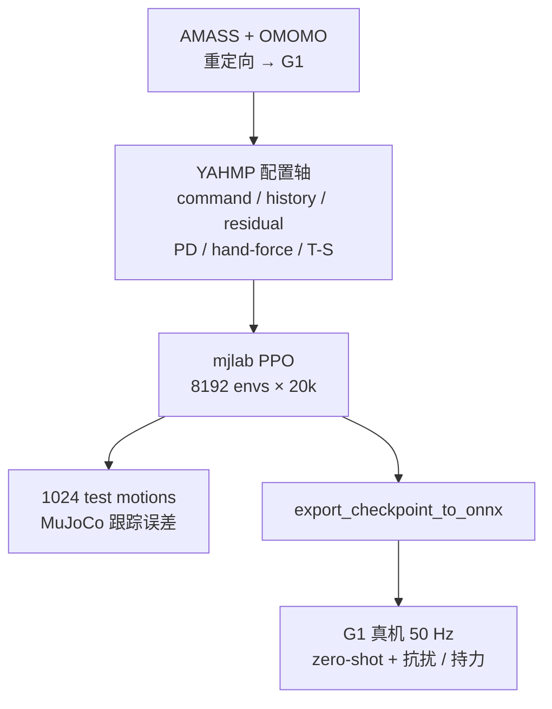
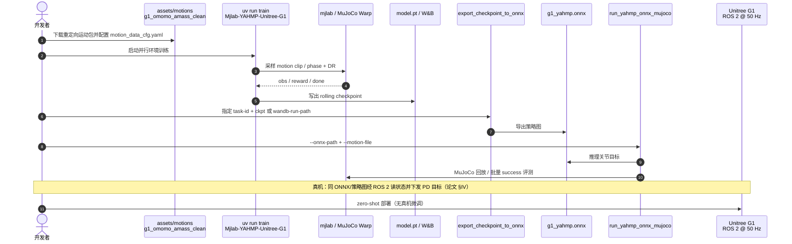

# YAHMP：人形通用运动跟踪里什么真的重要？

**YAHMP**（*Yet Another Humanoid Motion tracking Policy*；论文 *What Matters in Humanoid General Motion Tracking? An Empirical Study*，[arXiv:2607.19903](https://arxiv.org/abs/2607.19903)，[代码](https://github.com/fabio-amadio/yahmp)）由 **Inria / Université de Lorraine / CNRS** 提出：在 **Unitree G1** 上用基于 [mjlab](./mjlab.md) 的开源模块化管线，把近年全身 GMT 常见设计选择做成 **一次只改一项** 的受控消融，并与同数据重训的 [TWIST2](./paper-twist2.md) 对照；策略可 **ONNX 导出** 后 **zero-shot** 上真机。

## 一句话定义

**用可复现的开源 GMT 试验台，把「参考命令 / 历史 / 残差动作 / PD 剖面 / 手部力随机化 / Teacher–Student」从整系统对比里拆出来，告诉你哪些选择真改跟踪、哪些主要改力矩或交互力。**

## 英文缩写速查

| 缩写 | 英文全称 | 简要说明 |
|------|----------|----------|
| YAHMP | Yet Another Humanoid Motion tracking Policy | 本文开源框架与名义策略族 |
| GMT | General Motion Tracking | 跟踪广分布全身参考（走跑舞姿交互等）而非单 clip |
| PPO | Proximal Policy Optimization | 名义单阶段训练算法 |
| ONNX | Open Neural Network Exchange | 仓库导出/部署的策略交换格式 |
| PD | Proportional–Derivative | 底层关节目标跟踪控制器增益 |
| KL | Kullback–Leibler Divergence | Teacher–Student 中约束 student 贴近 teacher |

## 为什么重要

- **选型可读：** 多数 GMT 论文给「整管线 SOTA」，工程师难判断「要不要加参考关节速度 / 历史 / 残差」。YAHMP 把效应拆到误差表与力矩表。
- **工程可跑：** 训练、评测、ONNX、MuJoCo 回放与 TWIST2 ONNX 对照脚本齐备，适合作为 G1 跟踪基线试验台（相对 [Extreme-RGMT](./paper-extreme-rgmt.md) 等未开源高动态方案）。
- **真机读点清晰：** free-space 跟踪好 ≠ 手能撑住负载——手部力随机化几乎不伤仿真跟踪，却显著抬高真机持力。

## 核心信息

| 项 | 内容 |
|----|------|
| **机构** | 法国国家信息与自动化研究所（INRIA）；联合 Université de Lorraine / CNRS（Nancy） |
| **平台** | Unitree G1，29 DoF；策略 50 Hz |
| **数据** | 重定向 AMASS + OMOMO：训练 11,151 / 测试 1,024 |
| **栈** | mjlab + MuJoCo；单卡 RTX 4090 ≈25 h / 20k iter（8192 envs） |
| **开源** | **已开源**（Apache-2.0）：<https://github.com/fabio-amadio/yahmp> |

## 核心原理

### 消融轴（相对 Nominal）

| 因素 | Nominal | 变体 / 读法 |
|------|---------|-------------|
| Motion command | 参考关节位置 **+ 速度** + 基座量 | Pos-ref-only 去掉 \(\dot{\hat q}\) → 跟踪全面变差 |
| History | \(H=10\) | 无历史基座误差大幅上升；\(H=20\) 无一致收益 |
| Action | 相对参考残差 | 相对默认姿态：key-body/关节略差 |
| Actuation | 力学启发 \(k_p,k_d,\alpha\) | 更硬固定尺度：跟踪混杂，**力矩峰值明显升高** |
| Hand-force rand. | 关（名义） | 开：仿真跟踪几乎不变，**真机持力**显著更好 |
| Training | 非对称 PPO | Teacher–Student（KL）：仅轻微增益、成本更高 |

### 流程总览

## 源码运行时序图

官方仓库 [fabio-amadio/yahmp](https://github.com/fabio-amadio/yahmp)（论文亦指向 org fork `hucebot/yahmp`）提供训练、ONNX 导出与 MuJoCo/真机部署入口（归档见 [sources/repos/yahmp.md](../../sources/repos/yahmp.md)）：

- **最短复现路径：** `uv sync` → 放入运动资产 → `train` → `export_checkpoint_to_onnx` → `run_yahmp_onnx_mujoco`（或直接用仓库预置 `assets/models/g1_yahmp.onnx`）。
- **对照 TWIST2：** 同目录 `run_twist2_onnx_mujoco` / `evaluate_*_success_parallel` + `plot_tracking_metrics_boxplot`。

## 工程实践

| 项 | 建议 |
|----|------|
| 搭试验台 | 优先 YAHMP nominal，再按表逐项改配置，避免一次改多个轴 |
| 命令设计 | **保留参考关节速度**；不要指望历史编码器完全补回相位信息 |
| 历史长度 | 默认 **10**；盲目加到 20 不一定更好 |
| PD / action scale | 跟踪接近时优先看 **力矩峰值**（力学启发剖面） |
| 交互任务 | 需要手持/推拉时打开 **hand-force randomization** |
| Teacher–Student | 仅在有明确特权信息收益时再上；本设定增益有限 |
| 部署 | 论文：笔记本直连、ROS 2 读状态、50 Hz 下发；**无**额外滤波/真机微调 |

## 实验与评测

- **仿真：** 1024 条 held-out 重定向动作；全变体 **100%** 不摔倒，主比跟踪误差与力矩。
- **关键消融：** 去掉参考关节速度 / 历史 → 误差明显上升；History-20 无一致收益；更硬 PD 抬高力矩峰值。
- **vs TWIST2（同数据重训）：** TWIST2 key-body 位置略优；YAHMP nominal 在基座/朝向/关节速度上更准。
- **真机：** nominal **zero-shot**；手部力随机化使 4 kg 肘偏角 **15.5°→6.6°**。

## 与其他工作对比

| 对照 | 差异读法 |
|------|----------|
| [TWIST2](./paper-twist2.md) | 完整遥操作+采集栈；YAHMP 是 **GMT 设计消融试验台**，并用同数据重训 TWIST2 作外部基线 |
| [Extreme-RGMT](./paper-extreme-rgmt.md) | 高动态 continual learning（PACE/STAR）；**未开源**；YAHMP 覆盖日常 GMT 因子与 ONNX 复现 |
| [SONIC](../methods/sonic-motion-tracking.md) / [BeyondMimic](../methods/beyondmimic.md) | 规模化或接触丰富方法贡献；YAHMP 贡献在 **可控消融协议** |

## 局限与风险

- **单机、单 nominal 邻域消融：** 交互效应与其他人形平台外推未覆盖。
- **与 TWIST2 对比是「同数据重训的完整管线」**：TWIST2 在 key-body 位置上仍可更好，说明指标维度要分开看。
- **软垫等未见地形：** 双支撑尚可，稳定 locomotion 仍需专项训练。
- **持力实验是开环参考回放：** 箱子状态不观测、参考不重规划——展示交互力，不是自主操作。

## 关联页面

- [TWIST2](./paper-twist2.md) — 外部完整 GMT/遥操作管线基线
- [mjlab](./mjlab.md) — 训练栈依赖
- [Extreme-RGMT](./paper-extreme-rgmt.md) — G1 高动态 generalist 持续学习（未开源）
- [SONIC](../methods/sonic-motion-tracking.md) / [BeyondMimic](../methods/beyondmimic.md) — 规模化 / 接触丰富跟踪方法对照
- [人形 RL 身体系统栈](../overview/humanoid-rl-motion-control-body-system-stack.md)
- [运动跟踪方法选型](../queries/humanoid-motion-tracking-method-selection.md)

## 参考来源

- [yahmp_arxiv_2607_19903.md](../../sources/papers/yahmp_arxiv_2607_19903.md) — 论文摘录与开源核查
- [yahmp.md](../../sources/repos/yahmp.md) — GitHub 仓库归档
- [arXiv:2607.19903](https://arxiv.org/abs/2607.19903) — 原文
- [fabio-amadio/yahmp](https://github.com/fabio-amadio/yahmp) — 官方代码

## 推荐继续阅读

- [YAHMP GitHub README](https://github.com/fabio-amadio/yahmp)
- [补充视频（真机实验）](https://youtu.be/BH6FpQzwm8M)
- [TWIST2 项目页](https://yanjieze.com/projects/TWIST2/)
- [mjlab 文档](https://mujocolab.github.io/mjlab/main/index.html)
