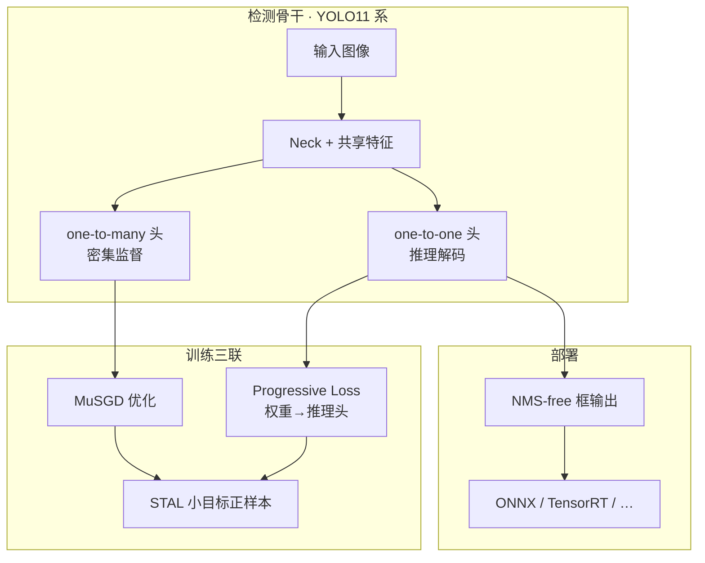
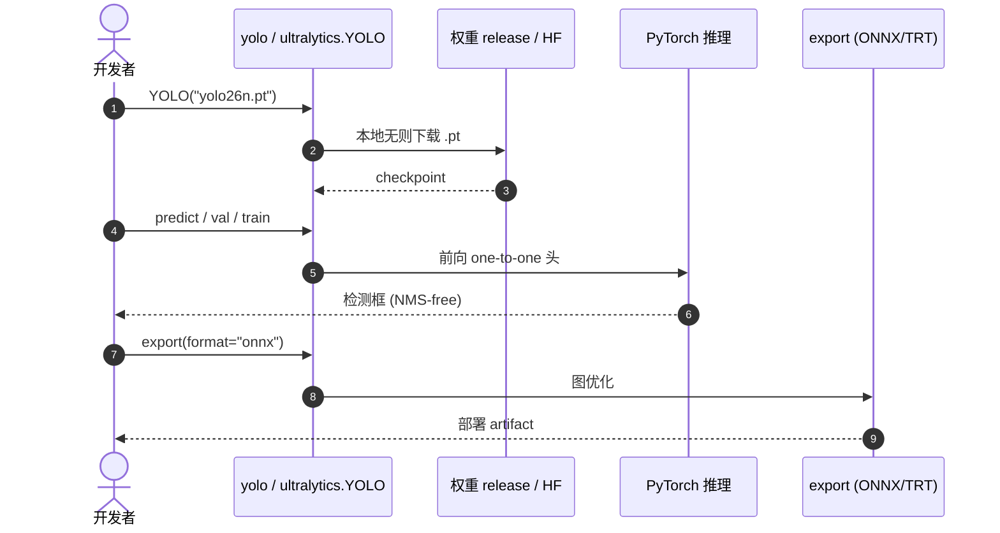

# Ultralytics YOLO26（Unified Real-Time End-to-End Vision）

**YOLO26** 是 Ultralytics 提出的 **统一实时视觉模型族**（[arXiv:2606.03748](https://arxiv.org/abs/2606.03748)）。在 YOLO11 基线上，检测侧 **移除 DFL**、采用 **原生 NMS-free 双头**，并用 **MuSGD + Progressive Loss + STAL** 三联训练同时改善精度与收敛；同一工程栈扩展到 **实例分割、姿态、OBB、分类、深度与语义分割**，开放词汇 **YOLOE-26** 接 text/visual/prompt-free 推理。官方实现与权重见 [`ultralytics/ultralytics`](https://github.com/ultralytics/ultralytics) 与 [HF `Ultralytics/YOLO26`](https://huggingface.co/Ultralytics/YOLO26)。

| 机构 | 超光速视觉（Ultralytics） |
|------|---------------------------|
| arXiv | [2606.03748](https://arxiv.org/abs/2606.03748) |
| 开源 | **已开源**（AGPL-3.0；商用见 Enterprise） |

## 一句话定义

**把 YOLO 推到「推理路径即训练路径」：NMS-free 端到端解码、去掉 DFL 头膨胀，并用 MuSGD/渐进监督/小目标 STAL 在统一多任务栈里刷新实时检测 Pareto 前沿。**

## 英文缩写速查

| 缩写 | 英文全称 | 简要说明 |
|------|----------|----------|
| YOLO | You Only Look Once | 单次前向实时检测范式；YOLO26 为其 2026 工程代 |
| DFL | Distribution Focal Loss | YOLOv8 起常用的框回归分布头；YOLO26 **移除** |
| NMS | Non-Maximum Suppression | 传统去重后处理；YOLO26 检测推理 **原生无需** |
| MuSGD | Muon–SGD hybrid optimizer | 本文检测训练用混合优化器 |
| STAL | Small-Target-Aware Label Assignment | 保证极小目标仍有 TAL 正样本 |
| mAP | mean Average Precision | COCO 检测主指标 |
| OBB | Oriented Bounding Box | 旋转框检测（如 DOTA） |
| AGPL | Affero General Public License | 主仓默认许可 |

## 为什么重要

- **机器人机载默认栈的论文锚点：** 工程入口仍是 [Ultralytics](./ultralytics.md)，但 YOLO26 把 **NMS-free +  lighter head** 写进 peer-facing 技术报告，便于与 [RF-DETR](./rf-detr.md) 等实时 DETR 做 **同协议** 对照。
- **小目标与长训练成本：** STAL 针对 TAL 在极小目标上 **零梯度** 的已知坑；MuSGD/Progressive Loss 面向 **更短有效训练**——对频繁重训域适应的机器人项目有直接意义。
- **多任务一张网：** detect/seg/pose/obb 等同包导出 ONNX/TensorRT，减少足球、操作、巡检等多模块拼装（见 [检测选型 Query](../queries/object-detection-model-selection.md)）。

## 流程总览

## 核心原理

| 组件 | 作用 |
|------|------|
| **DFL-free 回归** | 4 维直接回归，减参、去有限 bin 范围约束 |
| **Dual-head** | 训练用 one-to-many；推理 **仅** one-to-one（YOLOv10 思路的改进监督） |
| **MuSGD** | 将 LLM 侧 Muon–SGD 混合优化适配 CNN 检测 |
| **Progressive Loss** | 训练后期加大推理头损失权重，缓解「推理头欠训」 |
| **STAL** | 在 TAL 框架下为小目标 **强制** 正样本覆盖 |
| **任务扩展** | 分割 proto 多尺度 + 语义辅助；姿态 RLE 不确定性；OBB 长边角监督 |
| **YOLOE-26** | YOLO26 检测器 + 开放词汇头（MobileCLIP2 等）；LVIS text **40.6 AP**（26x） |

## 实验与评测

COCO val2017 **Detection**（官方表 · T4 TensorRT10 · 单模型单尺度）：

| 模型 | mAP50-95 | 延迟 (ms) | params (M) |
|------|----------|-----------|------------|
| YOLO26n | 40.9 | 1.7 | 2.4 |
| YOLO26s | 48.6 | 2.5 | 9.5 |
| YOLO26m | 53.1 | 4.7 | 20.4 |
| YOLO26l | 55.0 | 6.2 | 24.8 |
| YOLO26x | 57.5 | 11.8 | 55.7 |

相对 YOLO11：检测 **+1.6~+2.8 AP**；分割/姿态/OBB 亦有论文报告的一致增益（详见 arXiv 正文与 [HF 模型卡](https://huggingface.co/Ultralytics/YOLO26)）。

## 工程实践

| 项 | 读法 |
|----|------|
| 最短路径 | `pip install ultralytics` → `yolo predict model=yolo26n.pt source=...` |
| 权重 | HF `Ultralytics/YOLO26` 或首次运行自动下载 release `.pt` |
| 许可 | **AGPL-3.0**；闭源产品需 Enterprise 或换栈 |
| 对照 | 要 **DINOv2 域迁移** → [RF-DETR](./rf-detr.md)；要 **最大生态** → 本族 + [Ultralytics](./ultralytics.md) |

### 源码运行时序图

图对应 [`sources/repos/ultralytics.md`](../../sources/repos/ultralytics.md) README 的 `predict` / `export` 入口；TensorRT 延迟以 Docs 协议为准。

## 局限与风险

- **AGPL** 与闭源机器人产品冲突风险仍高于 Apache 系 DETR。
- **榜单协议敏感：** mAP 与 ms 须同一 artifact、同一 TRT/FP 设置；勿跨论文混比未声明协议的数字。
- **YOLOE-26** 开放词汇链路与纯闭集 detect 权重训练成本不同，勿混为「默认 YOLO26n 能力」。
- **真机域偏移** 仍常主导失败模式，换更大 x 模型不能替代数据采集。

## 结论

**YOLO26 把「实时 YOLO」的主矛盾从后处理与头参数，转成训练–推理对齐与小目标监督——对机器人是「同一 AGPL 栈里默认代际升级」，而不是换范式。**

- 选型时优先看 **e2e mAP + 目标 TRT 延迟** 是否落在机载预算（n/s 常是 Orin 起点）。
- 与 RF-DETR 的分工：**固定类、要教程与导出** → YOLO26；**要 ViT 迁移、可接受 transformer 栈** → RF-DETR。
- 工程落地钉死 **`ultralytics` 版本 + 导出引擎版本**；论文数字作回归参照，不作 SLA。
- 历史脉络读 [YOLO v1](./paper-yolo-unified-realtime-detection.md)；日常 API 读 [Ultralytics](./ultralytics.md)。

## 关联页面

- [Ultralytics（工程实体）](./ultralytics.md)
- [YOLO v1（范式起源）](./paper-yolo-unified-realtime-detection.md)
- [RF-DETR](./rf-detr.md) — 实时 DETR 对照
- [目标检测（方法）](../methods/object-detection.md)
- [目标检测模型选型](../queries/object-detection-model-selection.md)
- [机器人感知栈选型闭环](../queries/robot-perception-stack-selection-loop.md)
- [人形足球](../tasks/humanoid-soccer.md) — 机载检测消费方

## 参考来源

- [yolo26_arxiv_2606_03748.md](../../sources/papers/yolo26_arxiv_2606_03748.md) — arXiv 归档
- [ultralytics.md](../../sources/repos/ultralytics.md) — GitHub 仓库
- [huggingface-ultralytics-yolo26.md](../../sources/sites/huggingface-ultralytics-yolo26.md) — HF 权重
- [docs-ultralytics.md](../../sources/sites/docs-ultralytics.md) — 官方文档

## 推荐继续阅读

- [YOLO26 模型页](https://docs.ultralytics.com/models/yolo26/)
- [arXiv:2606.03748 PDF](https://arxiv.org/pdf/2606.03748.pdf)
- [Ultralytics/YOLO26 on Hugging Face](https://huggingface.co/Ultralytics/YOLO26)
