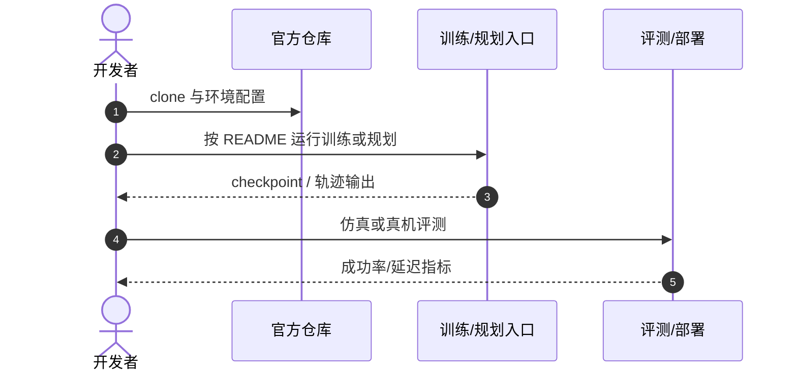

# YOPO-MINCO

**Some Modifications to Our End-to-End UAV Planner**（[arXiv:2608.15741](https://arxiv.org/abs/2608.15741)，[项目页](https://github.com/TJU-Aerial-Robotics/YOPO/tree/YOPO-MINCO)）——天津大学 Aerial Robotics。

## 一句话定义

**端到端规划仍需要把几何结构与优化约束显式放回系统。**

## 英文缩写速查

| 缩写 | 英文全称 | 简要说明 |
|------|----------|----------|
| YOPO | You Only Plan Once | 学习式单阶段 UAV 规划器 |
| MINCO | Minimum Control | 最小控制轨迹参数化 |
| ESDF | Euclidean Signed Distance Field | 可微距离场代价 |

## 为什么重要

- 纳入 [具身智能小站 2026-08-23 九篇盘点](../../sources/blogs/wechat_embodied_station_9_papers_open_source_2026-08-23.md) 的「长视野 VLA → 动作分布 → 真实交互」主线。
- 开源状态（入库日）：**已开源**。

## 核心信息

| 项 | 内容 |
|----|------|
| **机构** | 天津大学 Aerial Robotics |
| **出处** | arXiv:2608.15741（2026-08） |
| **开源** | **已开源** |

### 流程总览

## 评测

| 项 | 内容 |
|----|------|
| **主结果** | 更丰富轨迹表示、更安全避障与更直接路径；保留 YOPO 可微代价反传训练范式。 |

- 数据出处：[ingest 摘录](../../sources/papers/yopo_minco_arxiv_2608_15741.md)。

## 结论

**软约束优化的局部极小可通过 MINCO 分段、多同伦候选与排序损失缓解。**

- two-piece MINCO 以时间换平滑
- 多 homotopy class 候选扩展表达能力
- barrier penalty 与曲率限速提升安全性
- ranking loss 替代分数回归
- YOPO-MINCO 分支含训练/部署脚本

## 源码运行时序图

## 与其他页面的关系

- [locomotion](../tasks/locomotion.md)
- [smooth-navigation-path-generation](../methods/smooth-navigation-path-generation.md)
- [imitation-learning](../methods/imitation-learning.md)
- [vla-robustness-9-papers-technology-map](../overview/vla-robustness-9-papers-technology-map.md)

## 参考来源

- [yopo_minco_arxiv_2608_15741](../../sources/papers/yopo_minco_arxiv_2608_15741.md)
- [yopo-minco](../../sources/repos/yopo-minco.md)
- [wechat_embodied_station_9_papers_open_source_2026-08-23](../../sources/blogs/wechat_embodied_station_9_papers_open_source_2026-08-23.md)

## 推荐继续阅读

- [arXiv:2608.15741](https://arxiv.org/abs/2608.15741)
- [官方代码](https://github.com/TJU-Aerial-Robotics/YOPO/tree/YOPO-MINCO)
