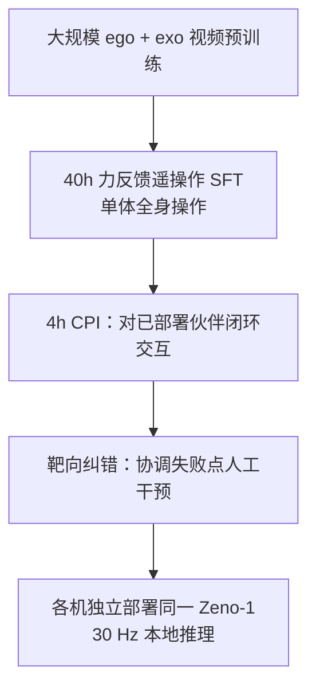

# Zeno-1：机器人协作智能基础模型

**Zeno-1**（*Collaborative Intelligence for Robots That Work Together*，[Zeno AI 研究页](https://www.zenobot.ai/research/zeno-1-collaborative-intelligence)，2026-09-07）由 **芝诺机器人（Zeno AI）** 发布：**首个面向去中心化多机协作物理智能的基础模型**（机构表述）。**3B** 参数；同一策略独立部署在每台机器人上，**30 Hz** 闭环 visuomotor 推理，无中央控制器、无机间内部状态交换。

## 一句话定义

**先学世界与单体，再在闭环伙伴交互（CPI）里学协作——共享物理世界作协调接口，而不是中央联合动作空间。**

## 英文缩写速查

| 缩写 | 英文全称 | 简要说明 |
|------|----------|----------|
| Zeno-1 | Zeno Collaborative Intelligence Model v1 | 本文 3B 协作基础模型 |
| CPI | Closed-loop Partner Interaction | 对已部署学习伙伴的闭环交互适应 |
| SFT | Supervised Fine-Tuning | 40h 力反馈遥操作单体示范微调 |
| WM | World Model | 动作条件潜变量世界模型（预测内省） |
| VLA | Vision-Language-Action | 视觉-语言-动作基础策略族（形态相关） |
| AUC | Area Under ROC Curve | 失败预测判别指标 |

## 为什么重要

- **协作是默认场景：** 搬运、装配、可变形物体、工具共持等任务天然多机；单体再强也可能**时序/接触不兼容**。
- **去中心化可扩展：** 加机器人不必构造更大联合动作空间；各机从本地观测决策。
- **训练数据效率叙事：** **4h CPI** 相对同步多机示范的边际收益，报告 Fig.1 显示 CPI 比例提升强于等量同步示范。
- **与学术论文互补：** 同期 [SAI](./paper-sai-sequential-asymmetric-imitation.md)（课程）、[TRACE](./paper-trace-causal-memory.md)（记忆模块，**已开源**）同作者线；Zeno-1 是**产品级基础模型**报告。

## 核心信息

| 项 | 内容 |
|----|------|
| **机构** | 芝诺机器人（Zeno AI） |
| **规模** | **3B** 参数；机载 **30 Hz** 闭环推理 |
| **训练** | 视频预训练 → **40h** 单体 SFT → **4h** CPI → 靶向人工纠错 |
| **开源** | **待发布 / 未开源**（截至 2026-09-15 研究页无权重/代码） |
| **文献** | **无 arXiv**（机构博客/技术报告形态） |

## 流程总览

## 核心原理

1. **去中心化：** 各机仅本地视觉 + 本体 + **持久交互记忆**；协调通过共享物理世界涌现。
2. **CPI vs 同步示范：** 伙伴是**也在观测与行动的自主策略**；学的是偏离示范序列后如何改行为。
3. **持久交互记忆：** 压缩保留任务相关视觉/状态证据，支撑 **>10 min**、**8** 子任务连续执行而不切换策略。
4. **预测内省：** 动作条件 WM 在接触前 **0.5 s** 预警失败（**AUC 0.94** vs 仅当前观测 **0.81**）；伙伴行为预测 **87%** vs 消融 **61%**。

## 源码运行时序图

**不适用** — 截至 **2026-09-15** [研究页](https://www.zenobot.ai/research/zeno-1-collaborative-intelligence) **未发布** Zeno-1 权重或完整训练栈。记忆与部署相关子模块可参考开源 [corl-trace](../../sources/repos/corl-trace.md)（TRACE 论文实现），**不能**等同于 Zeno-1 3B 策略。

## 实验与评测（报告摘录）

| 维度 | 结果要点 |
|------|----------|
| **长程执行** | 单策略连续 **>10 min**，**8** 子任务，多物体，无任务重置/策略切换 |
| **伙伴延迟鲁棒** | 故意扰动伙伴时序；同步示范训练策略快速失败，Zeno-1 保持协调（Fig.2） |
| **伙伴行为预测** | held-out 协作决策点：选致更好伙伴后续行为 **87%** vs 仅即时效应 **61%** |
| **WM 失败预测** | 200 次 live rollouts：**AUC 0.94**（0.5 s 预接触窗）vs **0.81**（无动作条件 WM） |
| **CPI 数据效率** | 增加 CPI 比例优于增加等量同步多机示范（Fig.1） |

## 结论

**协作物理智能可以作为单一去中心化策略学到，且 CPI + 记忆 + 预测内省是报告中的三条工程主线。**

1. **去中心化 3B 策略** 可在真机多子任务长程运行 — 报告给出的产品级证据。
2. **CPI 是核心训练增量：** 4h 闭环伙伴数据胜过堆同步双机示范（同报告口径）。
3. **持久记忆** 解决「看起来一样、历史不同」的分支 — 与 [TRACE](./paper-trace-causal-memory.md) 问题同族。
4. **预测内省** 把恢复前置为避错：0.5 s 预接触 WM 显著抬高 AUC。
5. **与 SAI 分工：** SAI 是**单遥操作课程**；Zeno-1 是**基础模型 + CPI** — 采集与部署范式不同。
6. **权重未开放** — 选型与复现需等待官方发布；TRACE 代码可作记忆子系统参考。
7. **无 arXiv** — 细节以机构页为准，学术引用需注明技术报告性质。

## 局限与风险

- **闭源：** 无法独立验证 3B 推理栈、CPI 数据协议与 WM 结构。
- **平台绑定：** 演示为 Zeno 自有全身机器人团队；迁移性未在报告中系统消融。
- **与 TRACE/SAI 关系：** 学术论文已部分开源/待发布；Zeno-1 全栈关系需官方后续说明。

## 关联页面

- [SAI](./paper-sai-sequential-asymmetric-imitation.md)
- [TRACE](./paper-trace-causal-memory.md)
- [Bimanual Manipulation](../tasks/bimanual-manipulation.md)
- [VLA](../methods/vla.md)

## 参考来源

- [Zeno-1 研究页归档](../../sources/sites/zeno-1-collaborative-intelligence.md)

## 推荐继续阅读

- [Zeno-1 研究页](https://www.zenobot.ai/research/zeno-1-collaborative-intelligence)
- [SAI（arXiv:2606.16490）](https://arxiv.org/abs/2606.16490)
- [TRACE（arXiv:2606.14551）](https://arxiv.org/abs/2606.14551)
