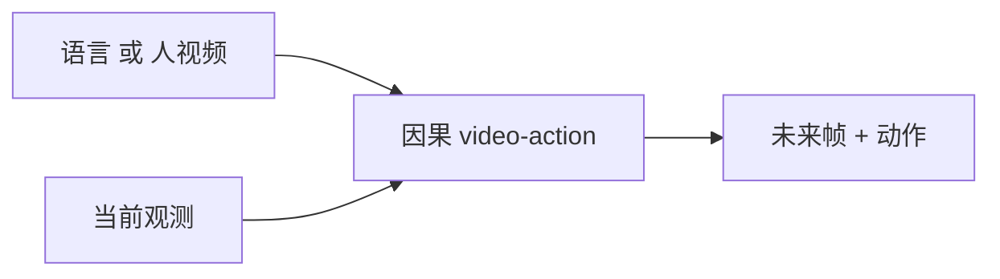

# Zero-WAM：人类视频提示的世界动作模型

**Zero-WAM**（*Zero-Shot World-Action Modeling from Human Videos*，[arXiv:2608.26103](https://arxiv.org/abs/2608.26103)，[项目页](https://robbyant-research.github.io/Zero-WAM/)）由 **灵波（Robbyant）** 与 **香港科技大学（广州）/ 香港科技大学** Jiaming Zhou、Kaiwen Zhang、Yangyang Xu 等提出：因果 video-action 模型，任务指令可以是**语言或人类演示视频**。

## 一句话定义

**把人视频当成可切换的任务提示，而不是再训一条 VLA：HumanGen 造 ICL 对、IFP 打断语言–动作捷径，让未见 RoboTwin 任务靠视频上下文而不是榜微调。**

## 英文缩写速查

| 缩写 | 英文全称 | 简要说明 |
|------|----------|----------|
| WAM | World Action Model | 联合未来观测与动作的具身模型 |
| ICL | In-Context Learning | 测试时把示范放进上下文，不更新权重 |
| HumanGen | Human-video ICL pair generator | 本文 74.2K 对 / 8.6K 任务的数据引擎 |
| IFP | Intervention / shortcut-blocking objective | 抑制语言直接抄动作、迫使走视频条件 |
| SR | Success Rate | RoboTwin / 真机成功率 |

## 为什么重要

- **指令模态可换：** 同一套因果 video-action，语言 **或** 人视频都能当任务规格；对照 [Skild S1](./skild-s1.md) 的视频 ICL，这里把 WAM 未来分支和提示绑在一起。
- **未见任务数字大、但对照窄：** RoboTwin 2.0 七任务未见 **46.95%** vs LingBot-VA **17.45%**（+29.5 pt）——读的是相对这一条基线，不是操作榜全集。
- **真机长程仍硬：** 双臂 Franka 放置 **53.3** / 长程 **33.3** / 插桌腿 **16.7**，零样本叙事到接触装配会掉下来。

## 核心信息

| 项 | 内容 |
|----|------|
| **机构** | 灵波（Robbyant）；香港科技大学（广州）（HKUST-GZ）；香港科技大学（HKUST） |
| **数据** | HumanGen：74.2K ICL 对 / 8.6K 任务 |
| **仿真** | RoboTwin 2.0 七任务未见 |
| **真机** | 双臂 Franka：放置 / 长程 / 插桌腿 |
| **开源** | **宣称将开源 / 待发布**：仓 Apache-2.0，截至 2026-08-28 仅 README + 资源；预计 2026-09-15 前发代码/模型/数据 |

## 核心原理（方法）

因果 video-action：当前观测与任务提示（文本或人视频）条件化，生成未来观测与动作。HumanGen 大规模构造「人演示 ↔ 机器人任务」ICL 对。IFP 干预语言–动作捷径，避免模型忽略视频提示、直接从指令词抄策略。

相对 [LAWA](./paper-lawa.md)：LAWA 把测试时未来压成 latent action、指令仍是语言；Zero-WAM 把**人视频本身**当成可切换指令，未来分支仍走像素/视频条件。

## 工程实践

| 项 | 说明 |
|----|------|
| 源码运行时序图 | **不适用**（GitHub 无可运行训练/推理入口；权重与数据待发布） |
| 复现窗口 | 作者预计 2026-09-15 前放出；入库日不要 clone 占位仓当训练栈 |
| ICL 读法 | 见 [机器人 In-Context Learning](../concepts/robot-in-context-learning.md)：上下文是部署期适应，不是后训练克隆 |

## 实验与评测

| 设定 | Zero-WAM | 对照 |
|------|----------|------|
| RoboTwin 2.0 七任务未见 | **46.95%** | LingBot-VA 17.45% |
| 真机放置 | 53.3% | — |
| 真机长程 | 33.3% | — |
| 真机插桌腿 | 16.7% | — |

## 结论

**Zero-WAM 的主张是「人视频可以当零样本任务规格」，不是「WAM 已经解决长程接触装配」——插桌腿 16.7% 和 RoboTwin +29.5 pt 必须分开读。**

1. **主数字是相对 LingBot-VA**，不要写成操作领域 SOTA。
2. **IFP 是为了防捷径**；没有干预时模型可能根本没用视频提示。
3. **HumanGen 规模（74.2K / 8.6K）是方法的数据前提**，不是推理时用户要准备的上下文长度。
4. **真机长程/插入远低于放置**，接触几何仍是瓶颈。
5. **代码待发布**；Apache-2.0 仓现在不能复现论文。

## 与其他工作对比

| 对比轴 | Zero-WAM | [LAWA](./paper-lawa.md) | [Skild S1](./skild-s1.md) |
|--------|----------|-------------------------|---------------------------|
| 测试时未来 | 因果视频–动作 | 紧凑 latent action | 不强调像素 rollout |
| 任务提示 | 语言 **或** 人视频 | 语言为主 | 人视频 ICL |
| 开源 | **待发布** | **待发布** | **确认未开源** |

## 局限与风险

- **占位仓：** `robbyant-research/Zero-WAM` 无训练脚本；`language: null`。
- **对照单一：** 未见任务只打 LingBot-VA。
- **真机样本未在摘要层给 trial 数**，16.7% 方差未知。
- **「Zero-Shot」依赖 HumanGen 预训练分布**，不是无相关人视频的真零样本。

## 关联页面

- [World Action Models](../concepts/world-action-models.md)
- [机器人 In-Context Learning](../concepts/robot-in-context-learning.md)
- [LAWA](./paper-lawa.md) — 潜意图 WAM 对照
- [S1（Skild）](./skild-s1.md) — 闭源视频 ICL
- [Manipulation](../tasks/manipulation.md)
- [VLA](../methods/vla.md)

## 参考来源

- [Zero-WAM 论文摘录](../../sources/papers/zero_wam_arxiv_2608_26103.md)
- [Zero-WAM 仓归档](../../sources/repos/zero-wam.md)
- [Zero-WAM 项目页归档](../../sources/sites/zero-wam.md)

## 推荐继续阅读

- 项目页 — <https://robbyant-research.github.io/Zero-WAM/>
- 论文 — <https://arxiv.org/abs/2608.26103>
- GitHub — <https://github.com/robbyant-research/Zero-WAM>
